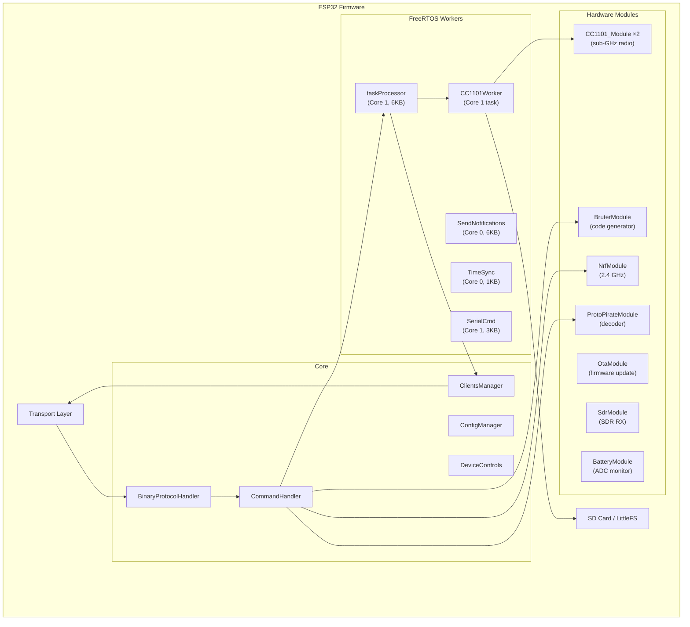
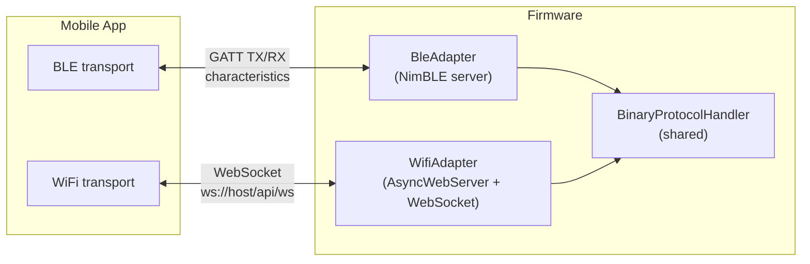
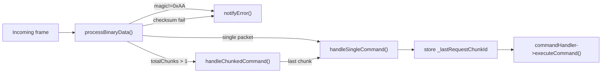
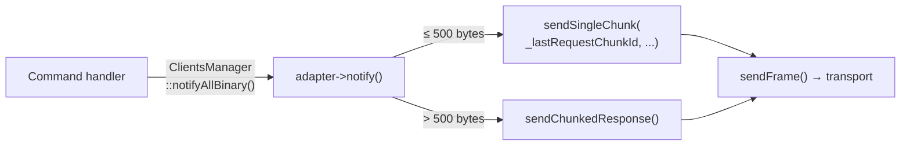
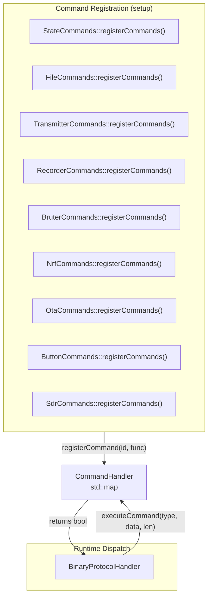
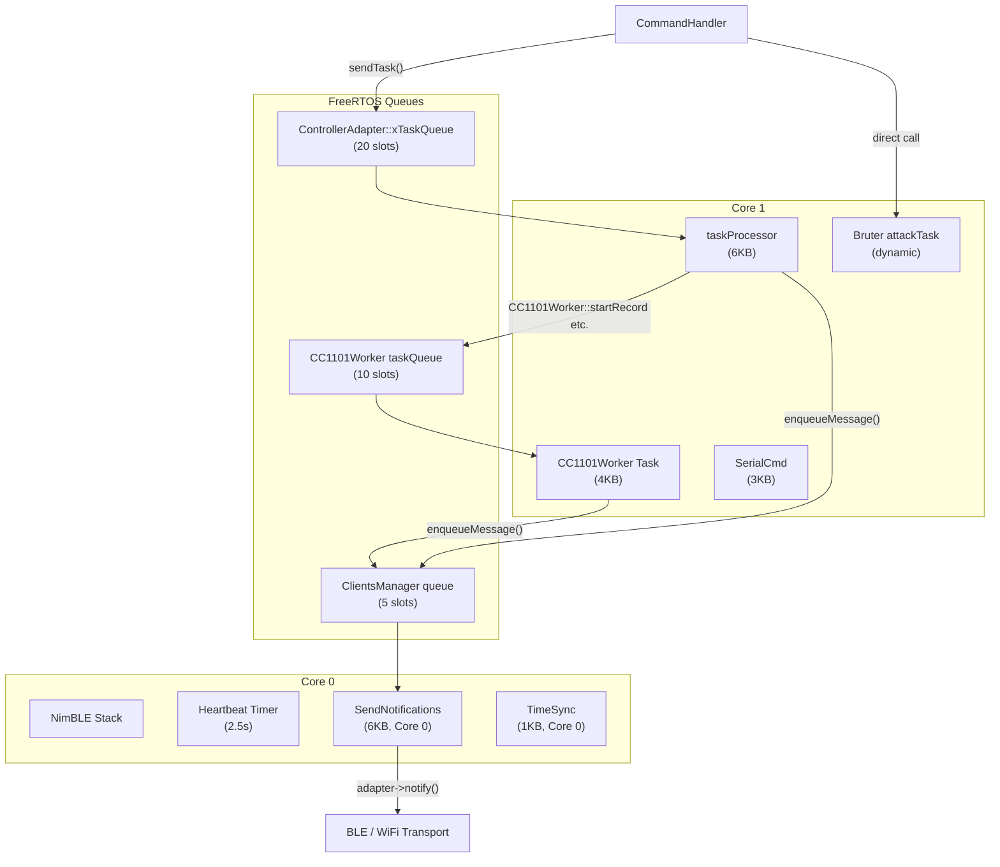
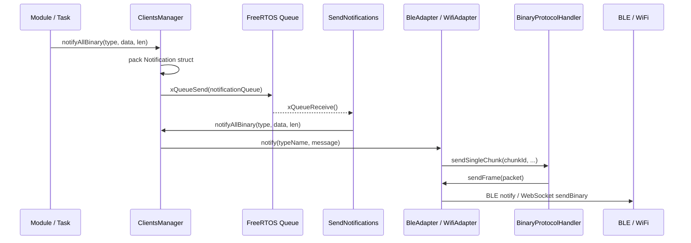
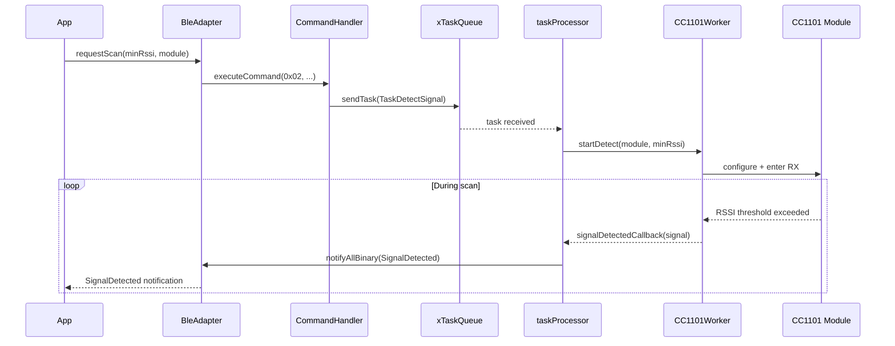
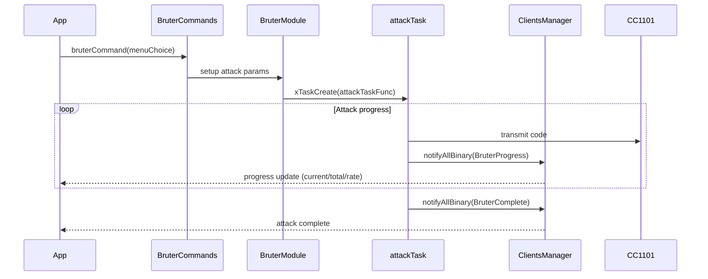
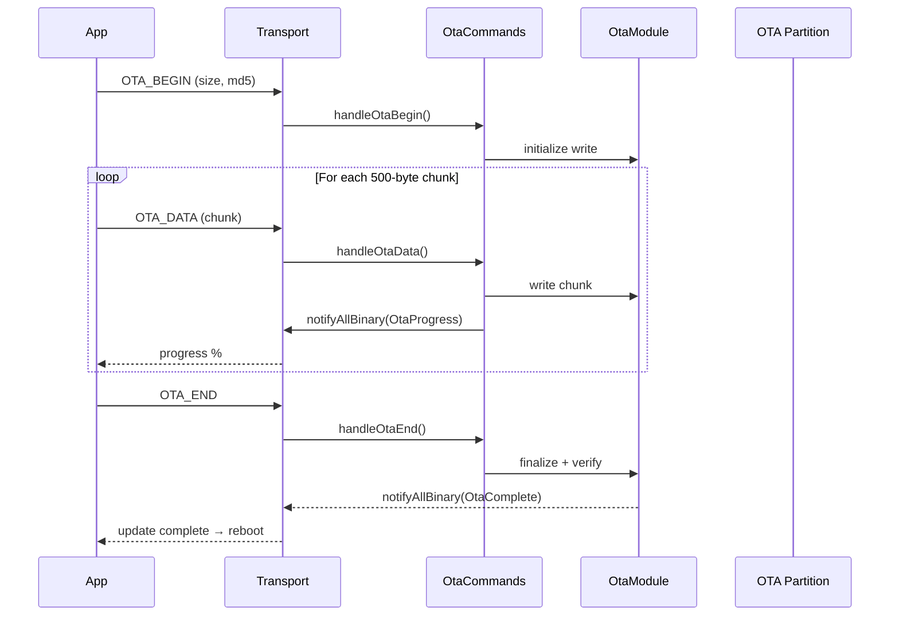

# EvilCrowRF V2 — Firmware Architecture

This document describes the architecture of the EvilCrowRF V2 ESP32 firmware and how it communicates with the Flutter mobile app.

---

## Table of Contents

1. [System Overview](#system-overview)
2. [Dual-Transport Architecture](#dual-transport-architecture)
3. [Binary Protocol](#binary-protocol)
4. [Command Handling](#command-handling)
5. [Task & Worker Architecture](#task--worker-architecture)
6. [Module System](#module-system)
7. [Notification Pipeline](#notification-pipeline)
8. [Settings & Persistence](#settings--persistence)
9. [Data Flow: Key Operations](#data-flow-key-operations)
10. [Build System](#build-system)
11. [File Map](#file-map)

---

## System Overview

The firmware runs on an ESP32 (Arduino framework) and controls up to two CC1101 sub-GHz radios, an nRF24L01 2.4 GHz module, and optional hardware (SDR, battery monitor). It communicates with the mobile app over **BLE** or **WiFi** using a shared binary protocol.



**Key resources:**
- **CPU**: ESP32 dual-core, 240 MHz. Core 0 runs BLE/WiFi stacks. Core 1 runs application logic.
- **RAM**: ~320 KB total. NimBLE replaces Bluedroid (saves ~30–40 KB). Heap usage is tightly managed.
- **Storage**: SD card (SPI) for signal files and datasets; LittleFS for settings and resumable attack state.

---

## Dual-Transport Architecture

The firmware can run in **BT mode** (`EVILCROW_BT_MODE=1`) or **WiFi mode** (`EVILCROW_WIFI_MODE=1`). The build system produces separate binaries with `-bt` / `-wifi` version suffixes. Both transports share `BinaryProtocolHandler`.



### BleAdapter (`src/core/ble/BleAdapter.cpp`, inherits `BinaryProtocolHandler`)

- Uses **NimBLE** (lightweight BLE stack, saves ~30–40 KB RAM vs Bluedroid).
- Advertises a single service (`6e400001-…`) with TX (notify) and RX (write-no-response) characteristics.
- `onWrite` callback on the RX characteristic calls `processBinaryData()` to handle incoming frames.
- `notify()` sends responses by calling `sendSingleChunk()` or chunking via `sendChunkedResponse()`.
- **Request correlation**: `_lastRequestChunkId` is stored from incoming commands and echoed in responses.
- Heartbeat timer fires every 2.5 s to keep the connection alive.
- Connection/disconnection triggers `clients.notifyAll()` with JSON status strings, which the app receives as `ble_connected` / `ble_disconnected`.

### WifiAdapter (`src/core/wifi/WifiAdapter.cpp`, inherits `BinaryProtocolHandler`)

- Uses **ESPAsyncWebServer** + a custom **WebSocket** handler at `/api/ws`.
- REST endpoints: `GET /api/info` (device metadata), `GET /api/status` (connection state).
- mDNS advertises `evilcrow.local` with TXT records (`name`, `fw_version`, `transport`).
- `onWsData()` calls `processBinaryData()` for incoming WebSocket binary frames.
- `notify()` sends responses over the WebSocket using `sendFrame()`.
- Two-phase startup: tries STA mode with saved credentials; falls back to SoftAP at `192.168.4.1`.
- `wifiCheck()` detects STA transition and starts mDNS.

---

## Binary Protocol

The same binary protocol used by the app is implemented here. See `mobile_app/docs/architecture.md` for the full frame format. Key firmware-side details:

### Frame Processing (`BinaryProtocolHandler`)



### Response Sending



### Message Types

Command message types (incoming): `0x01`–`0x7F` (see `FirmwareBinaryProtocol` in the app).

Response types (outgoing): `0x80`–`0xFF`, defined in `BinaryMessages.h`:

| Range | Purpose |
|-------|---------|
| `0x80`–`0x82` | Status, heartbeat, mode switch |
| `0x90`–`0x94` | Signal events (detected, recorded, sent, error) |
| `0xA0`–`0xA3` | File operations (content, list, directory tree, action result) |
| `0xB0`–`0xBB` | Bruter + ProtoPirate events |
| `0xC0`–`0xCB` | Settings sync, version info, battery, SDR, device identity |
| `0xD0`–`0xD7` | nRF24 events (scan, attack, spectrum, jammer) |
| `0xE0`–`0xE2` | OTA events (progress, complete, error) |
| `0xF0`–`0xF3` | Error / command result |

---

## Command Handling

Commands are routed through a **function-registry** pattern.



### CommandHandler (`src/core/CommandHandler.h`)

A lightweight registry that maps message type IDs (`uint8_t`) to `std::function<bool(const uint8_t*, size_t)>`. Commands are registered at boot time by each module's `registerCommands()` static method. At runtime, `BinaryProtocolHandler::handleSingleCommand()` extracts the message type and calls `executeCommand()`.

### Command Families

| File | Registered commands |
|------|-------------------|
| `StateCommands.h` | `0x01` getState, `0x02` scan, `0x03` idle, `0x13` setTime, `0x15` reboot, `0x16` factoryReset, `0x17` setDeviceName, `0x19` setWifiApConfig, `0x1A` applyWifi, `0xC1` settingsUpdate |
| `FileCommands.h` | File operations (list, load, upload, delete, rename, copy, move, mkdir, format) |
| `TransmitterCommands.h` | Signal transmission (binary, from file) |
| `RecorderCommands.h` | CC1101 recording and frequency search |
| `BruterCommands.h` | `0x04` bruter attack + sub-commands (cancel, pause, resume, delay, module) |
| `ProtoPirateCommands.h` | ProtoPirate decode/emulate/save |
| `NrfCommands.h` | nRF24 scan, attack, jam, spectrum |
| `OtaCommands.h` | OTA begin, data, end, abort |
| `ButtonCommands.h` | HW button configuration and polling |
| `SdrCommands.h` | SDR enable/disable/frequency/modulation |

A command can generate one or more responses by calling `ClientsManager::getInstance().notifyAllBinary()` with a typed binary payload. The `NotificationType` enum maps to a string tag that the app's `BinaryMessageParser` uses for dispatch.

---

## Task & Worker Architecture

The firmware uses **FreeRTOS** tasks pinned to specific ESP32 cores and a **queue-based** command flow.



### taskProcessor (Core 1, 6 KB stack)

The central application task. Reads from `ControllerAdapter::xTaskQueue`, which receives `Device::Task*` structs from command handlers via `sendTask()`. Handles:

- **Transmission**: Calls `CC1101Worker::transmit()`, sends `SignalSent` / `SignalSendError` notifications.
- **Record**: Parses preset or custom parameters, calls `CC1101Worker::startRecord()`.
- **DetectSignal**: Sends scan command to `CC1101Worker`.
- **FilesManager**: File list, load, create, delete, rename operations.
- **FileUpload**: Chunked file upload to SD/LittleFS.
- **GetState**: Builds `BinaryStatus` with CC1101 registers + CPU telemetry, dispatches via `clients.notifyAllBinary()`.
- **Idle / Jam**: Routes to `CC1101Worker`.

### CC1101Worker (Core 1, 4 KB stack)

Manages both CC1101 modules with a state machine per module: `Idle → Detecting → Recording → Transmitting → Analyzing → Jamming → Idle`.

- Receives commands via its own FreeRTOS queue (`CC1101Worker::taskQueue`).
- The worker loop selects the appropriate `processXxx()` handler based on each module's current `CC1101State`.
- ISR callbacks (`receiveSample`, `receiver`) capture pulse timings from GDO0 pins during recording.
- `signalDetectedCallback` fires when a signal is found during scanning; `signalRecordedCallback` fires when recording completes and saves to SD.
- Uses `portMUX_TYPE` spinlocks for ISR-safe sample buffer access.

### SendNotifications (Core 0, 6 KB stack)

Processes the `ClientsManager` notification queue. When `enqueueMessage()` is called (from any task), this task dequeues and calls `adapter->notify()` on each connected adapter. This decouples slow command handlers from the transport layer.

### Bruter Attack Task (dynamic, Core 1)

When a brute-force attack starts, `BruterModule::startAttackAsync()` spawns a dedicated FreeRTOS task (`attackTaskFunc`). This task runs the attack loop, periodically reports progress via `ClientsManager`, and checks the cancel/pause flag. On pause, state is saved to LittleFS. On completion, `BruterComplete` is sent.

---

## Module System

### CC1101_Module (`src/modules/CC1101_driver/`)

Low-level SPI driver for the CC1101 sub-GHz transceiver. Handles register read/write, frequency configuration, modulation settings, RSSI polling, and GDO pin management. Two instances (module 0 on pins SS=5/GDO0=2, module 1 on pins SS=27/GDO0=25).

### BruterModule (`src/modules/bruter/`)

Rolling-code brute-force engine with 33+ protocol definitions in `src/modules/bruter/protocols/`. Supports binary, tristate, and De Bruijn attack modes. Run-time configurable: inter-frame delay, repeats, power level, module selection. State is saved to LittleFS on pause for resumption.

### NrfModule / MouseJack / NrfJammer / NrfSpectrum (`src/modules/nrf/`)

nRF24L01 operations: `NrfModule` initializes the radio over shared SPI. `MouseJack` performs BLE advertisement scanning (sniffing) and keyboard injection attacks. `NrfJammer` jams 2.4 GHz channels with configurable patterns. `NrfSpectrum` reads RSSI across 80 channels for a real-time spectrum display.

### ProtoPirateModule (`src/modules/protopirate/`)

Automotive key fob protocol decoder. Uses the CC1101's continuous RX mode to capture raw pulses, then runs protocol-specific decoders from `src/modules/protopirate/protocols/`. Maintains a history buffer for replay analysis.

### OtaModule (`src/modules/ota/`)

Over-the-Air firmware update. Handles chunked binary uploads via BLE or WiFi, writes to the OTA partition, and triggers a reboot to apply.

### BatteryModule / SdrModule

Battery: reads ADC on GPIO36 through a voltage divider every 30 seconds, reports via `BinaryBatteryStatus`. SDR: optional software-defined radio mode using one CC1101 for spectrum scanning and raw RX streaming.

---

## Notification Pipeline



**Key design decisions:**
- Notifications are queued rather than sent synchronously. This prevents BLE/WiFi I/O from blocking command handlers or ISRs.
- The notification queue is only 5 slots deep. If full, messages are dropped (logged as warning).
- Binary payloads use a static buffer in the `Notification` struct — no heap allocation in the hot path.
- Heartbeat messages bypass the queue and are sent directly from the timer callback (non-blocking, drop-if-full).

---

## Settings & Persistence

### ConfigManager (`include/ConfigManager.h`)

Persistent settings are stored in `/config.txt` on LittleFS as a key=value text file. Runtime settings struct (`DeviceSettings`) includes:

| Field | Default | Purpose |
|-------|---------|---------|
| `serialBaudRate` | `115200` | Serial console baud |
| `scannerRssi` | `-80` | RSSI threshold for signal detection |
| `bruterPower` | `7` | CC1101 TX power (0–7) |
| `bruterDelay` | `10` | Inter-frame delay in ms |
| `bruterRepeats` | `4` | Repeats per code |
| `radioPowerMod1/2` | `10` | Module power in dBm (`-30` to `10`) |
| `cpuTempOffsetDeciC` | `-200` | CPU temperature correction |
| `button1Action/button2Action` | `0`/`7` | HW button actions |
| `nrfPaLevel/dataRate/channel/autoRetransmit` | `3`/`0`/`76`/`5` | nRF24 config |

**App sync**: On connect, the app sends `getState` → firmware responds with `VersionInfo` + `SettingsSync` + battery/button/SD/nRF status. The app can push new settings via `SETTINGS_UPDATE` (`0xC1`), which calls `ConfigManager::updateFromBle()` and echoes back a `SettingsSync` confirmation.

---

## Data Flow: Key Operations

### 1. Signal Scanning (App Commands)



### 2. Brute-Force Attack



### 3. OTA Firmware Update



---

## Build System

Two build environments in `platformio.ini`:

| Environment | Define | Output suffix | Key differences |
|-------------|--------|--------------|----------------|
| `evilcrow-bt` | `EVILCROW_BT_MODE=1` | `-bt` | NimBLE stack, excludes `core/wifi/` sources |
| `evilcrow-wifi` | `EVILCROW_WIFI_MODE=1` | `-wifi` | AsyncTCP + AsyncWebServer, excludes `core/ble/` sources |

**Version**: Defined in `include/config.h`:
```c
#define FIRMWARE_VERSION_MAJOR 3
#define FIRMWARE_VERSION_MINOR 0
#define FIRMWARE_VERSION_PATCH 0
#define FIRMWARE_VERSION_STRING "3.0.0" FIRMWARE_BUILD_SUFFIX
```

`FIRMWARE_BUILD_SUFFIX` is empty by default and overridden by PlatformIO build flags (`-DFIRMWARE_BUILD_SUFFIX="-bt"` / `-wifi`). The resulting string (e.g. `"3.0.0-bt"`) appears in mDNS, HTTP `/api/info`, and `VersionInfo` binary messages.

**Makefile** provides `build-bt`, `build-wifi`, `flash-bt`, `flash-wifi`, `monitor`, `flash-monitor-bt/wifi`, and `clean` targets. All delegate to PlatformIO via the project's `.venv`.

**release_builder.py** handles version bumping, firmware/app release packaging, and build automation from a GUI or CLI.

---

## File Map

```
firmware/
├── src/
│   ├── main.cpp                                # Entry point, setup, loop, taskProcessor
│   │                                           # (FreeRTOS tasks, module init, command registration)
│   ├── core/
│   │   ├── BinaryProtocolHandler.h/.cpp        # Shared binary protocol (parse, build, chunk)
│   │   ├── CommandHandler.h/.cpp               # Function registry for message types
│   │   ├── ControllerAdapter.h/.cpp            # Base class for transports + task queue
│   │   ├── ClientsManager.h/.cpp               # Multi-adapter notification dispatch
│   │   ├── ble/
│   │   │   └── BleAdapter.h/.cpp              # NimBLE server (scan, connect, notify, heartbeat)
│   │   ├── wifi/
│   │   │   ├── WifiAdapter.h/.cpp             # AsyncWebServer + WebSocket
│   │   │   ├── WifiConfigManager.h/.cpp       # WiFi provisioning (STA + SoftAP)
│   │   │   └── WifiWebSocket.h/.cpp           # WebSocket frame handler
│   │   └── device_controls/
│   │       └── DeviceControls.h/.cpp           # HW buttons, LED, power management
│   └── modules/
│       ├── CC1101_driver/
│       │   ├── CC1101_Module.h/.cpp            # SPI driver for CC1101 transceiver
│       │   └── CC1101_Worker.h/.cpp            # FreeRTOS worker (detect, record, transmit, jam)
│       ├── bruter/
│       │   ├── bruter_main.h/.cpp              # Rolling-code brute-force engine
│       │   ├── debruijn.h/.cpp                 # De Bruijn sequence generator
│       │   └── protocols/                      # 33+ RF protocol definitions
│       ├── nrf/
│       │   ├── NrfModule.h/.cpp               # nRF24L01 SPI driver
│       │   ├── MouseJack.h/.cpp               # BLE scan + keyboard injection
│       │   ├── NrfJammer.h/.cpp               # 2.4 GHz jammer
│       │   └── NrfSpectrum.h/.cpp             # 80-channel spectrum analyzer
│       ├── protopirate/
│       │   ├── ProtoPirateModule.h/.cpp        # Automotive key fob decoder
│       │   ├── ProtoPirateHistory.h            # Decode history buffer
│       │   └── protocols/                      # Protocol-specific decoders
│       ├── ota/
│       │   └── OtaModule.h/.cpp               # Over-the-Air firmware update
│       ├── sdr/
│       │   └── SdrModule.h/.cpp               # SDR mode (spectrum scan, raw RX)
│       ├── battery/
│       │   └── BatteryModule.h/.cpp            # ADC battery monitor
│       └── subghz_function/
│           ├── FrequencyAnalyzer.h/.cpp        # Sub-GHz frequency analysis
│           ├── ProtocolDecoder.h/.cpp          # Signal protocol recognition
│           └── StreamingSubFileParser.h/.cpp   # .sub file streaming parser
├── include/
│   ├── config.h                                # Version, pin defines, module config
│   ├── BinaryMessages.h                        # All binary response structs + type enums
│   ├── DeviceTasks.h                           # Task structs (Transmission, Record, Jam, etc.)
│   ├── ConfigManager.h                         # Persistent settings load/save/sync
│   ├── StateCommands.h                         # Core state commands (getState, scan, idle, etc.)
│   ├── FileCommands.h                          # File operation commands
│   ├── TransmitterCommands.h                   # Signal transmission commands
│   ├── RecorderCommands.h                      # CC1101 recording commands
│   ├── BruterCommands.h                        # Brute-force attack commands
│   ├── ButtonCommands.h                        # HW button config + polling
│   ├── NrfCommands.h                           # nRF24 commands
│   ├── OtaCommands.h                           # OTA firmware update commands
│   ├── ProtoPirateCommands.h                   # ProtoPirate commands
│   ├── SdrCommands.h                           # SDR mode commands
│   ├── HidPayloads.h                           # USB HID payloads for MouseJack
│   ├── SafeBuffer.h / StringBuffer.h           # Memory-safe buffer utilities
│   └── SubFileParser.h                         # Flipper Zero .sub file parser
├── platformio.ini                              # Build environments (bt / wifi)
├── Makefile                                    # Build/flash/monitor targets
├── partitions.csv                              # ESP32 partition table
├── release_builder.py                          # Version bumping + release packaging
├── tools/                                      # Build tooling (esptool)
└── docs/
    └── architecture.md                         # This document
```

---

*Last updated: 2026-06-18. See `mobile_app/docs/architecture.md` for the companion app architecture.*
