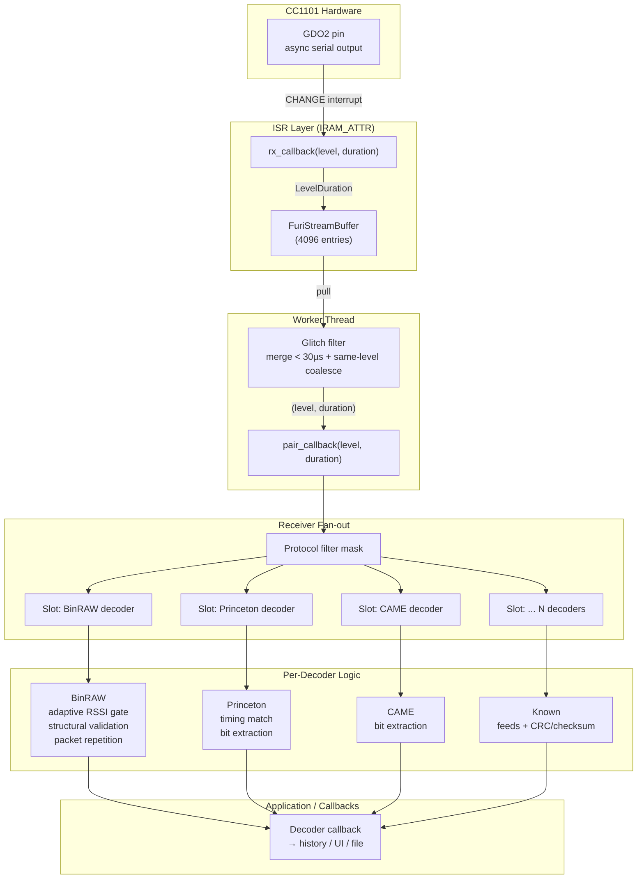

# Porting Plan: Flipper Zero Sub-GHz Protocol-Aware Capture → EvilCrowRF-V2

This document provides a step-by-step implementation plan to port the Flipper Zero's
protocol-aware sub-GHz signal capture architecture into the EvilCrowRF-V2 firmware.
The goal is to enable EvilCrowRF to identify known protocols (Princeton, CAME, KeeLoq,
etc.) during capture, apply adaptive noise rejection, and support frequency hopping
with RSSI linger — matching the Flipper Zero's Receiver + BinRAW mode behavior.

---

## Gap Analysis: What EvilCrowRF Has vs. What Flipper Zero Has

| Capability | EvilCrowRF (current) | Flipper Zero (target) | Gap |
|------------|---------------------|----------------------|-----|
| **ISR capture** | ✅ GDO2 CHANGE ISR with raw µs timestamps | ✅ CC1101 async RX → `LevelDuration` → `FuriStreamBuffer` | ISR→thread handoff uses vector instead of ring buffer; no overrun detection |
| **Glitch/merge filter** | ⚠️ 50 µs lower gate in ISR (reject short pulses) | ✅ 30 µs `filter_duration` in worker thread + same-level coalescing | Needs to be moved from ISR to a decoder-stage filter, with same-level merging |
| **RSSI threshold gate** | ❌ Not present | ✅ `SubGhzThresholdRssi` with user threshold + 10-sample hysteresis | Needs to be built from scratch |
| **Adaptive threshold** | ❌ Not present | ✅ BinRAW `adaptive_threshold_rssi` tracks noise floor with 0.2 smoothing + 7 dB margin | Needs to be built from scratch |
| **Decoder pipeline** | ⚠️ `ProtocolDecoder` attempts post-capture decoding from samples | ✅ Real-time `feed(level, duration)` per decoder slot with per-decoder callbacks | Needs complete redesign |
| **BinRAW decoder** | ❌ EvilCrowRF `BinRAWProtocol` only parses `.sub` files | ✅ Full `SubGhzProtocolDecoderBinRAW` with adaptive gate, structural validation, packet repetition check | Needs to be ported; ~900 lines of C in `bin_raw.c` |
| **Receiver fan-out** | ❌ Not present | ✅ `SubGhzReceiver` with one slot per registered protocol, filter mask | Needs to be built |
| **Known protocol decoders (feed)** | ❌ Stubbed in `ProtocolDecoder::tryProtocol()` | ✅ Princeton, CAME, KeeLoq, Holtek, etc. all have real-time `feed()` decoders | Need real `feed()` implementations |
| **Frequency hopper** | ⚠️ `detectSignal()` sweeps 18 freqs, reads RSSI, no linger | ✅ Hopper with `RSSITimeOut` state, lingers on active freq for 10 ticks | Needs refactoring |
| **File save integration** | ✅ Saves RAW `.sub` files post-capture | ✅ BinRAW + known protocols serialize via `FlipperFormat` | Need to save decoded protocol keys (not just RAW) |

---

## Architecture: Target End State



---

## Implementation Plan — Ordered by Dependency

### Phase 1: Build the Decoder Infrastructure (No Behavior Change)

These steps create the scaffolding. After Phase 1, the system still works exactly
as before, but the decoder framework exists.

#### 1.1 Define `SubGhzProtocolFlag` and `SubGhzProtocolDecoder` interfaces

**Reference files:**
- `flipperzero-firmware/lib/subghz/types.h` (lines 106-136) — protocol flag enum, `SubGhzProtocol` struct
- `flipperzero-firmware/lib/subghz/protocols/base.h` — `SubGhzProtocolDecoderBase` struct, callback typedef

**What to create in EvilCrowRF:**

File: `firmware/lib/subghz/SubGhzTypes.h`

```cpp
// Protocol capability flags (bitmask)
enum SubGhzProtocolFlag : uint32_t {
    SubGhzProtocolFlag_RAW       = (1 << 0),
    SubGhzProtocolFlag_Decodable = (1 << 1),
    SubGhzProtocolFlag_315       = (1 << 2),
    SubGhzProtocolFlag_433       = (1 << 3),
    SubGhzProtocolFlag_868       = (1 << 4),
    SubGhzProtocolFlag_AM        = (1 << 5),   // ASK/OOK
    SubGhzProtocolFlag_FM        = (1 << 6),   // 2FSK/GFSK
    SubGhzProtocolFlag_Save      = (1 << 7),
    SubGhzProtocolFlag_Load      = (1 << 8),
    SubGhzProtocolFlag_Send      = (1 << 9),
    SubGhzProtocolFlag_BinRAW    = (1 << 10),
};
```

File: `firmware/lib/subghz/SubGhzProtocolBase.h`

```cpp
struct SubGhzProtocolDecoderBase {
    const char* protocol_name;
    SubGhzProtocolFlag flag;
    void (*callback)(SubGhzProtocolDecoderBase* self, void* context);
    void* callback_context;
};

// V-table for decoder operations (C-style polymorphism)
struct SubGhzProtocolDecoderVTable {
    void* (*alloc)(void);
    void  (*free)(void* ctx);
    void  (*feed)(void* ctx, bool level, uint32_t duration_us);
    void  (*reset)(void* ctx);
    uint8_t (*get_hash)(void* ctx);
    void  (*serialize)(void* ctx, /* File */);
    void  (*deserialize)(void* ctx, /* File */);
};
```

**Action:** Create the two header files above.

#### 1.2 Build `SubGhzReceiver` — the fan-out dispatcher

**Reference file:** `flipperzero-firmware/lib/subghz/receiver.c` (full file, 125 lines)

**What to create in EvilCrowRF:**

File: `firmware/src/modules/subghz_function/SubGhzReceiver.h`
File: `firmware/src/modules/subghz_function/SubGhzReceiver.cpp`

The `SubGhzReceiver` class holds:
- A `std::vector<SubGhzReceiverSlot>` where each slot wraps a decoder instance
- A `SubGhzProtocolFlag filter` bitmask
- A callback for when any decoder successfully decodes a signal

Key methods (C++ equivalents of Flipper C):
```cpp
class SubGhzReceiver {
public:
    SubGhzReceiver();
    void decode(bool level, uint32_t duration_us);
    void reset();
    void setFilter(SubGhzProtocolFlag filter);
    void setCallback(ReceiverCallback cb, void* ctx);
    SubGhzProtocolDecoderBase* getDecoderByName(const char* name);
private:
    struct Slot {
        SubGhzProtocolDecoderBase base;
        void* decoder_instance;
        SubGhzProtocolDecoderVTable* vtable;
    };
    std::vector<Slot> slots;
    SubGhzProtocolFlag filter;
    ReceiverCallback callback;
    void* callback_ctx;
};
```

The `decode()` method iterates all slots and calls `vtable->feed()` on each slot
whose protocol flag passes the filter mask. This is a direct port of
`subghz_receiver_decode()` from `receiver.c:60-69`.

**Important implementation detail from Flipper:**
```c
// receiver.c:66 — filter mask check
if((slot->base->protocol->flag & instance->filter) != 0) {
    slot->base->protocol->decoder->feed(slot->base, level, duration);
}
```

#### 1.3 Extend the protocol registry to register decoder v-tables

**Reference:** `flipperzero-firmware/lib/subghz/protocols/protocol_items.c` (contains the registry)

**What to modify in EvilCrowRF:**

Modify `firmware/lib/subghz/AllProtocols.h` to also register `SubGhzProtocolDecoderVTable`
entries alongside the existing `SubGhzProtocol` creators. Create a new registry class
`SubGhzProtocolDecoderRegistry` that maps protocol name → v-table.

File: `firmware/lib/subghz/AllProtocols.h` (extend)
```cpp
namespace {
    struct RegisterAllProtocols {
        RegisterAllProtocols() {
            // Existing file-parser registrations
            SubGhzProtocol::registerProtocol("Princeton", createPrincetonProtocol);
            // ...
            
            // NEW: Decoder v-table registrations
            SubGhzProtocolDecoderRegistry::registerDecoder("Princeton",
                &princeton_decoder_vtable);
            SubGhzProtocolDecoderRegistry::registerDecoder("BinRAW",
                &binraw_decoder_vtable);
            // ...
        }
    };
}
```

#### 1.4 Create a `LevelDuration` helper

**Reference:** `flipperzero-firmware/lib/toolbox/level_duration.h`

**What to create:**

File: `firmware/lib/subghz/LevelDuration.h`

A simple packed struct to carry `(level: bool, duration: uint32_t)` from ISR →
worker, plus a `level_duration_reset()` sentinel for buffer overrun signaling.

```cpp
struct LevelDuration {
    uint32_t data;  // bit 0 = level, bits 1-31 = duration (in µs)
    
    static LevelDuration make(bool level, uint32_t duration);
    static LevelDuration reset();  // overrun sentinel
    bool isReset() const;
    bool getLevel() const;
    uint32_t getDuration() const;
};
```

The Flipper implementation packs level into bit 0 (bit 31 if duration sign is used
elsewhere). For simplicity and portability on ESP32, an explicit 2-field struct or
a packed `uint32_t` is fine. Use exactly the same bit layout as Flipper to keep
the port faithful:
- Bit 31: level (1 = high, 0 = low)
- Bits 30–0: duration in µs
- Special value `0xFFFFFFFF` = reset token

---

### Phase 2: Port the BinRAW Decoder (The Core of Protocol Awareness)

This is the single most important piece. The BinRAW decoder provides:
1. Adaptive RSSI threshold that tracks the noise floor
2. +7 dB margin gating to start/stop capture
3. Structural validation (duration clustering, TE correlation, repetition check)
4. Packet classification (GapRecurring, GapRolling, GapUnknown, NoGap)

**Reference file:** `flipperzero-firmware/lib/subghz/protocols/bin_raw.c` (full file, ~970 lines)

#### 2.1 Create the decoder header

File: `firmware/lib/subghz/protocols/BinRAWDecoder.h`

Port the struct and constants from `bin_raw.c` lines 17–79:

```cpp
// Constants (exact values from bin_raw.c)
#define BIN_RAW_BUF_RAW_SIZE        2048   // raw sample buffer (line 17)
#define BIN_RAW_BUF_DATA_SIZE       512    // decoded bit buffer (line 18)
#define BIN_RAW_THRESHOLD_RSSI      -85.0f // initial adaptive threshold (line 20)
#define BIN_RAW_DELTA_RSSI          7.0f   // dB margin above threshold (line 21)
#define BIN_RAW_SEARCH_CLASSES      20     // max duration buckets (line 22)
#define BIN_RAW_TE_MIN_COUNT        40     // min occurrences of a TE class (line 23)
#define BIN_RAW_BUF_MIN_DATA_COUNT  128    // min samples to run validator (line 24)
#define BIN_RAW_MAX_MARKUP_COUNT    20     // max packet divisions (line 25)

// States (from bin_raw.c:46-51)
enum class BinRAWDecoderStep : uint8_t {
    Reset = 0,
    Write,
    BufFull,
    NoParse,
};

// Signal classification (from bin_raw.c:53-60)
enum class BinRAWType : uint8_t {
    Unknown = 0,
    NoGap,
    Gap,
    GapRecurring,
    GapRolling,
    GapUnknown,
};

// Packet markup (from bin_raw.c:62-66)
struct BinRAWMarkup {
    uint16_t byte_bias;   // byte offset of this packet
    uint16_t bit_count;   // bit count of this packet
};

// Main decoder instance (from bin_raw.c:68-79)
class SubGhzProtocolDecoderBinRAW {
public:
    SubGhzProtocolDecoderBase base;  // protocol name, flags, callback
    BinRAWDecoderStep parser_step;
    int32_t* data_raw;              // [BIN_RAW_BUF_RAW_SIZE] raw samples (±duration)
    uint8_t* data;                  // [BIN_RAW_BUF_RAW_SIZE] decoded bits
    BinRAWMarkup data_markup[BIN_RAW_MAX_MARKUP_COUNT];
    size_t data_raw_ind;
    uint32_t te;                    // detected timing element (µs)
    float adaptive_threshold_rssi;
    uint32_t generic_data_count_bit;
    
    // Methods
    void alloc();
    void free();
    void feed(bool level, uint32_t duration_us);     // called by receiver
    void inputRssi(float rssi);                      // called every tick
    void reset();
    uint8_t getHashData();
    void serialize(/* File */);
};
```

#### 2.2 Port the `feed()` function

**From** `bin_raw.c:384-395`:

```c
void subghz_protocol_decoder_bin_raw_feed(void* context, bool level, uint32_t duration) {
    SubGhzProtocolDecoderBinRAW* instance = context;
    if(instance->decoder.parser_step == BinRAWDecoderStepWrite) {
        if(instance->data_raw_ind == BIN_RAW_BUF_RAW_SIZE) {
            instance->decoder.parser_step = BinRAWDecoderStepBufFull;
        } else {
            instance->data_raw[instance->data_raw_ind++] = (level ? duration : -duration);
        }
    }
}
```

**Port:** Direct C++ translation. During `BinRAWDecoderStepWrite`, accumulate
`±duration` samples into `data_raw[]`. On buffer full, transition to `BufFull`.

#### 2.3 Port `subghz_protocol_decoder_bin_raw_data_input_rssi()` — The Adaptive Gate

**From** `bin_raw.c:884-963`:

This is the core "signal vs noise" decision maker. Three cases:

**Case: `BinRAWDecoderStepReset` (line 889-902):**
```c
if(rssi > (instance->adaptive_threshold_rssi + BIN_RAW_DELTA_RSSI)) {  // +7 dB margin
    // SIGNAL DETECTED: clear buffers, start writing
    instance->data_raw_ind = 0;
    memset(instance->data_raw, 0, BIN_RAW_BUF_RAW_SIZE * sizeof(int32_t));
    memset(instance->data, 0, BIN_RAW_BUF_RAW_SIZE * sizeof(uint8_t));
    instance->decoder.parser_step = BinRAWDecoderStepWrite;
} else {
    // Quiet: track noise floor with EMA (α = 0.2)
    instance->adaptive_threshold_rssi += (rssi - instance->adaptive_threshold_rssi) * 0.2f;
}
```

**Case: `BinRAWDecoderStepWrite` / `BufFull` (line 904-954):**
```c
if(rssi < instance->adaptive_threshold_rssi + BIN_RAW_DELTA_RSSI) {
    // SIGNAL ENDED: return to Reset state
    instance->decoder.parser_step = BinRAWDecoderStepReset;
    if(instance->data_raw_ind >= BIN_RAW_BUF_MIN_DATA_COUNT) {  // ≥ 128 samples
        if(subghz_protocol_bin_raw_check_remote_controller(instance)) {
            // VALID SIGNAL FOUND
            if(instance->base.callback)
                instance->base.callback(&instance->base, instance->base.context);
        }
    }
}
```

**Port:** Direct C++ translation. The key insight: the adaptive threshold `+= (rssi - threshold) * 0.2f`
is an Exponential Moving Average (EMA). On ESP32, this is a simple floating-point
operation (no DSP needed).

**Important:** This function must be called periodically (every ~50-100ms) from the
worker loop, with a live RSSI reading. The current EvilCrowRF `processRecording()`
already runs every 10ms, so call `inputRssi()` at that rate.

#### 2.4 Port `subghz_protocol_bin_raw_check_remote_controller()` — Structural Validation

**From** `bin_raw.c:401-882`:

This is ~480 lines of heuristic analysis. It must be ported faithfully because
the constants and logic are finely tuned. The function has these sub-steps:

| Step | Lines | Description | Key Constants |
|------|-------|-------------|---------------|
| Duration clustering | 423-439 | Bucket samples into ≤20 classes (±25% tolerance, EMA k=0.05) | `BIN_RAW_SEARCH_CLASSES = 20` |
| Sort by frequency | 457-471 | Bubble sort classes by count descending | — |
| TE detection | 480-514 | Find shortest correlated duration with ≥40 counts; check 2nd duration is integer multiple of 1st (±20%) | `BIN_RAW_TE_MIN_COUNT = 40` |
| Gap detection | 517-538 | Find longest duration class; gap must be > 10×TE | `gap/te < 10 → NoGap` |
| Bit-level decode (gap path) | 543-580 | Quantize raw durations to multiples of TE, transcribe bits, split at gaps into packets | — |
| Packet size classification | 584-614 | Re-bucket packets by bit count | — |
| Adjacent repetition check | 644-689 | `memcmp` adjacent same-length packets → `BinRAWTypeGapRecurring` | — |
| Every-N-th repetition check | 692-774 | Rolling code detection: two pairs of packets match across a gap → `BinRAWTypeGapRolling` | — |
| Same-length grouping | 776-800 | Packets share length but not content → `BinRAWTypeGapUnknown` | — |
| No-gap path | 807-880 | Right-align bits, check non-zero data → `BinRAWTypeNoGap` | — |

**Porting guidance:**
- The duration clustering uses a running average: `classes[k].data += (sample - classes[k].data) * 0.05f` (line 433-434). Translate directly.
- The bubble sort (lines 457-471) can be replaced with `std::sort` for efficiency.
- The TE correlation check (lines 499-509) tests `k = 1..4` divisors, checking if `(classes[1].data / (classes[0].data / k))` is within 20% of an integer.
- The `memcmp`-based repetition checks (lines 670, 721) rely on byte-level comparison of decoded packet data. The `instance->data[]` array holds decoded bytes.
- The no-gap path (lines 807-880) quantizes and right-aligns bits, then checks if the decoded data is non-zero.

**Warning:** Do NOT simplify or "optimize" these heuristics. The constants
(0.25 tolerance, 0.05 EMA, 0.2 adaptive smoothing, 7 dB margin, 40 TE min count,
10× gap, 20% deviation) are the result of extensive empirical tuning against
real-world remote control signals. Changing any of them will degrade the
signal-vs-noise discrimination.

#### 2.5 Register BinRAW decoder v-table

```cpp
const SubGhzProtocolDecoderVTable binraw_decoder_vtable = {
    .alloc       = binraw_decoder_alloc,
    .free        = binraw_decoder_free,
    .feed        = binraw_decoder_feed,
    .reset       = binraw_decoder_reset,
    .get_hash    = binraw_decoder_get_hash,
    .serialize   = binraw_decoder_serialize,
    .deserialize = binraw_decoder_deserialize,
};
```

---

### Phase 3: Port Known-Protocol Decoders with Real-Time `feed()`

The current EvilCrowRF `ProtocolDecoder::tryProtocol()` is stubbed for all non-RAW
protocols because there is no real-time `feed()` implementation. We need to add
`feed()` methods to the existing protocol classes, or create parallel decoder
classes.

#### 3.1 Princeton decoder `feed()`

**Reference:** `flipperzero-firmware/lib/subghz/protocols/princeton.c`

The Flipper Princeton (and all known protocol) decoders use the `SubGhzBlockDecoder`
infrastructure from `lib/subghz/blocks/decoder.h`. This is a generic state machine
for OOK/ASK protocols:

1. **Wait for preamble** — detect a characteristic long HIGH pulse
2. **Capture TE** — measure the short pulse/gap duration (the timing element)
3. **Decode bits** — for each bit, read 2 edges:
   - HIGH + short LOW = bit 0
   - HIGH + long LOW = bit 1
4. **Validate** — check bit count matches expected, verify checksum if applicable
5. **Fire callback** — emit decoded key

**What to build in EvilCrowRF:**

File: `firmware/lib/subghz/protocols/PrincetonDecoder.h/cpp`

Create a self-contained `PrincetonDecoder` class that:
- Has a state machine: `WAIT_START → WAIT_TE → DECODE → VALIDATE`
- Uses the existing Princeton `generatePulseData()` logic in reverse
- Tracks a running bit buffer
- Calls a callback when a valid frame is decoded

Key parameters (from `princeton.c` in Flipper):
- Short duration: `1 × TE`
- Long duration: `3 × TE` (the "tri-state" encoding)
- TE tolerance: ±40% (from `subghz_block_const.te_delta`)
- Minimum TE: 100 µs
- Maximum TE: 1500 µs

**Simpler approach** (Flipper's `SubGhzBlockDecoder`):

The Flipper Princeton decoder (`princeton.c`) delegates to the generic
`SubGhzBlockDecoder` which handles level/duration tracking, TE auto-detection,
and bit assembly. If porting the full BlockDecoder infrastructure is too heavy,
implement a simpler Princeton-specific state machine directly:

```cpp
enum PrincetonState {
    WAIT_START,   // wait for long HIGH > 1000us
    WAIT_TE,      // measure short pulse = TE
    DECODE,       // capture 24/25 bits (or 48+stop for 48-bit variant)
    DONE
};

void feed(bool level, uint32_t duration) {
    switch(state) {
    case WAIT_START:
        if(level && duration > 1000) {
            state = WAIT_TE;
            bit_buffer = 0;
            bit_count = 0;
        }
        break;
    case WAIT_TE:
        if(!level) {
            te_short = min(te_short, duration);
            state = DECODE;
        }
        break;
    case DECODE:
        // For each bit: level==HIGH, duration ≈ TE (short) or 3*TE (long)
        if(level) {
            if(duration > te_short * 7/4) {  // long pulse = bit 1
                bit_buffer = (bit_buffer << 1) | 1;
            } else {                         // short pulse = bit 0
                bit_buffer = (bit_buffer << 1);
            }
            bit_count++;
            if(bit_count == expected_bits) {
                state = DONE;
                if(callback) callback(this, context);
            }
        }
        break;
    }
}
```

Do the same for **CAME** (`came.c`), **Gate TX** (`gate_tx.c`), **Holtek** (`holtek.c`),
and **Nice FLO** (`nice_flo.c`). Start with Princeton and CAME (most common),
then add others.

---

### Phase 4: Wire the Worker + ISR into the Decoder Pipeline

This phase connects the CC1101 ISR output through the new decoder infrastructure.

#### 4.1 Refactor the ISR → Worker handoff

**Current EvilCrowRF flow:**
```
GDO2 CHANGE ISR → receiveSample() → vector<unsigned long> samples[]
Worker poll (10ms) → checkAndSaveRecording() → post-capture decode
```

**Target flow (Flipper pattern):**
```
GDO2 CHANGE ISR → rx_callback(level, duration) → LevelDuration → StreamBuffer
Worker thread → drain StreamBuffer → glitch filter → pair_callback(level, duration)
pair_callback → SubGhzReceiver::decode(level, duration) → fan-out to all decoders
```

**Changes required in `CC1101_Worker.cpp`:**

1. **Replace `receiveSample()`** with a simpler `rx_callback()` that pushes
   `LevelDuration` pairs into a ring buffer (FreeRTOS `xStreamBuffer` or a
   simple lock-free SPSC queue):

```cpp
// ISR-level callback — minimal work
void IRAM_ATTR rx_callback(int module, bool level, uint32_t duration) {
    LevelDuration ld = LevelDuration::make(level, duration);
    // Push to ring buffer (use StreamBuffer or a pre-allocated circular buffer)
    xStreamBufferSend(streamBuffers[module], &ld, sizeof(ld), 0);
}
```

2. **Add the glitch filter** in the worker thread's process loop:

```cpp
void processDecoderPipeline(int module) {
    LevelDuration ld;
    while(xStreamBufferReceive(streamBuffers[module], &ld, sizeof(ld), 0) == sizeof(ld)) {
        if(ld.isReset()) {
            // Overrun detected → reset decoders
            receiver[module].reset();
            continue;
        }
        
        bool level = ld.getLevel();
        uint32_t duration = ld.getDuration();
        
        // GLITCH FILTER (port of subghz_worker_thread_callback, worker.c:61-74)
        if((duration < filterDuration) || (filterLevelDuration.level == level)) {
            // Merge short pulses & same-level runs
            filterLevelDuration.duration += duration;
        } else if(filterLevelDuration.level != level) {
            // Emit the accumulated edge
            receiver[module].decode(
                filterLevelDuration.level,
                filterLevelDuration.duration);
            
            filterLevelDuration.duration = duration;
            filterLevelDuration.level = level;
        }
    }
}
```

**Constants (from Flipper, `subghz_worker.c:92`):**
- `filterDuration = 30` µs (vs EvilCrowRF's current 50 µs in ISR)
- Stream buffer size: 4096 × `sizeof(LevelDuration)` = 32768 bytes

**Note:** The existing `MIN_PULSE_DURATION = 50` µs filtering in the ISR
(`receiveSample`) should be **removed** or raised to a safety-only level. The
30 µs glitch filter in the worker thread replaces it. The ISR itself should
do minimal work — just capture the timestamp and push.

#### 4.2 Add per-module `SubGhzReceiver` instances

```cpp
// In CC1101Worker.h or a new SubGhzCaptureManager class:
SubGhzReceiver* receivers[CC1101_NUM_MODULES];
```

Allocate one `SubGhzReceiver` per CC1101 module. Set up callbacks for decoded
signals.

#### 4.3 Add periodic RSSI feed to BinRAW decoder

In the worker loop's `processRecording()` (or renamed to `processReceiver()`):

```cpp
void processReceiver(int module) {
    // Drain stream buffer + feed decoders (Step 4.1 above)
    processDecoderPipeline(module);
    
    // Feed live RSSI to BinRAW decoder every tick (every ~50ms)
    static uint32_t lastRssiFeed[CC1101_NUM_MODULES] = {0};
    if(millis() - lastRssiFeed[module] >= 50) {
        float rssi = moduleCC1101State[module].getRssi();
        // Find BinRAW decoder instance and feed RSSI
        SubGhzProtocolDecoderBase* binraw =
            receivers[module].getDecoderByName("BinRAW");
        if(binraw) {
            ((SubGhzProtocolDecoderBinRAW*)binraw)->inputRssi(rssi);
        }
        lastRssiFeed[module] = millis();
    }
}
```

#### 4.4 Decoder callback → signal recorded

When any decoder fires its callback, save the decoded key:

```cpp
void onDecoderCallback(SubGhzProtocolDecoderBase* decoder, void* ctx) {
    int module = (int)ctx;
    
    // Build a decoded signal struct
    CC1101DetectedSignal sig;
    sig.protocol = decoder->protocol_name;
    sig.isDecoded = true;
    
    // Get serialized key string
    // decoder->serialize() → format as .sub file header + key data
    
    // Save to SD card
    saveDecodedSignal(module, decoder);
    
    // Notify via BLE
    if(signalDetectedCallback) signalDetectedCallback(sig);
}
```

---

### Phase 5: RSSI Threshold Gate for Read RAW Mode

#### 5.1 Build `SubGhzThresholdRssi`

**Reference:** `flipperzero-firmware/applications/main/subghz/helpers/subghz_threshold_rssi.c` (60 lines)

File: `firmware/src/modules/subghz_function/SubGhzThresholdRssi.h/cpp`

Direct C++ port:

```cpp
class SubGhzThresholdRssi {
public:
    static constexpr float THRESHOLD_MIN = -90.0f;   // "off" value
    static constexpr uint8_t LOW_COUNT = 10;          // hysteresis samples
    
    struct Result {
        float rssi;
        bool is_above;  // true = signal, false = noise/quiet
    };
    
    SubGhzThresholdRssi() : threshold_rssi(THRESHOLD_MIN), low_count(LOW_COUNT) {}
    
    void set(float rssi) { threshold_rssi = rssi; }
    float get() const { return threshold_rssi; }
    
    Result check(float rssi) {
        Result ret = {rssi, false};
        
        if(fabs(threshold_rssi - THRESHOLD_MIN) < 0.01f) {
            ret.is_above = true;  // threshold disabled
        } else {
            if(rssi < threshold_rssi) {
                low_count++;
                if(low_count > LOW_COUNT) low_count = LOW_COUNT;
                ret.is_above = false;
            } else {
                low_count = 0;
            }
            ret.is_above = (low_count != LOW_COUNT);
        }
        return ret;
    }
    
private:
    float threshold_rssi;
    uint8_t low_count;
};
```

**Key behavior (from `subghz_threshold_rssi.c:36-58`):**
- If RSSI is below the user-set threshold, `low_count` increments.
- Only after 10 consecutive below-threshold samples does `is_above` become `false`.
- This hysteresis prevents a single RSSI dip from fragmenting a capture, and
  prevents a single spike from triggering a noise capture.

#### 5.2 Integrate into Read RAW mode

The Read RAW equivalent in EvilCrowRF currently uses `checkAndSaveRecording()`.
Integrate the threshold gate:

- When the user sets a RAW RSSI threshold (via BLE command), create a
  `SubGhzThresholdRssi` instance.
- In the worker loop, before recording samples, call `threshold.check(rssi)`.
- If `!result.is_above`, pause sample accumulation (skip the `feed()` call).

---

### Phase 6: Frequency Hopper with RSSI Linger

#### 6.1 Build the hopper

**Reference:** `flipperzero-firmware/applications/main/subghz/helpers/subghz_txrx.c:365-412`

The Flipper hopper uses a state machine:

```c
enum SubGhzHopperState {
    OFF, Running, Pause, RSSITimeOut
};
```

File: `firmware/src/modules/subghz_function/FrequencyHopper.h/cpp`

```cpp
class FrequencyHopper {
public:
    enum State { OFF, RUNNING, PAUSE, RSSI_TIMEOUT };
    
    struct Config {
        std::vector<float> frequencies;   // hop list
        float lingerRssiThreshold = -90.0f;  // stay if RSSI > this
        int lingerTicks = 10;                // ticks to stay
    };
    
    void configure(const Config& cfg);
    void start();
    void stop();
    void pause();
    void update(float currentRssi);  // call every tick
    
    float getCurrentFrequency() const;
    State getState() const { return state; }
    
private:
    Config config;
    State state = OFF;
    size_t freqIndex = 0;
    int timeoutRemaining = 0;
};
```

**Hopper logic** (direct port of `subghz_txrx.c:365-412`):

```cpp
void FrequencyHopper::update(float rssi) {
    switch(state) {
    case OFF:
    case PAUSE:
        return;
        
    case RSSI_TIMEOUT:
        if(timeoutRemaining > 0) {
            timeoutRemaining--;
            return;  // Still lingering
        }
        break;  // Timeout expired, advance to next freq
        
    case RUNNING:
        // Check if current freq has a strong signal
        if(rssi > config.lingerRssiThreshold) {
            timeoutRemaining = config.lingerTicks;
            state = RSSI_TIMEOUT;
            return;  // Stay on this frequency!
        }
        break;
    }
    
    // Advance to next frequency
    freqIndex = (freqIndex + 1) % config.frequencies.size();
    state = RUNNING;
    // Caller must now re-tune CC1101 to config.frequencies[freqIndex]
}
```

#### 6.2 Integrate hopper with existing frequency list

The current `CC1101Worker::detectSignal()` sweeps 18 hardcoded frequencies.
Replace that with the hopper. The existing `signalDetectionFrequencies[]` array
(18 entries) becomes the default hop list. Allow BLE commands to set a custom
list via the `RecorderCommands` handler.

---

### Phase 7: File Output — Save Decoded Keys, Not Just RAW

#### 7.1 Serialize decoded protocols to `.sub` files

When a known protocol decoder fires, write the decoded key in the Flipper `.sub`
format with protocol-specific fields:

```
Filetype: Flipper SubGhz RAW File
Version: 1
Frequency: 433920000
Preset: FuriHalSubGhzPresetOok650Async
Protocol: Princeton
Bit: 24
Key: 00 A1 B2 C3
TE: 350
```

Not just `Protocol: RAW` with a raw data dump. This requires adding `serialize()`
to each decoder.

#### 7.2 Save BinRAW captures with markup

When BinRAW classifies a signal as `GapRecurring` or `GapRolling`, save it with:
- `Protocol: BinRAW`
- `Bit: <bit_count>`
- `TE: <te_value>`
- `Bit_RAW: <packet_sizes...>`
- `Data_RAW: <hex bytes...>`

This is the Flipper BinRAW file format (see `bin_raw.c` serializer at line ~960+).

---

## Implementation Order Summary

| # | Task | Files to Create/Modify | Effort Est. | Dependencies |
|---|------|----------------------|-------------|--------------|
| 1.1 | Define `SubGhzProtocolFlag`, `SubGhzProtocolDecoderBase`, v-table types | `lib/subghz/SubGhzTypes.h`, `lib/subghz/SubGhzProtocolBase.h` | Small | None |
| 1.2 | Build `SubGhzReceiver` fan-out dispatcher | `src/modules/subghz_function/SubGhzReceiver.h/cpp` | Medium | 1.1 |
| 1.3 | Extend protocol registry for decoder v-tables | `lib/subghz/AllProtocols.h` | Small | 1.1, 1.2 |
| 1.4 | Create `LevelDuration` helper | `lib/subghz/LevelDuration.h` | Small | None |
| **2.1** | **BinRAW decoder header + constants** | `lib/subghz/protocols/BinRAWDecoder.h` | Medium | 1.1 |
| **2.2** | **BinRAW `feed()` implementation** | `lib/subghz/protocols/BinRAWDecoder.cpp` | Small | 2.1 |
| **2.3** | **BinRAW `inputRssi()` — adaptive gate** | `lib/subghz/protocols/BinRAWDecoder.cpp` | Medium | 2.1 |
| **2.4** | **BinRAW structural validation** (`check_remote_controller`) | `lib/subghz/protocols/BinRAWDecoder.cpp` | **Large** | 2.1 |
| 2.5 | Register BinRAW decoder v-table | `lib/subghz/protocols/BinRAWDecoder.cpp` | Small | 2.1–2.4 |
| 3.1 | Princeton real-time `feed()` decoder | `lib/subghz/protocols/PrincetonDecoder.h/cpp` | Medium | 1.1 |
| 3.2 | CAME real-time `feed()` decoder | `lib/subghz/protocols/CAMEDecoder.h/cpp` | Medium | 1.1 |
| 3.3 | GateTX, Holtek, NiceFLO decoders | `lib/subghz/protocols/*Decoder.h/cpp` | Medium each | 1.1 |
| 4.1 | ISR → StreamBuffer + worker glitch filter | `src/modules/CC1101_driver/CC1101_Worker.cpp` | Medium | 1.4, 1.2 |
| 4.2 | Per-module `SubGhzReceiver` instances | `src/modules/CC1101_driver/CC1101_Worker.cpp` | Small | 1.2, 4.1 |
| 4.3 | Periodic RSSI feed to BinRAW decoder | `src/modules/CC1101_driver/CC1101_Worker.cpp` | Small | 2.3, 4.2 |
| 4.4 | Decoder callback → signal saved | `src/modules/CC1101_driver/CC1101_Worker.cpp` | Medium | 4.2 |
| 5.1 | Build `SubGhzThresholdRssi` | `src/modules/subghz_function/SubGhzThresholdRssi.h/cpp` | Small | None |
| 5.2 | Integrate threshold into Read RAW | `src/modules/CC1101_driver/CC1101_Worker.cpp`, `include/RecorderCommands.h` | Small | 5.1 |
| 6.1 | Build `FrequencyHopper` | `src/modules/subghz_function/FrequencyHopper.h/cpp` | Medium | None |
| 6.2 | Replace `detectSignal()` with hopper | `src/modules/CC1101_driver/CC1101_Worker.cpp` | Small | 6.1 |
| 7.1 | Decoded protocol serialization | `lib/subghz/protocols/*Decoder.h/cpp` | Medium | 3.x |
| 7.2 | BinRAW serialization | `lib/subghz/protocols/BinRAWDecoder.cpp` | Medium | 2.x |

**Total estimated effort:** ~12–17 files to create, ~5 files to modify.

---

## Critical Constants to Preserve (from Flipper Source)

When porting, use these exact values. Do not adjust them:

| Constant | Value | Flipper Source Line | Purpose |
|----------|-------|---------------------|---------|
| Worker filter duration | **30** µs | `subghz_worker.c:92` | Merge glitches shorter than this |
| Stream buffer size | **4096** × sizeof(LevelDuration) | `subghz_worker.c:89` | ISR → thread ring buffer |
| BinRAW threshold init | **-85.0** dBm | `bin_raw.c:20` | Starting adaptive threshold |
| BinRAW delta RSSI | **7.0** dB | `bin_raw.c:21` | Margin above threshold to trigger |
| BinRAW search classes | **20** | `bin_raw.c:22` | Duration clustering buckets |
| BinRAW TE min count | **40** | `bin_raw.c:23` | Min occurrences of a duration class |
| BinRAW min data count | **128** | `bin_raw.c:24` | Min samples to run validator |
| BinRAW max markup | **20** | `bin_raw.c:25` | Max packet count |
| BinRAW buffer size | **2048** | `bin_raw.c:17` | Raw sample buffer |
| BinRAW data buffer size | **512** | `bin_raw.c:18` | Decoded bit buffer |
| Adaptive smoothing (EMA) | **0.2** | `bin_raw.c:900` | Noise floor tracking weight |
| Duration class tolerance | **25%** | `bin_raw.c:431` | Clustering tolerance |
| Running average k | **0.05** | `bin_raw.c:434` | Cluster center EMA |
| Integer-multiple tolerance | **20%** | `bin_raw.c:504` | TE correlation tolerance |
| Gap minimum | **> 10× TE** | `bin_raw.c:525-526` | Minimum inter-packet silence |
| RSSI hysteresis count | **10** | `subghz_threshold_rssi.c:7` | Consecutive below-threshold samples |
| RAW threshold min (off) | **-90.0** dBm | `subghz_read_raw.h:7` | Disables threshold when set to this |
| Hopper linger RSSI | **-90.0** dBm | `subghz_txrx.c:387` | Stay on freq if stronger |
| Hopper linger ticks | **10** | `subghz_txrx.c:388` | Ticks to remain on active freq |

---

## Testing Strategy

1. **Unit test BinRAW structural validator** — Feed it known-clean and known-noisy
   pulse trains; verify correct classification (GapRecurring vs. rejected noise).

2. **Integration test Princeton decoder** — Capture from a known Princeton remote
   (e.g., a standard garage door opener); verify the decoded key matches.

3. **Regression test RAW capture** — Ensure the existing RAW capture still works
   after the pipeline refactoring.

4. **Noise rejection test** — Run the system in a noisy environment (WiFi router
   nearby, other transmitters); verify that the adaptive threshold + structural
   validation prevents noise from being saved as signals.

5. **Hopper test** — Configure a custom hop list; verify that the hopper lingers
   on an active frequency and advances past quiet ones.

---

## Implementation Progress

| Phase | Task | Status | Files Created/Modified |
|-------|------|--------|------------------------|
| 1.1 | Define SubGhzProtocolFlag, SubGhzProtocolDecoderBase, v-table types | ✅ Done | `lib/subghz/SubGhzTypes.h`, `lib/subghz/SubGhzProtocolBase.h` |
| 1.2 | Build SubGhzReceiver fan-out dispatcher | ✅ Done | `lib/subghz/SubGhzReceiver.h/cpp` |
| 1.3 | Extend protocol registry for decoder v-tables | ✅ Done | `lib/subghz/SubGhzProtocolDecoderRegistry.h/cpp` |
| 1.4 | Create LevelDuration helper | ✅ Done (included in 1.1) | `lib/subghz/SubGhzProtocolBase.h` |
| 2.1 | BinRAW decoder header + constants | ✅ Done | `lib/subghz/protocols/BinRAWDecoder.h` |
| 2.2 | BinRAW feed() implementation | ✅ Done | `lib/subghz/protocols/BinRAWDecoder.cpp` |
| 2.3 | BinRAW inputRssi() — adaptive gate | ✅ Done | `lib/subghz/protocols/BinRAWDecoder.cpp` |
| 2.4 | BinRAW structural validation | ✅ Done | `lib/subghz/protocols/BinRAWDecoder.cpp` |
| 2.5 | Register BinRAW decoder v-table | ✅ Done | `lib/subghz/protocols/BinRAWDecoder.cpp` |
| 3.1 | Princeton real-time feed() decoder | ✅ Done | `lib/subghz/protocols/PrincetonDecoder.h/cpp` |
| 3.2 | CAME real-time feed() decoder | ✅ Done | `lib/subghz/protocols/CAMEDecoder.h/cpp` |
| 3.3 | GateTX, Holtek, NiceFLO decoders | ✅ Done | `lib/subghz/protocols/GateTXDecoder.h/cpp, HoltekDecoder.h/cpp, NiceFloDecoder.h/cpp` |
| 3.4 | Register all decoders in AllProtocols.h | ✅ Done | `lib/subghz/AllProtocols.h` |
| 4.1–4.4 | Wire worker + ISR into decoder pipeline | ✅ Done | `SubGhzCaptureManager.h/cpp`, modified `CC1101_Worker.cpp` |
| 5.1 | Build SubGhzThresholdRssi | ✅ Done | `SubGhzThresholdRssi.h/cpp` |
| 5.2 | Integrate threshold into Read RAW | ✅ Done (via 0x70 KEY_THRESHOLD_RSSI) | `SubGhzConfigCommands.h` |
| 6.1 | Build FrequencyHopper | ✅ Done | `FrequencyHopper.h/cpp` |
| 6.2 | Hopper start/stop + freq list via BLE | ✅ Done (via 0x70 KEY_HOPPER_*) | `SubGhzConfigCommands.h` |
| 8   | SubGhz config commands (0x70/0x71 key-value) | ✅ Done | `include/SubGhzConfigCommands.h`, modified `main.cpp` |
| 7.1–7.2 | File output — save decoded keys | ✅ Done | `SubGhzCaptureManager.cpp` — `onSignalDecoded` saves `.sub` file to SD |
| 9       | Honeywell48 real-time decoder | ✅ Done | `protocols/Honeywell48/Honeywell48Decoder.h/cpp` |

---

## Appendix A: Client Integration Plan — SubGhz Config over BLE & WiFi

This appendix documents the breaking changes introduced in Phase 8 (command IDs
`0x70`/`0x71`) and provides a detailed migration plan for the mobile app
(`mobile_app/`) and Home Assistant integration (`hass/`).

### A.1 What Changed

Two new BLE/WiFi command IDs were added to the firmware:

| Command | ID | Direction | Purpose |
|---------|----|-----------|---------|
| `SUBGHZ_SET_CONFIG` | `0x70` | App → Device | Set a config key to a value |
| `SUBGHZ_GET_CONFIG` | `0x71` | App ↔ Device | Read back a config key |

These use a key-value model where the **first byte** of the payload is the config
key and the **remaining bytes** are the value.

| Key | Name | Value Type | Default |
|-----|------|-----------|---------|
| `0x01` | `THRESHOLD_RSSI` | `int8` (-90 to -40 dBm) | `-90` (disabled) |
| `0x02` | `HOPPER_FREQS` | `[count:1][freq_khz:4LE × N]` | Empty (no hopping) |
| `0x03` | `HOPPER_LINGER_RSSI` | `int8` | `-90` dBm |
| `0x04` | `HOPPER_LINGER_TICKS` | `uint8` | `10` |
| `0x05` | `HOPPER_ENABLED` | `uint8` (0 or 1) | `0` (off) |
| `0x06` | `DECODER_FILTER` | `uint32` (bitmask) | `BinRAW ⎸ Decodable` |
| `0x07` | `DECODER_FILTER_RAW` | `uint8` (0 or 1) | `0` |

Response format for both commands:
- Success: `[0xF2]` (MSG_COMMAND_SUCCESS)
- Error:   `[0xF3]` (MSG_COMMAND_ERROR)
- GET also returns the key byte + value after the success byte:
  `[0xF2][key:1][value:variable]`

### A.2 Transport Mapping

Both BLE and WiFi use the **same** `CommandHandler` inside the firmware. The
command IDs (`0x70`/`0x71`) are identical regardless of transport:

```mermaid
flowchart LR
    subgraph Clients
        BLE[BleAdapter]
        WiFi[WiFi WebSocket Adapter]
    end
    subgraph FW[Firmware]
        CH[CommandHandler
        registerCommand(0x70, handleSetConfig)
        registerCommand(0x71, handleGetConfig)]
    end
    BLE -->|handleSingleCommand| CH
    WiFi -->|executeCommand| CH
    CH -->|applies to| Singletons[
      g_subghzCaptureManager
      g_subghzThreshold
      g_frequencyHopper
    ]
```

For WiFi transport, the HA integration's `WiFiTransport` sends raw binary over
WebSocket. Each WebSocket message IS the binary payload (in contrast to BLE
which uses notification characteristics). The firmware's `WifiAdapter` receives
bytes and calls `commandHandler.executeCommand()`. The `BinaryProtocolHandler`
(used by BLE) is NOT involved in the WiFi path.

**Important:** The HA integration's `wifi_transport.py` already sends raw
command bytes over WebSocket. The `EvilCrowBinaryProtocol` class in HA wraps
them in `BinaryFrame` structs with a binary framing layer. The firmware's
WifiAdapter expects raw command bytes within a JSON or binary WebSocket
message. Check `src/core/wifi/WifiAdapter.cpp` for the exact framing.

### A.3 Changes Required — Mobile App (`mobile_app/`)

#### A.3.1 Add config key constants

File: `lib/providers/firmware_protocol.dart`

Add a config key enum and builder methods:

```dart
// Config keys (mirrors firmware SubGhzConfigCommands.h)
static const int KEY_THRESHOLD_RSSI = 0x01;
static const int KEY_HOPPER_FREQS = 0x02;
static const int KEY_HOPPER_LINGER_RSSI = 0x03;
static const int KEY_HOPPER_LINGER_TICKS = 0x04;
static const int KEY_HOPPER_ENABLED = 0x05;
static const int KEY_DECODER_FILTER = 0x06;
static const int KEY_DECODER_FILTER_RAW = 0x07;

// Command IDs
static const int CMD_SUBGHZ_SET_CONFIG = 0x70;
static const int CMD_SUBGHZ_GET_CONFIG = 0x71;

static Uint8List createSetConfigCommand(int key, Uint8List value) {
  final payload = Uint8List(1 + value.length);
  payload[0] = key;
  for (int i = 0; i < value.length; i++) payload[1 + i] = value[i];
  return _createEnhancedCommand(CMD_SUBGHZ_SET_CONFIG, payload);
}

static Uint8List createGetConfigCommand(int key) {
  return _createEnhancedCommand(CMD_SUBGHZ_GET_CONFIG, Uint8List.fromList([key]));
}

// Convenience builders:
static Uint8List createSetThresholdRssiCommand(int rssiDbm) =>
    createSetConfigCommand(KEY_THRESHOLD_RSSI, Uint8List.fromList([rssiDbm & 0xFF]));

static Uint8List createSetHopperFreqsCommand(List<int> freqKhzList) {
  final payload = BytesBuilder();
  payload.addByte(freqKhzList.length);
  for (final f in freqKhzList) {
    payload.addAll(ByteData(4)..setUint32(0, f, Endian.little).buffer.asUint8List());
  }
  return createSetConfigCommand(KEY_HOPPER_FREQS, payload.toBytes());
}
```

#### A.3.2 Add response parsing

File: `lib/services/binary_message_parser.dart`

Add a new `BinaryMessageType` entry for key-value config responses. The
response for `SUBGHZ_GET_CONFIG` starts with byte `0xF2` (MSG_COMMAND_SUCCESS)
followed by the key and value bytes — the existing message parser will need
a new entry:

```dart
subGhzConfigValue(0xF4),  // or reuse an existing type
```

Alternatively, the responses are already handled by the generic success/error
mechanism. The GET response payload `[0xF2][key:1][value:variable]` can be
parsed by the `SubGhzProvider` directly from the raw notification data.

#### A.3.3 Add provider methods

File: `lib/providers/subghz_provider.dart`

Add methods that the UI can call:

```dart
Future<void> setThresholdRssi(int rssiDbm) async {
  final cmd = FirmwareBinaryProtocol.createSetThresholdRssiCommand(rssiDbm);
  await _sendCommand(cmd);
}

Future<void> setHopperEnabled(bool enabled) async {
  final cmd = FirmwareBinaryProtocol.createSetConfigCommand(
    KEY_HOPPER_ENABLED,
    Uint8List.fromList([enabled ? 1 : 0]),
  );
  await _sendCommand(cmd);
}

Future<void> setDecoderFilterRaw(bool rawOnly) async {
  final cmd = FirmwareBinaryProtocol.createSetConfigCommand(
    KEY_DECODER_FILTER_RAW,
    Uint8List.fromList([rawOnly ? 1 : 0]),
  );
  await _sendCommand(cmd);
}

Future<int> getThresholdRssi() async {
  final cmd = FirmwareBinaryProtocol.createGetConfigCommand(KEY_THRESHOLD_RSSI);
  final response = await _sendCommandWithResponse(cmd);
  // response = [0xF2][0x01][rssi_value]
  return response[2].toSignedInt();
}
```

#### A.3.4 BLE transport changes

The `BleConnectionProvider.sendBinaryCommand()` method already handles sending
arbitrary `Uint8List` payloads over the BLE TX characteristic. No changes are
needed at the transport layer.

### A.4 Changes Required — Home Assistant Integration (`hass/`)

#### A.4.1 Add command constants

File: `custom_components/evilcrow_rf/const.py`

```python
# SubGhz config commands
CMD_SUBGHZ_SET_CONFIG = 0x70
CMD_SUBGHZ_GET_CONFIG = 0x71

# Config keys (mirrors firmware SubGhzConfigCommands.h)
KEY_THRESHOLD_RSSI = 0x01
KEY_HOPPER_FREQS = 0x02
KEY_HOPPER_LINGER_RSSI = 0x03
KEY_HOPPER_LINGER_TICKS = 0x04
KEY_HOPPER_ENABLED = 0x05
KEY_DECODER_FILTER = 0x06
KEY_DECODER_FILTER_RAW = 0x07
```

#### A.4.2 Add command builder methods

File: `custom_components/evilcrow_rf/binary_protocol.py`

```python
def build_subghz_set_config_command(self, key: int, value: bytes) -> list[bytes]:
    payload = struct.pack("B", key) + value
    return self._build_chunked_frames(CMD_SUBGHZ_SET_CONFIG, payload)

def build_subghz_get_config_command(self, key: int) -> list[bytes]:
    return self._build_single_frame(CMD_SUBGHZ_GET_CONFIG, struct.pack("B", key))
```

No changes are needed to `parse_response()` — the response byte `0xF2`
`(MSG_COMMAND_SUCCESS)` may need a `RESP_COMMAND_SUCCESS` parsing path if
you want to extract the returned value from GET responses.

#### A.4.3 WiFi transport verification

The WiFi transport (`wifi_transport.py`) sends frames via `send_frame()` →
`ws.send_bytes()`. The firmware's WifiAdapter receives these. To verify that
the WiFi path is equally reliable:

1. **Read** `src/core/wifi/WifiAdapter.cpp` — confirm it calls
   `commandHandler.executeCommand()` with the first byte as command ID
2. **Verify** that `BinaryProtocolHandler` is NOT interposed on the WiFi path
   (it applies additional framing that may add or strip bytes)
3. **Test** that a `SUBGHZ_SET_CONFIG` frame sent over WiFi reaches
   `handleSetConfig` and modifies `g_subghzThresholdRssi` correctly

#### A.4.4 HA config flow integration (optional)

The Home Assistant integration could expose these as config entry options:

```python
# In config_flow.py, add an options flow step:
STEP_SUBGHZ_CONFIG = "subghz_config"

async def async_step_subghz_config(self, user_input=None):
    schema = vol.Schema({
        vol.Optional("rssi_threshold", default=-85): vol.All(
            vol.Coerce(int), vol.Range(min=-90, max=-40)
        ),
        vol.Optional("decoder_raw_only", default=False): bool,
    })
    if user_input is not None:
        # Send config to device
        frames = self._protocol.build_subghz_set_config_command(
            KEY_THRESHOLD_RSSI, struct.pack("b", user_input["rssi_threshold"])
        )
        transport = self.hass.data[DOMAIN][self.config_entry.entry_id]["transport"]
        await transport.send_frame(frames)
        return self.async_create_entry(title="", data=user_input)
    return self.async_show_form(step_id="subghz_config", data_schema=schema)
```

### A.5 WiFi-Specific Considerations

| Concern | Mitigation |
|---------|-----------|
| **Frame integrity** | HA's `BinaryFrame` has an XOR checksum over magic+type+id+chunk+len+data.
  The firmware's WifiAdapter must validate this checksum (currently depends on
  `WifiAdapter.cpp` implementation). |
| **Chunk reassembly** | BLE chunks responses; WiFi sends each frame individually.
  The HA client sends the command as a single frame (or chunked if payload >
  MAX_PAYLOAD_SIZE). The firmware's WifiAdapter must reassemble chunks (check
  `WifiAdapter.cpp` for chunk_id/chunk_num/total_chunks handling). |
| **Response routing** | BLE responses arrive via notification characteristic.
  WiFi responses arrive via WebSocket binary frames. The HA client's
  `_reader_loop` already parses and dispatches both. |
| **Connection tracking** | For SET commands that modify device state (no
  response expected), use fire-and-forget. For GET commands, the response
  arrives asynchronously — use a pending-request tracker
  (`pending_request_tracker.py` pattern) to correlate responses.
|
