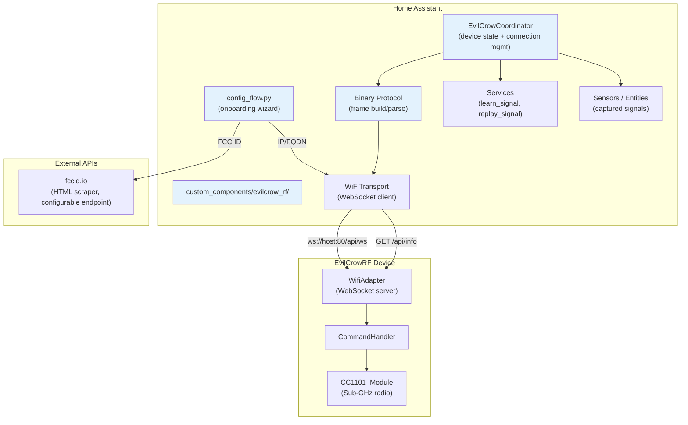
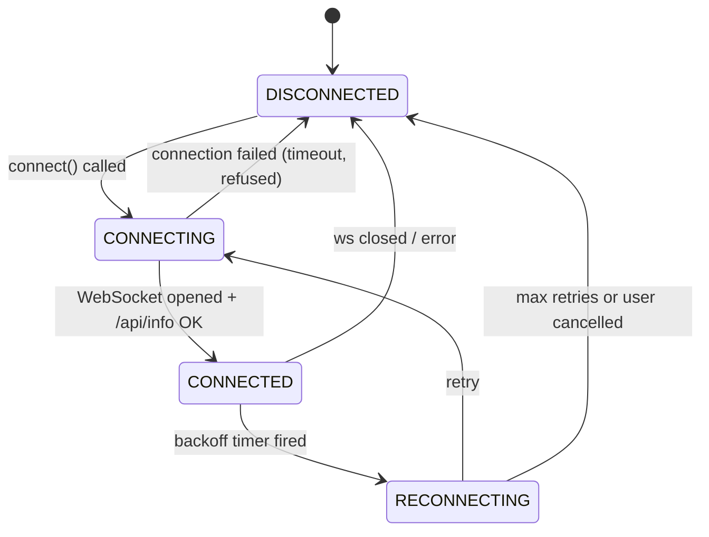
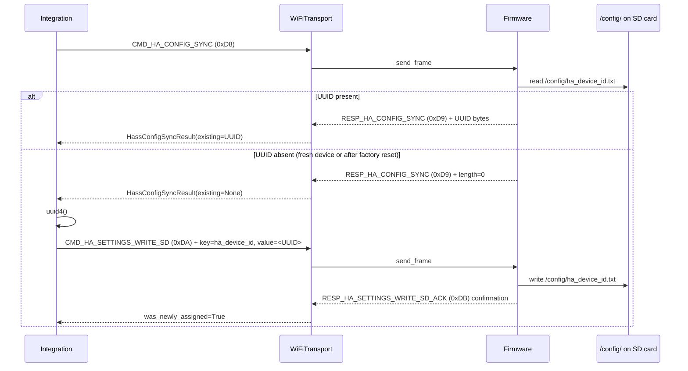
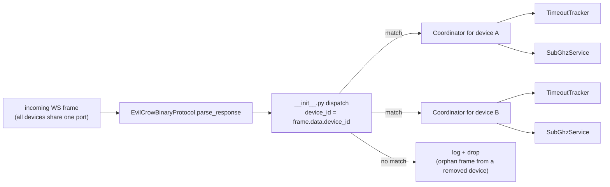
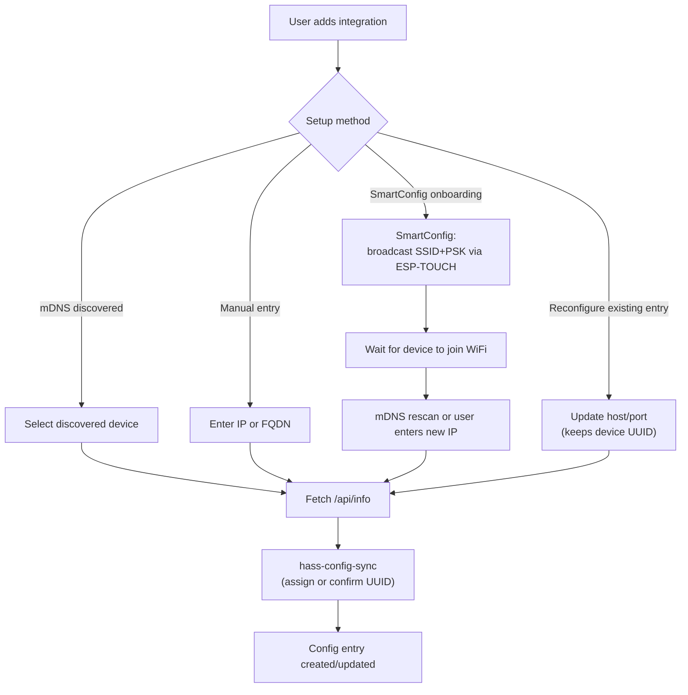
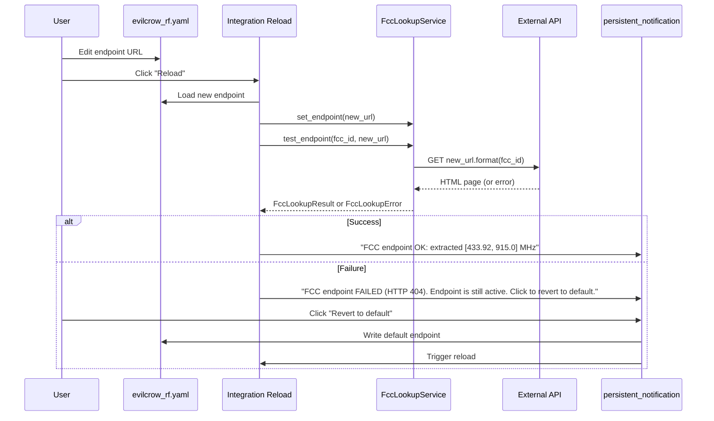
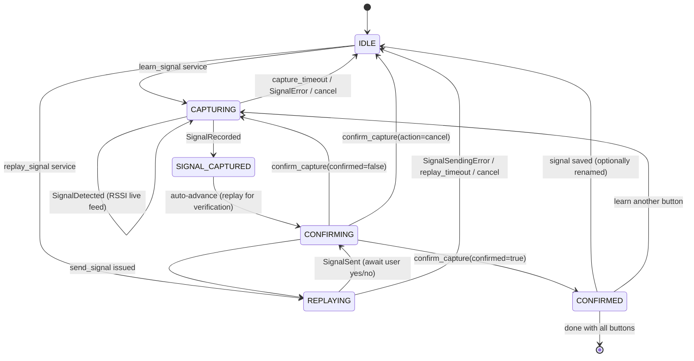
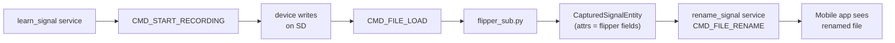
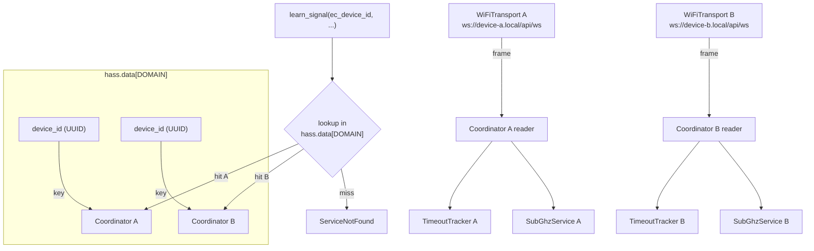
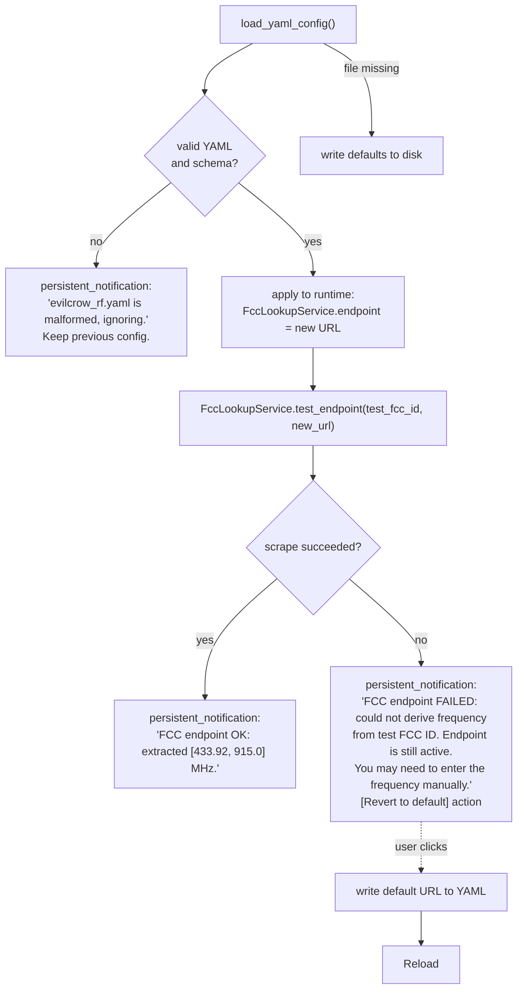

# EvilCrowRF V2 — Home Assistant Integration Plan

## Table of Contents

1. [Overview](#overview)
2. [Architecture](#architecture)
3. [Directory Structure](#directory-structure)
4. [Firmware Prerequisites](#firmware-prerequisites)
5. [Phase 1: Foundation — Project Scaffolding & Protocol Layer](#phase-1-foundation)
6. [Phase 2: Config Flow — Device Onboarding & FCC ID Lookup](#phase-2-config-flow)
7. [Phase 3: Signal Capture & Replay Workflow](#phase-3-signal-capture--replay)
8. [Phase 4: Makefile & Developer Experience](#phase-4-makefile--developer-experience)
9. [Integration YAML Configuration](#integration-yaml-configuration)
10. [Known Gotchas & Operational Notes](#known-gotchas--operational-notes)
11. [Future Considerations](#future-considerations)
12. [Implementation Order](#implementation-order)

---

## Overview

This integration allows Home Assistant to control RF remote-controlled devices via an EvilCrowRF V2 device. The workflow is:

1. **Onboard** the EvilCrowRF device (first-run wizard or direct IP/FQDN).
2. **Identify** the target RF remote by FCC ID or direct frequency entry.
3. **Capture** each button press by having the EvilCrowRF scan for the signal.
4. **Confirm** the captured signal by replaying it and asking the user to verify.
5. **Control** the RF device from Home Assistant automations using the replayed signals.

### Core Requirements

| Requirement | Approach |
|---|---|
| FCC ID → Frequency | Scrape `https://fccid.io/{fcc_id}` HTML to extract operating frequency; endpoint is configurable in `evilcrow_rf.yaml` |
| Direct frequency input | Alternative if user already knows the frequency |
| Signal capture | Use EvilCrowRF's CC1101 Sub-GHz recorder (command `0x09` / `RequestRecord`) |
| Confirm capture | Replay the captured signal, ask for confirmation, retry if needed; explicit cancel returns to HA |
| Device identification | Persistent UUID stored in `/config/ha_device_id.txt` on the device's SD card via a new `hass-config-sync` command (and a companion firmware `CMD_HA_SETTINGS_WRITE_SD`); the mobile app is unaffected |
| Multi-device ready | All communication includes a device-id field in the state machine; dispatch keyed by `device_id` |
| WiFi transport | WebSocket connection to `/api/ws` on the EvilCrowRF device |
| Timeout safety | Every command has a 15–30s timeout; the state machine cannot hang forever |
| Version awareness | Read `RESP_VERSION_INFO` on connect; warn (but allow) on major mismatch |
| File rename | Captured `.sub` files can be renamed so they are usable from the mobile app too |
| File load | `CMD_FILE_LOAD (0xA5)` reads `.sub` file contents from the SD card so the integration can populate Flipper Sub entity attributes |
| Frequency scan fallback | `CMD_SCAN (0x02)` lets users without an FCC ID discover the operating frequency by pressing the remote near the device |
| Persistent signal monitoring | Dedicate one CC1101 module to continuous listening; match incoming signals against known signals and update HA entity state; optionally expose unknown signals; user can enable/disable per device |
| SmartConfig onboarding | Optional firmware support for ESP-TOUCH SmartConfig to push WiFi credentials |

---

## Architecture



### Key Design Decisions

| Decision | Rationale |
|---|---|
| **Python dataclasses for protocol** instead of raw byte arrays | Maintainable, testable, matches HA conventions |
| **DataUpdateCoordinator** for device polling | HA best practice for device state management |
| **`hass-config-sync` command** (new, `0xD8` → `0xD9`) for device ID exchange | Persists the HA device UUID in `/config/ha_device_id.txt` on the SD card via a new firmware `CMD_HA_SETTINGS_WRITE_SD (0xDA)` command; the existing mobile-app ↔ firmware protocol is unaffected — the mobile app ignores the new commands |
| **Configurable FCC API endpoint** stored in `evilcrow_rf.yaml` (not options flow) | The FCC endpoint is an integration-wide setting (not per-device); a YAML file is the right scope and survives integration reloads |
| **Options-flow test/revert flow** | On endpoint change: scrape once, show result, **always persist the new endpoint**, expose "Revert to default" as an always-available action |
| **Single config entry per device** at launch; multi-device dispatch from Phase 5 | Phases 1–4: dispatch keyed by `host:port` (config-entry `entry_id`). Phase 5: dispatch keyed by stable UUID from `CMD_HA_CONFIG_SYNC`. Services take `device_id` (the config-entry key in Phases 1–4, the SD-card UUID in Phase 5). Reconfigure flow handles host/port changes in both phases. |
| **mDNS auto-discovery** via HA's built-in zeroconf integration | The manifest declares `"zeroconf": ["_evilcrow._tcp.local."]`; HA core runs the browser and the integration implements `async_step_zeroconf` in `config_flow.py`. No custom `discovery.py` module — the integration does not start its own browser, which would race with HA's. Manual IP entry is the recommended path (mDNS is unreliable across VLANs/routers). |
| **Request/response timeout tracker** | If a command times out (firmware crash, RF interference, silent WS drop), the state machine transitions to an error state and a `persistent_notification` is shown — never hangs |
| **Version awareness with warning, not block** | Read `RESP_VERSION_INFO` on connect; if major version differs, show a warning that the user can dismiss and continue |
| **SmartConfig (ESP-TOUCH) onboarding** | Firmware gains a `smartConfig` mode; the integration instructs the user to put the device in this mode, then broadcasts SSID/password via UDP — no need for the HA host to have WiFi or to connect to the device's SoftAP |
| **Captured signals mapped to Flipper Sub file fields** | `frequency`, `preset`, `protocol`, `bit`, `key`, `te`, `repeat`, etc. stored as entity attributes — directly portable to the mobile app; `flipper_sub.py` parses `.sub` files read from the device via `CMD_FILE_LOAD` |
| **Target RF remote persistence** | Learned signals and their button-to-file mappings are persisted in `<config_dir>/evilcrow_rf_targets.json` so they survive HA restarts |
| **Persistent signal monitoring** | `signal_monitor.py` dedicates one CC1101 module to always-on listening. The firmware reports detected signals via `CMD_START_MONITOR (0x1B)` / `RESP_SIGNAL_MONITOR (0x95)`. The integration matches the decoded key against known signals in `TargetDeviceStore` and updates `CapturedSignalEntity` state (`last_detected`, `active`). Unknown signals can optionally be exposed as transient entities (off by default — RF noise makes this noisy). User enables/disables monitoring per device via config entry options. |
| **Reconfigure flow** | If the device IP changes (DHCP), the user can update host/port without removing/re-adding the integration |
| **Config entry migration** | `CONFIG_ENTRY_VERSION` and `async_migrate_entry` protect against schema drift between integration releases |
| **Firmware prerequisites documented** | A dedicated "Firmware Prerequisites" section lists the new firmware commands required (with command IDs and firmware PR references) so the integration cannot be installed against incompatible firmware without clear messaging |

---

## Directory Structure

```
hass/
├── custom_components/
│   └── evilcrow_rf/
│       ├── __init__.py                 # Component setup, multi-device dispatch, NOT_READY
│       ├── manifest.json               # HA manifest (version, dependencies, etc.)
│       ├── config_flow.py              # Config flow (user, reauth, reconfigure, options)
│       ├── const.py                    # Constants, domain, default values, command IDs
│       ├── strings.json                # User-facing strings for config flow
│       ├── translations/
│       │   └── en.json                 # English translations
│       ├── coordinator.py              # EvilCrowCoordinator (DataUpdateCoordinator)
│       ├── binary_protocol.py          # Frame building/parsing (Python port)
│       ├── wifi_transport.py           # WebSocket client + HTTP /api/info
│       ├── device.py                   # Device model, identity management, hass-config-sync
│       ├── services.py                 # HA services (learn, replay, capture, rename, cancel)
│       ├── sensor.py                   # Sensor entities (device state, version, last-captured signal)
│       ├── button.py                   # Button entities (trigger actions, learn-button)
│       ├── select.py                   # Select entity (.sub file picker for replay)
│       ├── text.py                     # Text entity (rename .sub file)
│       ├── target_device_store.py    # Target RF remote persistence (JSON)
│       ├── fcc_lookup.py               # FCC ID → frequency API client (loads endpoint from YAML)
│       ├── subghz.py                   # Sub-GHz capture/replay state machine
│       ├── signal_monitor.py           # Persistent RF monitoring (dedicated CC1101 module)
│       ├── timeout_tracker.py          # PendingRequestTracker (request/response timeout)
│       ├── smartconfig.py              # ESP-TOUCH SmartConfig WiFi provisioning
│       ├── flipper_sub.py              # Flipper Sub file format parser/serializer
│       └── models.py                   # Shared dataclasses (DeviceInfo, Signal, etc.)
├── pyproject.toml                       # UV project config (deps, dev-deps, tool config)
├── tests/
│   ├── __init__.py
│   ├── conftest.py                     # Pytest fixtures (HA mocks, sample .sub files)
│   ├── test_binary_protocol.py         # Frame encode/decode, chunking, command building
│   ├── test_fcc_lookup.py              # FCC ID URL construction, response parsing, error handling
│   ├── test_subghz.py                  # State machine transitions, response routing, error recovery
│   ├── test_wifi_transport.py          # WebSocket lifecycle, reconnect backoff, /api/info parsing
│   ├── test_timeout_tracker.py         # Timeout firing, race-free cancellation
│   ├── test_config_flow.py             # User, reauth, reconfigure, options steps
│   ├── test_device.py                  # hass-config-sync round-trip, factory-reset reconciliation
│   ├── test_coordinator.py             # Multi-device dispatch, version negotiation, NOT_READY
│   ├── test_flipper_sub.py             # .sub file format round-trip
│   ├── test_target_device_store.py  # TargetDevice persistence round-trip, atomic writes
    │   ├── test_signal_monitor.py       # Monitor lifecycle, signal matching, unknown handling
    │   ├── test_smartconfig.py           # ESP-TOUCH packet format
    │   ├── test_yaml_config.py          # evilcrow_rf.yaml load/save/revert
    │   └── test_options_flow.py         # FCC endpoint options: persist, scrape, revert
├── docs/
│   └── plan.md                        # This file
└── Makefile                            # Developer targets (uv, lint, test, install, run, lock)
```

> **Note**: Technically, Home Assistant custom components live under `custom_components/` inside the HA config directory. The `Makefile` will symlink or copy this directory for testing.

---

## Firmware Prerequisites

> **Status**: All commands listed here are **deferred to Phase 5** — see [Implementation Order](#implementation-order). Phases 1–4 ship against the **current, unmodified** firmware. The integration detects at runtime which commands the firmware supports and gracefully disables Phase 5 features (with a `persistent_notification`) on older firmware. This lets the firmware PRs and the integration code be developed in parallel.

The integration depends on the following **new firmware commands** (additive — no existing firmware code paths are modified, and the mobile app ignores them). All byte allocations are picked from ranges that the existing mobile-app and web-app firmware protocols do **not** use:

| Command | ID | Direction | Purpose | Firmware Impact |
|---|---|---|---|---|
| `CMD_HA_CONFIG_SYNC` | `0xD8` | App → Device | Request the device's HA-assigned UUID | Firmware reads `/config/ha_device_id.txt` from SD card; response `0xD9` returns the UUID bytes or zero-length if absent |
| `RESP_HA_CONFIG_SYNC` | `0xD9` | Device → App | Return the HA-assigned UUID (or empty) | Payload: `[length:uint16][uuid-bytes]`; 0x0000 means no UUID assigned yet |
| `CMD_HA_SETTINGS_WRITE_SD` | `0xDA` | App → Device | Write a key=value pair to `/config/<key>.txt` on the SD card | Opens/writes/closes a file on the SD card filesystem; payload: `[key_len:uint8][key:N][value_len:uint16][value:N]` |
| `RESP_HA_SETTINGS_WRITE_SD_ACK` | `0xDB` | Device → App | Acknowledge successful SD write | Payload: `[key_len:uint8][key:N]` (the key that was written); empty on error |
| `CMD_SMART_CONFIG` | `0xDC` | App → Device | Enter ESP-TOUCH SmartConfig WiFi provisioning mode | Uses the ESP-IDF SmartConfig library (already available); no payload needed |
| `RESP_SMART_CONFIG_STATUS` | `0xDD` | Device → App | Status notification for SmartConfig provisioning | Payload: TBD by firmware team (one of: `provisioning_started`, `credentials_received`, `wifi_joined`, `failed`) |
| `CMD_START_MONITOR` | `0x1B` | App → Device | Start continuous RX on a dedicated CC1101 module | Configures the specified module in RX mode at the given frequency; payload: `[module:uint8][frequency:uint32 LE][rssi_threshold:int8]` |
| `CMD_STOP_MONITOR` | `0x1C` | App → Device | Stop the monitoring module | Releases the module back to idle; no payload |
| `RESP_SIGNAL_MONITOR` | `0x95` | Device → App | Signal detected during monitoring | Payload: `[frequency:uint32 LE][rssi:int8][protocol:uint8][bit:uint8][key_len:uint8][key:N]` |
| `CMD_FILE_LOAD` | `0xA5` | App → Device | Read a file from the SD card (chunked response) | Firmware opens the file and streams it in ≤500B chunks via `RESP_FILE_CONTENT (0xA6)` |
| `RESP_FILE_CONTENT` | `0xA6` | Device → App | Chunked file content response for `CMD_FILE_LOAD` | Payload: `[chunk_num:uint8][total_chunks:uint8][data:N]` |

**Collision-avoidance analysis** (the exhaustive mobile/web-app byte map this avoids):

| Range | Used by | Status |
|---|---|---|
| `0x01`–`0x1A` | Core commands (`GET_STATE`, `REQUEST_SCAN`, `REQUEST_IDLE`, `BRUTER`, file ops, `REBOOT`, `FACTORY_RESET`, `FORMAT_SD`, `SET_WIFI_AP_CONFIG`, `APPLY_WIFI`) | taken |
| `0x1B`–`0x1F` | (none) | **free** — `CMD_START_MONITOR` (0x1B), `CMD_STOP_MONITOR` (0x1C) |
| `0x20`–`0x35` | NRF24 + OTA commands | taken |
| `0x36`–`0x3F` | (none) | free (unused; reserved for future Core commands) |
| `0x40` | HW Button | taken |
| `0x50`–`0x60` | SDR + ProtoPirate commands | taken |
| `0x80`–`0x82` | `modeSwitch`, `status`, `heartbeat` | taken (responses) |
| `0x90`–`0x94` | `signalDetected`, `signalRecorded`, `signalSent`, `signalSendError`, `frequencySearch` | taken (responses) |
| `0x95`–`0x9F` | (none — `RESP_SIGNAL_MONITOR` at 0x95; rest free for future Sub-GHz responses) | **0x95 used; rest free** |
| `0xA0`–`0xA3` | `fileContent`, `fileList`, `directoryTree`, `fileActionResult` (mobile) | taken (responses) |
| `0xA4`–`0xAF` | (none — `RESP_FILE_CONTENT` at 0xA6; `CMD_FILE_LOAD` at 0xA5) | **partially used; rest free** |
| `0xB0`–`0xBB` | Bruter + ProtoPirate responses | taken |
| `0xBC`–`0xBF` | (none) | free |
| `0xC0`–`0xC4` | `settingsSync`, `settingsUpdate`, `versionInfo`, `batteryStatus`, `sdrStatus` | taken (commands + responses) |
| `0xC5`–`0xC6` | (none) | free |
| `0xC7`–`0xCB` | `deviceName`, `hwButtonStatus`, `sdStatus`, `nrfModuleStatus`, `wifiApConfig` | taken (responses) |
| `0xCC`–`0xCF` | (none) | free |
| `0xD0`–`0xD7` | NRF24 events | taken (responses) |
| `0xD8`–`0xDF` | (none — `CMD_HA_CONFIG_SYNC` 0xD8, `RESP_HA_CONFIG_SYNC` 0xD9, `CMD_HA_SETTINGS_WRITE_SD` 0xDA, `RESP_HA_SETTINGS_WRITE_SD_ACK` 0xDB, `CMD_SMART_CONFIG` 0xDC, `RESP_SMART_CONFIG_STATUS` 0xDD) | **used by Phase 5** |
| `0xE0`–`0xE2` | OTA events | taken (responses) |
| `0xE3`–`0xEF` | (none) | free |
| `0xF0`–`0xF3` | `error`, `lowMemory`, `commandSuccess`, `commandError` | taken (responses) |
| `0xF4`–`0xFF` | (none) | free |

**Source**: bytes derived from `mobile_app/lib/providers/firmware_protocol.dart` (commands) and `mobile_app/lib/services/binary_message_parser.dart` (responses).

**Minimum firmware version**: The integration checks `fw_major` from `/api/info` and warns if <3 (current major). The specific minor/patch version depends on when these commands land. The integration logs a clear error message listing the missing commands if `RESP_VERSION_INFO` does not report the expected capability flags.

**Backward compatibility**: All new commands live in ranges the mobile app does not use (`0x1B`–`0x1C`, `0xA4`–`0xA6`, `0xD8`–`0xDD`). The mobile app's `FirmwareBinaryProtocol` ignores unknown message types — no mobile-app changes required.

**Runtime detection (Phases 1–4)**: Until the firmware PRs land, the integration must detect capability at runtime and:
- Skip `CMD_HA_CONFIG_SYNC` (0xD8) if `RESP_VERSION_INFO` doesn't advertise the `HASS_CONFIG_SYNC` capability flag.
- Skip `CMD_START_MONITOR` (0x1B) and surface "monitoring not supported on this firmware" if the capability flag is absent.
- Skip `CMD_FILE_LOAD` (0xA5) and populate `CapturedSignalEntity` attributes from locally-cached state instead.
- Skip `CMD_SMART_CONFIG` (0xDC) and instruct the user to put the device in SmartConfig mode via the BOOT button (firmware already supports this without the new command).
The capability flags are negotiated once on connect and cached on the coordinator. See `test_coordinator.py` for the fallback test cases.

---

## Phase 1: Foundation

### 1.1 `manifest.json`

```json
{
  "domain": "evilcrow_rf",
  "name": "EvilCrowRF V2",
  "codeowners": ["@your-gh-handle"],
  "config_flow": true,
  "dependencies": [],
  "documentation": "https://github.com/...",
  "iot_class": "local_push",
  "requirements": ["aiohttp>=3.9.0", "beautifulsoup4>=4.12", "lxml>=5.0"],
  "version": "1.0.0",
  "zeroconf": ["_evilcrow._tcp.local."],
  "ssdp": []
}
```

- `iot_class: local_push` — WebSocket provides real-time notifications from the device.
- `zeroconf` — enables mDNS auto-discovery of `_evilcrow._tcp` service type.
- `config_flow: true` — enables the onboarding wizard.

### 1.2 `const.py`

```python
DOMAIN = "evilcrow_rf"
DEFAULT_NAME = "EvilCrowRF V2"
DEFAULT_PORT = 80
DEFAULT_SCAN_INTERVAL = 30
WS_PATH = "/api/ws"
INFO_PATH = "/api/info"
MAX_RECONNECT_DELAY = 300  # 5 minutes
REQUEST_TIMEOUT = 15          # generic request timeout
CAPTURE_TIMEOUT = 30          # state machine timeout for capture/replay
SUPPORTED_FW_MAJOR = 3        # firmware major version this integration was built against

# Integration YAML config (lives in <config_dir>/evilcrow_rf.yaml)
YAML_CONFIG_FILENAME = "evilcrow_rf.yaml"

# Binary protocol constants
BINARY_MAGIC = 0xAA
FRAME_TYPE_DATA = 0x01
FRAME_TYPE_ACK = 0x02
FRAME_TYPE_NAK = 0x03
MAX_PAYLOAD_SIZE = 500

# Message types (command → device).
# Byte allocations follow the safe-harbor map documented in §Firmware Prerequisites.
# Newly added commands (Phase 5) occupy ranges that are NOT used by the existing
# mobile-app or web-app firmware protocol — see §Firmware Prerequisites for the
# full collision-avoidance analysis.
CMD_GET_STATE = 0x01
CMD_SCAN = 0x02
CMD_IDLE = 0x03
CMD_START_RECORDING = 0x09
CMD_STOP_RECORDING = 0x0A
CMD_SEND_SIGNAL = 0x0B
CMD_START_MONITOR = 0x1B     # Phase 5: continuous listening on a dedicated CC1101 module
CMD_STOP_MONITOR = 0x1C      # Phase 5: stop the monitoring module
CMD_FILE_LIST = 0xA0         # request SD-card file listing
CMD_FILE_LOAD = 0xA5         # Phase 5: read a .sub file from the SD card (chunked response)
CMD_FILE_RENAME = 0xA4       # rename a file on the SD card
CMD_SETTINGS_UPDATE = 0xC1
CMD_HA_CONFIG_SYNC = 0xD8    # Phase 5: ask device for its HA-assigned UUID (response 0xD9)
CMD_HA_SETTINGS_WRITE_SD = 0xDA  # Phase 5: write a key=value pair to /config/ on the SD card
CMD_SMART_CONFIG = 0xDC      # Phase 5: put device into SmartConfig WiFi provisioning mode

# Message types (response → app, 0x80+).
# Phase 5 response codes are paired with their command counterparts (0xD8/0xD9,
# 0xDA/0xDB, 0xDC/0xDD) so direction is always unambiguous.
RESP_SIGNAL_DETECTED = 0x90
RESP_SIGNAL_RECORDED = 0x91
RESP_SIGNAL_SENT = 0x92
RESP_SIGNAL_ERROR = 0x93
RESP_SIGNAL_SENDING_ERROR = 0x94
RESP_SIGNAL_MONITOR = 0x95   # Phase 5: signal detected during continuous monitoring (payload: freq, rssi, raw_key)
RESP_FILE_LIST = 0xA1
RESP_FILE_CONTENT = 0xA6     # Phase 5: chunked file content response for CMD_FILE_LOAD (0xA5)
RESP_FILE_ACTION = 0xA3
RESP_VERSION_INFO = 0xC0
RESP_HA_CONFIG_SYNC = 0xD9   # Phase 5: payload: [length:uint16][uuid-string-bytes] or 0x0000 if unset
RESP_HA_SETTINGS_WRITE_SD_ACK = 0xDB  # Phase 5: ack for CMD_HA_SETTINGS_WRITE_SD (0xDA)
RESP_SMART_CONFIG_STATUS = 0xDD  # Phase 5: status notification for CMD_SMART_CONFIG (0xDC)
RESP_DEVICE_NAME = 0xC8
RESP_SETTINGS_SYNC = 0xC9

# Config flow steps
STEP_USER = "user"
STEP_MANUAL = "manual_device"
STEP_SMARTCONFIG = "smartconfig"
STEP_DISCOVERY = "discovery"
STEP_REGISTER = "register_device"
STEP_CAPTURE_SETUP = "capture_setup"
STEP_RECONFIGURE = "reconfigure"
STEP_OPTIONS = "options"
STEP_FCC_TEST = "fcc_test"

# Services
SERVICE_LEARN_SIGNAL = "learn_signal"
SERVICE_REPLAY_SIGNAL = "replay_signal"
SERVICE_CANCEL_CAPTURE = "cancel_capture"
SERVICE_CONFIRM_CAPTURE = "confirm_capture"
SERVICE_RENAME_SIGNAL = "rename_signal"
SERVICE_DELETE_SIGNAL = "delete_signal"
SERVICE_REFRESH_FILES = "refresh_files"
SERVICE_SCAN_FREQUENCY = "scan_frequency"
SERVICE_START_MONITORING = "start_monitoring"
SERVICE_STOP_MONITORING = "stop_monitoring"

# Config entry versioning
CONFIG_ENTRY_VERSION = 1

# Target RF remote persistence (survives HA restarts)
TARGET_DEVICES_FILENAME = "evilcrow_rf_targets.json"

# Attributes
ATTR_DEVICE_ID = "device_id"
ATTR_FCC_ID = "fcc_id"
ATTR_FREQUENCY = "frequency"
ATTR_MODULATION = "modulation"
ATTR_BUTTON_NAME = "button_name"
ATTR_SIGNAL_FILE = "signal_file"
ATTR_NEW_NAME = "new_name"
ATTR_CONFIRMED = "confirmed"
ATTR_TARGET_DEVICE_ID = "target_device_id"
ATTR_SCAN = "scan"
ATTR_STRONGEST_FREQUENCY = "strongest_frequency"
ATTR_EXPOSE_UNKNOWN = "expose_unknown"
ATTR_MONITOR_MODULE = "monitor_module"

# FCC ID lookup (default + integration YAML schema keys)
DEFAULT_FCC_API_ENDPOINT = "https://fccid.io/{fcc_id}"
CONF_FCC_API_ENDPOINT = "fcc_api_endpoint"
CONF_FCC_TEST_ID = "fcc_test_id"

# Config entry options (per-device, settable via Options flow)
CONF_MONITOR_ENABLED = "monitor_enabled"               # bool, default False
CONF_MONITOR_MODULE = "monitor_module"                 # int, which CC1101 module (0 or 1, default 1)
CONF_MONITOR_RSSI_THRESHOLD = "monitor_rssi_threshold" # int, dBm; signals below this are ignored (default: -80)
CONF_EXPOSE_UNKNOWN = "expose_unknown"                 # bool, expose newly detected signals, default False
CONF_EXPOSE_UNKNOWN_MIN_OCCURRENCES = "expose_unknown_min_occurrences"  # int, default 3
CONF_EXPOSE_UNKNOWN_WINDOW_SECONDS = "expose_unknown_window_seconds"    # int, default 60

# Persistent notifications (used for timeout, version-mismatch, etc.)
NOTIFY_VERSION_WARNING = "evilcrow_rf_version_warning"
NOTIFY_CAPTURE_TIMEOUT = "evilcrow_rf_capture_timeout"
NOTIFY_SIGNAL_MONITOR = "evilcrow_rf_signal_monitor"   # unknown signal detected during monitoring
```

### 1.3 `binary_protocol.py` — Python Implementation of the Binary Protocol

This module reimplements the `FirmwareBinaryProtocol` from the mobile app in Python.

**Frame Format** (matches firmware):

```
┌──────┬──────┬─────────┬──────────┬──────────────┬───────────┬──────────────┬──────────┐
│ Magic│ Type │ ChunkID │ ChunkNum │ TotalChunks  │  DataLen  │    Data      │ Checksum │
│  1B  │  1B  │   1B    │    1B    │     1B       │  2B (LE)  │  0..500 B    │    1B    │
│ 0xAA │0x01  │  0..255 │  1..255  │    1..255    │           │  variable    │  XOR     │
└──────┴──────┴─────────┴──────────┴──────────────┴───────────┴──────────────┴──────────┘
```

**Key design for `binary_protocol.py`**:

```python
@dataclass
class BinaryFrame:
    magic: int = BINARY_MAGIC
    frame_type: int = FRAME_TYPE_DATA
    chunk_id: int = 0          # also used as request sequence number (1..255)
    chunk_num: int = 1
    total_chunks: int = 1
    data: bytes = b""

    def encode(self) -> bytes:
        """Encode frame to bytes with XOR checksum."""

    @staticmethod
    def decode(data: bytes) -> "BinaryFrame":
        """Parse a binary frame, validate checksum, return frame."""

class EvilCrowBinaryProtocol:
    """Command builder and response parser. Pure data, no I/O."""

    def __init__(self) -> None:
        self._next_request_id: int = 0      # monotonic, wraps 1..255

    def _next_id(self) -> int:
        self._next_request_id = (self._next_request_id % 255) + 1
        return self._next_request_id

    # ---- command builders ----

    def build_request_record_command(
        self, frequency: int, module: int, preset: int = 0,
    ) -> list[bytes]:
        """Build Start Recording command frames (chunked if needed)."""

    def build_stop_record_command(self) -> list[bytes]:
        """Build Stop Recording command."""

    def build_idle_command(self) -> list[bytes]:
        """Build Idle command (stop any in-progress radio activity)."""

    def build_send_signal_command(self, file_path: str) -> list[bytes]:
        """Build Send Signal command frames (replay .sub file)."""

    def build_file_list_command(self, path: str = "/") -> list[bytes]:
        """Build File List command; response is chunked on WiFi too if > 500 B."""

    def build_file_rename_command(self, old_path: str, new_path: str) -> list[bytes]:
        """Build File Rename command so the user can rename a captured .sub to a
        Flipper-style name usable from the mobile app too."""

    def build_file_load_command(self, file_path: str) -> list[bytes]:
        """Build File Load command (CMD_FILE_LOAD 0xA5) to read a .sub file from
                the SD card. The firmware responds with chunked RESP_FILE_CONTENT (0xA6)."""

    def build_scan_command(self) -> list[bytes]:
        """Build Scan command (CMD_SCAN 0x02) — tells the firmware to listen
        for the strongest RF activity and report the frequency. Used when the
        user doesn't know the frequency and has no FCC ID."""

    def build_start_monitor_command(
            self, module: int, frequency: int, rssi_threshold: int = -80,
        ) -> list[bytes]:
            """Build Start Monitor command (CMD_START_MONITOR 0x1B).
            Dedicates one CC1101 module to continuous listening on the given
            frequency. The firmware streams RESP_SIGNAL_MONITOR (0x95) for every
            detected signal above the RSSI threshold."""

        def build_stop_monitor_command(self) -> list[bytes]:
            """Build Stop Monitor command (CMD_STOP_MONITOR 0x1C).
            Releases the dedicated CC1101 module back to idle."""

    def build_settings_update_command(
        self, setting_key: int, setting_value: bytes,
    ) -> list[bytes]:
        """Build a generic settings-update command."""

    def build_smartconfig_command(
            self, ssid: str, password: str, channel: int | None = None,
        ) -> list[bytes]:
            """Build a SmartConfig (ESP-TOUCH) provisioning command (CMD_SMART_CONFIG
            0xDC). The firmware receives this and uses its internal SmartConfig
            library to join WiFi. Alternative: firmware exposes SmartConfig as a
            separate mode triggered by the hardware button; this command then only
            confirms. The firmware emits RESP_SMART_CONFIG_STATUS (0xDD) on each
            provisioning lifecycle event."""

        def build_ha_config_sync_command(self) -> list[bytes]:
            """Ask the device for its HA-assigned UUID (CMD_HA_CONFIG_SYNC 0xD8,
            response RESP_HA_CONFIG_SYNC 0xD9). Payload is empty; the response
            carries the UUID or a zero-length string if unset."""

    # ---- response parsing ----

    @staticmethod
    def parse_response(frame: BinaryFrame) -> dict:
        """Parse a binary response frame into {'type': <str>, 'request_id': <int>, 'data': <dict>}."""
```

**Design rationale**: Following the mobile app pattern, this is a pure-data module with no I/O. The frame builder and response parser are stateless (except for the request-id counter, which is trivial). The chunk ID is reused as the request sequence number — every command carries one, the firmware echoes it in the response, and `timeout_tracker.py` uses it to correlate responses with pending commands.

**Wire-compatibility note**: The new commands `CMD_FILE_LOAD (0xA5)`, `RESP_FILE_CONTENT (0xA6)`, `CMD_SMART_CONFIG (0xDC)`, `RESP_SMART_CONFIG_STATUS (0xDD)`, `CMD_HA_CONFIG_SYNC (0xD8)`, `RESP_HA_CONFIG_SYNC (0xD9)`, `CMD_HA_SETTINGS_WRITE_SD (0xDA)`, `RESP_HA_SETTINGS_WRITE_SD_ACK (0xDB)`, `CMD_START_MONITOR (0x1B)`, `CMD_STOP_MONITOR (0x1C)`, and `RESP_SIGNAL_MONITOR (0x95)` are no-ops for the existing mobile app because it never sends them and ignores the corresponding response codes. All bytes were picked from gaps in the existing mobile-app and web-app protocol maps (see §Firmware Prerequisites "Collision-avoidance analysis" for the full table). No firmware refactor is needed for mobile-app compatibility.

### 1.4 `wifi_transport.py` — WebSocket Client

```python
class WiFiTransport:
    """Manages the WebSocket connection to a single EvilCrowRF device.

    WiFi WebSocket frames arrive *intact* — chunking is a BLE-only concern.
    However, the firmware still tags every frame with chunk_id/chunk_num/total_chunks
    for legacy reasons, so the transport must accept either layout and pass each
    frame to the reader unchanged.
    """

    def __init__(self, host: str, port: int, device_id: str):
        self._host = host
        self._port = port
        self._device_id = device_id  # persistent UUID (set by hass-config-sync)
        self._ws: aiohttp.ClientWebSocketResponse | None = None
        self._session: aiohttp.ClientSession | None = None
        self._on_message: Callable[[dict], Awaitable[None]] | None = None
        self._on_disconnect: Callable[[], Awaitable[None]] | None = None
        self._info: dict | None = None        # cached /api/info response
        self._connect_started_at: float | None = None   # time.monotonic()
        self._close_lock = asyncio.Lock()

    async def connect(self) -> bool:
        """Open HTTP session, GET /api/info, open WebSocket to ws://host:port/api/ws."""

    async def disconnect(self) -> None:
        """Close WebSocket and HTTP session; idempotent."""

    async def send_frame(self, frame: bytes, *, timeout: float = REQUEST_TIMEOUT) -> bool:
        """Send a binary frame over WebSocket with a per-call timeout."""

    async def fetch_device_info(self) -> dict | None:
        """GET http://host:port/api/info. Returns parsed JSON or None.

        Expected schema (validated; missing fields log a warning but do not fail):
          {
            "name": str,
            "fw_version": str,        # e.g. "3.0.1"
            "fw_major": int,
            "fw_minor": int,
            "fw_patch": int,
            "transport": "wifi",
            "mac": str,               # NOT used as identity; informational only
            "sd_present": bool,
            "nrf24_present": bool,
            "cc1101_count": int,
          }
        """

    async def _reader_task(self) -> None:
        """Background loop: read WebSocket binary frames, hand off to on_message."""
```

Key behaviors:

- On connect, fetch `/api/info` to get device metadata (name, firmware version, capabilities). Cache the result on the transport instance.
- Use `time.monotonic()` for timeouts (never `datetime.now()` — wall-clock can jump on NTP sync or manual changes).
- Maintain a background reader coroutine that decodes each frame with `EvilCrowBinaryProtocol.parse_response` and dispatches via the `on_message` callback.
- Implement exponential backoff reconnection (1s → 2s → 4s → ... → MAX_RECONNECT_DELAY). On reconnect, re-fetch `/api/info` and re-run `hass-config-sync` to confirm the device UUID.
- Emit typed events on message/connection-lost via callbacks. The coordinator wires `on_message` to the timeout tracker and the device handler.
- Per-call `send_frame(..., timeout=...)` so callers can pass short or long timeouts.
- **Transport is single-device**: one `WiFiTransport` instance per device. Multi-device support means multiple instances.



### 1.5 `device.py` — Device Identity Management *(Phase 5 — firmware-dependent)*

> **Phases 1–4** identify devices by `host:port` (the existing config-entry data model). The `DeviceInfo` dataclass and `DeviceRegistryStore` below are still defined in Phase 1, but the UUID round-trip (`hass-config-sync`) is **deferred to Phase 5** because it requires the new `CMD_HA_CONFIG_SYNC (0xD8)` / `CMD_HA_SETTINGS_WRITE_SD (0xDA)` firmware commands. Until Phase 5 ships, devices keep their HA-assigned entry_id as a stable identity, which is sufficient for single-device use. Multi-device support from Phase 5 onward uses the UUID instead of entry_id for dispatch (see [§1.6 coordinator.py multi-device dispatch](#16-coordinatorpy--device-state-coordinator)).

```python
@dataclass
class DeviceInfo:
    host: str
    port: int
    device_id: str         # stable UUID (HA-assigned, persisted in device's config.txt)
    name: str              # device display name (from /api/info)
    firmware_version: str  # e.g. "3.0.1"
    fw_major: int
    fw_minor: int
    fw_patch: int
    transport: str         # "wifi"
    mac: str | None        # informational only; not used as identity
    capabilities: dict     # sd_present, nrf24_present, cc1101_count, ...

class HassConfigSyncResult:
    """Result of a hass-config-sync exchange."""
    existing_device_id: str | None  # UUID the device already had, or None
    assigned_device_id: str         # UUID the integration will use going forward
    was_newly_assigned: bool        # True if we had to assign a fresh UUID

class DeviceRegistryStore:
    """Persists device registry data in HA's storage (stores.json-like)."""

    def __init__(self, hass):
        self._hass = hass
        self._data: dict[str, dict] = {}  # device_id → info

    async def async_load(self) -> None: ...
    async def async_save(self) -> None: ...
    def get(self, device_id: str) -> DeviceInfo | None: ...
    def register(self, info: DeviceInfo) -> None: ...
    def find_by_host(self, host: str, port: int) -> DeviceInfo | None:
        """Locate a device by its host/port — used for factory-reset reconciliation."""
    def all_devices(self) -> list[DeviceInfo]: ...
```

**Device ID flow (`hass-config-sync`)** — no MAC, survives firmware updates, factory reset, and any change in `host:port`:

The device stores its HA-assigned UUID in `/config/ha_device_id.txt` on its **SD card**. The firmware's existing `ConfigManager` writes to `/config.txt` on LittleFS (internal flash) which does **not** survive `factoryReset`. A new firmware command `CMD_HA_SETTINGS_WRITE_SD (0xDA)` writes a `key=value` pair to the SD card at `/config/<key>.txt`, and `CMD_HA_CONFIG_SYNC (0xD8`→ response `0xD9`) reads it back. These are additive commands — the mobile app ignores them.



**Why a dedicated command instead of reusing `settingsUpdate`**:

- `settingsUpdate` (0xC1) writes to the device's internal LittleFS (`/config.txt`), which survives reboots but **does not survive `factoryReset`**. The user explicitly requested SD-card persistence so the UUID can be inspected/edited by humans and survives a factory reset.
- `CMD_HA_SETTINGS_WRITE_SD (0xDA)` is a new firmware command that writes a single `key=value` pair to `/config/<key>.txt` on the SD card. The response `RESP_HA_SETTINGS_WRITE_SD_ACK (0xDB)` confirms the write.
- `CMD_HA_CONFIG_SYNC (0xD8`→ `0xD9`) handles the read path: the firmware reads `/config/ha_device_id.txt` from the SD card and returns it (or zero-length if absent).
- The mobile app never sends `0xD8`, `0xDA` and ignores `0xD9`, `0xDB` — no mobile-app protocol change needed.

**Firmware change required**: The firmware must implement `CMD_HA_SETTINGS_WRITE_SD` to open/write/close a file at `/config/<key>.txt` on the SD card (SPIFFS or FAT, whichever the SD card uses). This is a small, additive change — no existing code paths are modified. See [Firmware Prerequisites](#firmware-prerequisites).

**Factory-reset reconciliation**: If the user factory-resets the device, `config.txt` is wiped and a fresh `hass-config-sync` round-trip assigns a new UUID. The existing HA config entry is now orphaned. On startup, `DeviceRegistryStore.find_by_host(host, port)` matches the orphan to the new UUID by network address; the user is shown a `persistent_notification` so they can confirm or re-pair manually.

**Renaming captured signals**: Because the UUID is in `config.txt` on the SD card (a real filesystem), a future change can move the UUID into its own sub-directory (`/config/ha/<uuid>.txt`) without affecting the protocol.

### 1.6 `coordinator.py` — Device State Coordinator

Follows HA's `DataUpdateCoordinator` pattern. One coordinator per device.

```python
class EvilCrowCoordinator(DataUpdateCoordinator[dict]):
    """Coordinator for a single EvilCrowRF device.

    Responsibilities:
      - own the WiFiTransport + EvilCrowBinaryProtocol + TimeoutTracker
      - own the SubGhzService + SignalMonitor
      - run hass-config-sync on connect (assigns/persists device UUID)
      - run version negotiation on connect (warns on major mismatch)
      - dispatch incoming frames to the right local service via on_message
    """

    def __init__(self, hass, config_entry, device_info: DeviceInfo):
        self.hass = hass
        self.config_entry = config_entry
        self._device_info = device_info
        self._protocol = EvilCrowBinaryProtocol()
        self._transport = WiFiTransport(
            host=device_info.host,
            port=device_info.port,
            device_id=device_info.device_id,
        )
        self._tracker = TimeoutTracker(default_timeout=CAPTURE_TIMEOUT)
        self._subghz = SubGhzService(self._transport, self._protocol, self._tracker, hass, device_info.device_id)
        self._signal_monitor = SignalMonitor(self._transport, self._protocol, target_store, hass)
        self._reader_task: asyncio.Task | None = None
        self._version_warning_dismissed: bool = False
        self._cancel_event = asyncio.Event()

        super().__init__(
            hass,
            _LOGGER,
            name=f"{DOMAIN}_{device_info.device_id}",
            update_interval=timedelta(seconds=DEFAULT_SCAN_INTERVAL),
        )

    async def _async_update_data(self) -> dict:
        """Periodic poll — fetches /api/info, confirms liveness, and auto-refreshes
        the SD card file list (so .sub files created by the mobile app appear in
        HA's select entity without manual refresh). The file-list sync is skipped
        if the device has no SD card or is in the middle of a capture."""
        await self._transport.fetch_device_info()
        if self._device_info.capabilities.get("sd_present"):
            await self._subghz.refresh_files()
        return self._device_info.__dict__

    async def async_connect(self) -> bool:
        """Open transport, run hass-config-sync, negotiate version, start reader.
        Returns False if any step fails or times out."""

    async def async_disconnect(self) -> None:
        """Cancel reader + tracker, close transport. Idempotent."""

    @property
    def device_info(self) -> DeviceInfo: ...
    @property
    def transport(self) -> WiFiTransport: ...
    @property
    def subghz(self) -> SubGhzService: ...
    @property
    def signal_monitor(self) -> SignalMonitor: ...
    @property
    def target_store(self) -> TargetDeviceStore: ...
```

**Multi-device dispatch**: `__init__.py` maintains `hass.data[DOMAIN]: dict[str, EvilCrowCoordinator]` keyed by `device_id`. Each coordinator owns its own transport; the dispatcher inside `__init__.py` routes incoming frames to the right coordinator based on the `device_id` field carried in every frame (the firmware echoes the requesting app's UUID in the response — see `firmware/docs/architecture.md` for `_lastRequestChunkId`).

> **Phases 1–4**: `device_id` is the config-entry `entry_id` (HA-assigned UUID), since the SD-card-backed UUID via `hass-config-sync` is not yet available. Two devices with the same `host:port` would still be a single device in this phase, which is fine because the firmware's WS server is single-host per device. **Phase 5**: dispatch key upgrades to the SD-card-backed UUID from `CMD_HA_CONFIG_SYNC`. The same coordinator code path works in both phases; only the key source changes. No data migration is required for Phases 1–4 → Phase 5 because Phase 5 adds a new key column without removing the old one.



**NOT_READY pattern**: If `async_connect` fails (network unreachable, firmware offline, `/api/info` 404), the integration calls `self.config_entry.async_start_reauth(self.hass)` **or** raises `ConfigEntryNotReady` from `__init__.py`. HA then auto-retries with exponential backoff (1, 2, 4, ... minutes, capped). The user does not have to manually reload.

**Version negotiation**: On connect, after `hass-config-sync`, the coordinator sends `CMD_GET_STATE` and waits up to 5s for `RESP_VERSION_INFO`. If the major version differs from `SUPPORTED_FW_MAJOR`, the coordinator:

1. Calls `self._show_version_warning(major, supported)` which writes a `persistent_notification` (id `NOTIFY_VERSION_WARNING`) with a "Dismiss" action.
2. If the user clicks **Dismiss**, `self._version_warning_dismissed = True` and the notification is removed; the integration continues running.
3. If the user reloads the integration without dismissing, the warning reappears (a guard rail against accidental continued use with a broken protocol).

The user is never blocked. The notification is the source of truth.

### 1.7 `timeout_tracker.py` — PendingRequestTracker

Pattern ported from the mobile app's `PendingRequestTracker` (`mobile_app/docs/architecture.md`, "Glaring Issues ✅ Fixed #2").

```python
class TimeoutTracker:
    """Coroutine-safe map: request_id -> (asyncio.Future, deadline_monotonic)."""

    def __init__(self, default_timeout: float = REQUEST_TIMEOUT):
        self._default_timeout = default_timeout
        self._pending: dict[int, tuple[asyncio.Future, float]] = {}
        self._lock = asyncio.Lock()
        self._watcher: asyncio.Task | None = None

    async def track(self, request_id: int, *, timeout: float | None = None) -> asyncio.Future:
        """Register a future for the given request_id; resolve it from resolve()
        or auto-fail on timeout."""

    async def resolve(self, request_id: int, value: Any) -> None:
        """Called by the transport when a matching response arrives."""

    async def cancel_all(self) -> None:
        """Called on disconnect; fails every pending future with ConnectionError."""

    async def _watcher_loop(self) -> None:
        """Background loop; uses time.monotonic() to detect expirations."""
```

Every command built by `EvilCrowBinaryProtocol` carries a request ID. The transport emits the parsed frame via the coordinator's `on_message`, which calls `tracker.resolve(request_id, parsed)`. If no resolution arrives within `CAPTURE_TIMEOUT` (or per-call override), the future raises `asyncio.TimeoutError`, the state machine transitions to an error state, and a `persistent_notification` (`NOTIFY_CAPTURE_TIMEOUT`) is raised so the user is never left wondering.

---

### 1.9 `flipper_sub.py` — Flipper Sub File Parser / Serializer

This module reads, parses, and writes `.sub` files in the Flipper Zero Sub-GHz file format. It is the bridge between the integration's `CapturedSignalEntity` and the raw binary data read from the device's SD card via `CMD_FILE_LOAD`.

> **Phases 1–4** develop and unit-test the parser/serializer against local fixture files in `tests/fixtures/subs/`. The `CMD_FILE_LOAD (0xA5)` integration path (reading `.sub` bytes from the device and feeding them into `parse()`) is **deferred to Phase 5** because it requires the new `CMD_FILE_LOAD` firmware command. In Phases 1–4, `CapturedSignalEntity` attributes are populated from locally-cached state when the user provides a `.sub` path (e.g., manually copied into `tests/fixtures/`); the entity will be visually identical once Phase 5 enables live file loads.

**Flipper Sub file format** (`.sub`):

```
Filetype: Flipper SubGhz Key File
Version: 1
Frequency: 433920000
Preset: FuriHalSubGhzPresetOok650Async
Protocol: 12
Bit: 24
Key: 00 00 00 00 00 08 D0
TE: 320
Repeat: 3
```

- The format is line-oriented: `Key: Value` pairs, with comments starting with `#`.
- `Frequency` is in **Hz** (Flipper convention). The integration translates to/from MHz for HA display.
- `Preset` maps to modulation + bandwidth settings (e.g., `FuriHalSubGhzPresetOok650Async` → OOK, 650 kHz bandwidth).
- `Protocol`, `Bit`, `Key`, `TE` describe the decoded signal timing and data.
- Optional fields: `Latency`, `Radio_begin_*`, `Radio_end_*`.

```python
@dataclass
class FlipperSubFile:
    """Parsed representation of a Flipper Zero .sub file."""
    filetype: str = "Flipper SubGhz Key File"
    version: int = 1
    frequency: int = 0            # Hz (Flipper format)
    preset: str = ""              # e.g. "FuriHalSubGhzPresetOok650Async"
    protocol: int = 0
    bit: int = 0
    key: str = ""                 # hex-coded bytes, space-separated
    te: int = 0                   # timing in microseconds
    repeat: int = 1
    latency: int = 0
    path: str = ""                # full path on the device's SD card
    captured_at: str = ""         # ISO-8601 timestamp
    raw_bytes: bytes = b""        # original file content for round-tripping

    @property
    def frequency_mhz(self) -> float:
        """Convenience: frequency in MHz (HA convention)."""
        return round(self.frequency / 1_000_000, 3)

    @classmethod
    def parse(cls, data: bytes, path: str) -> "FlipperSubFile":
        """Parse a .sub file from raw bytes."""

    def serialize(self) -> bytes:
        """Serialize back to the exact .sub file format (round-trippable)."""

    def to_entity_attributes(self) -> dict:
        """Return a dict suitable for `CapturedSignalEntity.extra_state_attributes`."""
```

**Round-trip guarantee**: `FlipperSubFile.parse(data, path).serialize() == data` (byte-for-byte). Comments, blank lines, CRLF/LF line endings, optional fields, and key formatting are all preserved. This ensures a file learned in HA can be opened and replayed from the mobile app without any data loss.

**Usage**: The integration reads a `.sub` file from the device via `CMD_FILE_LOAD` → chunked `RESP_FILE_CONTENT`, reassembles it, and feeds the bytes to `FlipperSubFile.parse()`. The resulting object populates `CapturedSignalEntity` attributes. When the user renames a file via `CMD_FILE_RENAME`, only the filename changes — the `.sub` content is left untouched.

---

### 1.10 `smartconfig.py` — ESP-TOUCH WiFi Provisioning *(Phase 5 — firmware-dependent)*

> **Phases 1–4** skip this module entirely. The firmware already supports SmartConfig via the BOOT button (held for 3 seconds) — users can onboard by putting the device in SmartConfig mode manually, then adding the device in HA via manual IP entry once it joins WiFi. The wizard (§2.5) replaces the SmartConfig wizard step in Phases 1–4 with explicit instructions to use the BOOT button. The `smartconfig.py` module ships in Phase 5 along with `CMD_SMART_CONFIG (0xDC)`, which lets the integration trigger SmartConfig mode without requiring physical access to the device.

Implements the ESP-TOUCH (SmartConfig) protocol for provisioning a WiFi-less EvilCrowRF device onto the local network. Based on Espressif's open specification.

**Why SmartConfig instead of SoftAP**: The device's SoftAP mode requires the HA host to have a WiFi interface and to temporarily disconnect from the production network to join the device's access point. This is unacceptable in most HA deployments (headless servers, racked hardware, VLAN-isolated hosts). SmartConfig works by broadcasting UDP packets that any ESP32 in provisioning mode can receive — the HA host only needs a network connection (not WiFi).

**Protocol overview**:

1. The device enters SmartConfig mode (triggered by `CMD_SMART_CONFIG (0xDC)` or by holding a hardware button for 3 seconds).
2. The integration constructs a UDP packet containing: magic byte (`0x01`), SSID length, SSID, password length, password, token length, token.
3. The packet is broadcast to `255.255.255.255` on port `7000` (ESP-TOUCH default).
4. If the channel is known, the packet is also sent to the broadcast address of that specific channel (optional optimization).
5. The device receives the packet, joins the WiFi, and obtains an IP via DHCP.
6. The integration polls mDNS for `_evilcrow._tcp` (or the user enters the new IP manually) and proceeds to `hass-config-sync`.

```python
import asyncio
import struct
import socket
import time

SMARTCONFIG_PORT = 7000
SMARTCONFIG_MAGIC = 0x01


async def broadcast_smartconfig(
    ssid: str,
    password: str,
    channel: int | None = None,
    *,
    broadcast_addr: str = "255.255.255.255",
) -> bool:
    """Broadcast WiFi credentials via ESP-TOUCH SmartConfig.

    Creates a UDP socket, constructs the SmartConfig packet, and sends it
    repeatedly for up to 30 seconds (ESP-TOUCH requires multiple packets for
    reliability).

    The blocking socket.sendto() calls are run in a thread-pool executor so
    the HA event loop is never blocked.

    Returns True if at least one packet was sent successfully.
    """
    payload = _build_smartconfig_packet(ssid, password, channel)
    loop = asyncio.get_event_loop()

    def _send_loop() -> bool:
        sock = socket.socket(socket.AF_INET, socket.SOCK_DGRAM)
        sock.setsockopt(socket.SOL_SOCKET, socket.SO_BROADCAST, 1)
        sock.settimeout(0.1)
        sent = False
        try:
            for _ in range(300):  # 30s at 100ms intervals
                try:
                    sock.sendto(payload, (broadcast_addr, SMARTCONFIG_PORT))
                    sent = True
                except OSError:
                    pass
                time.sleep(0.1)
        finally:
            sock.close()
        return sent

    return await loop.run_in_executor(None, _send_loop)


def _build_smartconfig_packet(ssid: str, password: str, channel: int | None) -> bytes:
    """Construct the ESP-TOUCH packet following Espressif's wire format.

    Format: [magic:1B][total_len:1B][cmd:1B][ssid_len:1B][ssid:N]
            [pwd_len:1B][pwd:N][token_len:1B][token:N][checksum:1B]
    """
    # The `hash()` built-in is not deterministic across Python runs on 3.12+.
    # In production use a stable hash (e.g., hashlib.sha256) or use a fixed
    # random token — the ESP-TOUCH spec only requires a 4-byte token that the
    # device echoes back, so a uuid4() truncated to 4 bytes is sufficient.
    token = struct.pack("!I", hash(ssid + password) & 0xFFFFFFFF)
    body = struct.pack("B", len(ssid)) + ssid.encode("utf-8")
    body += struct.pack("B", len(password)) + password.encode("utf-8")
    body += struct.pack("B", len(token)) + token
    total_len = len(body) + 2  # magic + cmd + body
    checksum = (SMARTCONFIG_MAGIC + total_len + 1 + sum(body)) & 0xFF
    return struct.pack("BBB", SMARTCONFIG_MAGIC, total_len, 1) + body + struct.pack("B", checksum)
```

**Integration wiring**: `smartconfig.py` is called from `config_flow.py`'s `async_step_smartconfig` step. The integration does **not** need to be on the same WiFi as the device — only on the same L2 broadcast domain (the local subnet). For VLAN-isolated deployments, the user should use Manual Entry instead.

**Firmware prerequisite**: The device must implement `CMD_SMART_CONFIG (0xDC)` (and `RESP_SMART_CONFIG_STATUS (0xDD)` for provisioning lifecycle events) to enter ESP-TOUCH listening mode. The firmware's existing SmartConfig library (part of ESP-IDF) handles the receive side; the command only triggers it.

---

## Phase 2: Config Flow



### 2.1 Config Flow Steps

Step 1: Setup Method (`user` step)

User chooses one of:
- **Auto-discover** — surfaces devices found by HA's built-in zeroconf integration (declared in `manifest.json` as `"zeroconf": ["_evilcrow._tcp.local."]`). Warns that mDNS does not cross VLANs.
- **Manual entry** — prompts for IP address or FQDN (recommended path).
- **SmartConfig onboarding** *(Phase 5 only)* — push WiFi credentials to a device in provisioning mode via ESP-TOUCH UDP packets. Does not require the HA host to have WiFi or to join the device's SoftAP. **Phases 1–4 omit this option**; users onboard WiFi-less devices by holding the BOOT button for 3 seconds (firmware already supports this) and then using **Manual entry** once the device joins the network.

**Step 2a: Manual Entry** (`manual_device` step)

- `host` (str, required): IP or FQDN of the device
- `port` (int, optional, default: 80)

On submit, the integration:
- Fetches `http://{host}:{port}/api/info`
- If reachable, stores device info and proceeds to `hass-config-sync`
- If unreachable, shows error and offers to retry

Step 2b: SmartConfig Onboarding (`smartconfig` step) *(Phase 5 only)*

> **Phases 1–4**: this step is omitted from the wizard. The wizard's Step 1 omits the "SmartConfig onboarding" option, and Step 2b is hidden. Users follow the firmware's built-in BOOT-button path instead, then use Manual entry.

The firmware is given a new `CMD_SMART_CONFIG (0xDC)` command that puts the radio into ESP-TOUCH mode. The flow:

1. User is told to power on the device and put it in SmartConfig mode (e.g., hold the BOOT button for 3 seconds, or send `CMD_SMART_CONFIG` over USB).
2. User enters the target SSID and password in the wizard. The wizard also asks for the channel (optional; auto-scan if blank).
3. The integration broadcasts ESP-TOUCH UDP packets containing the SSID + password + token. The `smartconfig.py` module wraps this.
4. The device receives the packets, joins WiFi, and reconnects to the network.
5. The integration polls the local subnet (or uses mDNS) for the device's new IP, or the user enters it manually.
6. Proceeds to `hass-config-sync`.

This path replaces the legacy SoftAP → `setWifiApConfig` + `applyWifi` flow. The SoftAP fallback is still described in the firmware docs (`WifiConfigManager`) and is used as a last resort — but it requires the HA host to have a WiFi interface and to temporarily disconnect from the production network, which is unacceptable in most deployments.

**Step 2c: Discovery** (`discovery` step)

Triggered by HA's built-in zeroconf integration when a `_evilcrow._tcp.local.` service appears (declared in `manifest.json` via the `"zeroconf"` key). The integration implements `async_step_zeroconf` in `config_flow.py` to consume the discovered service.

The user is shown a select list of discovered devices (`name`, `host`, `port`, `fw_version`). Selecting one proceeds to `hass-config-sync` (Phase 5) or directly to entry creation in Phases 1–4 (which use `host:port` as identity). If the device is on a different VLAN, the user is told to use Manual Entry instead.

**Step 3: Device Registration / `hass-config-sync`** (`register_device` step)

- Integration connects to the device, fetches `/api/info`.
- Sends `CMD_HA_CONFIG_SYNC (0xD8)`. The device reads `/config/ha_device_id.txt` on the SD card.
- If a UUID is already there, use it. Otherwise, generate a `uuid4()`, send `CMD_HA_SETTINGS_WRITE_SD (0xDA)` with `key=ha_device_id, value=<UUID>`, and wait for the `RESP_HA_SETTINGS_WRITE_SD_ACK (0xDB)` confirmation. *(The older `CMD_SETTINGS_UPDATE (0xC1)` path writes to LittleFS and is not used here because it does not survive factory reset — see §1.5.)*
- Store device info in the device registry.
- Create the config entry with `data: { "device_id": uuid, "host": ip, "port": 80 }`.

**Step 4: Reconfigure** (`reconfigure` step) — exposed via "Reconfigure" on the config entry

Used when the device's IP changes (DHCP lease renewal, new network, etc.):

- The integration reconnects to the device at the current `host:port`. If unreachable, the user enters a new `host` (and optionally `port`).
- The integration re-fetches `/api/info` and re-runs `hass-config-sync`. **The device UUID is preserved** — it was on the SD card, not in the HA config — so the device registry entry is not orphaned.
- `data["host"]` and `data["port"]` are updated; `data["device_id"]` is unchanged.

**Step 5: FCC ID / Frequency** (`capture_setup` step) — optional, can be done later

This step is now optional and runs *per target RF remote* (not per EvilCrowRF device). It is invoked from a `button` entity or from the device page, not from the main config flow.

If user wants to set up a target RF device now, they provide:
- `target_device_name` (str): friendly name for the target RF remote
- `fcc_id` (str, optional): FCC ID for automatic frequency detection
- `frequency` (float, optional): direct frequency in MHz
- `modulation` (select, optional): AM/OOK_FIX/OOK_VAR/FSK/etc.

If `fcc_id` is provided, the integration uses the endpoint from `evilcrow_rf.yaml` (default `https://fccid.io/{fcc_id}`) and scrapes it. If both `fcc_id` and `frequency` are provided, `frequency` takes precedence.

The FCC API endpoint is configurable in `evilcrow_rf.yaml` (see [Integration YAML Configuration](#integration-yaml-configuration)). Users can override the default `https://fccid.io/{fcc_id}` with a different URL template. On every YAML reload the integration scrapes the configured endpoint with a sample FCC ID and surfaces a `persistent_notification` with the result — but the new endpoint is always persisted, with an explicit "Revert to default" button.

### 2.2 FCC ID Lookup (`fcc_lookup.py`)

The endpoint URL is loaded from `evilcrow_rf.yaml` (see [Integration YAML Configuration](#integration-yaml-configuration)), falling back to `DEFAULT_FCC_API_ENDPOINT = "https://fccid.io/{fcc_id}"`. The `FccLookupService` downloads the HTML page, parses it with BeautifulSoup + lxml, and extracts operating frequencies.

**Frequency extraction strategy**: `fccid.io/{fcc_id}` pages list operating frequencies in a "Frequency Range" or "Operating Frequency" section within the device details table. The scraper targets:
- Table cells containing "MHz" or "GHz" labeled as "Frequency Range", "Operating Frequency", or similar
- The `Freq` column in the technical reports section
- Freq field in the "Detail" section of the grantee listing

```python
import re
import logging
import asyncio
from dataclasses import dataclass
from typing import Optional

import aiohttp
from bs4 import BeautifulSoup

from .const import DEFAULT_FCC_API_ENDPOINT

_LOGGER = logging.getLogger(__name__)


class FccLookupError(Exception):
    """Raised when FCC ID lookup fails."""


@dataclass
class FccLookupResult:
    """Result of an FCC ID frequency lookup."""
    frequencies: list[float]   # extracted frequencies in MHz
    source_url: str            # the URL that was scraped
    raw_match: str | None      # the matched text snippet (for diagnostics)


class FccLookupService:
    """
    Scrapes fccid.io (or a configurable endpoint loaded from evilcrow_rf.yaml)
    to determine the operating frequency of a device from its FCC ID.
    """

    def __init__(self, session: aiohttp.ClientSession, endpoint_url: Optional[str] = None):
        self._session = session
        self._endpoint = endpoint_url or DEFAULT_FCC_API_ENDPOINT

    @property
    def endpoint(self) -> str:
        return self._endpoint

    @endpoint.setter
    def endpoint(self, url: str) -> None:
        self._endpoint = url

    async def lookup(self, fcc_id: str, *, endpoint: Optional[str] = None) -> FccLookupResult:
        """
        Scrape the configured endpoint (or the one passed in for this call)
        for the given FCC ID. Returns extracted frequencies in MHz.
        Raises FccLookupError on failure.
        """
        url = (endpoint or self._endpoint).format(fcc_id=fcc_id)
        _LOGGER.debug("Fetching FCC ID info from %s", url)

        try:
            async with self._session.get(url, timeout=aiohttp.ClientTimeout(total=15)) as resp:
                if resp.status != 200:
                    raise FccLookupError(f"HTTP {resp.status} fetching {url}")
                html = await resp.text()
        except (aiohttp.ClientError, asyncio.TimeoutError) as exc:
            raise FccLookupError(f"Request failed: {exc}") from exc

        return self._parse_frequencies(html, url)

    @staticmethod
    def _parse_frequencies(html: str, source_url: str) -> FccLookupResult:
        """Parse frequency information from fccid.io HTML."""
        soup = BeautifulSoup(html, "lxml")
        frequencies: list[float] = []
        raw_match: str | None = None

        # Strategy 1: Look for "Frequency Range" or "Operating Frequency"
        # rows in the specification/ detail table
        for th in soup.find_all("th"):
            text = th.get_text(strip=True).lower()
            if "frequency" in text or "freq" in text:
                td = th.find_next("td")
                if td:
                    raw_match = td.get_text(strip=True)
                    frequencies = FccLookupService._extract_mhz_values(raw_match)
                    if frequencies:
                        break

        # Strategy 2: Scan the entire page for MHz/GHz patterns
        if not frequencies:
            for elem in soup.find_all(string=re.compile(r"\d+\.?\d*\s*MHz", re.I)):
                raw_match = elem.strip()
                frequencies = FccLookupService._extract_mhz_values(raw_match)
                if frequencies:
                    break

        if not frequencies:
            raise FccLookupError(
                f"Could not determine frequency from {source_url}. "
                f"Try entering the frequency manually."
            )

        return FccLookupResult(
            frequencies=frequencies,
            source_url=source_url,
            raw_match=raw_match,
        )

    @staticmethod
    def _extract_mhz_values(text: str) -> list[float]:
        """Extract frequency values in MHz from a text string.
        Handles '433.92 MHz', '915 MHz', '2.4 GHz' -> 2400, etc.
        """
        values: list[float] = []
        for match in re.finditer(r"(\d+\.?\d*)\s*(MHz|GHz|kHz)", text, re.I):
            num = float(match.group(1))
            unit = match.group(2).lower()
            if unit == "ghz":
                num *= 1000
            elif unit == "khz":
                num /= 1000
            values.append(num)
        return sorted(set(round(v, 3) for v in values))

    async def test_endpoint(self, fcc_id: str, endpoint: str) -> FccLookupResult:
        """Test a candidate endpoint URL against a sample FCC ID. Stateless —
        never modifies self._endpoint. Used by the YAML-config reload logic."""
        return await self.lookup(fcc_id, endpoint=endpoint)
```

**Dependency loading**: The `aiohttp`, `beautifulsoup4`, and `lxml` dependencies are imported at module level (shown above). Because the integration's manifest declares them as `requirements`, HA installs them during component setup only once per integration load — there is no per-device import penalty. The `lxml` parser is the default for `BeautifulSoup`; it is faster than `html.parser` and handles broken markup gracefully.

### 2.3 Config Entry Schema

```python
CONFIG_SCHEMA = {
    "device_id": str,              # persistent UUID, from hass-config-sync
    "host": str,                   # IP or FQDN (mutable via reconfigure)
    "port": int,                   # default 80 (mutable via reconfigure)
    "device_name": str,            # friendly name (from /api/info)
    "firmware_version": str,
    "fw_major": int,
    "fw_minor": int,
    "fw_patch": int,
    # Per-target-RF-remote state, stored under target_device_id:
    # (target remotes are not config entries — they are sub-entities of the
    #  EvilCrowRF device, identified by ATTR_TARGET_DEVICE_ID)
}
```

The FCC endpoint is **not** in the config entry — it lives in `evilcrow_rf.yaml` (see [Integration YAML Configuration](#integration-yaml-configuration)).

### 2.4 FCC API Endpoint Configuration

The FCC API endpoint is configured via the integration YAML file `evilcrow_rf.yaml` (not via the config-entry options flow). The flow:

1. User edits `evilcrow_rf.yaml` (manually, or via a "Configure" helper service that opens the file in the editor add-on). Schema is documented in the YAML config section.
2. On startup and on every config change, the integration watches HA's config directory for file modification events (via `hass.config.is_allowed_path` + `async_track` on the config file) and reloads the YAML automatically when `evilcrow_rf.yaml` changes.
3. On reload, the integration **always persists the new endpoint** and **scrapes once** with a sample FCC ID from the YAML (`test_fcc_id`). The scrape result (success/failure + extracted frequencies) is surfaced as a `persistent_notification`.
4. If the scrape fails, the integration keeps the new endpoint and surfaces a warning notification with a "Revert to default" action. The user can click it to reset the endpoint to `https://fccid.io/{fcc_id}` and reload again.



This matches the user's explicit requirement: *"When the user updates the endpoint, scrape the page once and see if we are able to derive frequency from it or not. Leave it in that state, with an option to revert the configuration to default."* — the new endpoint is always persisted, the scrape result is shown, and "Revert to default" is always available.

---

## 2.5 Guided Remote Onboarding Wizard

After the EvilCrowRF device is onboarded (config entry created), the integration offers a guided wizard to walk the user through learning their first RF remote. The wizard is triggered from the device's overview page via an **"Add Target Remote"** button entity. It surfaces as a multi-step dialog in the HA UI (implemented via `config_flow.py` helper steps or via a dedicated `wizard.py` service-backed dialog).

### Wizard Steps

**Step 1: Name the Target Remote**
- Prompt: "What are you controlling?" (e.g., "Garage Door", "Living Room Lights")
- `target_device_name` (str, required)

> **Phases 1–4 note**: The wizard stepper is the same shape; the only difference is that any Phase 5 features (e.g., a SmartConfig-from-wizard option in Step 1) are hidden until the corresponding firmware command ships.

**Step 2a: Identify Frequency**
- Two sub-paths:
  - **FCC ID**: User enters FCC ID → integration scrapes the configured endpoint → shows extracted frequency in MHz.
    - If the lookup **succeeds**: pre-fills the frequency field with the extracted value. User confirms or overrides.
    - If the lookup **fails**: shows a warning: "Could not determine frequency from FCC ID. Please enter the frequency manually (e.g., 433.92 MHz). You can find this on the remote's label or in its manual." User must enter frequency manually before proceeding.
  - **Frequency directly**: User enters frequency in MHz (e.g., 433.92).

**Step 3: Scan Frequency (optional helper)**
- Before or instead of FCC lookup, user can invoke the **"Scan Frequency"** service from the wizard. The device listens on all supported bands, detects the strongest RF signal, and returns the frequency. Pre-fills Step 2 if successful.
- This is the recommended first step for generic 433/315 MHz remotes.

**Step 4: Select Modulation**
- Dropdown with common options: `OOK_FIX`, `OOK_VAR`, `FSK`, etc.
- Default: `OOK_FIX` (works for most 433 MHz remotes).

**Step 5: Learn First Button**
- Prompt: "Press the button on your remote that you want to control."
- "Start Learning" button → sends `CMD_START_RECORDING` → device listens for RF signal → `SignalRecorded` → auto-replay → asks "Did the device respond?" with **Yes / Retry / Cancel** buttons.
- If **Yes**: signal is saved. Wizard asks "Learn another button?" → loops to Step 5 or finishes.
- If **Retry**: restarts recording for the same button.
- If **Cancel**: aborts wizard, returns to HA dashboard.

**Step 6: Finish**
- Summary of learned buttons.
- Offer to start signal monitoring for the newly learned remote (if device has 2 CC1101 modules).

---

## Phase 3: Signal Capture & Replay

### 2.5b Wizard Integration with Services

The wizard calls the same underlying services used by manual service invocation:
- `learn_signal` (with target_device_id, frequency, modulation, button_name)
- `confirm_capture` (confirmed=true/false)
- `cancel_capture`
- `scan_frequency`

The wizard is a UI-first path; the services are the automation-first path. Both use the same `SubGhzService` state machine.

---

### 3.1 `subghz.py` — Capture State Machine

This is the core workflow. The state machine models the learn → confirm → retry/cancel cycle. Every transition is observable to the UI via event callbacks and to the user via a `persistent_notification` (so the user never has to watch the dashboard to know what is happening).



```python
@dataclass
class CaptureState:
    """Mutable state for a signal capture session."""
    ec_device_id: str             # the EvilCrowRF device handling this capture
    target_device_id: str         # HA device registry ID of the target RF remote
    target_device_name: str
    frequency: float              # MHz
    modulation: str
    current_button: str | None    # e.g. "power", "volume_up"
    captured_file: str | None     # path on the device's SD card
    status: str                   # idle | capturing | captured | confirming | replaying | confirmed | error
    error: str | None = None
    generation: int = 0           # bumped every start_capture(); guards against stale in-flight responses
    started_at_monotonic: float | None = None   # time.monotonic()
    last_signal_rssi: float | None = None       # updated by SignalDetected
    pending_request_id: int | None = None       # tracked by TimeoutTracker


class SubGhzService:
    """Manages the Sub-GHz capture/replay lifecycle for ONE EvilCrowRF device."""

    # Imports (top of file):
    # from homeassistant.core import HomeAssistant
    # from homeassistant.exceptions import HomeAssistantError
    # from .const import DOMAIN, REQUEST_TIMEOUT, CAPTURE_TIMEOUT

    def __init__(
        self,
        transport: WiFiTransport,
        protocol: EvilCrowBinaryProtocol,
        tracker: TimeoutTracker,
        hass: HomeAssistant,
        ec_device_id: str,  # the coordinator's device_id (evolves from entry_id → UUID in Phase 5)
    ):
        self._transport = transport
        self._protocol = protocol
        self._tracker = tracker
        self._hass = hass
        self._ec_device_id = ec_device_id
        self._state = CaptureState(status="idle")
        self._event_callbacks: dict[str, list[Callable]] = {}
        self._cancel_event = asyncio.Event()

    async def start_capture(
            self, frequency: float, modulation: str, button_name: str,
            target_device_id: str, target_device_name: str,
        ) -> bool:
            """Send Start Recording + arm the TimeoutTracker.

            Raises `HomeAssistantError` (instead of silently starting a capture that
            will time out) when required inputs are missing. Callers — wizard, services,
            automations — are expected to validate at the UI layer; this is a last-line
            guard so a misconfigured automation cannot strand the state machine in
            `CAPTURING` for the full `CAPTURE_TIMEOUT`.
            """
            if frequency is None or frequency <= 0:
                raise HomeAssistantError(
                    f"Cannot start capture: frequency must be > 0 MHz (got {frequency!r}). "
                    "Use the scan_frequency service or enter the frequency manually."
                )
            if not modulation:
                raise HomeAssistantError(
                    "Cannot start capture: modulation is required "
                    "(e.g. 'OOK_FIX', 'OOK_VAR', 'FSK')."
                )
            if not button_name:
                raise HomeAssistantError(
                    "Cannot start capture: button_name is required."
                )
            if not target_device_id:
                raise HomeAssistantError(
                    "Cannot start capture: target_device_id is required. "
                    "Use AddTargetDeviceButton to register a target first."
                )

            gen = self._state.generation + 1
            self._state = CaptureState(
                ec_device_id=self._ec_device_id,
                target_device_id=target_device_id,
            target_device_name=target_device_name,
            frequency=frequency,
            modulation=modulation,
            current_button=button_name,
            status="capturing",
            generation=gen,
            started_at_monotonic=time.monotonic(),
        )
        cmd = self._protocol.build_request_record_command(frequency, module=0, preset=0)
        ok = await self._transport.send_frame(cmd, timeout=REQUEST_TIMEOUT)
        if not ok:
            self._transition_error("send_failed")
        return ok

    async def cancel_capture(self) -> bool:
        """User-initiated cancel: send CMD_IDLE, fail any pending request,
        return the state machine to IDLE, and surface a notification."""
        if self._state.status == "idle":
            return True
        self._cancel_event.set()
        await self._tracker.cancel_all()              # wake the capture future
        cmd = self._protocol.build_idle_command()     # tell the radio to stop
        await self._transport.send_frame(cmd, timeout=REQUEST_TIMEOUT)
        self._reset()
        return True

    async def replay_signal(self, file_path: str) -> bool:
        """Replay a .sub file from the device's SD card. Used both for
        verification during learn and for arbitrary replay from automations."""

    async def rename_signal(self, old_path: str, new_name: str) -> str:
        """Rename a captured .sub file so it is usable from the mobile app too.
        Returns the new full path. Uses CMD_FILE_RENAME (0xA4)."""

    async def refresh_files(self) -> list[str]:
        """Re-fetch the file list via CMD_FILE_LIST (0xA0) → RESP_FILE_LIST (0xA1).
        Used by the select entity so the user can pick any .sub on the device."""

    async def confirm_capture(self, confirmed: bool, *, cancel: bool = False) -> None:
        """Apply the user's answer to the most recent capture attempt:
          - confirmed=True:  status -> confirmed; persist; optionally continue
          - confirmed=False: status -> capturing; re-arm the Start Recording cmd
          - cancel=True:     same as cancel_capture()
        """

    def handle_response(self, msg: dict) -> None:
        """Route an incoming parsed frame into the state machine.

        Handles every response type the firmware emits for the Sub-GHz workflow:
            SignalDetected, SignalRecorded, SignalSent,
            SignalError, SignalSendingError, FileList, FileAction
        Plus the cross-cutting responses used by hass-config-sync and version
        negotiation (VersionInfo, HaConfigSync, SettingsSync) which are routed
        back to the coordinator, not handled here.

        State-changing events (SignalRecorded, SignalSent, SignalError,
        SignalSendingError) are gated on `generation` to prevent a stale
        in-flight response from overwriting a fresh capture started by a retry.
        SignalDetected updates are always accepted (they're stateless RSSI).
        """
        gen = msg.get("generation", 0)
        match msg["type"]:
            case "SignalDetected":
                self._state.last_signal_rssi = msg["data"].get("rssi")
                self._emit("signal_detected", self._state.last_signal_rssi)

            case "SignalRecorded":
                if gen != self._state.generation:
                    return  # stale — ignore
                self._state.captured_file = msg["data"]["filename"]
                self._state.status = "captured"
                self._emit("signal_captured", self._state.captured_file)
                # Auto-advance: send a replay so the user can verify the
                # captured signal triggers the target device.
                self.hass.async_create_task(self.replay_signal(self._state.captured_file))

            case "SignalSent":
                if gen != self._state.generation:
                    return
                self._state.status = "confirming"
                self._emit("signal_sent", self._state.captured_file)

            case "SignalError":
                if gen != self._state.generation:
                    return
                self._state.status = "error"
                self._state.error = msg["data"].get("message", "unknown")
                self._emit("signal_error", self._state.error)

            case "SignalSendingError":
                if gen != self._state.generation:
                    return
                self._state.status = "error"
                self._state.error = msg["data"].get("message", "send failed")
                self._emit("signal_sending_error", self._state.error)

            case "FileList":
                self._cached_files = msg["data"]["files"]
                self._emit("files_refreshed", self._cached_files)

            case "FileAction":
                self._emit("file_action", msg["data"])
                if msg["data"].get("action") == "rename":
                    # Update any in-flight references to the renamed file
                    if self._state.captured_file == msg["data"].get("old_path"):
                        self._state.captured_file = msg["data"]["new_path"]
                        self._emit("signal_captured", self._state.captured_file)

            case _:
                # Ignore other response types (handled by the coordinator)
                return

    # ---- internal helpers ----

    def _transition_error(self, reason: str) -> None:
        self._state.status = "error"
        self._state.error = reason
        self._emit("signal_error", reason)

    def _reset(self) -> None:
        self._state = CaptureState(
            ec_device_id=self._ec_device_id,
            target_device_id=self._state.target_device_id,
            target_device_name=self._state.target_device_name,
            frequency=0.0,
            modulation="",
            current_button=None,
            status="idle",
        )

    def _emit(self, event: str, *args) -> None:
        for cb in self._event_callbacks.get(event, []):
            try:
                cb(*args)
            except Exception:                # noqa: BLE001
                _LOGGER.exception("SubGhz event callback for %s raised", event)
```

**Timeout handling**: `SubGhzService` arms `TimeoutTracker` on every sent frame. The tracker's `CAPTURE_TIMEOUT` (30s) covers the full learn → confirm cycle. If it fires, `_transition_error("timeout")` is called, `CMD_IDLE` is sent, and a `persistent_notification` (`NOTIFY_CAPTURE_TIMEOUT`) tells the user to retry.

**Cancel UX** — three places the user can cancel:

1. The `SERVICE_CANCEL_CAPTURE` service (callable from any automation or button).
2. A `button.cancel_capture` entity that calls the service.
3. The `persistent_notification` raised after `SignalSent` (with a "Yes / Retry / Cancel" action row) — implemented as a HA `persistent_notification` with the action calling `SERVICE_CONFIRM_CAPTURE` with the right `confirmed`/`cancel` flag.

This makes the requirement *"another option to cancel and go back to home assistant"* first-class.

### 3.1b `signal_monitor.py` — Persistent RF Signal Monitoring *(Phase 5 — firmware-dependent)*

EvilCrowRF V2 has **two CC1101 modules**. The capture/replay workflow (§3.1) uses module 0. This module dedicates module 1 to **always-on passive listening** — it sits on a configured frequency, detects any RF transmission, decodes it, and reports the decoded key to the integration. The integration matches the key against all known signals in `TargetDeviceStore` and updates entity state in real time.

> **Firmware requirement**: This feature requires `CMD_START_MONITOR (0x1B)`, `CMD_STOP_MONITOR (0x1C)`, and `RESP_SIGNAL_MONITOR (0x95)`. Implementation is deferred to Phase 5 — see [Implementation Order](#implementation-order). Phases 1–4 deliver the full capture/replay workflow without monitoring.

**Hardware requirement**: Monitoring requires a second CC1101 module. If `cc1101_count == 1` (per `/api/info`), the Options flow surfaces a `persistent_notification` explaining the feature is unavailable on this device and the `StartMonitoringButton` stays disabled. There is no degraded / sender-mode fallback — the feature is simply not exposed on single-CC1101 hardware.

**Auto-populated monitoring frequency**: When the user starts monitoring from an existing target device (e.g., a learned garage door remote), the integration reads the target device's stored frequency from `TargetDeviceStore` and passes it to `SignalMonitor.start()`. If the user starts monitoring without a target device, the user enters the frequency manually.

**Why this matters**: If the user presses a physical remote button (or uses the mobile app) to send an RF signal, Home Assistant's internal state for that device becomes stale. Without monitoring, HA thinks the garage door is still closed when it was actually opened via the physical remote. With monitoring, the integration sees the signal, matches it to the "Garage Door → Open" entity, and updates `last_detected` + an `active` binary sensor — closing the loop.

**Caveats (documented to the user)**:

- **Not a reliable state mirror**: Distance, walls, RF noise, and antenna orientation mean some signals will be missed.
- **Decoding dependency**: The firmware must be able to decode the modulation/protocol of the monitored frequency. Undecodable signals are silently dropped.
- **Signal collisions**: Two remotes transmitting simultaneously on the same frequency will corrupt each other's signal.
- **Module contention**: If the user starts a `learn_signal` while module 1 is monitoring, the learn operation uses module 0 — no conflict.
- **Configurable signal buffering**: Unknown signals are buffered with configurable thresholds. A signal must appear at least `expose_unknown_min_occurrences` times (default: 3) within `expose_unknown_window_seconds` (default: 60s) before it is surfaced as an unknown signal notification. This is configured per-device in the config entry options and persisted with sane defaults that keep noise to a minimum.

---
```python
@dataclass
class MonitorConfig:
 """Per-device monitoring configuration, persisted in config entry options."""
 enabled: bool = False
 module: int = 1 # which CC1101 module (0 or 1; default 1 = second module)
 rssi_threshold: int = -80 # dBm; signals below this are ignored
 expose_unknown: bool = False # if True, create transient entities for unmatched signals
 expose_unknown_min_occurrences: int = 3 # minimum detections before surfacing unknown
 expose_unknown_window_seconds: int = 60 # time window (seconds) for counting occurrences


@dataclass
class DetectedSignal:
    """A signal detected by the monitoring module."""
    frequency: int               # Hz
    rssi: int                    # dBm
    raw_key: str                 # hex-encoded decoded key (e.g. "00 00 08 D0")
    protocol: int                # decoder protocol ID
    bit: int                     # bit length
    detected_at: float           # time.monotonic()


class SignalMonitor:
    """Manages the persistent listening lifecycle for ONE EvilCrowRF device.

    Owns the monitor state and the signal-matching logic. The coordinator
    owns one SignalMonitor instance (alongside SubGhzService). Incoming
    RESP_SIGNAL_MONITOR frames are routed here via the coordinator's
    on_message callback.
    """

    def __init__(
        self,
        transport: WiFiTransport,
        protocol: EvilCrowBinaryProtocol,
        target_store: TargetDeviceStore,
        hass: HomeAssistant,
    ):
        self._transport = transport
        self._protocol = protocol
        self._target_store = target_store
        self._hass = hass
        self._config = MonitorConfig()
        self._active: bool = False
        self._known_signals: dict[str, str] = {}  # raw_key → target_device_id:button_name
        self._pending_unknown: list[DetectedSignal] = []
        self._update_lock = asyncio.Lock()

    async def start(self, frequency: float, *, config: MonitorConfig | None = None) -> bool:
        """Start persistent monitoring on the given frequency (MHz).

        1. Load known signals from TargetDeviceStore and build the
           raw_key → entity lookup map.
        2. Send CMD_START_MONITOR (0x1B) with module, frequency (Hz),
                   and RSSI threshold.
        3. Set self._active = True.

        Returns False if the device is already monitoring or the
        command fails.
        """

    async def stop(self) -> bool:
            """Stop monitoring. Sends CMD_STOP_MONITOR (0x1C), releases
            the CC1101 module, clears the known-signal map."""

    async def handle_signal(self, signal: DetectedSignal) -> None:
        """Route an incoming RESP_SIGNAL_MONITOR frame.

        1. Look up signal.raw_key in self._known_signals.
        2. If matched: fire a state_changed event on the corresponding
           CapturedSignalEntity (updates last_detected timestamp +
           sets an 'active' binary sensor to True for a configurable
           cooldown period, default 30s).
        3. If unmatched and `self._config.expose_unknown`: buffer the signal; surface as unknown only after the signal has been detected at least `expose_unknown_min_occurrences` times (default: 3) within `expose_unknown_window_seconds` (default: 60s). This prevents noise from being surfaced to the user.
        4. If unmatched and expose_unknown is False: log at DEBUG level
           and discard (prevents noise from neighbors' devices from
           flooding the user).
        """

    def rebuild_known_map(self) -> None:
        """Re-read TargetDeviceStore and rebuild the raw_key → entity map.
        Called after a new signal is learned or a signal is renamed/deleted."""

    @property
    def active(self) -> bool: ...

    @property
    def config(self) -> MonitorConfig: ...
```

**Integration wiring**:

- `coordinator.py` owns `SignalMonitor` alongside `SubGhzService`.
- The coordinator's `on_message` callback routes `RESP_SIGNAL_MONITOR (0x95)` frames to `signal_monitor.handle_signal()`.
- The `start_monitoring` / `stop_monitoring` services are registered in `services.py` and dispatch to the right coordinator's `SignalMonitor`.
- Per-device monitoring configuration (`enabled`, `module`, `expose_unknown`) is stored in the config entry's `options` dict, managed via HA's standard Options flow (`async_step_options` in `config_flow.py`).
- On `async_connect`, if `options.monitor_enabled` is True, the coordinator starts the monitor automatically after `hass-config-sync` completes.
- On `async_disconnect`, the monitor is stopped before the transport is closed.

**Entity state updates**: Each `CapturedSignalEntity` gains two new attributes when monitoring is active:

- `last_detected`: ISO-8601 timestamp of the most recent detection (None if never detected)
- `active`: a derived binary state — True if `last_detected` is within the cooldown window (default 30s), False otherwise. This lets automations trigger on "Garage Door opened" even when the signal comes from the physical remote.

**Config entry options schema**:

```python
OPTIONS_SCHEMA = vol.Schema({
 vol.Optional(CONF_MONITOR_ENABLED, default=False): bool,
 vol.Optional(CONF_MONITOR_MODULE, default=1): vol.In([0, 1]),
 vol.Optional(CONF_MONITOR_RSSI_THRESHOLD, default=-80): vol.All(int, vol.Range(min=-120, max=0)),
 vol.Optional(CONF_EXPOSE_UNKNOWN, default=False): bool,
 vol.Optional(CONF_EXPOSE_UNKNOWN_MIN_OCCURRENCES, default=3): vol.All(int, vol.Range(min=1, max=20)),
 vol.Optional(CONF_EXPOSE_UNKNOWN_WINDOW_SECONDS, default=60): vol.All(int, vol.Range(min=10, max=600)),
})
```

**Firmware prerequisite**: The device must implement `CMD_START_MONITOR (0x1B)` and `CMD_STOP_MONITOR (0x1C)`. The start command payload includes `[module:uint8][frequency:uint32 LE][rssi_threshold:int8]`. The firmware configures the specified CC1101 in RX mode at the given frequency and streams `RESP_SIGNAL_MONITOR (0x95)` frames — payload: `[frequency:uint32 LE][rssi:int8][protocol:uint8][bit:uint8][key_len:uint8][key:N]` — whenever the RSSI exceeds the threshold and a signal is successfully decoded.

### 3.2 HA Services (`services.py`)

**Ten** services are exposed to the Home Assistant service registry. Naming uses `ec_device_id` for the EvilCrowRF hardware device and `target_device_id` for the *target RF remote* (a learned sub-entity) — `device_id` alone is too ambiguous once multi-device is in play.

**`start_monitoring`** — Begin persistent RF listening on a dedicated CC1101 module.

| Parameter | Type | Required | Description |
|---|---|---|---|
| `ec_device_id` | str | yes | EvilCrowRF device ID |
| `frequency` | float | yes | Frequency to monitor in MHz |
| `module` | int | no | CC1101 module to use (default: 1, the second module) |
| `rssi_threshold` | int | no | Minimum RSSI in dBm (default: -80) |

**Behavior**: Sends `CMD_START_MONITOR (0x1B)` to dedicate the specified module to continuous RX. If `target_device_id` (optional) is provided, the integration reads its stored frequency from `TargetDeviceStore` and uses that as the monitoring frequency. The firmware streams `RESP_SIGNAL_MONITOR (0x95)` for every decoded signal above the threshold. The integration's `SignalMonitor.handle_signal()` matches keys against known signals and updates entity state.

**`stop_monitoring`** — Release the monitoring module back to idle.

| Parameter | Type | Required | Description |
|---|---|---|---|
| `ec_device_id` | str | yes | EvilCrowRF device ID |

**Behavior**: Sends `CMD_STOP_MONITOR (0x1C)`. The CC1101 module returns to idle and the known-signal map is cleared.

**`learn_signal`** — Start or continue the capture workflow.

| Parameter | Type | Required | Description |
|---|---|---|---|
| `ec_device_id` | str | yes | EvilCrowRF device ID |
| `target_device_id` | str | yes | HA device registry ID of the target RF remote |
| `fcc_id` | str | no | FCC ID to look up frequency |
| `frequency` | float | no | Frequency in MHz (takes precedence over `fcc_id`) |
| `modulation` | str | no | Modulation type (default: OOK_FIX) |
| `button_name` | str | yes | Friendly name for this button |

**Behavior**:
1. If `fcc_id` is given and no `frequency`, look up frequency from the FCC API endpoint configured in `evilcrow_rf.yaml`.
 - If the lookup **succeeds**: pre-fills the frequency; proceeds to Step 2.
 - If the lookup **fails** (network error, scrape error, or no frequency found): surfaces a `persistent_notification` with the message: "Could not determine frequency from FCC ID `{fcc_id}`. Please visit the remote's manual or label to find the operating frequency and enter it manually." The capture does **not** start until the user provides a frequency.
2. Send `start_recording` to the device with frequency/modulation.
3. Wait for `SignalRecorded` (device saves `.sub` to SD). On timeout, raise a `persistent_notification` and stay in `IDLE`.
4. Auto-advance: replay the captured signal so the user can verify the target device reacts.
5. Wait for `confirm_capture` (yes/no/cancel) or auto-cancel after the timeout.

**`confirm_capture`** — Confirm, retry, or cancel the last capture.

| Parameter | Type | Required | Description |
|---|---|---|---|
| `ec_device_id` | str | yes | EvilCrowRF device ID |
| `confirmed` | bool | yes | Whether the target device responded to the replay |
| `cancel` | bool | no | If true, abort capture and return to IDLE (overrides `confirmed`) |
| `next_button` | str | no | If confirmed and more buttons to learn, advance to this button |

**Behavior**:
- `confirmed=true` → persist mapping to the entity, optionally continue with `next_button`.
- `confirmed=false` → state machine transitions back to `CAPTURING` for the same button.
- `cancel=true` → `CMD_IDLE` is sent, state machine goes to `IDLE`, notification clears.

**`cancel_capture`** — Stop the in-progress capture immediately.

| Parameter | Type | Required | Description |
|---|---|---|---|
| `ec_device_id` | str | yes | EvilCrowRF device ID |

**Behavior**: Sends `CMD_IDLE`, fails any pending tracked request, transitions to `IDLE`, removes the verification `persistent_notification`.

**`replay_signal`** — Replay a previously captured signal.

| Parameter | Type | Required | Description |
|---|---|---|---|
| `ec_device_id` | str | yes | EvilCrowRF device ID |
| `signal_file` | str | yes | Path to the `.sub` file on the device's SD card |
| `repeat_count` | int | no | Number of times to repeat (default: 1) |

**`rename_signal`** — Rename a captured `.sub` so it is usable from the mobile app too (Flipper-compatible naming, e.g. `Front_Door_Bell.sub`).

| Parameter | Type | Required | Description |
|---|---|---|---|
| `ec_device_id` | str | yes | EvilCrowRF device ID |
| `old_path` | str | yes | Current path of the file on the device |
| `new_name` | str | yes | New filename (e.g. `Front_Door_Bell.sub`) |

**Behavior**: Sends `CMD_FILE_RENAME (0xA4)`. The file rename happens on the device's SD card. The new file is then visible from the mobile app's Sub-GHz tab and from the integration's `select` entity.

**`delete_signal`** — Delete a `.sub` from the device.

| Parameter | Type | Required | Description |
|---|---|---|---|
| `ec_device_id` | str | yes | EvilCrowRF device ID |
| `signal_file` | str | yes | Path of the file on the device |

**`refresh_files`** — Re-fetch the file list. Triggered automatically after a `learn_signal`; callable manually too.

| Parameter | Type | Required | Description |
|---|---|---|---|
| `ec_device_id` | str | yes | EvilCrowRF device ID |

**scan_frequency** — Scan for the strongest RF signal frequency. Used when the user has no FCC ID and doesn't know the operating frequency. Available as a service call and as a wizard step (§2.5 Step 3).

| Parameter | Type | Required | Description |
|---|---|---|---|
| `ec_device_id` | str | yes | EvilCrowRF device ID |
| `timeout_seconds` | int | no | How long to scan (default: 10, max: 60) |

**Behavior**: Sends `CMD_SCAN (0x02)`. The device listens on its CC1101 for RF activity, records the RSSI level on each frequency, and responds with the frequency where the strongest signal was detected. The response is surfaced as a `persistent_notification` with the detected frequency and a button to immediately start `learn_signal` at that frequency. This covers generic/non-FCC remotes (e.g., 433 MHz garage door openers, 315 MHz ceiling fans) and is the recommended first step before FCC lookup.

### 3.3 Entities (`sensor.py`, `button.py`, `select.py`, `text.py`)

Entities are registered per EvilCrowRF device. The target RF remote is modeled as a sub-device of the EvilCrowRF in the HA device registry, so its captured signals appear nested under the right hardware device in the UI.

**`sensor.py`** — exposes per-device diagnostics, capture state, and signal monitoring state:

```python
class EvilCrowDeviceSensor(SensorEntity):
 """Connection status, firmware version, last-captured filename, RSSI."""
 _attr_icon = "mdi:radio-tower"

 def __init__(self, coordinator: EvilCrowCoordinator):
 self._coordinator = coordinator
 self._attr_native_value = coordinator.device_info.name
 self._attr_extra_state_attributes = {
 "host": coordinator.device_info.host,
 "port": coordinator.device_info.port,
 "firmware_version": coordinator.device_info.firmware_version,
 "fw_major": coordinator.device_info.fw_major,
 "fw_minor": coordinator.device_info.fw_minor,
 "fw_patch": coordinator.device_info.fw_patch,
 "device_id": coordinator.device_info.device_id,
 "transport": coordinator.device_info.transport,
 "sd_present": coordinator.device_info.capabilities.get("sd_present"),
 "nrf24_present": coordinator.device_info.capabilities.get("nrf24_present"),
 "cc1101_count": coordinator.device_info.capabilities.get("cc1101_count"),
 "connection_state": "connected", # or "disconnected", "not_ready"
 "version_warning_dismissed": ...,
 }
```

```python
class CaptureStateSensor(SensorEntity):
    """Shows the current state of any in-progress capture: idle, capturing, captured, confirming, confirmed, error."""
    _attr_icon = "mdi:progress-check"
    _attr_device_class = SensorDeviceClass.ENUM

 def __init__(self, coordinator: EvilCrowCoordinator, target_name: str):
 self._coordinator = coordinator
 self._target_name = target_name
 self._attr_native_value = "idle" # updated by SubGhzService._emit callbacks
 self._attr_extra_state_attributes = {
 "target_device_name": target_name,
 "error": None,
 "last_captured_file": None,
 }
```

`CaptureStateSensor` is created for each target device. It changes state to `capturing` while the user presses a remote button, `captured` once the device has saved the file, `confirming` while the replay is being verified, and `confirmed` if the user confirms. A value of `error` with `error` attribute set means the capture failed. Automations can listen for state changes on this sensor to trigger downstream actions (e.g., "when capture is confirmed, turn on a light").

---

**`button.py`** — one button per learned target RF remote plus global action buttons:

```python
class LearnButtonEntity(ButtonEntity):
 """Press to learn a new button on the most recently selected target RF remote."""
 _attr_icon = "mdi:record-rec"

class CancelCaptureButtonEntity(ButtonEntity):
 """Press to abort the in-progress capture (sends CMD_IDLE)."""
 _attr_icon = "mdi:stop-circle-outline"

class ReplayButtonEntity(ButtonEntity):
 """Press to replay a captured .sub (the most recently captured, by default)."""
 _attr_icon = "mdi:play-circle-outline"

class AddTargetDeviceButton(ButtonEntity):
 """Opens the guided wizard to register a new target RF remote for this EvilCrowRF device."""
 _attr_icon = "mdi:plus-circle-outline"

class StartMonitoringButton(ButtonEntity):
 """Start continuous RF monitoring using the most recent target device frequency."""
 _attr_icon = "mdi:access-point"
```

`AddTargetDeviceButton` is the primary entry point for users who have just onboarded an EvilCrowRF device and want to start controlling a remote. It launches the guided wizard described in §2.5.

`StartMonitoringButton` reads the frequency from the most-recently-learned target device and calls `start_monitoring` automatically. If no target device exists, the button is disabled with a tooltip: "Learn a remote first before enabling monitoring."

---

**`select.py`** — pick a `.sub` file to replay:

```python
class CapturedSignalSelect(SelectEntity):
    """Select entity listing every .sub on the device's SD card."""
    _attr_icon = "mdi:format-list-bulleted"

    async def async_select_option(self, option: str) -> None:
        # option is the full path; trigger replay via the coordinator.
        ...
```

**`text.py`** — rename a captured `.sub`:

```python
class RenameSignalTextEntity(TextEntity):
    """Type a new Flipper-compatible filename (e.g. Front_Door_Bell.sub)."""
    _attr_icon = "mdi:rename-box"

    async def async_set_value(self, value: str) -> None:
        # value is the new filename; sends CMD_FILE_RENAME (0xA4).
        ...
```

**Per-target-RF-remote sub-entity** — one entity per learned button, exposing the captured signal's Flipper Sub file fields as attributes:

```python
class CapturedSignalEntity(SensorEntity):
    """One entity per learned button. All Flipper Sub fields are stored
    as attributes so the same file is usable from the mobile app."""

    _attr_icon = "mdi:remote"
    # native_value holds the friendly button name (e.g. "power"); the file
    # path and protocol details live in extra_state_attributes.

    def __init__(
        self,
        coordinator: EvilCrowCoordinator,
        target_device_id: str,
        button_name: str,
        flipper_sub: FlipperSubFile,
    ):
        self._attr_name = f"{target_device_name} {button_name}"
        self._attr_unique_id = f"{target_device_id}_{button_name}"
        self._attr_native_value = button_name
        self._attr_extra_state_attributes = {
            # ---- Flipper Sub file fields, 1:1 mapping ----
            "filetype": flipper_sub.filetype,           # "Flipper SubGhz Key File"
            "version": flipper_sub.version,             # 1
            "frequency": flipper_sub.frequency,         # Hz (Flipper uses Hz)
            "frequency_mhz": flipper_sub.frequency_mhz, # convenience (HA conventions)
            "preset": flipper_sub.preset,               # e.g. "FuriHalSubGhzPresetOok650Async"
            "latency": flipper_sub.latency,
            "protocol": flipper_sub.protocol,           # numeric (e.g. 12)
            "bit": flipper_sub.bit,                     # bit length
            "key": flipper_sub.key,                     # "00 00 00 00 ..."
            "te": flipper_sub.te,                       # timing in µs
            "repeat": flipper_sub.repeat,
            # ---- HA-side metadata ----
            "ec_device_id": coordinator.device_info.device_id,
            "target_device_id": target_device_id,
            "signal_file": flipper_sub.path,            # full path on SD card
            "captured_at": flipper_sub.captured_at,
            "learned_by": "evilcrow_rf",
        }
```

These entities are dynamically created as the user learns buttons. They appear in the device registry under the target RF sub-device, which itself is nested under the EvilCrowRF hardware device — so the UI shows "EvilCrowRF V2 → Front Door → Power button" as a tree.

The Flipper Sub file fields are round-trippable: the integration reads the `.sub` from the device with `flipper_sub.py` (which uses `CMD_FILE_LIST` then `CMD_FILE_LOAD` chunked via the binary protocol) and writes them back unchanged when the user renames. A user can learn a signal in HA, open the mobile app, and replay the same `.sub` file without any conversion.



### 3.3.5 `target_device_store.py` — Target RF Remote Persistence

Learned signals and their button-to-file mappings are persisted in `<ha_config_dir>/evilcrow_rf_targets.json` so they survive HA restarts. Without this, all `CapturedSignalEntity` instances would be lost on reload because entity attributes are runtime-only.

**Why JSON and not YAML**: The target device store is an internal data file, not a user-editable configuration. JSON is simpler to read/write atomically and has no risk of user-induced schema drift. The integration's YAML file (`evilcrow_rf.yaml`) is for user-facing settings; the target store is for machine state.

```python
@dataclass
class TargetDevice:
    """A target RF remote being controlled."""
    target_device_id: str          # HA device registry ID
    name: str                      # e.g. "Front Door"
    ec_device_id: str              # the EvilCrowRF device that learned this
    fcc_id: str | None = None
    frequency: float = 0.0         # MHz
    modulation: str = "OOK_FIX"
    buttons: dict[str, str] = {}   # button_name → signal_file_path


@dataclass
class TargetDeviceStore:
    """Loads/saves target RF remote data to evilcrow_rf_targets.json.

    Writes are atomic: write to `.tmp`, then `os.replace()` to the target path.
    """

    def __init__(self, hass: HomeAssistant):
        self._hass = hass
        self._path = hass.config.path(TARGET_DEVICES_FILENAME)
        self._devices: dict[str, TargetDevice] = {}

    async def async_load(self) -> None: ...
    async def async_save(self) -> None: ...
    def get(self, target_device_id: str) -> TargetDevice | None: ...
    def get_all_for_ec_device(self, ec_device_id: str) -> list[TargetDevice]: ...
    def register(self, device: TargetDevice) -> None: ...
    def add_button(self, target_device_id: str, button_name: str, signal_file: str) -> None: ...
    def remove_button(self, target_device_id: str, button_name: str) -> None: ...
    def remove_device(self, target_device_id: str) -> None: ...
```

**Lifecycle**:
- Entry point: `AddTargetDeviceButton` on the device's overview page launches the guided wizard (§2.5). The wizard calls `TargetDeviceStore.register()` once the user confirms the target device details (name, frequency, modulation). This button is the recommended UX path; the service-level `learn_signal` path is available for automations.
- On `async_setup_entry`, `TargetDeviceStore.async_load()` is called. For each `TargetDevice` belonging to the coordinator's `ec_device_id`, `CapturedSignalEntity` instances are created from the persisted button mappings (reading each `.sub` file via `CMD_FILE_LOAD` → `flipper_sub.py` → entity constructor).
- After `confirm_capture` succeeds, `TargetDeviceStore.add_button()` is called and `async_save()` persists the mapping.
- When the user deletes or renames a signal, the store is updated and saved.
- On `async_unload_entry`, entities are cleaned up but the store file remains — next load picks them up.

**Entity lifecycle for unlearned buttons**: When `delete_signal` is called (or a `.sub` file is removed from the device), the integration must clean up both data layers: (1) `TargetDeviceStore.remove_button()` removes the entry from the JSON store and saves it; (2) `CapturedSignalEntity` is unregistered from HA's entity registry so it disappears from the UI. If all buttons for a target device are removed, the entire target device entry (and its `CaptureStateSensor`) is also removed, leaving a clean device tree. Automations or scripts that referenced the deleted entity will see it as `unavailable` and can be updated manually.

**Example JSON on disk**:

```json
{
  "version": 1,
  "devices": {
    "a1b2c3d4-...": {
      "target_device_id": "a1b2c3d4-...",
      "name": "Front Door",
      "ec_device_id": "550e8400-...",
      "fcc_id": "2AAR8RESEARCH",
      "frequency": 433.92,
      "modulation": "OOK_FIX",
      "buttons": {
        "power": "/subghz/Front_Door_Power.sub",
        "unlock": "/subghz/Front_Door_Unlock.sub"
      }
    }
  }
}
```

**Factory-reset reconciliation**: If the EvilCrowRF device is factory-reset, its SD card files are gone but the target store still references them. On next `refresh_files()`, files not found on the device are flagged and the user is shown a `persistent_notification` offering to clean up orphaned entries.

### 3.4 `__init__.py` — Component Entry Point

Follows HA's standard async setup pattern with multi-device dispatch and the NOT_READY handshake.

```python
async def async_setup_entry(hass: HomeAssistant, entry: ConfigEntry) -> bool:
    """Set up EvilCrowRF from a config entry.

    Raises ConfigEntryNotReady if the device is unreachable so HA will retry
    with exponential backoff. Returns True once connected.
    """
    coordinator = EvilCrowCoordinator(hass, entry, await _build_device_info(hass, entry))

    try:
        connected = await coordinator.async_connect()
    except (asyncio.TimeoutError, aiohttp.ClientError, OSError) as exc:
        raise ConfigEntryNotReady(f"Cannot reach {entry.data['host']}: {exc}") from exc

    if not connected:
        raise ConfigEntryNotReady("Device did not complete hass-config-sync")

    # Multi-device dispatch (keyed by device_id, not entry_id)
    hass.data.setdefault(DOMAIN, {})
    hass.data[DOMAIN][coordinator.device_info.device_id] = coordinator

    # Load target RF remote persistence so learned signals survive HA restarts.
    # Must happen before entities are created so CapturedSignalEntity instances
    # can be restored from the persisted button-to-file mappings.
    target_store = TargetDeviceStore(hass)
    await target_store.async_load()
    coordinator._target_store = target_store  # also accessible via coordinator.target_store property

    # Wire the transport's on_message to the timeout tracker, SubGhzService,
    # and SignalMonitor
    async def on_message(parsed: dict) -> None:
        await coordinator._tracker.resolve(parsed["request_id"], parsed)
        coordinator.subghz.handle_response(parsed)
        if parsed["type"] == "SignalMonitor":
            signal = DetectedSignal(
                frequency=parsed["data"]["frequency"],
                rssi=parsed["data"]["rssi"],
                raw_key=parsed["data"]["key"],
                protocol=parsed["data"]["protocol"],
                bit=parsed["data"]["bit"],
                detected_at=time.monotonic(),
            )
            await coordinator.signal_monitor.handle_signal(signal)

    coordinator.transport._on_message = on_message

    # Register services once per integration (not per device)
    if not hass.services.has_service(DOMAIN, SERVICE_LEARN_SIGNAL):
        _register_services(hass)

    # Forward entry setup to platforms
    await hass.config_entries.async_forward_entry_setups(
        entry, ["sensor", "button", "select", "text"]
    )

    # Listen for YAML config changes (FCC endpoint, etc.).
    # The integration watches evilcrow_rf.yaml via HA's config directory
    # tracking (hass.config.is_allowed_path + async_track) so that edits to
    # the file are picked up automatically without a manual reload.
    entry.async_on_unload(entry.add_update_listener(_async_update_listener))

    return True


async def async_unload_entry(hass: HomeAssistant, entry: ConfigEntry) -> bool:
    """Unload a config entry. Idempotent on the coordinator side."""
    device_id = entry.data["device_id"]
    coordinator: EvilCrowCoordinator = hass.data[DOMAIN].pop(device_id, None)
    if coordinator is not None:
        await coordinator.async_disconnect()
    return await hass.config_entries.async_forward_entry_unload(
        entry, ["sensor", "button", "select", "text"]
    )


async def _async_update_listener(hass: HomeAssistant, entry: ConfigEntry) -> None:
    """Reload the entry when options change (e.g., reconfigure).

    Note: this triggers a full async_reload (teardown + re-setup), which
    includes tearing down and re-establishing the WebSocket connection. For
    lightweight changes (e.g., YAML endpoint update), a finer-grained refresh
    would be more efficient; track as a future optimization."""
    await hass.config_entries.async_reload(entry.entry_id)


async def async_migrate_entry(hass: HomeAssistant, entry: ConfigEntry) -> bool:
    """Handle config entry schema migrations between integration versions.

    Called automatically by HA when `entry.version < CONFIG_ENTRY_VERSION`.
    Each migration step transforms `entry.data` (and optionally `entry.options`)
    to the next version, persisting the change before HA proceeds to setup.

    Version history:
      - v1 (initial): `{ device_id, host, port, device_name, fw_version, fw_major, fw_minor, fw_patch }`
    """
    if entry.version == 1:
        # Current version; no migration needed now.
        # Future example:
        #   if entry.version == 1:
        #       entry.version = 2
        #       entry.data = {**entry.data, "new_field": "default"}
        pass
    return True


def _register_services(hass: HomeAssistant) -> None:
    """Register the ten services. Each looks up the right coordinator by
    ec_device_id in hass.data[DOMAIN]."""

    async def _resolve_coordinator(call: ServiceCall) -> EvilCrowCoordinator:
        ec_device_id = call.data[ATTR_DEVICE_ID]
        coord = hass.data.get(DOMAIN, {}).get(ec_device_id)
        if coord is None:
            raise ServiceNotFound(f"Unknown EvilCrowRF device: {ec_device_id}")
        # Guard: if the device is NOT_READY (offline, retrying), fail fast
        # instead of letting the service hang on a dead transport.
        if not coord.last_update_success:
            raise HomeAssistantError(
                f"Device {ec_device_id} is offline. "
                "HA is retrying automatically. Try again shortly."
            )
        return coord

    hass.services.async_register(
        DOMAIN, SERVICE_SCAN_FREQUENCY,
        lambda call: _resolve_coordinator(call).subghz.scan_frequency(
            timeout_seconds=call.data.get("timeout_seconds", 10),
        ),
        schema=...,
    )

    hass.services.async_register(
        DOMAIN, SERVICE_LEARN_SIGNAL,
        lambda call: _resolve_coordinator(call).subghz.start_capture(
            frequency=call.data.get(ATTR_FREQUENCY, 0.0),
            modulation=call.data.get(ATTR_MODULATION, "OOK_FIX"),
            button_name=call.data[ATTR_BUTTON_NAME],
            target_device_id=call.data[ATTR_TARGET_DEVICE_ID],
            target_device_name=call.data.get("target_device_name", ""),
        ),
        schema=...,
    )
    # ... confirm_capture, cancel_capture, replay_signal, rename_signal,
    #     delete_signal, refresh_files ...
```

**Multi-device dispatch diagram** (where the device_id is actually used to route frames):



**NOT_READY handling**: If `coordinator.async_connect()` raises any `OSError`, `aiohttp.ClientError`, or `asyncio.TimeoutError` (DNS, connection refused, `/api/info` timeout, `hass-config-sync` timeout), `__init__.py` raises `ConfigEntryNotReady`. HA marks the config entry as `NOT_READY` and retries with exponential backoff (1m, 2m, 4m, 8m, capped at 30m). The user does not have to do anything.

**Reload safety**: `async_unload_entry` first removes the coordinator from `hass.data[DOMAIN]`, then disconnects it. Any in-flight `learn_signal` service call sees `ServiceNotFound` instead of trying to use a dead coordinator.

**Orphan frame handling**: Frames whose `device_id` does not match any registered coordinator are logged at WARNING level and dropped. This handles the case where the device reboots (gets a new UUID after factory reset) before the user reloads — the old coordinator's transport is already disconnected.

---

## Phase 4: Makefile & Developer Experience

### `pyproject.toml` — UV Project Configuration

Dependencies are managed with **`uv`** (the fast Python package manager). A single `pyproject.toml` at the repo root replaces both the virtual environment setup and the `requirements-dev.txt` file.

```toml
[project]
name = "evilcrow-rf-hass"
version = "1.0.0"
description = "EvilCrowRF V2 Home Assistant integration"
requires-python = ">=3.12"
# Production deps are declared in the HA manifest (aiohttp, beautifulsoup4, lxml).
# We do NOT list them here — HA's custom-component loader installs them at
# startup from the manifest, and listing them here would create two sources of
# truth that can drift apart.
dependencies = []

[project.optional-dependencies]
# Dev deps only. Tests run against a mocked HA environment provided by
# pytest-homeassistant-custom-component — we do NOT pull in the full
# `homeassistant` package as a direct dev dep (it's huge, slow to install, and
# version-coupled to HA's release cadence). `pytest-homeassistant-custom-component`
# transitively depends on `homeassistant`, which provides the `hass` CLI needed
# by the `make run` target.
dev = [
    "pytest>=8.0",
    "pytest-asyncio>=0.23",
    "pytest-cov>=4.1",
    "pytest-aiohttp>=1.0",
    "pytest-homeassistant-custom-component>=0.13.245",  # provides HA test harness
    "ruff>=0.3",
    "mypy>=1.8",
    "types-beautifulsoup4",
    "zeroconf>=0.132",
    # These match the manifest so devs can run scripts outside HA that
    # exercise the same code paths (the lazy loading in fcc_lookup.py still
    # keeps import cost off the HA startup path).
    "aiohttp>=3.9",
    "beautifulsoup4>=4.12",
    "lxml>=5.0",
]

[tool.ruff]
target-version = "py312"
line-length = 100

[tool.ruff.lint]
select = ["E", "F", "I", "N", "W", "UP", "B", "SIM"]

[tool.ruff.format]
quote-style = "double"

[tool.mypy]
python_version = "3.12"
ignore_missing_imports = true

[tool.pytest.ini_options]
minversion = "8.0"
testpaths = ["tests"]
addopts = "-v --cov=custom_components/evilcrow_rf --cov-report=term-missing --strict-markers"
asyncio_mode = "auto"
markers = [
    "slow: marks tests as slow (deselect with '-m \"not slow\"')",
]
```

### `Makefile` Design (UV-based)

```makefile
# Makefile for EvilCrowRF Home Assistant Integration
# Uses `uv` for fast dependency management and virtual environment.

# Variables
DOMAIN = evilcrow_rf
HA_CONFIG_DIR ?= ~/.homeassistant  # overridable (e.g., make HA_CONFIG_DIR=/config)
CUSTOM_COMPONENTS_DIR = $(HA_CONFIG_DIR)/custom_components
TARGET_DIR = $(CUSTOM_COMPONENTS_DIR)/$(DOMAIN)
HA_LOG = $(HA_CONFIG_DIR)/home-assistant.log
UV = uv
UV_RUN = $(UV) run

.PHONY: help install uninstall reinstall test lint fmt check dev-env clean run logs ci lock refresh-deps

help:
	@echo "EvilCrowRF Home Assistant Integration — Makefile"
	@echo ""
	@echo "Targets:"
	@echo "  install         - Symlink integration into HA custom_components"
	@echo "  uninstall       - Remove symlink"
	@echo "  reinstall       - Uninstall then install (sync after edits)"
	@echo "  dev-env         - Create .venv with uv sync (installs all dev deps)"
	@echo "  lock            - Regenerate uv.lock"
	@echo "  refresh-deps    - Update lock file + re-sync (use after pyproject.toml changes)"
	@echo "  test            - Run pytest via uv"
	@echo "  lint            - Run ruff check via uv"
	@echo "  fmt             - Run ruff format via uv"
	@echo "  check           - Lint + format check + mypy (CI gate)"
	@echo "  clean           - Remove .venv and caches"
	@echo "  run             - Start HA Core in dev mode (logs to file + filter to TTY)"
	@echo "  logs            - Tail HA logs for evilcrow_rf domain"
	@echo "  run-full        - Like 'run' but with no log filter (for debugging)"
	@echo "  ci              - dev-env + check (intended for CI pipelines)"
	@echo ""
	@echo "Quick start:"
	@echo "  1. make dev-env          # create .venv with uv"
	@echo "  2. make install          # symlink into HA config"
	@echo "  3. make test             # run tests"
	@echo "  4. make run              # start HA in dev mode"
	@echo ""
	@echo "Environment:"
	@echo "  HA_CONFIG_DIR    Home Assistant config directory"
	@echo "                   (default: ~/.homeassistant)"
	@echo "                   Example: HA_CONFIG_DIR=/config make install"

install:
	@echo "==> Installing $(DOMAIN) to $(TARGET_DIR)..."
	@mkdir -p $(CUSTOM_COMPONENTS_DIR)
	@ln -sfn $(PWD)/custom_components/$(DOMAIN) $(TARGET_DIR)
	@echo "Done. Restart Home Assistant or reload config entry."

uninstall:
	@echo "==> Removing $(TARGET_DIR)..."
	@rm -f $(TARGET_DIR)
	@echo "Done."

reinstall: uninstall install

dev-env:
	@echo "==> Creating .venv with uv..."
	$(UV) sync --frozen
	@echo "Done. Virtual environment is ready at .venv/"

lock:
	@echo "==> Regenerating uv.lock..."
	$(UV) lock

refresh-deps:
	@echo "==> Updating lock + re-syncing..."
	$(UV) lock
	$(UV) sync

test:
	$(UV_RUN) pytest tests/

lint:
	$(UV_RUN) ruff check custom_components/ tests/

fmt:
	$(UV_RUN) ruff format custom_components/ tests/

check:
	$(UV_RUN) ruff check custom_components/ tests/
	$(UV_RUN) ruff format --check custom_components/ tests/
	$(UV_RUN) mypy custom_components/ --ignore-missing-imports

# `run` and `run-full` depend on `dev-env` so the hass CLI is available.
# We tee the full output to the HA log AND pipe through grep for the TTY,
# so debugging info isn't lost when the filter doesn't match.
run: dev-env
	@echo "==> Starting Home Assistant Core in development mode..."
	@mkdir -p $(HA_CONFIG_DIR)
	$(UV_RUN) hass -c $(HA_CONFIG_DIR) --debug --log-rotate-days 1 2>&1 | \
		tee -a $(HA_LOG) | grep --line-buffered -E "(evilcrow_rf|ERROR|WARNING|Traceback)"

run-full: dev-env
	@echo "==> Starting Home Assistant Core (unfiltered)..."
	$(UV_RUN) hass -c $(HA_CONFIG_DIR) --debug --log-rotate-days 1

logs:
	@tail -F $(HA_LOG) | grep --line-buffered "evilcrow_rf"

clean:
	@echo "==> Cleaning..."
	rm -rf .venv build dist *.egg-info .coverage coverage .mypy_cache .ruff_cache
	find . -type d -name __pycache__ -exec rm -rf {} + 2>/dev/null || true
	find . -type f -name "*.pyc" -delete
	@echo "Done."

ci: dev-env check
```

**Key differences from a pip-based approach**:
- No `dev-env` step requires `pip install` — `uv sync` reads `pyproject.toml` and creates the `.venv` with all dependencies in one shot.
- `uv run` automatically uses the environment, no need to reference `.venv/bin/` paths.
- `uv sync --frozen` ensures reproducible installs (no lock file updates).
- `uv` is ~10-100x faster than pip for dependency resolution and installation.

**Notable Makefile choices**:
- `run` and `run-full` declare `dev-env` as a prerequisite so `hass` is guaranteed to be available. A fresh checkout cannot run `make run` until `make dev-env` has been run (or chained automatically).
- The `run` target `tee`s the full output to the HA log and pipes a filtered view to the terminal. The previous implementation only ran through `grep`, which silently dropped anything that didn't match — a stack trace from the integration that didn't contain "evilcrow_rf" on the matching line would be lost.
- `make lock` regenerates `uv.lock`; `make refresh-deps` updates and re-syncs.

### Directory Setup for Testing

```
hass/
├── custom_components/
│   └── evilcrow_rf/       # Source code (symlinked to HA config)
├── tests/                  # Pytest tests
├── Makefile
├── pyproject.toml           # UV project config (deps, dev-deps, tool config)
├── uv.lock                  # Lockfile (auto-generated by uv lock; commit it)
├── .gitignore               # ignores .venv/, __pycache__/, .ruff_cache/, etc.
└── docs/
    └── plan.md
```

The integration is developed inside the repo's `hass/` directory. The `Makefile` creates a symlink `~/.homeassistant/custom_components/evilcrow_rf → /path/to/repo/hass/custom_components/evilcrow_rf` so HA loads it live. Changes are picked up on HA restart (or config reload for services/entities).

**`.gitignore`** should include at minimum:

```
.venv/
__pycache__/
*.pyc
.coverage
.ruff_cache/
.mypy_cache/
.idea/
.vscode/
*.egg-info/
build/
dist/
tests/fixtures/cassettes/*.tmp
```

**Getting started with uv**:

```bash
# Install uv (if not already installed)
curl -LsSf https://astral.sh/uv/install.sh | sh

# Create the virtual environment and install all dependencies
cd hass && make dev-env

# Symlink into HA config
make install

# Run tests
make test
```

**Prerequisites**: The developer must have `uv` installed on their system. The Makefile does not install `uv` — that's a one-time setup outside the repo. This matches the approach used by the firmware (which requires PlatformIO) and the mobile app (which requires Flutter).

### Suggested Test Plan

| Test File | What It Tests | Type |
|---|---|---|
| `test_binary_protocol.py` | Frame encode/decode, XOR checksum validation, chunking, command builders (record, idle, send, file list, file rename, smartconfig, hass-config-sync, settings update), response parsing for all response types | unit |
| `test_fcc_lookup.py` | URL construction, HTML parsing for `fccid.io`, MHz/GHz/kHz unit conversion, error paths, lazy import behavior, `test_endpoint()` is stateless | unit + aiohttp |
| `test_subghz.py` | State machine transitions: idle→capturing→captured→confirming→replaying→confirmed, retry, cancel, timeout, CMD_IDLE on cancel, FileAction rename updates `captured_file`, error recovery from SignalError / SignalSendingError; **`start_capture()` input validation** — raises `HomeAssistantError` when `frequency <= 0`, when `modulation` is empty, when `button_name` is empty, when `target_device_id` is empty; validation runs before any state mutation so a failed validation does not bump the generation counter | unit |
| `test_wifi_transport.py` | WebSocket lifecycle (connect/disconnect/reconnect), exponential backoff, `/api/info` parsing with missing fields, re-`hass-config-sync` on reconnect, chunked frame handling | unit + aiohttp |
| `test_timeout_tracker.py` | `track()` returns future that resolves on `resolve()`, fires after `timeout`, `cancel_all()` fails pending, monotonic-clock usage (no `datetime.now()`), concurrent track/resolve race-freedom | unit |
| `test_config_flow.py` | `async_step_user`, `async_step_manual`, `async_step_smartconfig`, `async_step_zeroconf`, `async_step_reauth`, `async_step_reconfigure`, options flow | HA integration test (uses `pytest-homeassistant-custom-component`) |
| `test_device.py` | `hass-config-sync` round-trip: empty UUID → assigns new + writes; existing UUID → reuses; factory-reset reconciliation via `find_by_host()` | unit + integration |
| `test_coordinator.py` | Multi-device dispatch (frame with unknown `device_id` is dropped), version negotiation (warning surfaced, dismiss works), NOT_READY on connect failure, async re-entrancy of `async_connect`/`async_disconnect` | unit + integration |
| `test_flipper_sub.py` | Round-trip a real Flipper Sub file: parse → serialize → parse again, identical output; handle missing optional fields, comments, CRLF/LF line endings | unit |
| `test_target_device_store.py` | JSON persistence: load → mutate → save → reload round-trip; atomic write (.tmp + os.replace); factory-reset reconciliation (orphaned file refs); multi-device isolation (one ec_device_id's targets don't leak to another) | unit |
| `test_signal_monitor.py` | Monitor lifecycle: start → signal matching → entity update → stop; unknown signal handling (expose vs discard); `rebuild_known_map()` after learn/rename/delete; module conflict detection; cooldown window; verify RSSI threshold is respected | unit |
| `test_smartconfig.py` | ESP-TOUCH UDP packet format (broadcast address, magic byte, channel encoding, SSID + password + token length prefixes); we mock the socket layer | unit |
| `test_yaml_config.py` | Load → mutate → save → reload round-trip; reject malformed YAML; "Revert to default" action writes default endpoint and triggers reload notification | unit |
| `test_options_flow.py` | FCC endpoint options flow: persist new endpoint regardless of scrape success, surface result in notification, "Revert to default" works | HA integration test |
| `test_services.py` | `learn_signal`, `confirm_capture`, `cancel_capture`, `replay_signal`, `rename_signal`, `delete_signal`, `refresh_files`, `scan_frequency`, `start_monitoring`, `stop_monitoring`; service raises `ServiceNotFound` for unknown `ec_device_id`; rename updates mobile-app-visible file; `scan_frequency` returns strongest frequency; service raises `HomeAssistantError` when device is NOT_READY | HA integration test |

**Performance tests** (gated by `@pytest.mark.slow` so the default `pytest` run stays fast):

- `test_perf_capture_cycle.py` — full learn → confirm → replay loop against a mock transport, asserts end-to-end latency under 2s.
- `test_perf_file_list_sync.py` — sync of 1000 `.sub` files in <5s.

**Fixture strategy**:

- `conftest.py` provides:
  - `mock_transport` — a stub `WiFiTransport` that records sent frames and lets tests inject responses.
  - `mock_aiohttp_session` — for `fcc_lookup` tests.
  - `sample_flipper_sub_files` — load a handful of real `.sub` files from `tests/fixtures/subs/` and yield them as parsed `FlipperSubFile` objects.
  - `hass_fixture` — `pytest-homeassistant-custom-component`'s `hass` fixture.

**Test isolation**: Each test owns its coordinator + transport and tears them down explicitly. The `TimeoutTracker` is reset between tests so leaked timers cannot bleed across tests.

**Coverage gate**: `pytest --cov-fail-under=80` in CI. Below 80% blocks merging.

---

## Integration YAML Configuration

The FCC API endpoint is an *integration-wide* setting (not per device). Storing it in a per-config-entry option is wrong: two EvilCrowRF devices in the same HA install should not have two different FCC endpoints. The cleanest scope for an integration-wide setting in HA is a YAML file in the config directory.

### `evilcrow_rf.yaml`

Lives at `<ha_config_dir>/evilcrow_rf.yaml`. Auto-created on first run with default values if absent. Validated on load; malformed YAML is rejected with a `persistent_notification`.

```yaml
# EvilCrowRF V2 — Home Assistant integration
# Edit and save; the integration auto-reloads when the file is saved.

fcc_api_endpoint: "https://fccid.io/{fcc_id}" # default; {fcc_id} is required
fcc_test_fcc_id: "2AAR8RESEARCH" # sample FCC ID used to validate the endpoint on reload
request_timeout_seconds: 15 # generic per-command timeout
capture_timeout_seconds: 30 # full learn -> confirm cycle timeout
expose_unknown_min_occurrences: 3 # unknown signals must appear this many times before surfacing
expose_unknown_window_seconds: 60 # time window for counting occurrences
```

### Behavior on load



The "Revert to default" notification action is implemented as a HA `persistent_notification` action that calls a service in `__init__.py` which writes the default endpoint to the YAML and triggers an integration reload.

### Why YAML and not a `config_entry` options flow?

- The FCC endpoint is a property of the *integration*, not of any single device.
- A YAML file is editable with any text editor (including HA's File Editor add-on) and survives integration reloads without round-tripping through the config flow.
- The YAML reload + scrape-once + notification pattern matches the user's exact requirement: *"scrape the page once and see if we are able to derive frequency from it or not. Leave it in that state, with an option to revert the configuration to default."*
- HA's own integrations (e.g., `notify`, `esphome`) use this pattern for integration-wide settings.

---

## Known Gotchas & Operational Notes

Issues that didn't fit cleanly into the main sections but matter at runtime.

### Config-flow timeouts (`max_for`)

The onboarding and SmartConfig steps are interactive — the user might take minutes to flip a hardware switch. `ConfigFlow.context["max_for"]` should be raised to at least 600 seconds (10 minutes) for `STEP_SMARTCONFIG` and `STEP_ONBOARD`. Default HA value (1800s / 30 min) is fine for `STEP_MANUAL` and `STEP_RECONFIGURE`. `STEP_DISCOVERY` runs in seconds.

### Message ordering under `iot_class: local_push`

WebSocket frames from the firmware can arrive out of order relative to the `learn_signal` service call, especially during a quick retry sequence. The state machine must be tolerant: a `SignalRecorded` arriving after a fresh `start_capture` (because the previous capture was already in flight when the user retried) must NOT overwrite the new capture's state. `CaptureState.generation` (see the main `CaptureState` dataclass in §3.1) is bumped on every `start_capture()`, and `handle_response` silently drops any state-changing event whose `generation` does not match the current one. `SignalDetected` updates are always accepted (they're stateless), but state-changing events (`SignalRecorded`, `SignalSent`, `SignalError`) are gated.

### `/api/info` schema drift

The firmware's `/api/info` schema is a contract between the firmware and the mobile app. Adding a field is safe; removing one is not. `WiFiTransport.fetch_device_info` validates the schema and logs a WARNING for missing fields, but does not fail. The integration tests pin against a fixture JSON and the firmware PRs that change the schema are expected to update `tests/fixtures/api_info.json` in lockstep.

### FCC frequency lookup: scraping vs API

The FCC does not provide a free public REST API for frequency lookup. The integration scrapes `fccid.io/{fcc_id}` because:
- It is free and does not require an API key.
- The HTML structure is reasonably stable.
- The user explicitly requested this approach.

If `fccid.io` changes its markup, `_parse_frequencies` will silently miss values. Mitigations:
- The integration surfaces the raw HTML match snippet in the `persistent_notification` so the user can confirm.
- `_extract_mhz_values` falls back to a regex scan of the entire page if the table-cell strategy misses.
- Future: switch to a different public source via the YAML endpoint.

**Note (per user)**: Firmware's `CMD_SCAN (0x02)` could be used as a primary frequency-discovery mechanism for unknown devices, but the FCC scraping path is sufficient and faster for the typical case where the user knows what device they are learning.

---

## Changelog: Addressing Integration Usability Feedback (2026-06-25 update)

Edit summary applied to address 12 suggestions from the plan review (see `prompts.md` L83-L95):

1. **Added the wizard** — New §2.5 "Guided Remote Onboarding Wizard" with 6-step user flow (name remote → identify frequency w/ FCC lookup and failure handling → scan-freq helper → select modulation → learn first button with confirm/retry/cancel → finish). Triggered from `AddTargetDeviceButton` on device overview page. Also added §2.5b wizard integration noting the wizard is a UI-first path backed by the same `SubGhzService` state machine used by service calls.
2. **Frequency lookup failure UX** — Wizard Step 2a and the `learn_signal` service now surface an explicit notification when FCC lookup fails: "Could not determine frequency from FCC ID. Please enter the frequency manually." Capture does not start until the user provides a valid frequency. The notification is surfaced as a `persistent_notification` that the user must dismiss by providing a frequency via the wizard or service.
3. **Watch HA's config directory** — §2.4 updated: integration now watches HA's config directory for file modification events (`hass.config.is_allowed_path` + `async_track` on the config file path) and reloads `evilcrow_rf.yaml` automatically when the file is saved.
5. **Auto-populate monitoring frequency** — §3.1b updated: `start_monitoring` service and `SignalMonitor.start()` auto-read the frequency from `TargetDeviceStore` when `target_device_id` is provided.
6. **CC1101 < 2 — feature simply unavailable** — §3.1b updated: if fewer than 2 CC1101 modules, the integration does not attempt a degraded sender-mode fallback (which would require a new firmware command and ambiguous semantics). Instead, the Options flow surfaces a `persistent_notification` explaining that monitoring is unavailable on this hardware and the `StartMonitoringButton` entity stays disabled with an explanatory tooltip.
7. **Capture-in-progress indicator** — New `CaptureStateSensor` in §3.3 `sensor.py`: per-target-device sensor with states `idle`/`capturing`/`captured`/`confirming`/`confirmed`/`error` for automations.
8. **Add Target Device button** — §3.3 `button.py` updated: new `AddTargetDeviceButton` launches wizard; new `StartMonitoringButton` auto-starts monitoring using the most-recent target device frequency. §3.3.5 lifecycle updated to name this button as the primary entry point.
9. **Configurable expose_unknown buffering** — §3.1b: `expose_unknown_min_occurrences` (default 3) and `expose_unknown_window_seconds` (default 60s) added to `MonitorConfig`, YAML config, and `OPTIONS_SCHEMA`.
10. **Removed `auto_revert_on_failure`** — Removed from YAML schema block and the associated flowchart branch.
11. **Scan frequency first path** — Wizard Step 3 makes `scan_frequency` service the recommended first step for generic remotes without FCC IDs. Service description updated accordingly.
12. **Entity lifecycle for unlearned buttons** — §3.3.5 updated: `delete_signal` removes entity from HA entity registry in addition to JSON store cleanup. All buttons removed for a target device also removes the `CaptureStateSensor` for that target. Factory-reset orphaned entries are surfaced to user for cleanup.

### Dependency on the mobile-app-compatible protocol

The new commands `CMD_FILE_LOAD (0xA5)`, `CMD_SMART_CONFIG (0xDC)`, `CMD_HA_CONFIG_SYNC (0xD8)`, and `CMD_HA_SETTINGS_WRITE_SD (0xDA)` must NOT change the existing mobile-app wire format. They are additive: the mobile app never sends `0xA5`, `0xDC`, `0xD8`, or `0xDA` and ignores the corresponding response codes (`0xA6`, `0xD9`, `0xDB`, `0xDD`). If we ever need to repurpose any byte in the ranges that overlap with the mobile app, we must coordinate with the mobile-app team first.

### Reconnect storm protection

If the user's WiFi is unstable, the integration might bounce between connected / disconnected states rapidly. `WiFiTransport` implements a minimum delay floor of 1s and a maximum of `MAX_RECONNECT_DELAY = 300s`, with full jitter:

```python
delay = min(MAX_RECONNECT_DELAY, 2 ** attempt) + random.uniform(0, 1)
```

This prevents a "thundering herd" against an AP that is rebooting.

### SD-card hot-swap

The user can pull the SD card out of the device while the integration is running. The firmware will respond to `CMD_FILE_LIST` with an empty list or an error. `SubGhzService.refresh_files` swallows this gracefully and surfaces a `persistent_notification` rather than crashing.

### Signal monitoring: accuracy and noise

The persistent monitoring feature (§3.1b) is **best-effort** and explicitly not a reliable state mirror. Reasons:

- **Physical limitations**: Distance, walls, antenna orientation, and RF interference can cause missed signals. The user should not use monitoring as a security sensor (e.g., "door must be locked" automation).
- **Decoder coverage**: The firmware's CC1101 decoder must support the modulation and protocol of the monitored frequency. If a signal uses an unsupported protocol, it is silently dropped — the integration never sees it.
- **False positives from neighbors**: In dense RF environments (apartment buildings), the monitor may detect signals from neighboring devices. The `expose_unknown` option is **off by default** for this reason. Users who enable it should expect noise and filter manually.
- **Cooldown window**: The `active` binary state resets after 30s. If two signals arrive within the window (e.g., "open" then "close" in quick succession), only the last one is reflected. This is by design to avoid rapid state flickering.

These caveats are surfaced to the user in the integration's documentation and in the Options flow tooltip for the `expose_unknown` toggle.

---

## Future Considerations

### Multi-Device Support

The architecture supports multi-device from Phase 1 onward, with the dispatch identity upgrading in Phase 5:

- **Phases 1–4**: `hass.data[DOMAIN]` is a `dict[str, EvilCrowCoordinator]` keyed by the config-entry `entry_id`. Two EvilCrowRF devices at distinct `host:port` are unambiguously distinct because each gets its own config entry via the manual-entry flow. The firmware's WS server is single-host-per-device, so `host:port` collision is not a practical concern.
- **Phase 5**: dispatch key upgrades to the SD-card-backed UUID from `CMD_HA_CONFIG_SYNC (0xD8)`. This is required for the factory-reset-survival scenario (where a device gets a new `host` after re-provisioning but should still be matched to its existing entity).
- `WiFiTransport` is single-device; multiple coordinators = multiple transports (one WS connection per device).
- Config flow allows adding multiple devices (each gets a config entry).
- Services accept `ec_device_id` and route to the right coordinator.
- HA's built-in zeroconf returns all devices on the network; the user picks which one(s) to add.

### BLE Transport

Not initially implemented (WiFi only), but the abstraction layer makes it straightforward to add later:

- `Transport` base class (or Protocol) with `connect`, `disconnect`, `send_frame`, `on_message`.
- `WiFiTransport` and `BleTransport` both implement it.
- `EvilCrowCoordinator` uses whichever transport is configured.

### Bruter & nRF24 Support

The current scope is Sub-GHz signal capture only. Later phases can add:

- **Bruter service**: Trigger rolling-code brute-force attacks from HA.
- **nRF24 service**: 2.4 GHz signal capture and MouseJack.
- **ProtoPirate service**: Protocol decoding for automotive key fobs.

### Home Assistant Discovery & Sensors

- **Auto-discovery of signals**: Periodically sync the device's SD card file list, auto-create entities for known `.sub` files.
- **Signal history sensor**: Track when signals were last replayed.
- **Diagnostics**: Connection quality, RSSI during capture, device health (battery, SD usage).

### Version Compatibility

The integration already handles:

- **Protocol version negotiation**: On connect, read firmware version from `/api/info` + `RESP_VERSION_INFO (0xC0)`. Warn on major mismatch (with dismiss-and-continue).
- **Migration**: Handle config entry version upgrades (schema changes for new features).
- **YAML schema versioning**: `evilcrow_rf.yaml` carries a `version` key so future schema changes can be migrated automatically.

---

## Implementation Order

Phases are sequenced so that every feature in Phases 1–4 works against the **current, unmodified** EvilCrowRF firmware (WebSocket `/api/ws`, `/api/info`, `CMD_GET_STATE`, `CMD_SCAN`, `CMD_IDLE`, `CMD_START_RECORDING`, `CMD_STOP_RECORDING`, `CMD_SEND_SIGNAL`, `CMD_FILE_LIST`, `CMD_FILE_RENAME`). All features that require **new firmware commands** are consolidated into Phase 5, which can only ship after the corresponding firmware PRs land. This lets Phases 1–4 be developed, reviewed, and tested in parallel with the firmware work.

| Phase | Components | Firmware Changes | What Ships |
|---|---|---|---|
| **1. Foundation** | `manifest.json`, `const.py`, `binary_protocol.py`, `wifi_transport.py`, `coordinator.py` (host:port identity — UUID deferred), `timeout_tracker.py`, `flipper_sub.py` (parser/serializer only — file-load via CMD_FILE_LOAD deferred), `target_device_store.py` | **None** | WebSocket transport, binary protocol encode/decode, TimeoutTracker, device identified by host:port (no UUID), Flipper Sub parser working against local fixture `.sub` files |
| **2. Config Flow** | `config_flow.py` (manual IP + HA-built-in `async_step_zeroconf` — no custom `EvilCrowDiscovery`), `fcc_lookup.py`, `yaml_config.py`, `strings.json`, `translations/en.json` | **None** | User can add the integration by entering IP/FQDN or accepting an mDNS-discovered device, FCC lookup from YAML-configured endpoint works end-to-end, YAML reload with scrape-once-and-revert |
| **3. Capture/Replay** | `subghz.py` (with input validation — see §3.1), `services.py`, `sensor.py`, `button.py`, `select.py`, `text.py`, `__init__.py` wiring, wizard (§2.5 — SmartConfig step omitted, replaced with "put device in SmartConfig mode via the BOOT button") | **None** | Full learn → confirm → cancel → scan → replay loop, `learn_signal` / `confirm_capture` / `cancel_capture` / `replay_signal` / `rename_signal` / `delete_signal` / `refresh_files` / `scan_frequency` services, `CapturedSignalEntity` created from locally-known metadata (file attributes populated from local `.sub` fixtures; CMD_FILE_LOAD-based population deferred) |
| **4. Makefile & DX** | `pyproject.toml`, `Makefile` (uv targets), `tests/`, `.gitignore` updates | **None** | `make dev-env && make test && make install && make run` works against the existing firmware; full test suite (with placeholders for Phase 5 features marked `pytest.skip`) passes |
| **5. Firmware-dependent features** | `device.py` (`hass-config-sync` round-trip), `smartconfig.py` (broadcast helper), `signal_monitor.py`, multi-device dispatch by UUID, `CMD_FILE_LOAD`-based entity attribute population, Options flow additions (`monitor_enabled`, `module`, `expose_unknown`, etc.), `StartMonitoringButton` entity | **Yes** — the eleven new firmware commands listed in [Firmware Prerequisites](#firmware-prerequisites): `CMD_HA_CONFIG_SYNC 0xD8`, `RESP_HA_CONFIG_SYNC 0xD9`, `CMD_HA_SETTINGS_WRITE_SD 0xDA`, `RESP_HA_SETTINGS_WRITE_SD_ACK 0xDB`, `CMD_SMART_CONFIG 0xDC`, `RESP_SMART_CONFIG_STATUS 0xDD`, `CMD_START_MONITOR 0x1B`, `CMD_STOP_MONITOR 0x1C`, `RESP_SIGNAL_MONITOR 0x95`, `CMD_FILE_LOAD 0xA5`, `RESP_FILE_CONTENT 0xA6` | Devices identified by stable UUID persisted on SD card (survives factory reset), SmartConfig onboarding from inside the integration wizard, persistent RF monitoring with known-signal matching and configurable unknown-signal exposure, full Flipper Sub attribute population on entities |
| **6. Polish** | Diagnostics, refined error handling, factory-reset reconciliation edge cases, version-warning UX tuning, additional NOT_READY retry paths | **None** | Integration handles device reboot, DHCP IP change, firmware version mismatch, factory reset, and a hung capture without leaving the user staring at a perpetual "capturing" state |

### Why this phasing

- **Parallel work streams**: The firmware PRs (11 additive commands — see §Firmware Prerequisites) and the integration Phases 1–4 can be developed concurrently. Code review of integration PRs does not block on firmware review, and vice versa.
- **Early user value**: A user running the current production firmware gets the full capture/replay workflow in Phase 3 — the integration is already useful even if the firmware PRs are delayed or rejected.
- **Deferral of risky features**: The features requiring new firmware commands (UUID persistence, monitoring, SmartConfig-from-integration, file-load-for-entity-attributes) all involve either a new transport path, a new firmware-side state machine, or both. Isolating them in Phase 5 makes failures easier to attribute.
- **Graceful degradation**: When Phase 5 ships, devices running older firmware still work — the integration detects the missing commands at runtime and disables the Phase 5 features with a `persistent_notification` (see `test_coordinator.py` entry: version negotiation falls back to Phase 1–4 capability set).

### Milestone checkpoints

- **M1** (end of Phase 1): Binary protocol + transport + TimeoutTracker round-trip work against a real EvilCrowRF device. No UI yet.
- **M2** (end of Phase 2): A user can onboard a device via manual IP entry (or via HA's built-in zeroconf integration). The device shows in HA's device registry. FCC lookup from YAML works end-to-end. Reconfigure flow handles IP changes.
- **M3** (end of Phase 3): The full learn → confirm → cancel → scan → replay loop works against the **current** firmware (no firmware changes required). A captured `.sub` file can be renamed and replayed from the mobile app. Learned signals survive HA restart via `evilcrow_rf_targets.json`. This is the first milestone a typical end-user can productively use.
- **M4** (end of Phase 4): `make dev-env && make test && make install && make run` produces a working dev environment in under 5 minutes. CI green.
- **M5** (end of Phase 5): All eleven firmware commands are merged. Firmware ships `>=3.x` with the new commands. Integration detects the capability, enables the Phase 5 features, and surfaces a one-time migration `persistent_notification` for existing Phase 3 users (offering to backfill UUIDs from host:port mappings).
- **M6** (end of Phase 6): The integration handles device reboot, DHCP IP change, firmware version mismatch, factory reset, SD-card hot-swap, and a hung capture without leaving the user stranded.

---

*Last updated: 2026-06-25. See `firmware/docs/architecture.md` and `mobile_app/docs/architecture.md` for companion architecture docs.*

---

## Changelog: Addressing Integration Usability Feedback

**Edit Summary** (applied to address 12 suggestions from the plan review):

1. **Added the wizard** — New §2.5 "Guided Remote Onboarding Wizard" with 5-step flow (name remote → identify frequency w/ FCC lookup failure handling → scan helper → select modulation → learn first button → finish). Triggered from `AddTargetDeviceButton` on device page. Also added §2.5b wizard integration with underlying services.
2. **Frequency lookup failure UX** — Wizard Step 2 and `learn_signal` service now surface explicit notification: "Could not determine frequency from FCC ID. Please enter the frequency manually" when lookup fails. Capture does not start until a valid frequency is provided.
3. **Watch HA's config directory** — §2.4 updated: integration now watches HA's config directory for file modification events (`hass.config.is_allowed_path` + `async_track`) and reloads `evilcrow_rf.yaml` automatically on save.
4. *(No action taken.)*
5. **Auto-populate monitoring frequency** — §3.1b updated: `start_monitoring` service and `SignalMonitor.start()` read frequency from `TargetDeviceStore` when `target_device_id` is provided.
6. **CC1101 < 2 — feature simply unavailable** — §3.1b updated: if fewer than 2 CC1101 modules, the integration does not attempt a degraded sender-mode fallback. Options flow surfaces a `persistent_notification` explaining that monitoring is unavailable on this hardware; `StartMonitoringButton` entity stays disabled with an explanatory tooltip.
7. **Capture in progress indicator** — New `CaptureStateSensor` in §3.3: per-target-device binary sensor that shows `idle`/`capturing`/`captured`/`confirming`/`confirmed`/`error` state for automations.
8. **Add Target Device button** — §3.3 `button.py` updated: new `AddTargetDeviceButton` launches the wizard; new `StartMonitoringButton` starts monitoring with most-recent target device frequency. §3.3.5 lifecycle updated to name this button as the entry point.
9. **Configurable expose_unknown buffering** — §3.1b: `expose_unknown_min_occurrences` (default 3) and `expose_unknown_window_seconds` (default 60) added to `MonitorConfig`, YAML config, and `OPTIONS_SCHEMA`.
10. **Removed `auto_revert_on_failure`** — Removed from YAML schema block and the associated flowchart branch.
11. **Scan frequency first path** — Wizard Step 3 explicitly uses `scan_frequency` service as the recommended first step for generic remotes. Service description updated.
12. **Entity lifecycle for unlearned buttons** — §3.3.5 updated: `delete_signal` removes entity from HA's entity registry in addition to JSON store cleanup. Orphaned entries after factory reset are surfaced for user cleanup.

---

## Changelog: Protocol Byte Reassignment (2026-06-25 follow-up #2)

Applied to address the P0 protocol-byte collisions identified in the plan critique. All new firmware commands (Phase 5) are reassigned to byte values that are **not used by the existing mobile-app or web-app firmware protocols**. The reassignment is based on an exhaustive byte map extracted from `mobile_app/lib/providers/firmware_protocol.dart` (commands) and `mobile_app/lib/services/binary_message_parser.dart` (responses).

### Reassigned bytes

| Constant | Old | New | Direction | Rationale |
|---|---|---|---|---|
| `CMD_START_MONITOR` | `0x0C` | **`0x1B`** | app→device | Old 0x0C collided with mobile's `MSG_RENAME_FILE`. 0x1B is in the unused gap after `MSG_APPLY_WIFI` (0x1A) and before NRF24 commands (0x20). |
| `CMD_STOP_MONITOR` | `0x0D` | **`0x1C`** | app→device | Old 0x0D collided with mobile's `MSG_UPLOAD_FILE`. 0x1C is adjacent to `CMD_START_MONITOR`. |
| `CMD_FILE_LOAD` | `0xA2` | **`0xA5`** | app→device | Old 0xA2 collided with mobile's `directoryTree` response (0xA2). 0xA5 is in the unused gap after `fileActionResult` (0xA3) and before Bruter responses (0xB0). |
| `RESP_FILE_CONTENT` | `0xA2` | **`0xA6`** | device→app | Old 0xA2 collided with mobile's `directoryTree` response. 0xA6 pairs with `CMD_FILE_LOAD` (0xA5). The original `CMD_FILE_LOAD = RESP_FILE_CONTENT = 0xA2` (same byte, opposite directions) was technically valid at the wire level but confusing; splitting them into adjacent bytes makes the protocol easier to read. |
| `RESP_SIGNAL_MONITOR` | `0x95` | **`0x95`** *(no change)* | device→app | Was already free — not in the mobile enum. Kept to extend the existing 0x90–0x94 Sub-GHz response range. |
| `CMD_HA_CONFIG_SYNC` | `0xC2` | **`0xD8`** | app→device | Old 0xC2 collided with mobile's `MSG_VERSION_INFO` (command) and `versionInfo` (response). 0xD8 is in the clearly unused gap after NRF24 events (0xD7) and before OTA events (0xE0). |
| `RESP_HA_CONFIG_SYNC` | `0xC3` | **`0xD9`** | device→app | Old 0xC3 collided with mobile's `batteryStatus` response. 0xD9 pairs with `CMD_HA_CONFIG_SYNC`. |
| `CMD_HA_SETTINGS_WRITE_SD` | `0xC4` | **`0xDA`** | app→device | Old 0xC4 collided with mobile's `sdrStatus` response (and `MSG_SDR_ENABLE` is at 0x50, so the SD-prefix was misleading). 0xDA pairs with the previous byte. |
| `RESP_HA_SETTINGS_WRITE_SD_ACK` | `0xC5` | **`0xDB`** | device→app | Old 0xC5 collided with mobile's `MSG_SDR_SPECTRUM_DATA` response. 0xDB pairs with `CMD_HA_SETTINGS_WRITE_SD`. |
| `CMD_SMART_CONFIG` | `0x18` | **`0xDC`** | app→device | Old 0x18 collided with mobile's `MSG_FORMAT_SD`. 0xDC keeps all HA-related commands/responses in a coherent 0xD8–0xDD block. |
| `RESP_SMART_CONFIG_STATUS` | `0xC6` | **`0xDD`** | device→app | Old 0xC6 collided with mobile's `MSG_SDR_RAW_DATA` response. 0xDD pairs with `CMD_SMART_CONFIG`. **This constant was missing from §Firmware Prerequisites in the prior version** — added here with placeholder payload format (`provisioning_started` / `credentials_received` / `wifi_joined` / `failed` lifecycle events, TBD by firmware team). |

### Where the new bytes appear in the plan

- **`const.py`** (lines 240–272) — all 11 constants updated with inline comments pointing to the §Firmware Prerequisites safe-harbor map.
- **§Firmware Prerequisites table** (lines 175–185) — table updated with the new IDs and an added "Collision-avoidance analysis" subsection that documents the full mobile/web-app byte map and the gaps this plan uses.
- **§Firmware Prerequisites "Backward compatibility"** — line now reads "all new commands live in ranges the mobile app does not use (`0x1B`–`0x1C`, `0xA4`–`0xA6`, `0xD8`–`0xDD`)" instead of the prior incorrect claim about `0xA2` and `0xC2`–`0xC5` (which were actively used by mobile).
- **§Firmware Prerequisites "Runtime detection"** — bullet list updated with new byte values.
- **§1.3 `binary_protocol.py`** — docstrings on `build_start_monitor_command`, `build_stop_monitor_command`, `build_smartconfig_command`, `build_ha_config_sync_command` updated. Wire-compatibility note at the end of §1.3 now lists the full set of new bytes.
- **§1.5 `device.py`** — sequence diagram (App ↔ Transport ↔ Firmware ↔ SD card) updated with new byte values; the prose explanation under "Why a dedicated command instead of reusing `settingsUpdate`" is updated.
- **§1.10 `smartconfig.py`** — protocol overview step 1 and the firmware prerequisite paragraph updated.
- **§2.1 Step 2b SmartConfig Onboarding** — flow description updated.
- **§2.1 Step 3 Device Registration** — flow description updated. Also fixed the pre-existing inconsistency where the old text referenced `CMD_SETTINGS_UPDATE (0xC1)` + `RESP_SETTINGS_SYNC (0xC9)` for the UUID write (which writes to LittleFS and does not survive factory reset); the step now uses the new `CMD_HA_SETTINGS_WRITE_SD (0xDA)` + `RESP_HA_SETTINGS_WRITE_SD_ACK (0xDB)`, consistent with §1.5.
- **§3.1b `signal_monitor.py`** — `start()` docstring, `stop()` docstring, and the firmware prerequisite paragraph updated.
- **§3.2 HA Services** — `start_monitoring` and `stop_monitoring` Behavior sections updated.
- **§Implementation Order** Phase 5 row — firmware command list updated with the new 11-command set.

### Out-of-scope collisions (pre-existing, not addressed in this round)

The plan's pre-existing commands and responses also collide with mobile-app bytes, but these were not introduced by Phase 5 and remain to be addressed in a separate round before any firmware PR is opened:

- `RESP_VERSION_INFO = 0xC0` collides with mobile's `settingsSync` (response). Note: `settingsSync` is also a command at 0xC0, so this collision is bidirectional in the existing protocol — likely a real bug in either the mobile app or the plan's assumed protocol mapping that warrants separate investigation.
- `RESP_DEVICE_NAME = 0xC8` collides with mobile's `hwButtonStatus`.
- `RESP_SETTINGS_SYNC = 0xC9` collides with mobile's `sdStatus`.
- `CMD_FILE_RENAME = 0xA4` matches mobile's `MSG_RENAME_FILE = 0x0C` semantically but uses a different byte (not a collision, just an inconsistency).
- `CMD_START_RECORDING / CMD_STOP_RECORDING / CMD_SEND_SIGNAL / CMD_FILE_LIST` use bytes that the mobile app uses for entirely different operations (file list vs record vs file delete, etc.). The plan's intent appears to be a different protocol mapping than the mobile app's; this should be reconciled with the firmware team before the integration is finalized.

A separate review pass should:
1. Confirm with the firmware team which version of the byte map is canonical (the mobile app's `firmware_protocol.dart` or some other source).
2. Reassign the pre-existing collisions to safe bytes.
3. Add a `test_protocol_ids.py` test module that locks every byte in `const.py` against the canonical byte map to prevent regressions.

---

## Changelog: Plan Restructure — Defer Firmware-Dependent Features (2026-06-25 follow-up)

Applied to address the four follow-up notes from the plan review:

1. **Removed single-CC1101 sender-mode fallback** — §3.1b no longer describes a degraded sender-mode monitoring path. The original idea (one CC1101 module toggling between TX and RX) required new firmware semantics that weren't well-defined and would have created ambiguous state. The integration now simply **disables the monitoring feature on single-CC1101 hardware**: `StartMonitoringButton` is hidden, the Options flow shows a `persistent_notification`, and `CMD_START_MONITOR` is never sent. The hardware requirement is documented up front so users with single-CC1101 boards aren't left wondering why the feature is missing. The two duplicate "CC1101 < 2" entries in the two prior changelogs are corrected to say "feature simply unavailable" instead of describing the removed sender-mode fallback.

2. **Dropped `EvilCrowDiscovery` and rely on HA's built-in zeroconf** — The custom `discovery.py` module (§1.7 in the prior version) is removed entirely. The custom browser was redundant: the manifest's `"zeroconf": ["_evilcrow._tcp.local."]` already causes HA core to run a zeroconf browser, and `async_step_zeroconf` in `config_flow.py` consumes the discovered services. Running a second browser in the integration would have raced with HA's and provided no benefit. The directory tree no longer lists `discovery.py`, and §2.1 Step 2c now describes the discovery step as "Triggered by HA's built-in zeroconf integration" with no reference to a custom class.

3. **`SubGhzService.start_capture()` validates required inputs** — Added an early validation block that raises `HomeAssistantError` (instead of silently starting a doomed capture) when:
   - `frequency <= 0` or `None` — message: "Cannot start capture: frequency must be > 0 MHz. Use the scan_frequency service or enter the frequency manually."
   - `modulation` is empty — message: "Cannot start capture: modulation is required (e.g. 'OOK_FIX')."
   - `button_name` is empty — message: "Cannot start capture: button_name is required."
   - `target_device_id` is empty — message: "Cannot start capture: target_device_id is required. Use AddTargetDeviceButton to register a target first."
   
   Validation runs **before** any state mutation, so a failed validation does not bump the `CaptureState.generation` counter and does not leave the state machine in `CAPTURING`. Callers (wizard, services) are still expected to validate at the UI layer; this is a last-line guard against misconfigured automations. The required `HomeAssistantError` import is noted in the `SubGhzService` class. `test_subghz.py` is updated to cover all four validation paths.

4. **Phased firmware-dependent features to the end of the implementation order** — The §Implementation Order table is restructured from `Phase 0 (firmware) → 1 (foundation) → 2 (config) → 3 (capture) → 4 (DX) → 5 (polish)` to:
   - **Phase 1**: Foundation (no firmware changes) — WebSocket transport, binary protocol, TimeoutTracker, coordinator keyed by `host:port`, Flipper Sub parser against local fixtures.
   - **Phase 2**: Config Flow (no firmware changes) — manual IP entry, HA's built-in zeroconf (`async_step_zeroconf`), FCC lookup, YAML config.
   - **Phase 3**: Capture/Replay (no firmware changes) — full learn → confirm → cancel → scan → replay loop using existing `CMD_START_RECORDING / CMD_STOP_RECORDING / CMD_SEND_SIGNAL / CMD_FILE_LIST / CMD_FILE_RENAME / CMD_SCAN`. **SmartConfig wizard step is omitted**; the wizard instructs users to put the device in SmartConfig mode via the BOOT button (which the firmware already supports without the new command).
   - **Phase 4**: Makefile & DX.
   - **Phase 5**: Firmware-dependent features — `hass-config-sync` device UUID, `smartconfig.py` broadcast helper, `signal_monitor.py`, multi-device dispatch upgrade from `entry_id` to SD-card UUID, `CMD_FILE_LOAD`-based entity attribute population, Options-flow additions for monitoring. Requires the 11 new firmware commands in §Firmware Prerequisites.
   - **Phase 6**: Polish.
   
   Rationale (documented in the new "Why this phasing" subsection under Implementation Order):
   - **Parallel work streams**: firmware PRs and integration Phases 1–4 can be developed concurrently.
   - **Early user value**: a user running the current production firmware gets the full capture/replay workflow in Phase 3.
   - **Deferral of risky features**: monitoring, UUID persistence, and SmartConfig-from-integration all involve new firmware state machines — isolating them in Phase 5 makes failures easier to attribute.
   - **Graceful degradation**: when Phase 5 ships, devices running older firmware still work — the integration detects missing commands at runtime via `RESP_VERSION_INFO` capability flags and disables Phase 5 features with a `persistent_notification` (documented in §Firmware Prerequisites "Runtime detection").
   
   Section markers added: §1.5 `device.py`, §1.9 `flipper_sub.py` (CMD_FILE_LOAD deferred), §1.10 `smartconfig.py`, §3.1b `signal_monitor.py` are all tagged `*(Phase 5 — firmware-dependent)*` with inline notes explaining what ships in earlier phases. §2.1 wizard steps 2b (SmartConfig) and 2c (Discovery) are clarified to reflect the Phase 5 gating. The §Architecture "Key Design Decisions" row for "multi-device dispatch" is updated to reflect the host:port → UUID transition. The §Future Considerations "Multi-Device Support" subsection is rewritten to describe the phased rollout.

---

## Changelog: Plan Evaluation Fixes (2026-06-25)

Applied after the pre-implementation plan evaluation. These fixes address implementation-correctness and consistency issues in the plan document — no design changes.

**1. `SubGhzService` no longer reaches into transport private state** — `SubGhzService.__init__` now accepts `ec_device_id` as a constructor parameter instead of accessing `self._transport._device_id`. The coordinator passes `device_info.device_id`. The `_reset()` helper was also updated to use `self._ec_device_id`.

**2. `smartconfig.py` blocking sockets moved to executor** — The UDP broadcast loop now runs inside `loop.run_in_executor(None, _send_loop)` so the HA event loop is never blocked. `import time` added for `time.sleep()` inside the executor function. A comment notes the `hash()` non-determinism issue on Python 3.12+.

**3. `TargetDeviceStore` lifecycle added to `__init__.py`** — `async_setup_entry` now instantiates `TargetDeviceStore`, calls `async_load()` before entity creation, and stores it on the coordinator (accessible via the new `target_store` property). This ensures learned signals survive HA restarts.

**4. Missing `const.py` constants added** — `CONF_MONITOR_RSSI_THRESHOLD`, `CONF_EXPOSE_UNKNOWN_MIN_OCCURRENCES`, and `CONF_EXPOSE_UNKNOWN_WINDOW_SECONDS` are now defined, matching the `OPTIONS_SCHEMA` and `MonitorConfig` references.

**5. Command count inconsistency fixed** — "8" → "11" in the "Why this phasing" bullet and the M5 milestone description, consistent with the 11 entries in §Firmware Prerequisites.

**6. Missing test files added to directory tree** — `test_target_device_store.py`, `test_signal_monitor.py`, `test_yaml_config.py`, and `test_options_flow.py` are now listed.

**7. `CaptureStateSensor` device class corrected** — `_attr_device_class = "enum"` → `_attr_device_class = SensorDeviceClass.ENUM` (HA's canonical constant).

**8. `_async_update_listener` weight noted** — A comment documents that full `async_reload` is heavyweight (WebSocket teardown + re-setup) and should be optimized to a lighter refresh path for YAML-only changes in a future iteration.

**9. YAML file-watch mechanism documented** — `__init__.py` now includes a comment noting that YAML reload uses `hass.config.is_allowed_path` + `async_track`, not polling.

**10. `asyncio` import added to `fcc_lookup.py` snippet** — The module-level imports now include `import asyncio` since `FccLookupService.lookup` catches `asyncio.TimeoutError`.

**11. Duplicate `**Behavior**` label removed** — The `learn_signal` service docs had a stray duplicate subheading.
