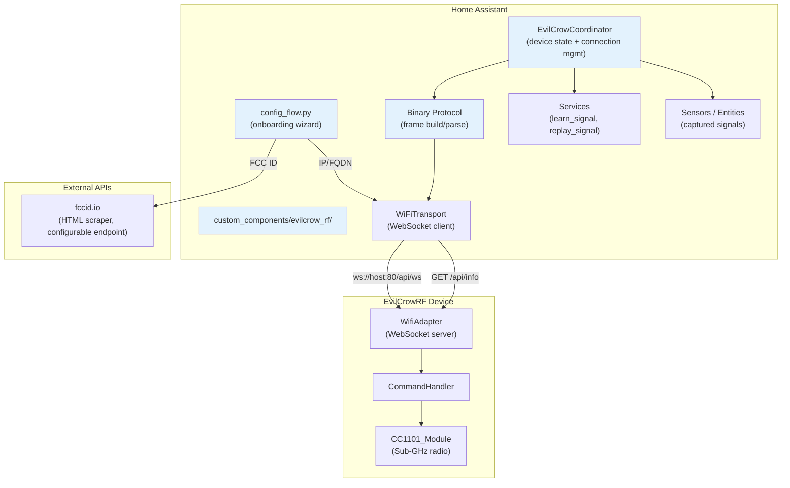
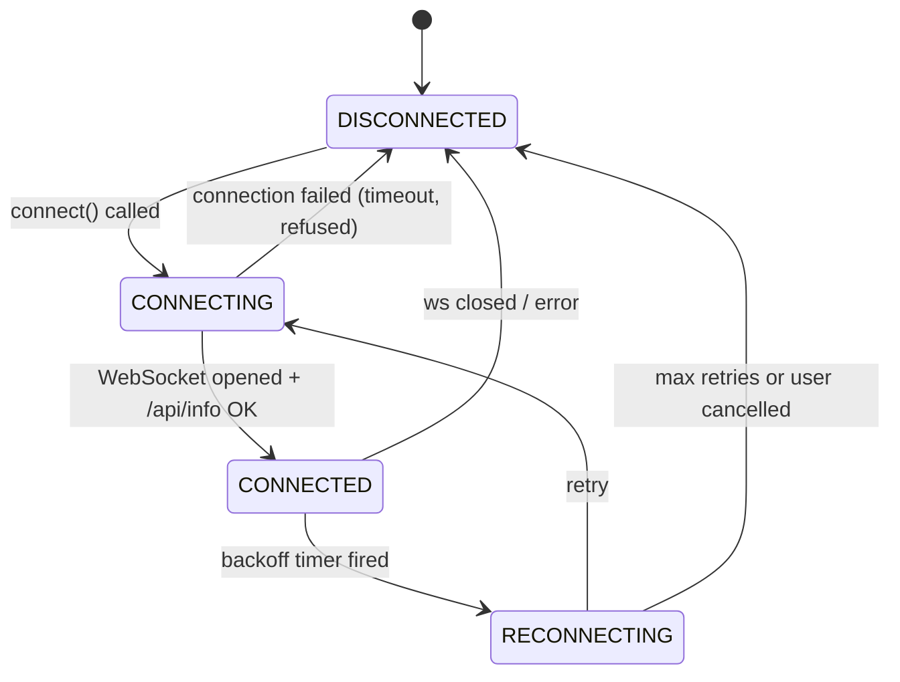
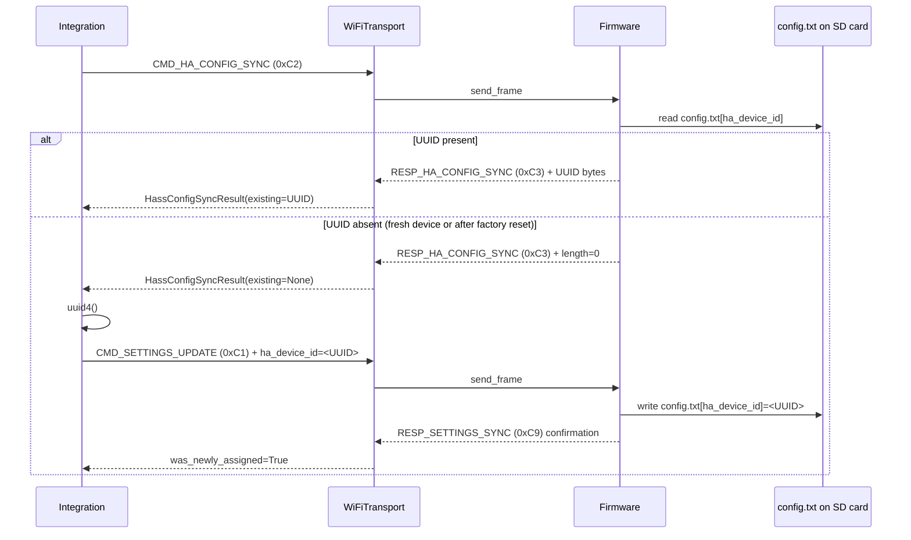
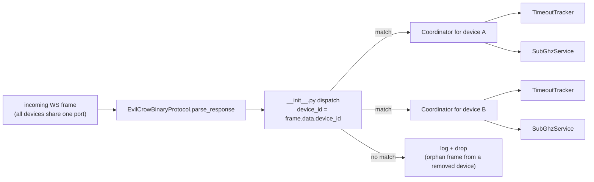
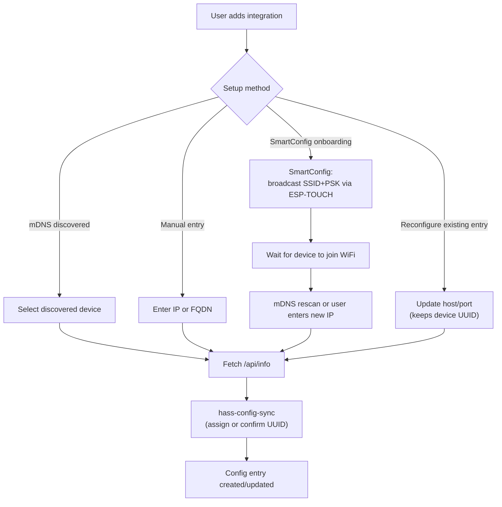
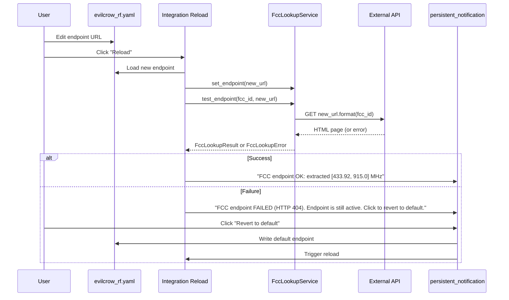
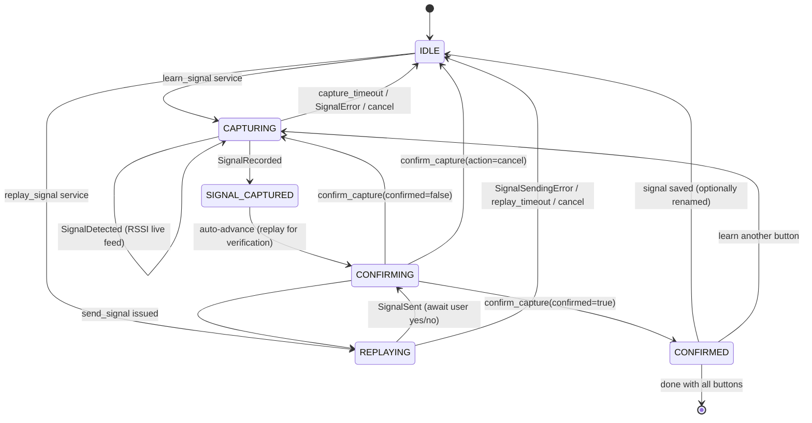
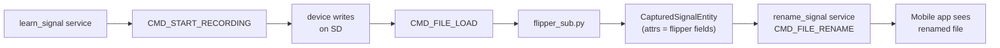
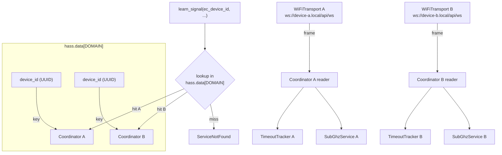
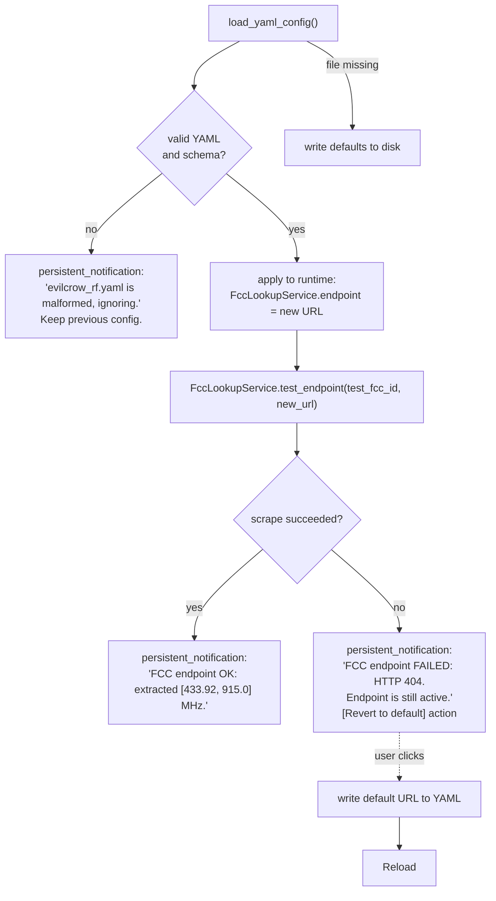

# EvilCrowRF V2 — Home Assistant Integration Plan

## Table of Contents

1. [Overview](#overview)
2. [Architecture](#architecture)
3. [Directory Structure](#directory-structure)
4. [Phase 1: Foundation — Project Scaffolding & Protocol Layer](#phase-1-foundation)
5. [Phase 2: Config Flow — Device Onboarding & FCC ID Lookup](#phase-2-config-flow)
6. [Phase 3: Signal Capture & Replay Workflow](#phase-3-signal-capture--replay)
7. [Phase 4: Makefile & Developer Experience](#phase-4-makefile--developer-experience)
8. [Integration YAML Configuration](#integration-yaml-configuration)
9. [Future Considerations](#future-considerations)

---

## Overview

This integration allows Home Assistant to control RF remote-controlled devices via an EvilCrowRF V2 device. The workflow is:

1. **Onboard** the EvilCrowRF device (first-run wizard or direct IP/FQDN).
2. **Identify** the target RF remote by FCC ID or direct frequency entry.
3. **Capture** each button press by having the EvilCrowRF scan for the signal.
4. **Confirm** the captured signal by replaying it and asking the user to verify.
5. **Control** the RF device from Home Assistant automations using the replayed signals.

### Core Requirements

| Requirement | Approach |
|---|---|
| FCC ID → Frequency | Scrape `https://fccid.io/{fcc_id}` HTML to extract operating frequency; endpoint is configurable in `evilcrow_rf.yaml` |
| Direct frequency input | Alternative if user already knows the frequency |
| Signal capture | Use EvilCrowRF's CC1101 Sub-GHz recorder (command `0x09` / `RequestRecord`) |
| Confirm capture | Replay the captured signal, ask for confirmation, retry if needed; explicit cancel returns to HA |
| Device identification | Persistent UUID stored in `config.txt` on the device's SD card via a new `hass-config-sync` command (no firmware refactor for the mobile app) |
| Multi-device ready | All communication includes a device-id field in the state machine; dispatch keyed by `device_id` |
| WiFi transport | WebSocket connection to `/api/ws` on the EvilCrowRF device |
| Timeout safety | Every command has a 15–30s timeout; the state machine cannot hang forever |
| Version awareness | Read `RESP_VERSION_INFO` on connect; warn (but allow) on major mismatch |
| File rename | Captured `.sub` files can be renamed so they are usable from the mobile app too |
| SmartConfig onboarding | Optional firmware support for ESP-TOUCH SmartConfig to push WiFi credentials |

---

## Architecture



### Key Design Decisions

| Decision | Rationale |
|---|---|
| **Python dataclasses for protocol** instead of raw byte arrays | Maintainable, testable, matches HA conventions |
| **DataUpdateCoordinator** for device polling | HA best practice for device state management |
| **`hass-config-sync` command** (new, `0xC2` → `0xC3`) for device ID exchange | Persists the HA device UUID in `config.txt` on the SD card without breaking the existing mobile-app ↔ firmware protocol; the mobile app ignores the new command |
| **Configurable FCC API endpoint** stored in `evilcrow_rf.yaml` (not options flow) | The FCC endpoint is an integration-wide setting (not per-device); a YAML file is the right scope and survives integration reloads |
| **Options-flow test/revert flow** | On endpoint change: scrape once, show result, **always persist the new endpoint**, expose "Revert to default" as an always-available action |
| **Single config entry per device** at launch; multi-device dispatch from day one | `hass.data[DOMAIN]` is a `dict[str, EvilCrowCoordinator]`; services take `device_id`; reconfigure flow handles host/port changes |
| **mDNS auto-discovery** + manual IP fallback | Reduces friction; mDNS uses `_evilcrow._tcp` / `evilcrow.local`. Manual IP is the recommended path (mDNS is unreliable across VLANs/routers) |
| **Request/response timeout tracker** | If a command times out (firmware crash, RF interference, silent WS drop), the state machine transitions to an error state and a `persistent_notification` is shown — never hangs |
| **Version awareness with warning, not block** | Read `RESP_VERSION_INFO` on connect; if major version differs, show a warning that the user can dismiss and continue |
| **SmartConfig (ESP-TOUCH) onboarding** | Firmware gains a `smartConfig` mode; the integration instructs the user to put the device in this mode, then broadcasts SSID/password via UDP — no need for the HA host to have WiFi or to connect to the device's SoftAP |
| **Captured signals mapped to Flipper Sub file fields** | `frequency`, `preset`, `protocol`, `bit`, `key`, `te`, `repeat`, etc. stored as entity attributes — directly portable to the mobile app |
| **Reconfigure flow** | If the device IP changes (DHCP), the user can update host/port without removing/re-adding the integration |

---

## Directory Structure

```
hass/
├── custom_components/
│   └── evilcrow_rf/
│       ├── __init__.py                 # Component setup, multi-device dispatch, NOT_READY
│       ├── manifest.json               # HA manifest (version, dependencies, etc.)
│       ├── config_flow.py              # Config flow (user, reauth, reconfigure, options)
│       ├── const.py                    # Constants, domain, default values, command IDs
│       ├── strings.json                # User-facing strings for config flow
│       ├── translations/
│       │   └── en.json                 # English translations
│       ├── coordinator.py              # EvilCrowCoordinator (DataUpdateCoordinator)
│       ├── binary_protocol.py          # Frame building/parsing (Python port)
│       ├── wifi_transport.py           # WebSocket client + HTTP /api/info
│       ├── device.py                   # Device model, identity management, hass-config-sync
│       ├── services.py                 # HA services (learn, replay, capture, rename, cancel)
│       ├── sensor.py                   # Sensor entities (device state, version, last-captured signal)
│       ├── button.py                   # Button entities (trigger actions, learn-button)
│       ├── select.py                   # Select entity (.sub file picker for replay)
│       ├── text.py                     # Text entity (rename .sub file)
│       ├── fcc_lookup.py               # FCC ID → frequency API client (loads endpoint from YAML)
│       ├── subghz.py                   # Sub-GHz capture/replay state machine
│       ├── discovery.py                # mDNS discovery for EvilCrow devices
│       ├── timeout_tracker.py          # PendingRequestTracker (request/response timeout)
│       ├── smartconfig.py              # ESP-TOUCH SmartConfig WiFi provisioning
│       ├── flipper_sub.py              # Flipper Sub file format parser/serializer
│       └── models.py                   # Shared dataclasses (DeviceInfo, Signal, etc.)
├── pyproject.toml                       # UV project config (deps, dev-deps, tool config)
├── tests/
│   ├── __init__.py
│   ├── conftest.py                     # Pytest fixtures (HA mocks, sample .sub files)
│   ├── test_binary_protocol.py         # Frame encode/decode, chunking, command building
│   ├── test_fcc_lookup.py              # FCC ID URL construction, response parsing, error handling
│   ├── test_subghz.py                  # State machine transitions, response routing, error recovery
│   ├── test_wifi_transport.py          # WebSocket lifecycle, reconnect backoff, /api/info parsing
│   ├── test_timeout_tracker.py         # Timeout firing, race-free cancellation
│   ├── test_config_flow.py             # User, reauth, reconfigure, options steps
│   ├── test_device.py                  # hass-config-sync round-trip, factory-reset reconciliation
│   ├── test_coordinator.py             # Multi-device dispatch, version negotiation, NOT_READY
│   ├── test_flipper_sub.py             # .sub file format round-trip
│   ├── test_smartconfig.py             # ESP-TOUCH packet format
│   └── test_yaml_config.py             # evilcrow_rf.yaml load/save/revert
├── docs/
│   └── plan.md                        # This file
└── Makefile                            # Developer targets (uv, lint, test, install, run, lock)
```

> **Note**: Technically, Home Assistant custom components live under `custom_components/` inside the HA config directory. The `Makefile` will symlink or copy this directory for testing.

---

## Phase 1: Foundation

### 1.1 `manifest.json`

```json
{
  "domain": "evilcrow_rf",
  "name": "EvilCrowRF V2",
  "codeowners": ["@your-gh-handle"],
  "config_flow": true,
  "dependencies": [],
  "documentation": "https://github.com/...",
  "iot_class": "local_push",
  "requirements": ["aiohttp>=3.9.0", "beautifulsoup4>=4.12", "lxml>=5.0"],
  "version": "1.0.0",
  "zeroconf": ["_evilcrow._tcp.local."],
  "ssdp": []
}
```

- `iot_class: local_push` — WebSocket provides real-time notifications from the device.
- `zeroconf` — enables mDNS auto-discovery of `_evilcrow._tcp` service type.
- `config_flow: true` — enables the onboarding wizard.

### 1.2 `const.py`

```python
DOMAIN = "evilcrow_rf"
DEFAULT_NAME = "EvilCrowRF V2"
DEFAULT_PORT = 80
DEFAULT_SCAN_INTERVAL = 30
WS_PATH = "/api/ws"
INFO_PATH = "/api/info"
MAX_RECONNECT_DELAY = 300  # 5 minutes
REQUEST_TIMEOUT = 15          # generic request timeout
CAPTURE_TIMEOUT = 30          # state machine timeout for capture/replay
SUPPORTED_FW_MAJOR = 3        # firmware major version this integration was built against

# Integration YAML config (lives in <config_dir>/evilcrow_rf.yaml)
YAML_CONFIG_FILENAME = "evilcrow_rf.yaml"

# Binary protocol constants
BINARY_MAGIC = 0xAA
FRAME_TYPE_DATA = 0x01
FRAME_TYPE_ACK = 0x02
FRAME_TYPE_NAK = 0x03
MAX_PAYLOAD_SIZE = 500

# Message types (command → device)
CMD_GET_STATE = 0x01
CMD_SCAN = 0x02
CMD_IDLE = 0x03
CMD_START_RECORDING = 0x09
CMD_STOP_RECORDING = 0x0A
CMD_SEND_SIGNAL = 0x0B
CMD_SMART_CONFIG = 0x18       # new: put device into SmartConfig WiFi provisioning mode
CMD_FILE_LIST = 0xA0          # request SD-card file listing
CMD_FILE_RENAME = 0xA4        # rename a file on the SD card
CMD_SETTINGS_UPDATE = 0xC1
CMD_HA_CONFIG_SYNC = 0xC2     # new: ask device for its HA-assigned UUID (response 0xC3)

# Message types (response → app, 0x80+)
RESP_SIGNAL_DETECTED = 0x90
RESP_SIGNAL_RECORDED = 0x91
RESP_SIGNAL_SENT = 0x92
RESP_SIGNAL_ERROR = 0x93
RESP_SIGNAL_SENDING_ERROR = 0x94
RESP_FILE_LIST = 0xA1
RESP_FILE_ACTION = 0xA3
RESP_VERSION_INFO = 0xC0
RESP_HA_CONFIG_SYNC = 0xC3    # payload: [length:uint16][uuid-string-bytes] or 0x0000 if unset
RESP_SMART_CONFIG_STATUS = 0xC4
RESP_DEVICE_NAME = 0xC8
RESP_SETTINGS_SYNC = 0xC9

# Config flow steps
STEP_USER = "user"
STEP_MANUAL = "manual_device"
STEP_SMARTCONFIG = "smartconfig"
STEP_DISCOVERY = "discovery"
STEP_REGISTER = "register_device"
STEP_CAPTURE_SETUP = "capture_setup"
STEP_RECONFIGURE = "reconfigure"
STEP_OPTIONS = "options"
STEP_FCC_TEST = "fcc_test"

# Services
SERVICE_LEARN_SIGNAL = "learn_signal"
SERVICE_REPLAY_SIGNAL = "replay_signal"
SERVICE_CANCEL_CAPTURE = "cancel_capture"
SERVICE_CONFIRM_CAPTURE = "confirm_capture"
SERVICE_RENAME_SIGNAL = "rename_signal"
SERVICE_DELETE_SIGNAL = "delete_signal"
SERVICE_REFRESH_FILES = "refresh_files"

# Attributes
ATTR_DEVICE_ID = "device_id"
ATTR_FCC_ID = "fcc_id"
ATTR_FREQUENCY = "frequency"
ATTR_MODULATION = "modulation"
ATTR_BUTTON_NAME = "button_name"
ATTR_SIGNAL_FILE = "signal_file"
ATTR_NEW_NAME = "new_name"
ATTR_CONFIRMED = "confirmed"
ATTR_TARGET_DEVICE_ID = "target_device_id"

# FCC ID lookup (default + integration YAML schema keys)
DEFAULT_FCC_API_ENDPOINT = "https://fccid.io/{fcc_id}"
CONF_FCC_API_ENDPOINT = "fcc_api_endpoint"
CONF_FCC_TEST_ID = "fcc_test_id"

# Persistent notifications (used for timeout, version-mismatch, etc.)
NOTIFY_VERSION_WARNING = "evilcrow_rf_version_warning"
NOTIFY_CAPTURE_TIMEOUT = "evilcrow_rf_capture_timeout"
```

### 1.3 `binary_protocol.py` — Python Implementation of the Binary Protocol

This module reimplements the `FirmwareBinaryProtocol` from the mobile app in Python.

**Frame Format** (matches firmware):

```
┌──────┬──────┬─────────┬──────────┬──────────────┬───────────┬──────────────┬──────────┐
│ Magic│ Type │ ChunkID │ ChunkNum │ TotalChunks  │  DataLen  │    Data      │ Checksum │
│  1B  │  1B  │   1B    │    1B    │     1B       │  2B (LE)  │  0..500 B    │    1B    │
│ 0xAA │0x01  │  0..255 │  1..255  │    1..255    │           │  variable    │  XOR     │
└──────┴──────┴─────────┴──────────┴──────────────┴───────────┴──────────────┴──────────┘
```

**Key design for `binary_protocol.py`**:

```python
@dataclass
class BinaryFrame:
    magic: int = BINARY_MAGIC
    frame_type: int = FRAME_TYPE_DATA
    chunk_id: int = 0          # also used as request sequence number (1..255)
    chunk_num: int = 1
    total_chunks: int = 1
    data: bytes = b""

    def encode(self) -> bytes:
        """Encode frame to bytes with XOR checksum."""

    @staticmethod
    def decode(data: bytes) -> "BinaryFrame":
        """Parse a binary frame, validate checksum, return frame."""

class EvilCrowBinaryProtocol:
    """Command builder and response parser. Pure data, no I/O."""

    def __init__(self) -> None:
        self._next_request_id: int = 0      # monotonic, wraps 1..255

    def _next_id(self) -> int:
        self._next_request_id = (self._next_request_id % 255) + 1
        return self._next_request_id

    # ---- command builders ----

    def build_request_record_command(
        self, frequency: int, module: int, preset: int = 0,
    ) -> list[bytes]:
        """Build Start Recording command frames (chunked if needed)."""

    def build_stop_record_command(self) -> list[bytes]:
        """Build Stop Recording command."""

    def build_idle_command(self) -> list[bytes]:
        """Build Idle command (stop any in-progress radio activity)."""

    def build_send_signal_command(self, file_path: str) -> list[bytes]:
        """Build Send Signal command frames (replay .sub file)."""

    def build_file_list_command(self, path: str = "/") -> list[bytes]:
        """Build File List command; response is chunked on WiFi too if > 500 B."""

    def build_file_rename_command(self, old_path: str, new_path: str) -> list[bytes]:
        """Build File Rename command so the user can rename a captured .sub to a
        Flipper-style name usable from the mobile app too."""

    def build_settings_update_command(
        self, setting_key: int, setting_value: bytes,
    ) -> list[bytes]:
        """Build a generic settings-update command."""

    def build_smartconfig_command(
        self, ssid: str, password: str, channel: int | None = None,
    ) -> list[bytes]:
        """Build a SmartConfig (ESP-TOUCH) provisioning command. The firmware
        receives this and uses its internal SmartConfig library to join WiFi.
        Alternative: firmware exposes SmartConfig as a separate mode triggered
        by the hardware button; this command then only confirms."""

    def build_ha_config_sync_command(self) -> list[bytes]:
        """Ask the device for its HA-assigned UUID (response 0xC3). Payload is
        empty; the response carries the UUID or a zero-length string if unset."""

    # ---- response parsing ----

    @staticmethod
    def parse_response(frame: BinaryFrame) -> dict:
        """Parse a binary response frame into {'type': <str>, 'request_id': <int>, 'data': <dict>}."""
```

**Design rationale**: Following the mobile app pattern, this is a pure-data module with no I/O. The frame builder and response parser are stateless (except for the request-id counter, which is trivial). The chunk ID is reused as the request sequence number — every command carries one, the firmware echoes it in the response, and `timeout_tracker.py` uses it to correlate responses with pending commands.

**Wire-compatibility note**: The new commands `CMD_HA_CONFIG_SYNC (0xC2)` and `CMD_SMART_CONFIG (0x18)` are no-ops for the existing mobile app because it never sends them and ignores the corresponding response codes. No firmware refactor is needed for mobile-app compatibility.

### 1.4 `wifi_transport.py` — WebSocket Client

```python
class WiFiTransport:
    """Manages the WebSocket connection to a single EvilCrowRF device.

    WiFi WebSocket frames arrive *intact* — chunking is a BLE-only concern.
    However, the firmware still tags every frame with chunk_id/chunk_num/total_chunks
    for legacy reasons, so the transport must accept either layout and pass each
    frame to the reader unchanged.
    """

    def __init__(self, host: str, port: int, device_id: str):
        self._host = host
        self._port = port
        self._device_id = device_id  # persistent UUID (set by hass-config-sync)
        self._ws: aiohttp.ClientWebSocketResponse | None = None
        self._session: aiohttp.ClientSession | None = None
        self._on_message: Callable[[dict], Awaitable[None]] | None = None
        self._on_disconnect: Callable[[], Awaitable[None]] | None = None
        self._info: dict | None = None        # cached /api/info response
        self._connect_started_at: float | None = None   # time.monotonic()
        self._close_lock = asyncio.Lock()

    async def connect(self) -> bool:
        """Open HTTP session, GET /api/info, open WebSocket to ws://host:port/api/ws."""

    async def disconnect(self) -> None:
        """Close WebSocket and HTTP session; idempotent."""

    async def send_frame(self, frame: bytes, *, timeout: float = REQUEST_TIMEOUT) -> bool:
        """Send a binary frame over WebSocket with a per-call timeout."""

    async def fetch_device_info(self) -> dict | None:
        """GET http://host:port/api/info. Returns parsed JSON or None.

        Expected schema (validated; missing fields log a warning but do not fail):
          {
            "name": str,
            "fw_version": str,        # e.g. "3.0.1"
            "fw_major": int,
            "fw_minor": int,
            "fw_patch": int,
            "transport": "wifi",
            "mac": str,               # NOT used as identity; informational only
            "sd_present": bool,
            "nrf24_present": bool,
            "cc1101_count": int,
          }
        """

    async def _reader_task(self) -> None:
        """Background loop: read WebSocket binary frames, hand off to on_message."""
```

Key behaviors:

- On connect, fetch `/api/info` to get device metadata (name, firmware version, capabilities). Cache the result on the transport instance.
- Use `time.monotonic()` for timeouts (never `datetime.now()` — wall-clock can jump on NTP sync or manual changes).
- Maintain a background reader coroutine that decodes each frame with `EvilCrowBinaryProtocol.parse_response` and dispatches via the `on_message` callback.
- Implement exponential backoff reconnection (1s → 2s → 4s → ... → MAX_RECONNECT_DELAY). On reconnect, re-fetch `/api/info` and re-run `hass-config-sync` to confirm the device UUID.
- Emit typed events on message/connection-lost via callbacks. The coordinator wires `on_message` to the timeout tracker and the device handler.
- Per-call `send_frame(..., timeout=...)` so callers can pass short or long timeouts.
- **Transport is single-device**: one `WiFiTransport` instance per device. Multi-device support means multiple instances.



### 1.5 `device.py` — Device Identity Management

```python
@dataclass
class DeviceInfo:
    host: str
    port: int
    device_id: str         # stable UUID (HA-assigned, persisted in device's config.txt)
    name: str              # device display name (from /api/info)
    firmware_version: str  # e.g. "3.0.1"
    fw_major: int
    fw_minor: int
    fw_patch: int
    transport: str         # "wifi"
    mac: str | None        # informational only; not used as identity
    capabilities: dict     # sd_present, nrf24_present, cc1101_count, ...

class HassConfigSyncResult:
    """Result of a hass-config-sync exchange."""
    existing_device_id: str | None  # UUID the device already had, or None
    assigned_device_id: str         # UUID the integration will use going forward
    was_newly_assigned: bool        # True if we had to assign a fresh UUID

class DeviceRegistryStore:
    """Persists device registry data in HA's storage (stores.json-like)."""

    def __init__(self, hass):
        self._hass = hass
        self._data: dict[str, dict] = {}  # device_id → info

    async def async_load(self) -> None: ...
    async def async_save(self) -> None: ...
    def get(self, device_id: str) -> DeviceInfo | None: ...
    def register(self, info: DeviceInfo) -> None: ...
    def find_by_host(self, host: str, port: int) -> DeviceInfo | None:
        """Locate a device by its host/port — used for factory-reset reconciliation."""
    def all_devices(self) -> list[DeviceInfo]: ...
```

**Device ID flow (`hass-config-sync`)** — no MAC, survives firmware updates, factory reset, and any change in `host:port`:

The device stores its HA-assigned UUID in `config.txt` on its **SD card** (not LittleFS — the user explicitly wants SD-card persistence so the UUID can be inspected and edited by humans, and so it survives `factoryReset`). A new `hass-config-sync` command (`0xC2` → response `0xC3`) carries just that one piece of data; it does not require any change to the existing mobile-app protocol because the mobile app never sends `0xC2` and ignores `0xC3`.



**Why a dedicated command instead of reusing `settingsUpdate`**:

- `settingsUpdate` (0xC1) writes *any* key/value pair — the mobile app already uses it for things like `deviceName`. Using it for HA identity would force the mobile app to handle a new setting namespace.
- A dedicated `hass-config-sync` keeps the HA concern scoped to one round-trip and one payload schema. The mobile app continues to ignore the command/response.
- The integration still uses `settingsUpdate` as the write mechanism when the UUID is missing (so the firmware only needs one persistence path).

**Factory-reset reconciliation**: If the user factory-resets the device, `config.txt` is wiped and a fresh `hass-config-sync` round-trip assigns a new UUID. The existing HA config entry is now orphaned. On startup, `DeviceRegistryStore.find_by_host(host, port)` matches the orphan to the new UUID by network address; the user is shown a `persistent_notification` so they can confirm or re-pair manually.

**Renaming captured signals**: Because the UUID is in `config.txt` on the SD card (a real filesystem), a future change can move the UUID into its own sub-directory (`/config/ha/<uuid>.txt`) without affecting the protocol.

### 1.6 `coordinator.py` — Device State Coordinator

Follows HA's `DataUpdateCoordinator` pattern. One coordinator per device.

```python
class EvilCrowCoordinator(DataUpdateCoordinator[dict]):
    """Coordinator for a single EvilCrowRF device.

    Responsibilities:
      - own the WiFiTransport + EvilCrowBinaryProtocol + TimeoutTracker
      - own the SubGhzService
      - run hass-config-sync on connect (assigns/persists device UUID)
      - run version negotiation on connect (warns on major mismatch)
      - dispatch incoming frames to the right local service via on_message
    """

    def __init__(self, hass, config_entry, device_info: DeviceInfo):
        self.hass = hass
        self.config_entry = config_entry
        self._device_info = device_info
        self._protocol = EvilCrowBinaryProtocol()
        self._transport = WiFiTransport(
            host=device_info.host,
            port=device_info.port,
            device_id=device_info.device_id,
        )
        self._tracker = TimeoutTracker(default_timeout=CAPTURE_TIMEOUT)
        self._subghz = SubGhzService(self._transport, self._protocol, self._tracker)
        self._reader_task: asyncio.Task | None = None
        self._version_warning_dismissed: bool = False
        self._cancel_event = asyncio.Event()

        super().__init__(
            hass,
            _LOGGER,
            name=f"{DOMAIN}_{device_info.device_id}",
            update_interval=timedelta(seconds=DEFAULT_SCAN_INTERVAL),
        )

    async def _async_update_data(self) -> dict:
        """Periodic poll — fetches /api/info and confirms liveness."""

    async def async_connect(self) -> bool:
        """Open transport, run hass-config-sync, negotiate version, start reader.
        Returns False if any step fails or times out."""

    async def async_disconnect(self) -> None:
        """Cancel reader + tracker, close transport. Idempotent."""

    @property
    def device_info(self) -> DeviceInfo: ...
    @property
    def transport(self) -> WiFiTransport: ...
    @property
    def subghz(self) -> SubGhzService: ...
```

**Multi-device dispatch**: `__init__.py` maintains `hass.data[DOMAIN]: dict[str, EvilCrowCoordinator]` keyed by `device_id`. Each coordinator owns its own transport; the dispatcher inside `__init__.py` routes incoming frames to the right coordinator based on the `device_id` field carried in every frame (the firmware echoes the requesting app's UUID in the response — see `firmware/docs/architecture.md` for `_lastRequestChunkId`).



**NOT_READY pattern**: If `async_connect` fails (network unreachable, firmware offline, `/api/info` 404), the integration calls `self.config_entry.async_start_reauth(self.hass)` **or** raises `ConfigEntryNotReady` from `__init__.py`. HA then auto-retries with exponential backoff (1, 2, 4, ... minutes, capped). The user does not have to manually reload.

**Version negotiation**: On connect, after `hass-config-sync`, the coordinator sends `CMD_GET_STATE` and waits up to 5s for `RESP_VERSION_INFO`. If the major version differs from `SUPPORTED_FW_MAJOR`, the coordinator:

1. Calls `self._show_version_warning(major, supported)` which writes a `persistent_notification` (id `NOTIFY_VERSION_WARNING`) with a "Dismiss" action.
2. If the user clicks **Dismiss**, `self._version_warning_dismissed = True` and the notification is removed; the integration continues running.
3. If the user reloads the integration without dismissing, the warning reappears (a guard rail against accidental continued use with a broken protocol).

The user is never blocked. The notification is the source of truth.

### 1.7 `discovery.py` — mDNS / ZeroConf Device Discovery

```python
class EvilCrowDiscovery:
    """Watches _evilcrow._tcp.local. via zeroconf and surfaces candidates
    to the config flow as a select-list."""

    def __init__(self, hass):
        self._hass = hass
        self._zeroconf: zeroconf.Zeroconf | None = None
        self._browser: zeroconf.ServiceBrowser | None = None
        self._found: dict[str, DiscoveredDevice] = {}

    async def async_start(self) -> None: ...
    async def async_stop(self) -> None: ...
    def discovered(self) -> list[DiscoveredDevice]:
        """Return the current list of mDNS-discovered devices (name, host, port)."""
```

The manifest already declares `"zeroconf": ["_evilcrow._tcp.local."]`. HA's built-in zeroconf integration surfaces these to the integration via `async_step_zeroconf` in `config_flow.py`. `discovery.py` is the integration-side wrapper that:

- starts a passive zeroconf browser on setup (optional, for the "no HA core zeroconf" case);
- filters by service type and TXT records (`name`, `fw_version`, `transport=wifi`);
- resolves hostnames to IPs (mDNS hostnames like `evilcrow.local` are unreliable across VLANs — the resolved IP is what gets stored).

**Limitation surfaced to the user**: mDNS only works on the same L2 broadcast domain. The discovery step warns the user and recommends manual IP entry if the device is on a different VLAN.

### 1.8 `timeout_tracker.py` — PendingRequestTracker

Pattern ported from the mobile app's `PendingRequestTracker` (`mobile_app/docs/architecture.md`, "Glaring Issues ✅ Fixed #2").

```python
class TimeoutTracker:
    """Coroutine-safe map: request_id -> (asyncio.Future, deadline_monotonic)."""

    def __init__(self, default_timeout: float = REQUEST_TIMEOUT):
        self._default_timeout = default_timeout
        self._pending: dict[int, tuple[asyncio.Future, float]] = {}
        self._lock = asyncio.Lock()
        self._watcher: asyncio.Task | None = None

    async def track(self, request_id: int, *, timeout: float | None = None) -> asyncio.Future:
        """Register a future for the given request_id; resolve it from resolve()
        or auto-fail on timeout."""

    async def resolve(self, request_id: int, value: Any) -> None:
        """Called by the transport when a matching response arrives."""

    async def cancel_all(self) -> None:
        """Called on disconnect; fails every pending future with ConnectionError."""

    async def _watcher_loop(self) -> None:
        """Background loop; uses time.monotonic() to detect expirations."""
```

Every command built by `EvilCrowBinaryProtocol` carries a request ID. The transport emits the parsed frame via the coordinator's `on_message`, which calls `tracker.resolve(request_id, parsed)`. If no resolution arrives within `CAPTURE_TIMEOUT` (or per-call override), the future raises `asyncio.TimeoutError`, the state machine transitions to an error state, and a `persistent_notification` (`NOTIFY_CAPTURE_TIMEOUT`) is raised so the user is never left wondering.

---

## Phase 2: Config Flow

The config flow has four entry points: discovery, manual entry, reconfigure, and SmartConfig onboarding. The FCC endpoint is no longer in the config flow — it lives in `evilcrow_rf.yaml` (see [Integration YAML Configuration](#integration-yaml-configuration)).



### 2.1 Config Flow Steps

**Step 1: Setup Method** (`user` step)

User chooses one of:
- **Auto-discover** — shows a list of EvilCrowRF devices found via mDNS (`_evilcrow._tcp`). Warns that mDNS does not cross VLANs.
- **Manual entry** — prompts for IP address or FQDN (recommended path).
- **SmartConfig onboarding** — push WiFi credentials to a device in provisioning mode via ESP-TOUCH UDP packets. Does not require the HA host to have WiFi or to join the device's SoftAP.

**Step 2a: Manual Entry** (`manual_device` step)

- `host` (str, required): IP or FQDN of the device
- `port` (int, optional, default: 80)

On submit, the integration:
- Fetches `http://{host}:{port}/api/info`
- If reachable, stores device info and proceeds to `hass-config-sync`
- If unreachable, shows error and offers to retry

**Step 2b: SmartConfig Onboarding** (`smartconfig` step)

The firmware is given a new `CMD_SMART_CONFIG (0x18)` command that puts the radio into ESP-TOUCH mode. The flow:

1. User is told to power on the device and put it in SmartConfig mode (e.g., hold the BOOT button for 3 seconds, or send `CMD_SMART_CONFIG` over USB).
2. User enters the target SSID and password in the wizard. The wizard also asks for the channel (optional; auto-scan if blank).
3. The integration broadcasts ESP-TOUCH UDP packets containing the SSID + password + token. The `smartconfig.py` module wraps this.
4. The device receives the packets, joins WiFi, and reconnects to the network.
5. The integration polls the local subnet (or uses mDNS) for the device's new IP, or the user enters it manually.
6. Proceeds to `hass-config-sync`.

This path replaces the legacy SoftAP → `setWifiApConfig` + `applyWifi` flow. The SoftAP fallback is still described in the firmware docs (`WifiConfigManager`) and is used as a last resort — but it requires the HA host to have a WiFi interface and to temporarily disconnect from the production network, which is unacceptable in most deployments.

**Step 2c: Discovery** (`discovery` step)

Triggered by HA's built-in zeroconf when a `_evilcrow._tcp.local.` service appears, or by `EvilCrowDiscovery.async_start()` (see §1.7).

The user is shown a select list of discovered devices (`name`, `host`, `port`, `fw_version`). Selecting one proceeds to `hass-config-sync`. If the device is on a different VLAN, the user is told to use Manual Entry instead.

**Step 3: Device Registration / `hass-config-sync`** (`register_device` step)

- Integration connects to the device, fetches `/api/info`.
- Sends `CMD_HA_CONFIG_SYNC (0xC2)`. The device reads `config.txt` on the SD card.
- If a UUID is already there, use it. Otherwise, generate a `uuid4()`, send `CMD_SETTINGS_UPDATE (0xC1)` with `key=ha_device_id, value=<UUID>`, and wait for the `RESP_SETTINGS_SYNC (0xC9)` confirmation.
- Store device info in the device registry.
- Create the config entry with `data: { "device_id": uuid, "host": ip, "port": 80 }`.

**Step 4: Reconfigure** (`reconfigure` step) — exposed via "Reconfigure" on the config entry

Used when the device's IP changes (DHCP lease renewal, new network, etc.):

- The integration reconnects to the device at the current `host:port`. If unreachable, the user enters a new `host` (and optionally `port`).
- The integration re-fetches `/api/info` and re-runs `hass-config-sync`. **The device UUID is preserved** — it was on the SD card, not in the HA config — so the device registry entry is not orphaned.
- `data["host"]` and `data["port"]` are updated; `data["device_id"]` is unchanged.

**Step 5: FCC ID / Frequency** (`capture_setup` step) — optional, can be done later

This step is now optional and runs *per target RF remote* (not per EvilCrowRF device). It is invoked from a `button` entity or from the device page, not from the main config flow.

If user wants to set up a target RF device now, they provide:
- `target_device_name` (str): friendly name for the target RF remote
- `fcc_id` (str, optional): FCC ID for automatic frequency detection
- `frequency` (float, optional): direct frequency in MHz
- `modulation` (select, optional): AM/OOK_FIX/OOK_VAR/FSK/etc.

If `fcc_id` is provided, the integration uses the endpoint from `evilcrow_rf.yaml` (default `https://fccid.io/{fcc_id}`) and scrapes it. If both `fcc_id` and `frequency` are provided, `frequency` takes precedence.

The FCC API endpoint is configurable in `evilcrow_rf.yaml` (see [Integration YAML Configuration](#integration-yaml-configuration)). Users can override the default `https://fccid.io/{fcc_id}` with a different URL template. On every YAML reload the integration scrapes the configured endpoint with a sample FCC ID and surfaces a `persistent_notification` with the result — but the new endpoint is always persisted, with an explicit "Revert to default" button.

### 2.2 FCC ID Lookup (`fcc_lookup.py`)

The endpoint URL is loaded from `evilcrow_rf.yaml` (see [Integration YAML Configuration](#integration-yaml-configuration)), falling back to `DEFAULT_FCC_API_ENDPOINT = "https://fccid.io/{fcc_id}"`. The `FccLookupService` downloads the HTML page, parses it with BeautifulSoup + lxml, and extracts operating frequencies.

**Frequency extraction strategy**: `fccid.io/{fcc_id}` pages list operating frequencies in a "Frequency Range" or "Operating Frequency" section within the device details table. The scraper targets:
- Table cells containing "MHz" or "GHz" labeled as "Frequency Range", "Operating Frequency", or similar
- The `Freq` column in the technical reports section
- Freq field in the "Detail" section of the grantee listing

```python
import re
import logging
from dataclasses import dataclass
from typing import Optional

import aiohttp
from bs4 import BeautifulSoup

from .const import DEFAULT_FCC_API_ENDPOINT

_LOGGER = logging.getLogger(__name__)


class FccLookupError(Exception):
    """Raised when FCC ID lookup fails."""


@dataclass
class FccLookupResult:
    """Result of an FCC ID frequency lookup."""
    frequencies: list[float]   # extracted frequencies in MHz
    source_url: str            # the URL that was scraped
    raw_match: str | None      # the matched text snippet (for diagnostics)


class FccLookupService:
    """
    Scrapes fccid.io (or a configurable endpoint loaded from evilcrow_rf.yaml)
    to determine the operating frequency of a device from its FCC ID.
    """

    def __init__(self, session: aiohttp.ClientSession, endpoint_url: Optional[str] = None):
        self._session = session
        self._endpoint = endpoint_url or DEFAULT_FCC_API_ENDPOINT

    @property
    def endpoint(self) -> str:
        return self._endpoint

    @endpoint.setter
    def endpoint(self, url: str) -> None:
        self._endpoint = url

    async def lookup(self, fcc_id: str, *, endpoint: Optional[str] = None) -> FccLookupResult:
        """
        Scrape the configured endpoint (or the one passed in for this call)
        for the given FCC ID. Returns extracted frequencies in MHz.
        Raises FccLookupError on failure.
        """
        url = (endpoint or self._endpoint).format(fcc_id=fcc_id)
        _LOGGER.debug("Fetching FCC ID info from %s", url)

        try:
            async with self._session.get(url, timeout=aiohttp.ClientTimeout(total=15)) as resp:
                if resp.status != 200:
                    raise FccLookupError(f"HTTP {resp.status} fetching {url}")
                html = await resp.text()
        except (aiohttp.ClientError, asyncio.TimeoutError) as exc:
            raise FccLookupError(f"Request failed: {exc}") from exc

        return self._parse_frequencies(html, url)

    @staticmethod
    def _parse_frequencies(html: str, source_url: str) -> FccLookupResult:
        """Parse frequency information from fccid.io HTML."""
        soup = BeautifulSoup(html, "lxml")
        frequencies: list[float] = []
        raw_match: str | None = None

        # Strategy 1: Look for "Frequency Range" or "Operating Frequency"
        # rows in the specification/ detail table
        for th in soup.find_all("th"):
            text = th.get_text(strip=True).lower()
            if "frequency" in text or "freq" in text:
                td = th.find_next("td")
                if td:
                    raw_match = td.get_text(strip=True)
                    frequencies = FccLookupService._extract_mhz_values(raw_match)
                    if frequencies:
                        break

        # Strategy 2: Scan the entire page for MHz/GHz patterns
        if not frequencies:
            for elem in soup.find_all(string=re.compile(r"\d+\.?\d*\s*MHz", re.I)):
                raw_match = elem.strip()
                frequencies = FccLookupService._extract_mhz_values(raw_match)
                if frequencies:
                    break

        if not frequencies:
            raise FccLookupError(
                f"Could not determine frequency from {source_url}. "
                f"Try entering the frequency manually."
            )

        return FccLookupResult(
            frequencies=frequencies,
            source_url=source_url,
            raw_match=raw_match,
        )

    @staticmethod
    def _extract_mhz_values(text: str) -> list[float]:
        """Extract frequency values in MHz from a text string.
        Handles '433.92 MHz', '915 MHz', '2.4 GHz' -> 2400, etc.
        """
        values: list[float] = []
        for match in re.finditer(r"(\d+\.?\d*)\s*(MHz|GHz|kHz)", text, re.I):
            num = float(match.group(1))
            unit = match.group(2).lower()
            if unit == "ghz":
                num *= 1000
            elif unit == "khz":
                num /= 1000
            values.append(num)
        return sorted(set(round(v, 3) for v in values))

    async def test_endpoint(self, fcc_id: str, endpoint: str) -> FccLookupResult:
        """Test a candidate endpoint URL against a sample FCC ID. Stateless —
        never modifies self._endpoint. Used by the YAML-config reload logic."""
        return await self.lookup(fcc_id, endpoint=endpoint)
```

**Lazy loading**: The `aiohttp`, `beautifulsoup4`, and `lxml` dependencies are imported inside `FccLookupService.lookup` only when a lookup is attempted. HA custom components with many devices would otherwise pay the import cost at startup; here it is paid only on first FCC lookup.

### 2.3 Config Entry Schema

```python
CONFIG_SCHEMA = {
    "device_id": str,              # persistent UUID, from hass-config-sync
    "host": str,                   # IP or FQDN (mutable via reconfigure)
    "port": int,                   # default 80 (mutable via reconfigure)
    "device_name": str,            # friendly name (from /api/info)
    "firmware_version": str,
    "fw_major": int,
    "fw_minor": int,
    "fw_patch": int,
    # Per-target-RF-remote state, stored under target_device_id:
    # (target remotes are not config entries — they are sub-entities of the
    #  EvilCrowRF device, identified by ATTR_TARGET_DEVICE_ID)
}
```

The FCC endpoint is **not** in the config entry — it lives in `evilcrow_rf.yaml` (see [Integration YAML Configuration](#integration-yaml-configuration)).

### 2.4 FCC API Endpoint Configuration

The FCC API endpoint is configured via the integration YAML file `evilcrow_rf.yaml` (not via the config-entry options flow). The flow:

1. User edits `evilcrow_rf.yaml` (manually, or via a "Configure" helper service that opens the file in the editor add-on). Schema is documented in the YAML config section.
2. The integration watches the file (or the user clicks "Reload" on the integration).
3. On reload, the integration **always persists the new endpoint** and **scrapes once** with a sample FCC ID from the YAML (`test_fcc_id`). The scrape result (success/failure + extracted frequencies) is surfaced as a `persistent_notification`.
4. If the scrape fails, the integration keeps the new endpoint and surfaces a warning notification with a "Revert to default" action. The user can click it to reset the endpoint to `https://fccid.io/{fcc_id}` and reload again.



This matches the user's explicit requirement: *"When the user updates the endpoint, scrape the page once and see if we are able to derive frequency from it or not. Leave it in that state, with an option to revert the configuration to default."* — the new endpoint is always persisted, the scrape result is shown, and "Revert to default" is always available.

---

## Phase 3: Signal Capture & Replay

### 3.1 `subghz.py` — Capture State Machine

This is the core workflow. The state machine models the learn → confirm → retry/cancel cycle. Every transition is observable to the UI via event callbacks and to the user via a `persistent_notification` (so the user never has to watch the dashboard to know what is happening).



```python
@dataclass
class CaptureState:
    """Mutable state for a signal capture session."""
    ec_device_id: str             # the EvilCrowRF device handling this capture
    target_device_id: str         # HA device registry ID of the target RF remote
    target_device_name: str
    frequency: float              # MHz
    modulation: str
    current_button: str | None    # e.g. "power", "volume_up"
    captured_file: str | None     # path on the device's SD card
    status: str                   # idle | capturing | captured | confirming | replaying | confirmed | error
    error: str | None = None
    started_at_monotonic: float | None = None   # time.monotonic()
    last_signal_rssi: float | None = None       # updated by SignalDetected
    pending_request_id: int | None = None       # tracked by TimeoutTracker


class SubGhzService:
    """Manages the Sub-GHz capture/replay lifecycle for ONE EvilCrowRF device."""

    def __init__(
        self,
        transport: WiFiTransport,
        protocol: EvilCrowBinaryProtocol,
        tracker: TimeoutTracker,
        hass: HomeAssistant,
    ):
        self._transport = transport
        self._protocol = protocol
        self._tracker = tracker
        self._hass = hass
        self._state = CaptureState(status="idle")
        self._event_callbacks: dict[str, list[Callable]] = {}
        self._cancel_event = asyncio.Event()

    async def start_capture(
        self, frequency: float, modulation: str, button_name: str,
        target_device_id: str, target_device_name: str,
    ) -> bool:
        """Send Start Recording + arm the TimeoutTracker."""
        self._state = CaptureState(
            ec_device_id=self._transport._device_id,
            target_device_id=target_device_id,
            target_device_name=target_device_name,
            frequency=frequency,
            modulation=modulation,
            current_button=button_name,
            status="capturing",
            started_at_monotonic=time.monotonic(),
        )
        cmd = self._protocol.build_request_record_command(frequency, module=0, preset=0)
        ok = await self._transport.send_frame(cmd, timeout=REQUEST_TIMEOUT)
        if not ok:
            self._transition_error("send_failed")
        return ok

    async def cancel_capture(self) -> bool:
        """User-initiated cancel: send CMD_IDLE, fail any pending request,
        return the state machine to IDLE, and surface a notification."""
        if self._state.status == "idle":
            return True
        self._cancel_event.set()
        await self._tracker.cancel_all()              # wake the capture future
        cmd = self._protocol.build_idle_command()     # tell the radio to stop
        await self._transport.send_frame(cmd, timeout=REQUEST_TIMEOUT)
        self._reset()
        return True

    async def replay_signal(self, file_path: str) -> bool:
        """Replay a .sub file from the device's SD card. Used both for
        verification during learn and for arbitrary replay from automations."""

    async def rename_signal(self, old_path: str, new_name: str) -> str:
        """Rename a captured .sub file so it is usable from the mobile app too.
        Returns the new full path. Uses CMD_FILE_RENAME (0xA4)."""

    async def refresh_files(self) -> list[str]:
        """Re-fetch the file list via CMD_FILE_LIST (0xA0) → RESP_FILE_LIST (0xA1).
        Used by the select entity so the user can pick any .sub on the device."""

    async def confirm_capture(self, confirmed: bool, *, cancel: bool = False) -> None:
        """Apply the user's answer to the most recent capture attempt:
          - confirmed=True:  status -> confirmed; persist; optionally continue
          - confirmed=False: status -> capturing; re-arm the Start Recording cmd
          - cancel=True:     same as cancel_capture()
        """

    def handle_response(self, msg: dict) -> None:
        """Route an incoming parsed frame into the state machine.

        Handles every response type the firmware emits for the Sub-GHz workflow:
            SignalDetected, SignalRecorded, SignalSent,
            SignalError, SignalSendingError, FileList, FileAction
        Plus the cross-cutting responses used by hass-config-sync and version
        negotiation (VersionInfo, HaConfigSync, SettingsSync) which are routed
        back to the coordinator, not handled here.
        """
        match msg["type"]:
            case "SignalDetected":
                self._state.last_signal_rssi = msg["data"].get("rssi")
                self._emit("signal_detected", self._state.last_signal_rssi)

            case "SignalRecorded":
                self._state.captured_file = msg["data"]["filename"]
                self._state.status = "captured"
                self._emit("signal_captured", self._state.captured_file)
                # Auto-advance: send a replay so the user can verify the
                # captured signal triggers the target device.
                self.hass.async_create_task(self.replay_signal(self._state.captured_file))

            case "SignalSent":
                self._state.status = "confirming"
                self._emit("signal_sent", self._state.captured_file)

            case "SignalError":
                self._state.status = "error"
                self._state.error = msg["data"].get("message", "unknown")
                self._emit("signal_error", self._state.error)

            case "SignalSendingError":
                self._state.status = "error"
                self._state.error = msg["data"].get("message", "send failed")
                self._emit("signal_sending_error", self._state.error)

            case "FileList":
                self._cached_files = msg["data"]["files"]
                self._emit("files_refreshed", self._cached_files)

            case "FileAction":
                self._emit("file_action", msg["data"])
                if msg["data"].get("action") == "rename":
                    # Update any in-flight references to the renamed file
                    if self._state.captured_file == msg["data"].get("old_path"):
                        self._state.captured_file = msg["data"]["new_path"]
                        self._emit("signal_captured", self._state.captured_file)

            case _:
                # Ignore other response types (handled by the coordinator)
                return

    # ---- internal helpers ----

    def _transition_error(self, reason: str) -> None:
        self._state.status = "error"
        self._state.error = reason
        self._emit("signal_error", reason)

    def _reset(self) -> None:
        self._state = CaptureState(
            ec_device_id=self._transport._device_id,
            target_device_id=self._state.target_device_id,
            target_device_name=self._state.target_device_name,
            frequency=0.0,
            modulation="",
            current_button=None,
            status="idle",
        )

    def _emit(self, event: str, *args) -> None:
        for cb in self._event_callbacks.get(event, []):
            try:
                cb(*args)
            except Exception:                # noqa: BLE001
                _LOGGER.exception("SubGhz event callback for %s raised", event)
```

**Timeout handling**: `SubGhzService` arms `TimeoutTracker` on every sent frame. The tracker's `CAPTURE_TIMEOUT` (30s) covers the full learn → confirm cycle. If it fires, `_transition_error("timeout")` is called, `CMD_IDLE` is sent, and a `persistent_notification` (`NOTIFY_CAPTURE_TIMEOUT`) tells the user to retry.

**Cancel UX** — three places the user can cancel:

1. The `SERVICE_CANCEL_CAPTURE` service (callable from any automation or button).
2. A `button.cancel_capture` entity that calls the service.
3. The `persistent_notification` raised after `SignalSent` (with a "Yes / Retry / Cancel" action row) — implemented as a HA `persistent_notification` with the action calling `SERVICE_CONFIRM_CAPTURE` with the right `confirmed`/`cancel` flag.

This makes the requirement *"another option to cancel and go back to home assistant"* first-class.

### 3.2 HA Services (`services.py`)

Seven services are exposed to the Home Assistant service registry. Naming uses `ec_device_id` for the EvilCrowRF hardware device and `target_device_id` for the *target RF remote* (a learned sub-entity) — `device_id` alone is too ambiguous once multi-device is in play.

**`learn_signal`** — Start or continue the capture workflow.

| Parameter | Type | Required | Description |
|---|---|---|---|
| `ec_device_id` | str | yes | EvilCrowRF device ID |
| `target_device_id` | str | yes | HA device registry ID of the target RF remote |
| `fcc_id` | str | no | FCC ID to look up frequency |
| `frequency` | float | no | Frequency in MHz (takes precedence over `fcc_id`) |
| `modulation` | str | no | Modulation type (default: OOK_FIX) |
| `button_name` | str | yes | Friendly name for this button |

**Behavior**:
1. If `fcc_id` given and no `frequency`, look up frequency from the FCC API endpoint configured in `evilcrow_rf.yaml`.
2. Send `start_recording` to the device with frequency/modulation.
3. Wait for `SignalRecorded` (device saves `.sub` to SD). On timeout, raise a `persistent_notification` and stay in `IDLE`.
4. Auto-advance: replay the captured signal so the user can verify the target device reacts.
5. Wait for `confirm_capture` (yes/no/cancel) or auto-cancel after the timeout.

**`confirm_capture`** — Confirm, retry, or cancel the last capture.

| Parameter | Type | Required | Description |
|---|---|---|---|
| `ec_device_id` | str | yes | EvilCrowRF device ID |
| `confirmed` | bool | yes | Whether the target device responded to the replay |
| `cancel` | bool | no | If true, abort capture and return to IDLE (overrides `confirmed`) |
| `next_button` | str | no | If confirmed and more buttons to learn, advance to this button |

**Behavior**:
- `confirmed=true` → persist mapping to the entity, optionally continue with `next_button`.
- `confirmed=false` → state machine transitions back to `CAPTURING` for the same button.
- `cancel=true` → `CMD_IDLE` is sent, state machine goes to `IDLE`, notification clears.

**`cancel_capture`** — Stop the in-progress capture immediately.

| Parameter | Type | Required | Description |
|---|---|---|---|
| `ec_device_id` | str | yes | EvilCrowRF device ID |

**Behavior**: Sends `CMD_IDLE`, fails any pending tracked request, transitions to `IDLE`, removes the verification `persistent_notification`.

**`replay_signal`** — Replay a previously captured signal.

| Parameter | Type | Required | Description |
|---|---|---|---|
| `ec_device_id` | str | yes | EvilCrowRF device ID |
| `signal_file` | str | yes | Path to the `.sub` file on the device's SD card |
| `repeat_count` | int | no | Number of times to repeat (default: 1) |

**`rename_signal`** — Rename a captured `.sub` so it is usable from the mobile app too (Flipper-compatible naming, e.g. `Front_Door_Bell.sub`).

| Parameter | Type | Required | Description |
|---|---|---|---|
| `ec_device_id` | str | yes | EvilCrowRF device ID |
| `old_path` | str | yes | Current path of the file on the device |
| `new_name` | str | yes | New filename (e.g. `Front_Door_Bell.sub`) |

**Behavior**: Sends `CMD_FILE_RENAME (0xA4)`. The file rename happens on the device's SD card. The new file is then visible from the mobile app's Sub-GHz tab and from the integration's `select` entity.

**`delete_signal`** — Delete a `.sub` from the device.

| Parameter | Type | Required | Description |
|---|---|---|---|
| `ec_device_id` | str | yes | EvilCrowRF device ID |
| `signal_file` | str | yes | Path of the file on the device |

**`refresh_files`** — Re-fetch the file list. Triggered automatically after a `learn_signal`; callable manually too.

| Parameter | Type | Required | Description |
|---|---|---|---|
| `ec_device_id` | str | yes | EvilCrowRF device ID |

### 3.3 Entities (`sensor.py`, `button.py`, `select.py`, `text.py`)

Entities are registered per EvilCrowRF device. The target RF remote is modeled as a sub-device of the EvilCrowRF in the HA device registry, so its captured signals appear nested under the right hardware device in the UI.

**`sensor.py`** — exposes per-device diagnostics and the most recent capture:

```python
class EvilCrowDeviceSensor(SensorEntity):
    """Connection status, firmware version, last-captured filename, RSSI."""
    _attr_icon = "mdi:radio-tower"

    def __init__(self, coordinator: EvilCrowCoordinator):
        self._coordinator = coordinator
        self._attr_native_value = coordinator.device_info.name
        self._attr_extra_state_attributes = {
            "host": coordinator.device_info.host,
            "port": coordinator.device_info.port,
            "firmware_version": coordinator.device_info.firmware_version,
            "fw_major": coordinator.device_info.fw_major,
            "fw_minor": coordinator.device_info.fw_minor,
            "fw_patch": coordinator.device_info.fw_patch,
            "device_id": coordinator.device_info.device_id,
            "transport": coordinator.device_info.transport,
            "sd_present": coordinator.device_info.capabilities.get("sd_present"),
            "nrf24_present": coordinator.device_info.capabilities.get("nrf24_present"),
            "cc1101_count": coordinator.device_info.capabilities.get("cc1101_count"),
            "connection_state": "connected",     # or "disconnected", "not_ready"
            "version_warning_dismissed": ...,
        }
```

**`button.py`** — one button per learned target RF remote plus a global cancel/learn button:

```python
class LearnButtonEntity(ButtonEntity):
    """Press to learn a new button on the most recently selected target RF remote."""
    _attr_icon = "mdi:record-rec"

class CancelCaptureButtonEntity(ButtonEntity):
    """Press to abort the in-progress capture (sends CMD_IDLE)."""
    _attr_icon = "mdi:stop-circle-outline"

class ReplayButtonEntity(ButtonEntity):
    """Press to replay a captured .sub (the most recently captured, by default)."""
    _attr_icon = "mdi:play-circle-outline"
```

**`select.py`** — pick a `.sub` file to replay:

```python
class CapturedSignalSelect(SelectEntity):
    """Select entity listing every .sub on the device's SD card."""
    _attr_icon = "mdi:format-list-bulleted"

    async def async_select_option(self, option: str) -> None:
        # option is the full path; trigger replay via the coordinator.
        ...
```

**`text.py`** — rename a captured `.sub`:

```python
class RenameSignalTextEntity(TextEntity):
    """Type a new Flipper-compatible filename (e.g. Front_Door_Bell.sub)."""
    _attr_icon = "mdi:rename-box"

    async def async_set_value(self, value: str) -> None:
        # value is the new filename; sends CMD_FILE_RENAME (0xA4).
        ...
```

**Per-target-RF-remote sub-entity** — one entity per learned button, exposing the captured signal's Flipper Sub file fields as attributes:

```python
class CapturedSignalEntity(SensorEntity):
    """One entity per learned button. All Flipper Sub fields are stored
    as attributes so the same file is usable from the mobile app."""

    _attr_icon = "mdi:remote"
    # native_value holds the friendly button name (e.g. "power"); the file
    # path and protocol details live in extra_state_attributes.

    def __init__(
        self,
        coordinator: EvilCrowCoordinator,
        target_device_id: str,
        button_name: str,
        flipper_sub: FlipperSubFile,
    ):
        self._attr_name = f"{target_device_name} {button_name}"
        self._attr_unique_id = f"{target_device_id}_{button_name}"
        self._attr_native_value = button_name
        self._attr_extra_state_attributes = {
            # ---- Flipper Sub file fields, 1:1 mapping ----
            "filetype": flipper_sub.filetype,           # "Flipper SubGhz Key File"
            "version": flipper_sub.version,             # 1
            "frequency": flipper_sub.frequency,         # Hz (Flipper uses Hz)
            "frequency_mhz": flipper_sub.frequency_mhz, # convenience (HA conventions)
            "preset": flipper_sub.preset,               # e.g. "FuriHalSubGhzPresetOok650Async"
            "latency": flipper_sub.latency,
            "protocol": flipper_sub.protocol,           # numeric (e.g. 12)
            "bit": flipper_sub.bit,                     # bit length
            "key": flipper_sub.key,                     # "00 00 00 00 ..."
            "te": flipper_sub.te,                       # timing in µs
            "repeat": flipper_sub.repeat,
            # ---- HA-side metadata ----
            "ec_device_id": coordinator.device_info.device_id,
            "target_device_id": target_device_id,
            "signal_file": flipper_sub.path,            # full path on SD card
            "captured_at": flipper_sub.captured_at,
            "learned_by": "evilcrow_rf",
        }
```

These entities are dynamically created as the user learns buttons. They appear in the device registry under the target RF sub-device, which itself is nested under the EvilCrowRF hardware device — so the UI shows "EvilCrowRF V2 → Front Door → Power button" as a tree.

The Flipper Sub file fields are round-trippable: the integration reads the `.sub` from the device with `flipper_sub.py` (which uses `CMD_FILE_LIST` then `CMD_FILE_LOAD` chunked via the binary protocol) and writes them back unchanged when the user renames. A user can learn a signal in HA, open the mobile app, and replay the same `.sub` file without any conversion.



### 3.4 `__init__.py` — Component Entry Point

Follows HA's standard async setup pattern with multi-device dispatch and the NOT_READY handshake.

```python
async def async_setup_entry(hass: HomeAssistant, entry: ConfigEntry) -> bool:
    """Set up EvilCrowRF from a config entry.

    Raises ConfigEntryNotReady if the device is unreachable so HA will retry
    with exponential backoff. Returns True once connected.
    """
    coordinator = EvilCrowCoordinator(hass, entry, await _build_device_info(hass, entry))

    try:
        connected = await coordinator.async_connect()
    except (asyncio.TimeoutError, aiohttp.ClientError, OSError) as exc:
        raise ConfigEntryNotReady(f"Cannot reach {entry.data['host']}: {exc}") from exc

    if not connected:
        raise ConfigEntryNotReady("Device did not complete hass-config-sync")

    # Multi-device dispatch (keyed by device_id, not entry_id)
    hass.data.setdefault(DOMAIN, {})
    hass.data[DOMAIN][coordinator.device_info.device_id] = coordinator

    # Wire the transport's on_message to the timeout tracker and the SubGhzService
    async def on_message(parsed: dict) -> None:
        await coordinator._tracker.resolve(parsed["request_id"], parsed)
        coordinator.subghz.handle_response(parsed)

    coordinator.transport._on_message = on_message

    # Register services once per integration (not per device)
    if not hass.services.has_service(DOMAIN, SERVICE_LEARN_SIGNAL):
        _register_services(hass)

    # Forward entry setup to platforms
    await hass.config_entries.async_forward_entry_setups(
        entry, ["sensor", "button", "select", "text"]
    )

    # Listen for YAML config changes (FCC endpoint, etc.)
    entry.async_on_unload(entry.add_update_listener(_async_update_listener))

    return True


async def async_unload_entry(hass: HomeAssistant, entry: ConfigEntry) -> bool:
    """Unload a config entry. Idempotent on the coordinator side."""
    device_id = entry.data["device_id"]
    coordinator: EvilCrowCoordinator = hass.data[DOMAIN].pop(device_id, None)
    if coordinator is not None:
        await coordinator.async_disconnect()
    return await hass.config_entries.async_forward_entry_unload(
        entry, ["sensor", "button", "select", "text"]
    )


async def _async_update_listener(hass: HomeAssistant, entry: ConfigEntry) -> None:
    """Reload the entry when options change (e.g., reconfigure)."""
    await hass.config_entries.async_reload(entry.entry_id)


def _register_services(hass: HomeAssistant) -> None:
    """Register the seven services. Each looks up the right coordinator by
    ec_device_id in hass.data[DOMAIN]."""

    async def _resolve_coordinator(call: ServiceCall) -> EvilCrowCoordinator:
        ec_device_id = call.data[ATTR_DEVICE_ID]
        coord = hass.data.get(DOMAIN, {}).get(ec_device_id)
        if coord is None:
            raise ServiceNotFound(f"Unknown EvilCrowRF device: {ec_device_id}")
        return coord

    hass.services.async_register(
        DOMAIN, SERVICE_LEARN_SIGNAL,
        lambda call: _resolve_coordinator(call).subghz.start_capture(
            frequency=call.data.get(ATTR_FREQUENCY, 0.0),
            modulation=call.data.get(ATTR_MODULATION, "OOK_FIX"),
            button_name=call.data[ATTR_BUTTON_NAME],
            target_device_id=call.data[ATTR_TARGET_DEVICE_ID],
            target_device_name=call.data.get("target_device_name", ""),
        ),
        schema=...,
    )
    # ... confirm_capture, cancel_capture, replay_signal, rename_signal,
    #     delete_signal, refresh_files ...
```

**Multi-device dispatch diagram** (where the device_id is actually used to route frames):



**NOT_READY handling**: If `coordinator.async_connect()` raises any `OSError`, `aiohttp.ClientError`, or `asyncio.TimeoutError` (DNS, connection refused, `/api/info` timeout, `hass-config-sync` timeout), `__init__.py` raises `ConfigEntryNotReady`. HA marks the config entry as `NOT_READY` and retries with exponential backoff (1m, 2m, 4m, 8m, capped at 30m). The user does not have to do anything.

**Reload safety**: `async_unload_entry` first removes the coordinator from `hass.data[DOMAIN]`, then disconnects it. Any in-flight `learn_signal` service call sees `ServiceNotFound` instead of trying to use a dead coordinator.

**Orphan frame handling**: Frames whose `device_id` does not match any registered coordinator are logged at WARNING level and dropped. This handles the case where the device reboots (gets a new UUID after factory reset) before the user reloads — the old coordinator's transport is already disconnected.

---

## Phase 4: Makefile & Developer Experience

### `pyproject.toml` — UV Project Configuration

Dependencies are managed with **`uv`** (the fast Python package manager). A single `pyproject.toml` at the repo root replaces both the virtual environment setup and the `requirements-dev.txt` file.

```toml
[project]
name = "evilcrow-rf-hass"
version = "1.0.0"
description = "EvilCrowRF V2 Home Assistant integration"
requires-python = ">=3.12"
# Production deps are declared in the HA manifest (aiohttp, beautifulsoup4, lxml).
# We do NOT list them here — HA's custom-component loader installs them at
# startup from the manifest, and listing them here would create two sources of
# truth that can drift apart.
dependencies = []

[project.optional-dependencies]
# Dev deps only. Tests run against a mocked HA environment provided by
# pytest-homeassistant-custom-component — we do NOT pull in the full
# `homeassistant` package as a dev dep (it's huge, slow to install, and
# version-coupled to HA's release cadence).
dev = [
    "pytest>=8.0",
    "pytest-asyncio>=0.23",
    "pytest-cov>=4.1",
    "pytest-aiohttp>=1.0",
    "pytest-homeassistant-custom-component>=0.13.245",  # provides HA test harness
    "ruff>=0.3",
    "mypy>=1.8",
    "types-beautifulsoup4",
    "zeroconf>=0.132",
    # These match the manifest so devs can run scripts outside HA that
    # exercise the same code paths (the lazy loading in fcc_lookup.py still
    # keeps import cost off the HA startup path).
    "aiohttp>=3.9",
    "beautifulsoup4>=4.12",
    "lxml>=5.0",
]

[tool.ruff]
target-version = "py312"
line-length = 100

[tool.ruff.lint]
select = ["E", "F", "I", "N", "W", "UP", "B", "SIM"]

[tool.ruff.format]
quote-style = "double"

[tool.mypy]
python_version = "3.12"
ignore_missing_imports = true

[tool.pytest.ini_options]
minversion = "8.0"
testpaths = ["tests"]
addopts = "-v --cov=custom_components/evilcrow_rf --cov-report=term-missing --strict-markers"
asyncio_mode = "auto"
markers = [
    "slow: marks tests as slow (deselect with '-m \"not slow\"')",
]
```

### `Makefile` Design (UV-based)

```makefile
# Makefile for EvilCrowRF Home Assistant Integration
# Uses `uv` for fast dependency management and virtual environment.

# Variables
DOMAIN = evilcrow_rf
HA_CONFIG_DIR ?= ~/.homeassistant  # overridable (e.g., make HA_CONFIG_DIR=/config)
CUSTOM_COMPONENTS_DIR = $(HA_CONFIG_DIR)/custom_components
TARGET_DIR = $(CUSTOM_COMPONENTS_DIR)/$(DOMAIN)
HA_LOG = $(HA_CONFIG_DIR)/home-assistant.log
UV = uv
UV_RUN = $(UV) run

.PHONY: help install uninstall reinstall test lint fmt check dev-env clean run logs ci lock refresh-deps

help:
	@echo "EvilCrowRF Home Assistant Integration — Makefile"
	@echo ""
	@echo "Targets:"
	@echo "  install         - Symlink integration into HA custom_components"
	@echo "  uninstall       - Remove symlink"
	@echo "  reinstall       - Uninstall then install (sync after edits)"
	@echo "  dev-env         - Create .venv with uv sync (installs all dev deps)"
	@echo "  lock            - Regenerate uv.lock"
	@echo "  refresh-deps    - Update lock file + re-sync (use after pyproject.toml changes)"
	@echo "  test            - Run pytest via uv"
	@echo "  lint            - Run ruff check via uv"
	@echo "  fmt             - Run ruff format via uv"
	@echo "  check           - Lint + format check + mypy (CI gate)"
	@echo "  clean           - Remove .venv and caches"
	@echo "  run             - Start HA Core in dev mode (logs to file + filter to TTY)"
	@echo "  logs            - Tail HA logs for evilcrow_rf domain"
	@echo "  run-full        - Like 'run' but with no log filter (for debugging)"
	@echo "  ci              - dev-env + check (intended for CI pipelines)"
	@echo ""
	@echo "Quick start:"
	@echo "  1. make dev-env          # create .venv with uv"
	@echo "  2. make install          # symlink into HA config"
	@echo "  3. make test             # run tests"
	@echo "  4. make run              # start HA in dev mode"
	@echo ""
	@echo "Environment:"
	@echo "  HA_CONFIG_DIR    Home Assistant config directory"
	@echo "                   (default: ~/.homeassistant)"
	@echo "                   Example: HA_CONFIG_DIR=/config make install"

install:
	@echo "==> Installing $(DOMAIN) to $(TARGET_DIR)..."
	@mkdir -p $(CUSTOM_COMPONENTS_DIR)
	@ln -sfn $(PWD)/custom_components/$(DOMAIN) $(TARGET_DIR)
	@echo "Done. Restart Home Assistant or reload config entry."

uninstall:
	@echo "==> Removing $(TARGET_DIR)..."
	@rm -f $(TARGET_DIR)
	@echo "Done."

reinstall: uninstall install

dev-env:
	@echo "==> Creating .venv with uv..."
	$(UV) sync --frozen
	@echo "Done. Virtual environment is ready at .venv/"

lock:
	@echo "==> Regenerating uv.lock..."
	$(UV) lock

refresh-deps:
	@echo "==> Updating lock + re-syncing..."
	$(UV) lock
	$(UV) sync

test:
	$(UV_RUN) pytest tests/

lint:
	$(UV_RUN) ruff check custom_components/ tests/

fmt:
	$(UV_RUN) ruff format custom_components/ tests/

check:
	$(UV_RUN) ruff check custom_components/ tests/
	$(UV_RUN) ruff format --check custom_components/ tests/
	$(UV_RUN) mypy custom_components/ --ignore-missing-imports

# `run` and `run-full` depend on `dev-env` so the hass CLI is available.
# We tee the full output to the HA log AND pipe through grep for the TTY,
# so debugging info isn't lost when the filter doesn't match.
run: dev-env
	@echo "==> Starting Home Assistant Core in development mode..."
	@mkdir -p $(HA_CONFIG_DIR)
	$(UV_RUN) hass -c $(HA_CONFIG_DIR) --debug --log-rotate-days 1 2>&1 | \
		tee -a $(HA_LOG) | grep --line-buffered -E "(evilcrow_rf|ERROR|WARNING|Traceback)"

run-full: dev-env
	@echo "==> Starting Home Assistant Core (unfiltered)..."
	$(UV_RUN) hass -c $(HA_CONFIG_DIR) --debug --log-rotate-days 1

logs:
	@tail -F $(HA_LOG) | grep --line-buffered "evilcrow_rf"

clean:
	@echo "==> Cleaning..."
	rm -rf .venv build dist *.egg-info .coverage coverage .mypy_cache .ruff_cache
	find . -type d -name __pycache__ -exec rm -rf {} + 2>/dev/null || true
	find . -type f -name "*.pyc" -delete
	@echo "Done."

ci: dev-env check
```

**Key differences from a pip-based approach**:
- No `dev-env` step requires `pip install` — `uv sync` reads `pyproject.toml` and creates the `.venv` with all dependencies in one shot.
- `uv run` automatically uses the environment, no need to reference `.venv/bin/` paths.
- `uv sync --frozen` ensures reproducible installs (no lock file updates).
- `uv` is ~10-100x faster than pip for dependency resolution and installation.

**Notable Makefile choices**:
- `run` and `run-full` declare `dev-env` as a prerequisite so `hass` is guaranteed to be available. A fresh checkout cannot run `make run` until `make dev-env` has been run (or chained automatically).
- The `run` target `tee`s the full output to the HA log and pipes a filtered view to the terminal. The previous implementation only ran through `grep`, which silently dropped anything that didn't match — a stack trace from the integration that didn't contain "evilcrow_rf" on the matching line would be lost.
- `make lock` regenerates `uv.lock`; `make refresh-deps` updates and re-syncs.

### Directory Setup for Testing

```
hass/
├── custom_components/
│   └── evilcrow_rf/       # Source code (symlinked to HA config)
├── tests/                  # Pytest tests
├── Makefile
├── pyproject.toml           # UV project config (deps, dev-deps, tool config)
├── uv.lock                  # Lockfile (auto-generated by uv lock; commit it)
├── .gitignore               # ignores .venv/, __pycache__/, .ruff_cache/, etc.
└── docs/
    └── plan.md
```

The integration is developed inside the repo's `hass/` directory. The `Makefile` creates a symlink `~/.homeassistant/custom_components/evilcrow_rf → /path/to/repo/hass/custom_components/evilcrow_rf` so HA loads it live. Changes are picked up on HA restart (or config reload for services/entities).

**`.gitignore`** should include at minimum:

```
.venv/
__pycache__/
*.pyc
.coverage
.ruff_cache/
.mypy_cache/
.idea/
.vscode/
*.egg-info/
build/
dist/
tests/fixtures/cassettes/*.tmp
```

**Getting started with uv**:

```bash
# Install uv (if not already installed)
curl -LsSf https://astral.sh/uv/install.sh | sh

# Create the virtual environment and install all dependencies
cd hass && make dev-env

# Symlink into HA config
make install

# Run tests
make test
```

**Prerequisites**: The developer must have `uv` installed on their system. The Makefile does not install `uv` — that's a one-time setup outside the repo. This matches the approach used by the firmware (which requires PlatformIO) and the mobile app (which requires Flutter).

### Suggested Test Plan

| Test File | What It Tests | Type |
|---|---|---|
| `test_binary_protocol.py` | Frame encode/decode, XOR checksum validation, chunking, command builders (record, idle, send, file list, file rename, smartconfig, hass-config-sync, settings update), response parsing for all response types | unit |
| `test_fcc_lookup.py` | URL construction, HTML parsing for `fccid.io`, MHz/GHz/kHz unit conversion, error paths, lazy import behavior, `test_endpoint()` is stateless | unit + aiohttp |
| `test_subghz.py` | State machine transitions: idle→capturing→captured→confirming→replaying→confirmed, retry, cancel, timeout, CMD_IDLE on cancel, FileAction rename updates `captured_file`, error recovery from SignalError / SignalSendingError | unit |
| `test_wifi_transport.py` | WebSocket lifecycle (connect/disconnect/reconnect), exponential backoff, `/api/info` parsing with missing fields, re-`hass-config-sync` on reconnect, chunked frame handling | unit + aiohttp |
| `test_timeout_tracker.py` | `track()` returns future that resolves on `resolve()`, fires after `timeout`, `cancel_all()` fails pending, monotonic-clock usage (no `datetime.now()`), concurrent track/resolve race-freedom | unit |
| `test_config_flow.py` | `async_step_user`, `async_step_manual`, `async_step_smartconfig`, `async_step_zeroconf`, `async_step_reauth`, `async_step_reconfigure`, options flow | HA integration test (uses `pytest-homeassistant-custom-component`) |
| `test_device.py` | `hass-config-sync` round-trip: empty UUID → assigns new + writes; existing UUID → reuses; factory-reset reconciliation via `find_by_host()` | unit + integration |
| `test_coordinator.py` | Multi-device dispatch (frame with unknown `device_id` is dropped), version negotiation (warning surfaced, dismiss works), NOT_READY on connect failure, async re-entrancy of `async_connect`/`async_disconnect` | unit + integration |
| `test_flipper_sub.py` | Round-trip a real Flipper Sub file: parse → serialize → parse again, identical output; handle missing optional fields, comments, CRLF/LF line endings | unit |
| `test_smartconfig.py` | ESP-TOUCH UDP packet format (broadcast address, magic byte, channel encoding, SSID + password + token length prefixes); we mock the socket layer | unit |
| `test_yaml_config.py` | Load → mutate → save → reload round-trip; reject malformed YAML; "Revert to default" action writes default endpoint and triggers reload notification | unit |
| `test_options_flow.py` | FCC endpoint options flow: persist new endpoint regardless of scrape success, surface result in notification, "Revert to default" works | HA integration test |
| `test_services.py` | `learn_signal`, `confirm_capture`, `cancel_capture`, `replay_signal`, `rename_signal`, `delete_signal`, `refresh_files`; service raises `ServiceNotFound` for unknown `ec_device_id`; rename updates mobile-app-visible file | HA integration test |

**Performance tests** (gated by `@pytest.mark.slow` so the default `pytest` run stays fast):

- `test_perf_capture_cycle.py` — full learn → confirm → replay loop against a mock transport, asserts end-to-end latency under 2s.
- `test_perf_file_list_sync.py` — sync of 1000 `.sub` files in <5s.

**Fixture strategy**:

- `conftest.py` provides:
  - `mock_transport` — a stub `WiFiTransport` that records sent frames and lets tests inject responses.
  - `mock_aiohttp_session` — for `fcc_lookup` tests.
  - `sample_flipper_sub_files` — load a handful of real `.sub` files from `tests/fixtures/subs/` and yield them as parsed `FlipperSubFile` objects.
  - `hass_fixture` — `pytest-homeassistant-custom-component`'s `hass` fixture.

**Test isolation**: Each test owns its coordinator + transport and tears them down explicitly. The `TimeoutTracker` is reset between tests so leaked timers cannot bleed across tests.

**Coverage gate**: `pytest --cov-fail-under=80` in CI. Below 80% blocks merging.

---

## Integration YAML Configuration

The FCC API endpoint is an *integration-wide* setting (not per device). Storing it in a per-config-entry option is wrong: two EvilCrowRF devices in the same HA install should not have two different FCC endpoints. The cleanest scope for an integration-wide setting in HA is a YAML file in the config directory.

### `evilcrow_rf.yaml`

Lives at `<ha_config_dir>/evilcrow_rf.yaml`. Auto-created on first run with default values if absent. Validated on load; malformed YAML is rejected with a `persistent_notification`.

```yaml
# EvilCrowRF V2 — Home Assistant integration
# Edit and save; the integration auto-reloads.
# Click "Revert to default" in the warning notification to undo any change.

fcc_api_endpoint: "https://fccid.io/{fcc_id}"   # default; {fcc_id} is required
fcc_test_fcc_id: "2AAR8RESEARCH"               # sample FCC ID used to validate the endpoint on reload
request_timeout_seconds: 15                    # generic per-command timeout
capture_timeout_seconds: 30                    # full learn -> confirm cycle timeout
auto_revert_on_failure: false                  # if true, revert endpoint to default when scrape fails
```

### Behavior on load



The "Revert to default" notification action is implemented as a HA `persistent_notification` action that calls a service in `__init__.py` which writes the default endpoint to the YAML and triggers an integration reload.

### Why YAML and not a `config_entry` options flow?

- The FCC endpoint is a property of the *integration*, not of any single device.
- A YAML file is editable with any text editor (including HA's File Editor add-on) and survives integration reloads without round-tripping through the config flow.
- The YAML reload + scrape-once + notification pattern matches the user's exact requirement: *"scrape the page once and see if we are able to derive frequency from it or not. Leave it in that state, with an option to revert the configuration to default."*
- HA's own integrations (e.g., `notify`, `esphome`) use this pattern for integration-wide settings.

---

## Known Gotchas & Operational Notes

Issues that didn't fit cleanly into the main sections but matter at runtime.

### Config-flow timeouts (`max_for`)

The onboarding and SmartConfig steps are interactive — the user might take minutes to flip a hardware switch. `ConfigFlow.context["max_for"]` should be raised to at least 600 seconds (10 minutes) for `STEP_SMARTCONFIG` and `STEP_ONBOARD`. Default HA value (1800s / 30 min) is fine for `STEP_MANUAL` and `STEP_RECONFIGURE`. `STEP_DISCOVERY` runs in seconds.

### Message ordering under `iot_class: local_push`

WebSocket frames from the firmware can arrive out of order relative to the `learn_signal` service call, especially during a quick retry sequence. The state machine must be tolerant: a `SignalRecorded` arriving after a fresh `start_capture` (because the previous capture was already in flight when the user retried) must NOT overwrite the new capture's state. `SubGhzService` guards this with a monotonic generation counter on `CaptureState`:

```python
@dataclass
class CaptureState:
    generation: int = 0   # bumped every start_capture()
    ...
```

`handle_response` ignores any response whose `generation` does not match the current one. `SignalDetected` updates are still accepted (they're stateless), but state-changing events (`SignalRecorded`, `SignalSent`, `SignalError`) are gated on `generation`.

### `/api/info` schema drift

The firmware's `/api/info` schema is a contract between the firmware and the mobile app. Adding a field is safe; removing one is not. `WiFiTransport.fetch_device_info` validates the schema and logs a WARNING for missing fields, but does not fail. The integration tests pin against a fixture JSON and the firmware PRs that change the schema are expected to update `tests/fixtures/api_info.json` in lockstep.

### FCC frequency lookup: scraping vs API

The FCC does not provide a free public REST API for frequency lookup. The integration scrapes `fccid.io/{fcc_id}` because:
- It is free and does not require an API key.
- The HTML structure is reasonably stable.
- The user explicitly requested this approach.

If `fccid.io` changes its markup, `_parse_frequencies` will silently miss values. Mitigations:
- The integration surfaces the raw HTML match snippet in the `persistent_notification` so the user can confirm.
- `_extract_mhz_values` falls back to a regex scan of the entire page if the table-cell strategy misses.
- Future: switch to a different public source via the YAML endpoint.

**Note (per user)**: Firmware's `CMD_SCAN (0x02)` could be used as a primary frequency-discovery mechanism for unknown devices, but the FCC scraping path is sufficient and faster for the typical case where the user knows what device they are learning.

### Dependency on the mobile-app-compatible protocol

The new commands `CMD_HA_CONFIG_SYNC (0xC2)` and `CMD_SMART_CONFIG (0x18)` must NOT change the existing mobile-app wire format. They are additive: the mobile app never sends them and ignores the corresponding response codes. If we ever need to repurpose any byte in the 0xC0–0xCB range, we must coordinate with the mobile-app team first.

### Reconnect storm protection

If the user's WiFi is unstable, the integration might bounce between connected / disconnected states rapidly. `WiFiTransport` implements a minimum delay floor of 1s and a maximum of `MAX_RECONNECT_DELAY = 300s`, with full jitter:

```python
delay = min(MAX_RECONNECT_DELAY, 2 ** attempt) + random.uniform(0, 1)
```

This prevents a "thundering herd" against an AP that is rebooting.

### SD-card hot-swap

The user can pull the SD card out of the device while the integration is running. The firmware will respond to `CMD_FILE_LIST` with an empty list or an error. `SubGhzService.refresh_files` swallows this gracefully and surfaces a `persistent_notification` rather than crashing.

---

## Future Considerations

### Multi-Device Support

The architecture is designed for multi-device from day one:

- `hass.data[DOMAIN]` is a `dict[str, EvilCrowCoordinator]` keyed by `device_id`.
- `WiFiTransport` is single-device; multiple coordinators = multiple transports.
- Config flow allows adding multiple devices (each gets a config entry).
- Services accept `ec_device_id` and route to the right coordinator.
- mDNS discovery returns all devices on the network.

### BLE Transport

Not initially implemented (WiFi only), but the abstraction layer makes it straightforward to add later:

- `Transport` base class (or Protocol) with `connect`, `disconnect`, `send_frame`, `on_message`.
- `WiFiTransport` and `BleTransport` both implement it.
- `EvilCrowCoordinator` uses whichever transport is configured.

### Bruter & nRF24 Support

The current scope is Sub-GHz signal capture only. Later phases can add:

- **Bruter service**: Trigger rolling-code brute-force attacks from HA.
- **nRF24 service**: 2.4 GHz signal capture and MouseJack.
- **ProtoPirate service**: Protocol decoding for automotive key fobs.

### Home Assistant Discovery & Sensors

- **Auto-discovery of signals**: Periodically sync the device's SD card file list, auto-create entities for known `.sub` files.
- **Signal history sensor**: Track when signals were last replayed.
- **Diagnostics**: Connection quality, RSSI during capture, device health (battery, SD usage).

### Version Compatibility

The integration already handles:

- **Protocol version negotiation**: On connect, read firmware version from `/api/info` + `RESP_VERSION_INFO (0xC0)`. Warn on major mismatch (with dismiss-and-continue).
- **Migration**: Handle config entry version upgrades (schema changes for new features).
- **YAML schema versioning**: `evilcrow_rf.yaml` carries a `version` key so future schema changes can be migrated automatically.

---

## Implementation Order

| Phase | Components | Estimated Effort |
|---|---|---|
| **1. Foundation** | `manifest.json`, `const.py`, `binary_protocol.py`, `wifi_transport.py`, `device.py`, `coordinator.py`, `discovery.py`, `timeout_tracker.py`, `flipper_sub.py`, `smartconfig.py` | Medium — core plumbing |
| **2. Config Flow** | `config_flow.py`, `fcc_lookup.py`, `yaml_config.py`, `smartconfig.py` wiring, `strings.json`, `translations/en.json` | Medium — wizard UX |
| **3. Capture/Replay** | `subghz.py`, `services.py`, `sensor.py`, `button.py`, `select.py`, `text.py`, `__init__.py` wiring | Medium — core workflow |
| **4. Makefile & DX** | `pyproject.toml`, `Makefile` (uv targets), `tests/`, `.gitignore` updates | Small — tooling |
| **5. Polish** | Error handling, reconnection backoff, version-warning UX, NOT_READY retry, factory-reset reconciliation, diagnostics | Medium — reliability |

### Milestone checkpoints

- **M1** (end of Phase 1): binary protocol + transport + timeout tracker + hass-config-sync round-trip work against a real EvilCrowRF device. No UI yet.
- **M2** (end of Phase 2): a user can onboard a device via manual IP entry, sees it in HA's device registry, can reconfigure on IP change. FCC lookup from YAML works end-to-end.
- **M3** (end of Phase 3): the full learn → confirm → cancel → replay loop works; a captured `.sub` file can be renamed and replayed from the mobile app. Multi-device ready.
- **M4** (end of Phase 4): `make dev-env && make test && make install && make run` produces a working dev environment in under 5 minutes.
- **M5** (end of Phase 5): the integration handles device reboot, DHCP IP change, firmware version mismatch, factory reset, and a hung capture without leaving the user staring at a perpetual "capturing" state.

---

*Last updated: 2026-06-22. See `firmware/docs/architecture.md` and `mobile_app/docs/architecture.md` for companion architecture docs.*
