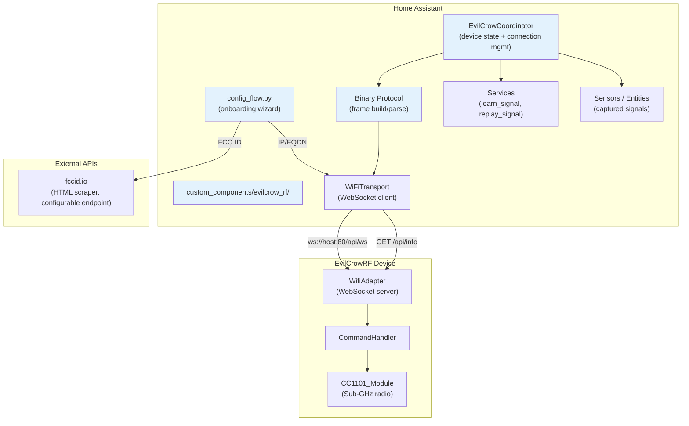
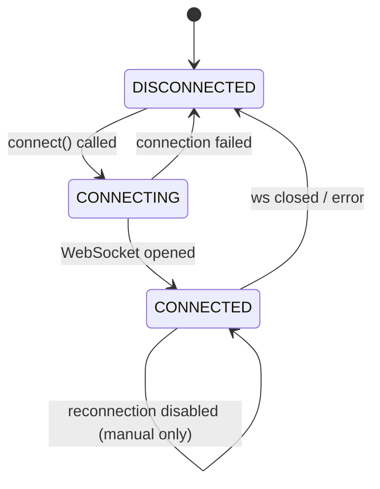
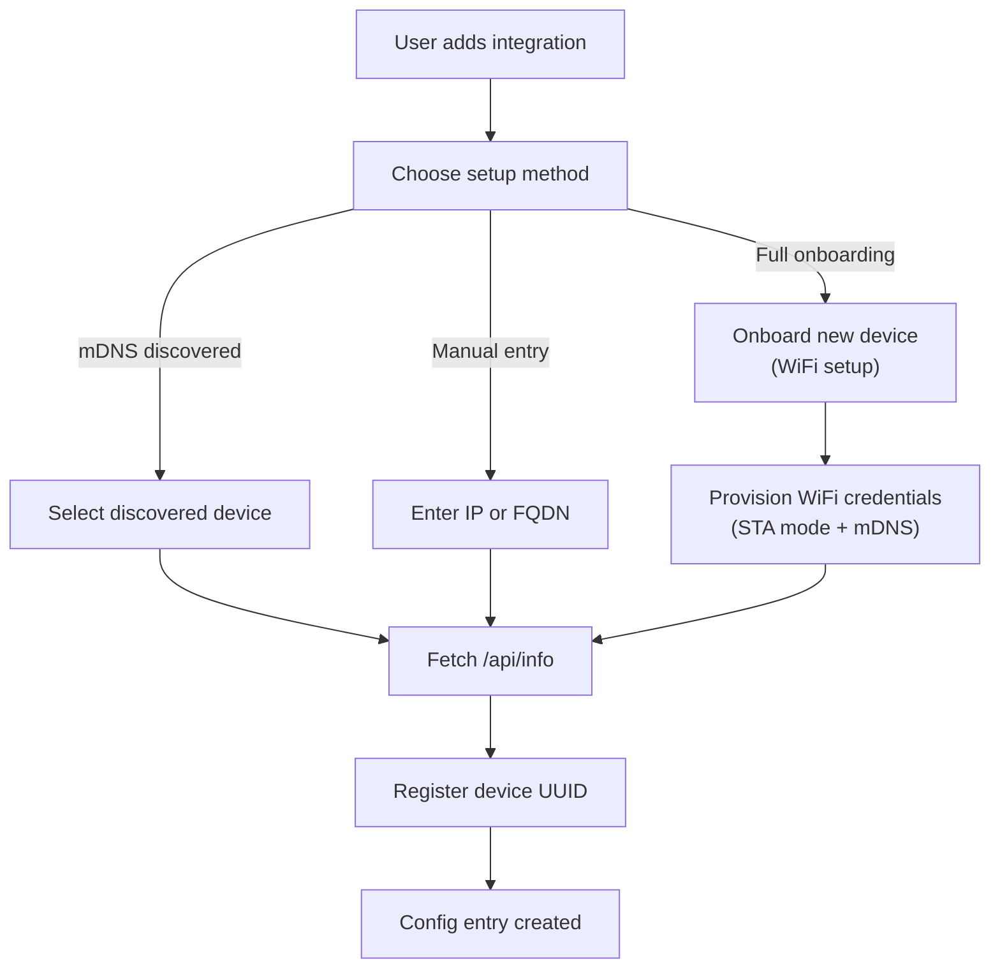
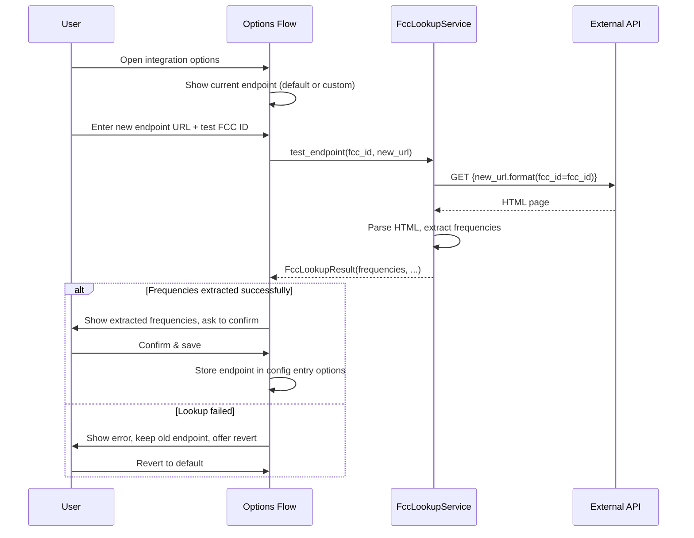
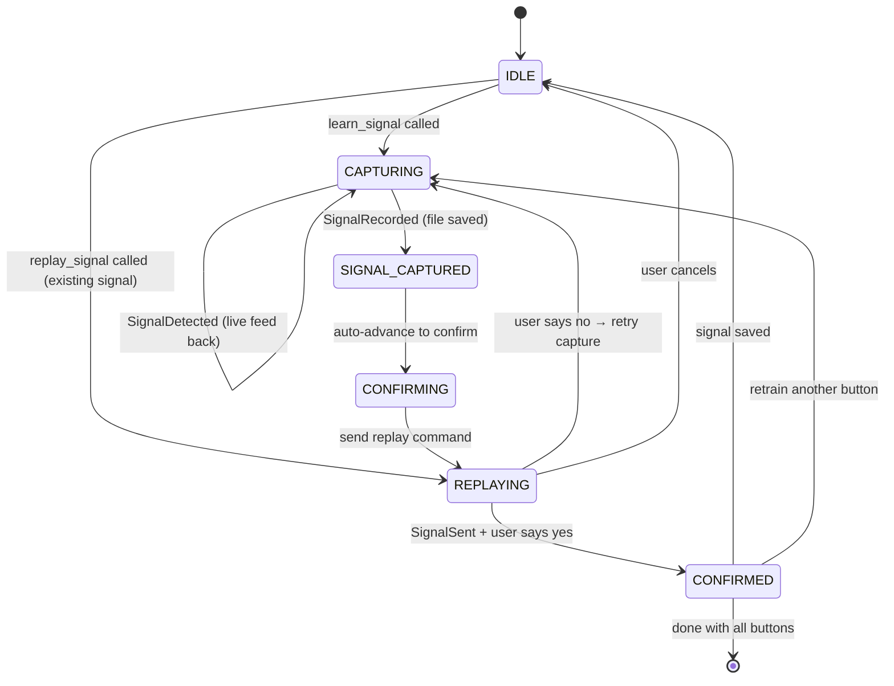

# EvilCrowRF V2 — Home Assistant Integration Plan

## Table of Contents

1. [Overview](#overview)
2. [Architecture](#architecture)
3. [Directory Structure](#directory-structure)
4. [Phase 1: Foundation — Project Scaffolding & Protocol Layer](#phase-1-foundation)
5. [Phase 2: Config Flow — Device Onboarding & FCC ID Lookup](#phase-2-config-flow)
6. [Phase 3: Signal Capture & Replay Workflow](#phase-3-signal-capture--replay)
7. [Phase 4: Makefile & Developer Experience](#phase-4-makefile--developer-experience)
8. [Integration YAML Configuration](#integration-yaml-configuration)
9. [Future Considerations](#future-considerations)

---

## Overview

This integration allows Home Assistant to control RF remote-controlled devices via an EvilCrowRF V2 device. The workflow is:

1. **Onboard** the EvilCrowRF device (first-run wizard or direct IP/FQDN).
2. **Identify** the target RF remote by FCC ID or direct frequency entry.
3. **Capture** each button press by having the EvilCrowRF scan for the signal.
4. **Confirm** the captured signal by replaying it and asking the user to verify.
5. **Control** the RF device from Home Assistant automations using the replayed signals.

### Core Requirements

| Requirement | Approach |
|---|---|
| FCC ID → Frequency | Scrape `https://fccid.io/{fcc_id}` HTML to extract operating frequency; endpoint is configurable in `evilcrow_rf.yaml` |
| Direct frequency input | Alternative if user already knows the frequency |
| Signal capture | Use EvilCrowRF's CC1101 Sub-GHz recorder (command `0x09` / `RequestRecord`) |
| Confirm capture | Replay the captured signal, ask for confirmation, retry if needed; explicit cancel returns to HA |
| Device identification | Persistent UUID stored in `config.txt` on the device's SD card via a new `hass-config-sync` command (no firmware refactor for the mobile app) |
| Multi-device ready | All communication includes a device-id field in the state machine; dispatch keyed by `device_id` |
| WiFi transport | WebSocket connection to `/api/ws` on the EvilCrowRF device |
| Timeout safety | Every command has a 15–30s timeout; the state machine cannot hang forever |
| Version awareness | Read `RESP_VERSION_INFO` on connect; warn (but allow) on major mismatch |
| File rename | Captured `.sub` files can be renamed so they are usable from the mobile app too |
| SmartConfig onboarding | Optional firmware support for ESP-TOUCH SmartConfig to push WiFi credentials |

---

## Architecture



### Key Design Decisions

| Decision | Rationale |
|---|---|
| **Python dataclasses for protocol** instead of raw byte arrays | Maintainable, testable, matches HA conventions |
| **DataUpdateCoordinator** for device polling | HA best practice for device state management |
| **`hass-config-sync` command** (new, `0xC2` → `0xC3`) for device ID exchange | Persists the HA device UUID in `config.txt` on the SD card without breaking the existing mobile-app ↔ firmware protocol; the mobile app ignores the new command |
| **Configurable FCC API endpoint** stored in `evilcrow_rf.yaml` (not options flow) | The FCC endpoint is an integration-wide setting (not per-device); a YAML file is the right scope and survives integration reloads |
| **Options-flow test/revert flow** | On endpoint change: scrape once, show result, **always persist the new endpoint**, expose "Revert to default" as an always-available action |
| **Single config entry per device** at launch; multi-device dispatch from day one | `hass.data[DOMAIN]` is a `dict[str, EvilCrowCoordinator]`; services take `device_id`; reconfigure flow handles host/port changes |
| **mDNS auto-discovery** + manual IP fallback | Reduces friction; mDNS uses `_evilcrow._tcp` / `evilcrow.local`. Manual IP is the recommended path (mDNS is unreliable across VLANs/routers) |
| **Request/response timeout tracker** | If a command times out (firmware crash, RF interference, silent WS drop), the state machine transitions to an error state and a `persistent_notification` is shown — never hangs |
| **Version awareness with warning, not block** | Read `RESP_VERSION_INFO` on connect; if major version differs, show a warning that the user can dismiss and continue |
| **SmartConfig (ESP-TOUCH) onboarding** | Firmware gains a `smartConfig` mode; the integration instructs the user to put the device in this mode, then broadcasts SSID/password via UDP — no need for the HA host to have WiFi or to connect to the device's SoftAP |
| **Captured signals mapped to Flipper Sub file fields** | `frequency`, `preset`, `protocol`, `bit`, `key`, `te`, `repeat`, etc. stored as entity attributes — directly portable to the mobile app |
| **Reconfigure flow** | If the device IP changes (DHCP), the user can update host/port without removing/re-adding the integration |

---

## Directory Structure

```
hass/
├── custom_components/
│   └── evilcrow_rf/
│       ├── __init__.py                 # Component setup, multi-device dispatch, NOT_READY
│       ├── manifest.json               # HA manifest (version, dependencies, etc.)
│       ├── config_flow.py              # Config flow (user, reauth, reconfigure, options)
│       ├── const.py                    # Constants, domain, default values, command IDs
│       ├── strings.json                # User-facing strings for config flow
│       ├── translations/
│       │   └── en.json                 # English translations
│       ├── coordinator.py              # EvilCrowCoordinator (DataUpdateCoordinator)
│       ├── binary_protocol.py          # Frame building/parsing (Python port)
│       ├── wifi_transport.py           # WebSocket client + HTTP /api/info
│       ├── device.py                   # Device model, identity management, hass-config-sync
│       ├── services.py                 # HA services (learn, replay, capture, rename, cancel)
│       ├── sensor.py                   # Sensor entities (device state, version, last-captured signal)
│       ├── button.py                   # Button entities (trigger actions, learn-button)
│       ├── select.py                   # Select entity (.sub file picker for replay)
│       ├── text.py                     # Text entity (rename .sub file)
│       ├── fcc_lookup.py               # FCC ID → frequency API client (loads endpoint from YAML)
│       ├── subghz.py                   # Sub-GHz capture/replay state machine
│       ├── discovery.py                # mDNS discovery for EvilCrow devices
│       ├── timeout_tracker.py          # PendingRequestTracker (request/response timeout)
│       ├── smartconfig.py              # ESP-TOUCH SmartConfig WiFi provisioning
│       ├── flipper_sub.py              # Flipper Sub file format parser/serializer
│       └── models.py                   # Shared dataclasses (DeviceInfo, Signal, etc.)
├── pyproject.toml                       # UV project config (deps, dev-deps, tool config)
├── tests/
│   ├── __init__.py
│   ├── conftest.py                     # Pytest fixtures (HA mocks, sample .sub files)
│   ├── test_binary_protocol.py         # Frame encode/decode, chunking, command building
│   ├── test_fcc_lookup.py              # FCC ID URL construction, response parsing, error handling
│   ├── test_subghz.py                  # State machine transitions, response routing, error recovery
│   ├── test_wifi_transport.py          # WebSocket lifecycle, reconnect backoff, /api/info parsing
│   ├── test_timeout_tracker.py         # Timeout firing, race-free cancellation
│   ├── test_config_flow.py             # User, reauth, reconfigure, options steps
│   ├── test_device.py                  # hass-config-sync round-trip, factory-reset reconciliation
│   ├── test_coordinator.py             # Multi-device dispatch, version negotiation, NOT_READY
│   ├── test_flipper_sub.py             # .sub file format round-trip
│   ├── test_smartconfig.py             # ESP-TOUCH packet format
│   └── test_yaml_config.py             # evilcrow_rf.yaml load/save/revert
├── docs/
│   └── plan.md                        # This file
└── Makefile                            # Developer targets (uv, lint, test, install, run, lock)
```

> **Note**: Technically, Home Assistant custom components live under `custom_components/` inside the HA config directory. The `Makefile` will symlink or copy this directory for testing.

---

## Phase 1: Foundation

### 1.1 `manifest.json`

```json
{
  "domain": "evilcrow_rf",
  "name": "EvilCrowRF V2",
  "codeowners": ["@your-gh-handle"],
  "config_flow": true,
  "dependencies": [],
  "documentation": "https://github.com/...",
  "iot_class": "local_push",
  "requirements": ["aiohttp>=3.9.0", "beautifulsoup4>=4.12", "lxml>=5.0"],
  "version": "1.0.0",
  "zeroconf": ["_evilcrow._tcp.local."],
  "ssdp": []
}
```

- `iot_class: local_push` — WebSocket provides real-time notifications from the device.
- `zeroconf` — enables mDNS auto-discovery of `_evilcrow._tcp` service type.
- `config_flow: true` — enables the onboarding wizard.

### 1.2 `const.py`

```python
DOMAIN = "evilcrow_rf"
DEFAULT_NAME = "EvilCrowRF V2"
DEFAULT_PORT = 80
DEFAULT_SCAN_INTERVAL = 30
WS_PATH = "/api/ws"
INFO_PATH = "/api/info"
MAX_RECONNECT_DELAY = 300  # 5 minutes
REQUEST_TIMEOUT = 15          # generic request timeout
CAPTURE_TIMEOUT = 30          # state machine timeout for capture/replay
SUPPORTED_FW_MAJOR = 3        # firmware major version this integration was built against

# Integration YAML config (lives in <config_dir>/evilcrow_rf.yaml)
YAML_CONFIG_FILENAME = "evilcrow_rf.yaml"

# Binary protocol constants
BINARY_MAGIC = 0xAA
FRAME_TYPE_DATA = 0x01
FRAME_TYPE_ACK = 0x02
FRAME_TYPE_NAK = 0x03
MAX_PAYLOAD_SIZE = 500

# Message types (command → device)
CMD_GET_STATE = 0x01
CMD_SCAN = 0x02
CMD_IDLE = 0x03
CMD_START_RECORDING = 0x09
CMD_STOP_RECORDING = 0x0A
CMD_SEND_SIGNAL = 0x0B
CMD_SMART_CONFIG = 0x18       # new: put device into SmartConfig WiFi provisioning mode
CMD_FILE_LIST = 0xA0          # request SD-card file listing
CMD_FILE_RENAME = 0xA4        # rename a file on the SD card
CMD_SETTINGS_UPDATE = 0xC1
CMD_HA_CONFIG_SYNC = 0xC2     # new: ask device for its HA-assigned UUID (response 0xC3)

# Message types (response → app, 0x80+)
RESP_SIGNAL_DETECTED = 0x90
RESP_SIGNAL_RECORDED = 0x91
RESP_SIGNAL_SENT = 0x92
RESP_SIGNAL_ERROR = 0x93
RESP_SIGNAL_SENDING_ERROR = 0x94
RESP_FILE_LIST = 0xA1
RESP_FILE_ACTION = 0xA3
RESP_VERSION_INFO = 0xC0
RESP_HA_CONFIG_SYNC = 0xC3    # payload: [length:uint16][uuid-string-bytes] or 0x0000 if unset
RESP_SMART_CONFIG_STATUS = 0xC4
RESP_DEVICE_NAME = 0xC8
RESP_SETTINGS_SYNC = 0xC9

# Config flow steps
STEP_USER = "user"
STEP_MANUAL = "manual_device"
STEP_SMARTCONFIG = "smartconfig"
STEP_DISCOVERY = "discovery"
STEP_REGISTER = "register_device"
STEP_CAPTURE_SETUP = "capture_setup"
STEP_RECONFIGURE = "reconfigure"
STEP_OPTIONS = "options"
STEP_FCC_TEST = "fcc_test"

# Services
SERVICE_LEARN_SIGNAL = "learn_signal"
SERVICE_REPLAY_SIGNAL = "replay_signal"
SERVICE_CANCEL_CAPTURE = "cancel_capture"
SERVICE_CONFIRM_CAPTURE = "confirm_capture"
SERVICE_RENAME_SIGNAL = "rename_signal"
SERVICE_DELETE_SIGNAL = "delete_signal"
SERVICE_REFRESH_FILES = "refresh_files"

# Attributes
ATTR_DEVICE_ID = "device_id"
ATTR_FCC_ID = "fcc_id"
ATTR_FREQUENCY = "frequency"
ATTR_MODULATION = "modulation"
ATTR_BUTTON_NAME = "button_name"
ATTR_SIGNAL_FILE = "signal_file"
ATTR_NEW_NAME = "new_name"
ATTR_CONFIRMED = "confirmed"
ATTR_TARGET_DEVICE_ID = "target_device_id"

# FCC ID lookup (default + integration YAML schema keys)
DEFAULT_FCC_API_ENDPOINT = "https://fccid.io/{fcc_id}"
CONF_FCC_API_ENDPOINT = "fcc_api_endpoint"
CONF_FCC_TEST_ID = "fcc_test_id"

# Persistent notifications (used for timeout, version-mismatch, etc.)
NOTIFY_VERSION_WARNING = "evilcrow_rf_version_warning"
NOTIFY_CAPTURE_TIMEOUT = "evilcrow_rf_capture_timeout"
```

### 1.3 `binary_protocol.py` — Python Implementation of the Binary Protocol

This module reimplements the `FirmwareBinaryProtocol` from the mobile app in Python.

**Frame Format** (matches firmware):

```
┌──────┬──────┬─────────┬──────────┬──────────────┬───────────┬──────────────┬──────────┐
│ Magic│ Type │ ChunkID │ ChunkNum │ TotalChunks  │  DataLen  │    Data      │ Checksum │
│  1B  │  1B  │   1B    │    1B    │     1B       │  2B (LE)  │  0..500 B    │    1B    │
│ 0xAA │0x01  │  0..255 │  1..255  │    1..255    │           │  variable    │  XOR     │
└──────┴──────┴─────────┴──────────┴──────────────┴───────────┴──────────────┴──────────┘
```

**Key design for `binary_protocol.py`**:

```python
@dataclass
class BinaryFrame:
    magic: int = BINARY_MAGIC
    frame_type: int = FRAME_TYPE_DATA
    chunk_id: int = 0
    chunk_num: int = 1
    total_chunks: int = 1
    data: bytes = b""

    def encode(self) -> bytes:
        """Encode frame to bytes with XOR checksum."""

    @staticmethod
    def decode(data: bytes) -> "BinaryFrame":
        """Parse a binary frame, validate checksum, return frame."""

class EvilCrowBinaryProtocol:
    """Command builder and response parser."""

    _next_chunk_id: int = 0

    def _next_id(self) -> int:
        self._next_chunk_id = (self._next_chunk_id % 255) + 1
        return self._next_chunk_id

    def build_request_record_command(
        self,
        frequency: int,
        module: int,
        preset: int = 0,
    ) -> list[bytes]:
        """Build Start Recording command frames. Returns list of encoded frames (chunked if needed)."""

    def build_send_signal_command(self, file_path: str) -> list[bytes]:
        """Build Send Signal command frames."""

    def build_settings_update_command(
        self, setting_key: int, setting_value: bytes
    ) -> list[bytes]:
        """Build a settings update command (e.g., to store HA device ID)."""

    @staticmethod
    def parse_response(data: bytes) -> dict:
        """Parse a binary response payload into a typed dict with 'type' and 'data' keys."""
```

**Design rationale**: Following the mobile app pattern, this is a pure-data module with no I/O. The frame builder and response parser are stateless (except for the chunk ID counter, which is trivial). This makes it fully unit-testable.

### 1.4 `wifi_transport.py` — WebSocket Client

```python
class WiFiTransport:
    """Manages the WebSocket connection to a single EvilCrowRF device."""

    def __init__(self, host: str, port: int, device_id: str):
        self._host = host
        self._port = port
        self._device_id = device_id  # persistent UUID
        self._ws: aiohttp.ClientWebSocketResponse | None = None
        self._session: aiohttp.ClientSession | None = None
        self._on_message: Callable[[dict], Awaitable[None]] | None = None
        self._on_disconnect: Callable[[], Awaitable[None]] | None = None

    async def connect(self) -> bool:
        """Connect WebSocket to ws://host:port/api/ws. Returns success."""

    async def disconnect(self):
        """Close WebSocket connection."""

    async def send_frame(self, frame: bytes) -> bool:
        """Send a binary frame over WebSocket."""

    async def fetch_device_info(self) -> dict | None:
        """GET http://host:port/api/info for device metadata."""

    async def _reader_task(self):
        """Background loop: read WebSocket messages, parse, dispatch."""
```

Key behaviors:

- On connect, fetch `/api/info` to get device metadata (name, firmware version, transport).
- Maintain a background reader coroutine that dispatches parsed responses.
- Implement exponential backoff reconnection (1s → 2s → 4s → ... → MAX_RECONNECT_DELAY).
- Emit typed events on message/connection-lost via callbacks.
- **Transport is single-device**: one `WiFiTransport` instance per device. Multi-device support means multiple instances.



### 1.5 `device.py` — Device Identity Management

```python
@dataclass
class DeviceInfo:
    host: str
    port: int
    device_id: str       # stable UUID (set via settingsUpdate, generated on first connect)
    name: str            # device display name (from /api/info)
    firmware_version: str
    transport: str       # "wifi"

class DeviceRegistryStore:
    """Persists device registry data in HA's storage (stores.json-like)."""

    def __init__(self, hass):
        self._hass = hass
        self._data: dict[str, dict] = {}  # device_id → info

    async def async_load(self):
        ...

    async def async_save(self):
        ...

    def get(self, device_id: str) -> DeviceInfo | None:
        ...

    def register(self, info: DeviceInfo):
        ...

    def all_devices(self) -> list[DeviceInfo]:
        ...  # ready for multi-device
```

**Device ID generation**: On first successful connection, the integration:

1. Checks if the device already has an HA device ID stored via `settingsUpdate` (reading settings via `getState` or `settingsSync` responses).
2. If not, generates a UUID, writes it to the device via `settingsUpdate` command (key `SETTING_HA_DEVICE_ID`), and stores it locally.
3. The device persists this UUID across reboots via its `ConfigManager` (LittleFS).

This is the key to surviving firmware updates: the UUID is stored in the device's own persistent storage, not derived from hardware.

### 1.6 `coordinator.py` — Device State Coordinator

Follows HA's `DataUpdateCoordinator` pattern.

```python
class EvilCrowCoordinator(DataUpdateCoordinator[dict]):
    """Coordinator for a single EvilCrowRF device."""

    def __init__(self, hass, config_entry, device_info: DeviceInfo):
        self._device_info = device_info
        self._transport = WiFiTransport(
            host=device_info.host,
            port=device_info.port,
            device_id=device_info.device_id,
        )
        self._subghz = SubGhzService(self._transport, self._protocol)
        self._protocol = EvilCrowBinaryProtocol()

    async def _async_update_data(self) -> dict:
        """Periodic poll (or push-based state refresh)."""

    async def async_connect(self) -> bool:
        """Establish WebSocket connection, start reader loop."""

    async def async_disconnect(self):
        """Clean shutdown."""
```

**Multi-device preparation**: The `__init__.py` will maintain a `dict[str, EvilCrowCoordinator]` keyed by device_id for routing responses.

---

## Phase 2: Config Flow

The config flow has two paths:



### 2.1 Config Flow Steps

**Step 1: Setup Method** (`user` step)

User chooses one of:
- **Auto-discover** — shows a list of EvilCrowRF devices found via mDNS (`_evilcrow._tcp`)
- **Manual entry** — prompts for IP address or FQDN
- **Onboard new device** — connects to device's SoftAP, sets WiFi credentials, gets IP

**Step 2a: Manual Entry** (`manual_device` step)

- `host` (str, required): IP or FQDN of the device
- `port` (int, optional, default: 80)

On submit, the integration:
- Fetches `http://{host}:{port}/api/info`
- If reachable, stores device info and proceeds to device registration
- If unreachable, shows error

**Step 2b: Onboarding** (`onboard_device` step)

1. User is instructed to power on the EvilCrowRF in SoftAP mode.
2. User connects their HA machine to the EvilCrowRF's WiFi AP (SSID: `EvilCrow-XXXX`).
3. User enters the AP's SSID and password in the wizard (or provides STA credentials).
4. Integration connects to the device at `192.168.4.1`, sends WiFi credentials via `setWifiApConfig` + `applyWifi` commands.
5. Device reboots, connects to the user's WiFi.
6. Integration re-discovers the device at its new IP (via mDNS or subnet scan).
7. Proceeds to device registration.

**Step 3: Device Registration** (`register_device` step)

- Integration connects to the device, fetches `/api/info`.
- Generates a UUID, sends it to the device via `settingsUpdate` (key `0x01` = `ha_device_id`).
- Stores device info in the device registry.
- Creates the config entry with `data: { "device_id": uuid, "host": ip, "port": 80 }`.

**Step 4: FCC ID / Frequency** (`capture_setup` step) — optional, can be done later

If user wants to set up a device now, they provide:
- `device_name` (str): friendly name for the target RF device
- `fcc_id` (str, optional): FCC ID for automatic frequency detection
- `frequency` (float, optional): direct frequency in MHz
- `modulation` (select, optional): AM/OOK_FIX/OOK_VAR/FSK/etc.

If `fcc_id` is provided, the integration scrapes `https://fccid.io/{fcc_id}` to determine the frequency. If both `fcc_id` and `frequency` are provided, frequency takes precedence.

The FCC API endpoint is configurable in the integration's options (see [FCC API Endpoint Configuration](#fcc-api-endpoint-configuration)). Users can override the default `https://fccid.io/{fcc_id}` with a different URL template, test it against a known FCC ID, and revert to the default if needed.

### 2.2 FCC ID Lookup (`fcc_lookup.py`)

The `FccLookupService` downloads the HTML page from the configured endpoint URL (default: `https://fccid.io/{fcc_id}`), parses it with BeautifulSoup + lxml, and extracts operating frequencies using heuristic selectors targeting the frequency information typically present on fccid.io pages.

**Frequency extraction strategy**: fccid.io pages list operating frequencies in a "Frequency Range" or "Operating Frequency" section within the device details table. The scraper targets:
- Table cells containing "MHz" or "GHz" labeled as "Frequency Range", "Operating Frequency", or similar
- The `Freq` column in the technical reports section
- Freq field in the "Detail" section of the grantee listing

```python
import re
import logging
from typing import Optional

import aiohttp
from bs4 import BeautifulSoup

_LOGGER = logging.getLogger(__name__)


class FccLookupError(Exception):
    """Raised when FCC ID lookup fails."""


@dataclass
class FccLookupResult:
    """Result of an FCC ID frequency lookup."""
    frequencies: list[float]   # extracted frequencies in MHz
    source_url: str            # the URL that was scraped
    raw_match: str | None      # the matched text snippet (for diagnostics)


class FccLookupService:
    """
    Scrapes fccid.io (or a configurable endpoint) to determine
    the operating frequency of a device from its FCC ID.
    """

    def __init__(self, session: aiohttp.ClientSession, endpoint_url: str | None = None):
        self._session = session
        # Endpoint template with {fcc_id} placeholder
        self._endpoint = endpoint_url or DEFAULT_FCC_API_ENDPOINT

    @property
    def endpoint(self) -> str:
        return self._endpoint

    @endpoint.setter
    def endpoint(self, url: str) -> None:
        self._endpoint = url

    async def lookup(self, fcc_id: str) -> FccLookupResult:
        """
        Scrape the configured endpoint for the given FCC ID.
        Returns extracted frequencies in MHz.
        Raises FccLookupError on failure.
        """
        url = self._endpoint.format(fcc_id=fcc_id)
        _LOGGER.debug("Fetching FCC ID info from %s", url)

        try:
            async with self._session.get(url, timeout=aiohttp.ClientTimeout(total=15)) as resp:
                if resp.status != 200:
                    raise FccLookupError(f"HTTP {resp.status} fetching {url}")
                html = await resp.text()
        except (aiohttp.ClientError, asyncio.TimeoutError) as exc:
            raise FccLookupError(f"Request failed: {exc}") from exc

        return self._parse_frequencies(html, url)

    @staticmethod
    def _parse_frequencies(html: str, source_url: str) -> FccLookupResult:
        """Parse frequency information from fccid.io HTML."""
        soup = BeautifulSoup(html, "lxml")
        frequencies: list[float] = []
        raw_match: str | None = None

        # Strategy 1: Look for "Frequency Range" or "Operating Frequency"
        # rows in the specification/ detail table
        for th in soup.find_all("th"):
            text = th.get_text(strip=True).lower()
            if "frequency" in text or "freq" in text:
                td = th.find_next("td")
                if td:
                    raw_match = td.get_text(strip=True)
                    frequencies = FccLookupService._extract_mhz_values(raw_match)
                    if frequencies:
                        break

        # Strategy 2: Scan the entire page for MHz/GHz patterns
        # in frequency-related table cells
        if not frequencies:
            for elem in soup.find_all(string=re.compile(r"\d+\.?\d*\s*MHz", re.I)):
                raw_match = elem.strip()
                frequencies = FccLookupService._extract_mhz_values(raw_match)
                if frequencies:
                    break

        if not frequencies:
            raise FccLookupError(
                f"Could not determine frequency from {source_url}. "
                f"Try entering the frequency manually."
            )

        return FccLookupResult(
            frequencies=frequencies,
            source_url=source_url,
            raw_match=raw_match,
        )

    @staticmethod
    def _extract_mhz_values(text: str) -> list[float]:
        """Extract frequency values in MHz from a text string.
        Handles '433.92 MHz', '915 MHz', '2.4 GHz' -> 2400, etc.
        """
        values: list[float] = []
        for match in re.finditer(r"(\d+\.?\d*)\s*(MHz|GHz|kHz)", text, re.I):
            num = float(match.group(1))
            unit = match.group(2).lower()
            if unit == "ghz":
                num *= 1000
            elif unit == "khz":
                num /= 1000
            values.append(num)
        return sorted(set(round(v, 3) for v in values))

    async def test_endpoint(self, fcc_id: str, endpoint: str) -> FccLookupResult:
        """
        Test a custom endpoint URL against a sample FCC ID.
        This is used during configuration to validate that the
        endpoint URL is functional and returns parseable data.

        Does NOT modify the service's internal endpoint.
        """
        saved = self._endpoint
        self._endpoint = endpoint
        try:
            return await self.lookup(fcc_id)
        finally:
            self._endpoint = saved
```

**Error handling**: If scraping fails (HTTP error, no frequency found, parse error), the integration logs a warning and allows the user to enter the frequency manually. The `FccLookupError` exception carries a descriptive message that is surfaced in the config flow UI.

### 2.3 Config Entry Schema

```python
CONFIG_SCHEMA = {
    "device_id": str,      # persistent UUID
    "host": str,           # IP or FQDN
    "port": int,           # default 80
    "device_name": str,    # friendly name
    "firmware_version": str,
    # Stored in options (mutable):
    "fcc_id": str | None,
    "frequency": float | None,
    "modulation": str | None,
    "fcc_api_endpoint": str | None,  # custom FCC URL template, None = use default
}
```

### 2.4 FCC API Endpoint Configuration

The FCC API endpoint is configurable via the integration's **Options** flow (not the initial config flow). This allows the user to:

1. **Override** the default `https://fccid.io/{fcc_id}` with a different URL template (e.g., a proxy or alternative database).
2. **Test** the new endpoint by providing a sample FCC ID and verifying that frequencies are extracted correctly.
3. **Revert** to the default endpoint at any time.



**Config flow step design** (`options_flow`):

| Field | Type | Description |
|---|---|---|
| `fcc_api_endpoint` | str | URL template with `{fcc_id}` placeholder (prefilled with current value) |
| `test_fcc_id` | str | A sample FCC ID to test the endpoint with (shown only when endpoint changes) |
| `revert_to_default` | bool | Checkbox to reset to `https://fccid.io/{fcc_id}` |

**Behavior**:
- When the user modifies the endpoint URL, a `test_fcc_id` field appears.
- On submitting the test, the integration scrapes the endpoint with the test FCC ID.
- If frequencies are found, they are displayed to the user with an option to confirm.
- If the scrape fails, an error is shown and the endpoint is NOT saved. The user can fix the URL or revert to default.
- The endpoint is stored in `config_entry.options[CONF_FCC_API_ENDPOINT]`. The `FccLookupService` reads it on startup, falling back to `DEFAULT_FCC_API_ENDPOINT`.

---

## Phase 3: Signal Capture & Replay

### 3.1 `subghz.py` — Capture State Machine

This is the core workflow. The state machine models the learn → confirm → retry cycle.



```python
@dataclass
class CaptureState:
    """Mutable state for a signal capture session."""
    target_device_id: str         # HA device registry ID of the target RF device
    target_device_name: str
    frequency: float
    modulation: str
    current_button: str | None    # button being learned (e.g., "power", "volume_up")
    captured_file: str | None     # path on device's SD card
    status: str                   # idle | capturing | captured | confirming | replaying | confirmed

class SubGhzService:
    """Manages the Sub-GHz capture/replay lifecycle."""

    def __init__(self, transport: WiFiTransport, protocol: EvilCrowBinaryProtocol):
        self._transport = transport
        self._protocol = protocol
        self._state = CaptureState(status="idle")
        self._event_callbacks: dict[str, list[Callable]] = {}

    async def start_capture(self, frequency: float, modulation: str, button_name: str) -> bool:
        """Send start recording command to the device."""
        self._state = CaptureState(
            frequency=frequency,
            modulation=modulation,
            current_button=button_name,
            status="capturing",
        )
        cmd = self._protocol.build_request_record_command(...)
        return await self._transport.send_frame(cmd)

    async def send_signal(self, file_path: str) -> bool:
        """Replay a captured signal from device storage."""

    def handle_response(self, msg: dict) -> None:
        """Route incoming response to current state handler."""
        match msg["type"]:
            case "SignalRecorded":
                self._state.captured_file = msg["data"]["filename"]
                self._state.status = "captured"
                self._emit("signal_captured")
            case "SignalSent":
                self._state.status = "confirmed" if self._state.status == "replaying" else "replaying"
                self._emit("signal_sent")
            case "SignalError":
                self._state.status = "idle"
                self._emit("signal_error")
```

### 3.2 HA Services (`services.py`)

Three services are exposed to the Home Assistant service registry:

**`learn_signal`** — Start or continue the capture workflow.

| Parameter | Type | Required | Description |
|---|---|---|---|
| `device_id` | str | yes | EvilCrowRF device ID |
| `fcc_id` | str | no | FCC ID to look up frequency |
| `frequency` | float | no | Frequency in MHz (takes precedence over FCC ID) |
| `modulation` | str | no | Modulation type (default: OOK_FIX) |
| `button_name` | str | yes | Friendly name for this button |

If neither `fcc_id` nor `frequency` is provided, uses values from the target device's config entry options.

**Behavior**:
1. If FCC ID given and no frequency, look up frequency from FCC API.
2. Send `start_recording` command to device with frequency/modulation.
3. Wait for `SignalRecorded` response (device saves .sub file to SD).
4. Automatically advance to confirmation: replay the captured signal.
5. Wait for user response (via `confirm_capture` service or HA script).

**`confirm_capture`** — Confirm or reject the last captured signal.

| Parameter | Type | Required | Description |
|---|---|---|---|
| `device_id` | str | yes | EvilCrowRF device ID |
| `confirmed` | bool | yes | Whether the device responded to the signal |
| `next_button` | str | no | If confirmed and more buttons to learn |

**Behavior**:
- If `confirmed`: save the captured signal mapping → HA entity, advance to next button or complete.
- If not confirmed: restart capture (go back to scanning) for the same button.
- Parallel option: user can also cancel with `hassio/addon_stdin` or a separate service call.

**`replay_signal`** — Replay a previously captured signal.

| Parameter | Type | Required | Description |
|---|---|---|---|
| `device_id` | str | yes | EvilCrowRF device ID |
| `signal_file` | str | yes | Path to the .sub file on the device's SD card |
| `repeat_count` | int | no | Number of times to repeat (default: 1) |

### 3.3 Entities (`sensor.py`, `button.py`)

**Sensor Entities** — Represent captured signals as entities that can be used in automations.

```python
class CapturedSignalEntity(SensorEntity):
    """Represents a learned RF signal's metadata."""

    _attr_icon = "mdi:remote"

    def __init__(self, coordinator, device_id, button_name, signal_file):
        self._attr_name = f"{device_name} {button_name}"
        self._attr_unique_id = f"{device_id}_{button_name}"
        self._attr_native_value = signal_file  # path to .sub file
        self._attr_extra_state_attributes = {
            "frequency": ...,
            "modulation": ...,
            "button_name": button_name,
        }

class LearnButtonEntity(ButtonEntity):
    """Press to re-learn or re-train a signal button."""

    _attr_icon = "mdi:remote"
```

These entities are dynamically created as the user learns buttons. They appear in the device registry under the target RF device (or under the EvilCrowRF device as sub-entities).

### 3.4 `__init__.py` — Component Entry Point

Follows HA's standard async setup pattern:

```python
async def async_setup_entry(hass, entry):
    """Set up EvilCrowRF from a config entry."""
    coordinator = EvilCrowCoordinator(hass, entry, ...)
    await coordinator.async_connect()

    # Register services
    async def handle_learn(call):
        await coordinator.subghz.start_capture(...)
    hass.services.async_register(DOMAIN, SERVICE_LEARN_SIGNAL, handle_learn)

    # Forward entry setup to platforms
    hass.async_create_task(
        hass.config_entries.async_forward_entry_setups(entry, ["sensor", "button"])
    )

    return True

async def async_unload_entry(hass, entry):
    """Unload a config entry."""
    coordinator = hass.data[DOMAIN].pop(entry.data["device_id"])
    await coordinator.async_disconnect()
    return await hass.config_entries.async_forward_entry_unload(entry, ["sensor", "button"])
```

---

## Phase 4: Makefile & Developer Experience

### `pyproject.toml` — UV Project Configuration

Dependencies are managed with **`uv`** (the fast Python package manager). A single `pyproject.toml` at the repo root replaces both the virtual environment setup and the `requirements-dev.txt` file.

```toml
[project]
name = "evilcrow-rf-hass"
version = "1.0.0"
description = "EvilCrowRF V2 Home Assistant integration"
requires-python = ">=3.12"
dependencies = []

[project.optional-dependencies]
# Dependencies are declared in the HA manifest (beautifulsoup4, aiohttp, lxml).
# This section is for dev tooling and HA core for testing.
dev = [
    "pytest>=8.0",
    "pytest-asyncio>=0.23",
    "pytest-cov>=4.1",
    "pytest-aiohttp>=1.0",
    "ruff>=0.3",
    "mypy>=1.8",
    "homeassistant>=2024.4",
    "aiohttp>=3.9",
    "beautifulsoup4>=4.12",
    "lxml>=5.0",
]

[tool.ruff]
target-version = "py312"
line-length = 100

[tool.ruff.lint]
select = ["E", "F", "I", "N", "W", "UP"]

[tool.ruff.format]
quote-style = "double"

[tool.mypy]
python_version = "3.12"
ignore_missing_imports = true

[tool.pytest.ini_options]
minversion = "8.0"
testpaths = ["tests"]
addopts = "-v --cov=custom_components/evilcrow_rf --cov-report=term-missing"
```

### `Makefile` Design (UV-based)

```makefile
# Makefile for EvilCrowRF Home Assistant Integration
# Uses `uv` for fast dependency management and virtual environment.

# Variables
DOMAIN = evilcrow_rf
HA_CONFIG_DIR ?= ~/.homeassistant  # overridable (e.g., make HA_CONFIG_DIR=/config)
CUSTOM_COMPONENTS_DIR = $(HA_CONFIG_DIR)/custom_components
TARGET_DIR = $(CUSTOM_COMPONENTS_DIR)/$(DOMAIN)
UV = uv
UV_RUN = $(UV) run

.PHONY: help install uninstall reinstall test lint fmt check dev-env clean run logs ci

help:
	@echo "EvilCrowRF Home Assistant Integration — Makefile"
	@echo ""
	@echo "Targets:"
	@echo "  install     - Symlink integration into HA custom_components"
	@echo "  uninstall   - Remove symlink"
	@echo "  reinstall   - Uninstall then install (sync after edits)"
	@echo "  dev-env     - Create .venv with uv sync (installs all dev deps)"
	@echo "  test        - Run pytest via uv"
	@echo "  lint        - Run ruff check via uv"
	@echo "  fmt         - Run ruff format via uv"
	@echo "  check       - Lint + format check (CI gate)"
	@echo "  clean       - Remove .venv and caches"
	@echo "  run         - Start HA Core in dev mode with filtered logs"
	@echo "  logs        - Tail HA logs for evilcrow_rf domain"
	@echo "  ci          - dev-env + check (intended for CI pipelines)"
	@echo ""
	@echo "Quick start:"
	@echo "  1. make dev-env          # create .venv with uv"
	@echo "  2. make install          # symlink into HA config"
	@echo "  3. make test             # run tests"
	@echo "  4. make run              # start HA in dev mode"
	@echo ""
	@echo "Environment:"
	@echo "  HA_CONFIG_DIR    Home Assistant config directory"
	@echo "                   (default: ~/.homeassistant)"
	@echo "                   Example: HA_CONFIG_DIR=/config make install"

install:
	@echo "==> Installing $(DOMAIN) to $(TARGET_DIR)..."
	@mkdir -p $(CUSTOM_COMPONENTS_DIR)
	@ln -sfn $(PWD)/custom_components/$(DOMAIN) $(TARGET_DIR)
	@echo "Done. Restart Home Assistant or reload config entry."

uninstall:
	@echo "==> Removing $(TARGET_DIR)..."
	@rm -f $(TARGET_DIR)
	@echo "Done."

reinstall: uninstall install

dev-env:
	@echo "==> Creating .venv with uv..."
	$(UV) sync --frozen
	@echo "Done. Virtual environment is ready at .venv/"

test:
	$(UV_RUN) pytest tests/

lint:
	$(UV_RUN) ruff check custom_components/ tests/

fmt:
	$(UV_RUN) ruff format custom_components/ tests/

check:
	$(UV_RUN) ruff check custom_components/ tests/
	$(UV_RUN) ruff format --check custom_components/ tests/
	$(UV_RUN) mypy custom_components/ --ignore-missing-imports

run:
	@echo "==> Starting Home Assistant Core in development mode..."
	@echo "    Logs filtered to ERROR/WARNING + evilcrow_rf lines."
	$(UV_RUN) hass -c $(HA_CONFIG_DIR) --debug --log-rotate-days 1 2>&1 | \
		grep --line-buffered -E "^(ERROR|WARNING)|evilcrow_rf"

logs:
	@tail -f $(HA_CONFIG_DIR)/home-assistant.log | grep --line-buffered "evilcrow_rf"

clean:
	@echo "==> Cleaning..."
	rm -rf .venv build dist *.egg-info .coverage coverage .mypy_cache .ruff_cache
	find . -type d -name __pycache__ -exec rm -rf {} + 2>/dev/null || true
	find . -type f -name "*.pyc" -delete
	@echo "Done."

ci: dev-env check
```

**Key differences from pip-based approach**:
- No `dev-env` step requires `pip install` — `uv sync` reads `pyproject.toml` and creates the `.venv` with all dependencies in one shot.
- `uv run` automatically uses the environment, no need to reference `.venv/bin/` paths.
- `uv sync --frozen` ensures reproducible installs (no lock file updates).
- `uv` is ~10-100x faster than pip for dependency resolution and installation.

### Directory Setup for Testing

```
hass/
├── custom_components/
│   └── evilcrow_rf/       # Source code (symlinked to HA config)
├── tests/                  # Pytest tests
├── Makefile
├── pyproject.toml           # UV project config (deps, dev-deps, tool config)
├── uv.lock                  # Lockfile (auto-generated by uv sync)
└── docs/
    └── plan.md
```

The integration is developed inside the repo's `hass/` directory. The `Makefile` creates a symlink `~/.homeassistant/custom_components/evilcrow_rf → /path/to/repo/hass/custom_components/evilcrow_rf` so HA loads it live. Changes are picked up on HA restart (or config reload for services/entities).

**Getting started with uv**:

```bash
# Install uv (if not already installed)
curl -LsSf https://astral.sh/uv/install.sh | sh

# Create the virtual environment and install all dependencies
cd hass && make dev-env

# Symlink into HA config
make install

# Run tests
make test
```

**Prerequisites**: The developer must have `uv` installed on their system. The Makefile does not install `uv` — that's a one-time setup outside the repo. This matches the approach used by the firmware (which requires PlatformIO) and the mobile app (which requires Flutter).

### Suggested Test Plan

| Test File | What It Tests |
|---|---|
| `test_binary_protocol.py` | Frame encode/decode, checksum validation, command building, chunking, response parsing |
| `test_fcc_lookup.py` | FCC ID URL construction, response parsing, error handling |
| `test_subghz.py` | State machine transitions, response routing, error recovery |

---

## Future Considerations

### Multi-Device Support

The architecture is designed for multi-device from day one:

- `hass.data[DOMAIN]` is a `dict[str, EvilCrowCoordinator]` keyed by `device_id`.
- `WiFiTransport` is single-device; multiple coordinators = multiple transports.
- Config flow allows adding multiple devices (each gets a config entry).
- Services accept a `device_id` parameter to target a specific device.
- mDNS discovery returns all devices on the network.

### BLE Transport

Not initially implemented (WiFi only), but the abstraction layer makes it straightforward to add later:

- `Transport` base class (or Protocol) with `connect`, `disconnect`, `send_frame`, `on_message`.
- `WiFiTransport` and `BleTransport` both implement it.
- `EvilCrowCoordinator` uses whichever transport is configured.

### Bruter & nRF24 Support

The current scope is Sub-GHz signal capture only. Later phases can add:

- **Bruter service**: Trigger rolling-code brute-force attacks from HA.
- **nRF24 service**: 2.4 GHz signal capture and MouseJack.
- **ProtoPirate service**: Protocol decoding for automotive key fobs.

### Home Assistant Discovery & Sensors

- **Auto-discovery of signals**: Periodically sync the device's SD card file list, auto-create entities for known `.sub` files.
- **Signal history sensor**: Track when signals were last replayed.
- **Diagnostics**: Connection quality, RSSI during capture, device health (battery, SD usage).

### Version Compatibility

The integration must handle:

- **Protocol version negotiation**: On connect, read firmware version from `/api/info`. Gate features based on version.
- **Migration**: Handle config entry version upgrades (schema changes for new features).

---

## Implementation Order

| Phase | Components | Estimated Effort |
|---|---|---|
| **1. Foundation** | `manifest.json`, `const.py`, `binary_protocol.py`, `wifi_transport.py`, `device.py`, `coordinator.py` | Medium — core plumbing |
| **2. Config Flow** | `config_flow.py`, `fcc_lookup.py`, `discovery.py`, `strings.json`, `translations/en.json` | Medium — wizard UX |
| **3. Capture/Replay** | `subghz.py`, `services.py`, `sensor.py`, `button.py`, `__init__.py` wiring | Medium — core workflow |
| **4. Makefile & DX** | `pyproject.toml`, `Makefile` (uv targets), `tests/`, `.gitignore` updates | Small — tooling |
| **5. Polish** | Error handling, reconnection, logging, diagnostics | Medium — reliability |

---

*Last updated: 2026-06-21. See `firmware/docs/architecture.md` and `mobile_app/docs/architecture.md` for companion architecture docs.*
