# EvilCrowRF V2 — Mobile App Architecture

This document describes the architecture of the EvilCrowRF V2 Flutter mobile app, its communication with the ESP32 firmware, and the design decisions behind the current implementation.

---

## Table of Contents

1. [System Overview](#system-overview)
2. [Transport Layer](#transport-layer)
3. [Binary Protocol](#binary-protocol)
4. [App ↔ Firmware Communication](#app--firmware-communication)
5. [State Management](#state-management)
6. [Message Routing](#message-routing)
7. [Module Providers](#module-providers)
8. [Screen Layer](#screen-layer)
9. [Services Layer](#services-layer)
10. [Data Flow: Key Operations](#data-flow-key-operations)
11. [Methodology Assessment](#methodology-assessment)
12. [File Map](#file-map)

---

## System Overview

The EvilCrowRF V2 is a dual-radio (CC1101 Sub-GHz + nRF24L01 2.4 GHz) penetration testing tool. The mobile app serves as the remote control interface for the ESP32-based device.

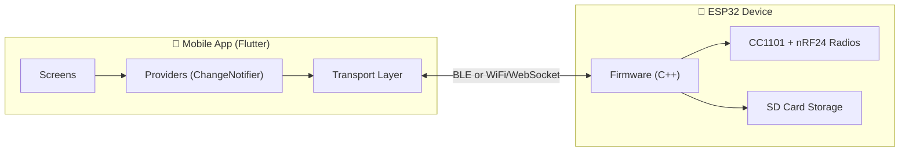

The app communicates with a single ESP32 device over one of two transports: **BLE (Bluetooth Low Energy)** or **WiFi (WebSocket)**. Both transports carry the same binary protocol, making the transport interchangeable at the application layer.

---

## Transport Layer

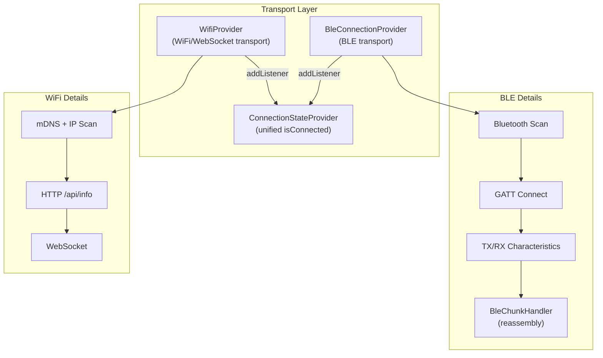

### BleConnectionProvider (`lib/connection/ble_connection_provider.dart`, ~522 lines)

The BLE transport extracted from the legacy `BleProvider` god object. Handles:

- **Scan/connect/disconnect** lifecycle via `flutter_blue_plus`
- **Characteristic discovery** (TX for sending commands, RX for receiving binary frames)
- **MTU negotiation** and reconnection with exponential backoff
- **BleChunkHandler** integration: BLE notifications are limited to ~509 bytes per packet. Large responses are chunked by firmware, and `BleChunkHandler` reassembles them before passing to `MessageDispatcher`
- Persists the last known device ID via `ConnectionHistoryService`

**Key design**: `BleConnectionProvider` is transport-*only*. It owns no domain state — it forwards all parsed responses to `MessageDispatcher`.

### WifiProvider (`lib/providers/wifi_provider.dart`, ~395 lines)

The WiFi transport layer. Handles:

- **Device discovery** via mDNS (`evilcrow.local`) + subnet IP scan
- **HTTP `/api/info`** endpoint for device metadata (name, firmware version)
- **WebSocket connection** to `/api/ws` for bidirectional binary protocol communication
- WebSocket frames are delivered complete (no chunking needed — chunking is BLE-only)
- Persists the last WiFi host via `ConnectionHistoryService`

### ConnectionStateProvider (`lib/providers/connection_state_provider.dart`, ~41 lines)

A lightweight `ChangeNotifier` that watches both transports and exposes:

- `isConnected` — `true` when either transport is connected
- `connectedTransport` — `'ble'`, `'wifi'`, or `null`
- `deviceName` — display name from whichever transport is active

This is what screens use to gate functionality (e.g., blocking Sub-GHz/NRF/Files tabs when disconnected).

---

## Binary Protocol

A custom binary protocol carries commands (app → device) and responses (device → app) over both transports. It is defined in `FirmwareBinaryProtocol` (`lib/providers/firmware_protocol.dart`, ~1433 lines) on the app side and `BinaryProtocolHandler` (`firmware/src/core/BinaryProtocolHandler.h/.cpp`) on the firmware side.

### Frame Format

```
┌──────┬──────┬─────────┬──────────┬──────────────┬───────────┬──────────────┬──────────┐
│ Magic│ Type │ ChunkID │ ChunkNum │ TotalChunks  │  DataLen  │    Data      │ Checksum │
│  1B  │  1B  │   1B    │    1B    │     1B       │  2B (LE)  │  0..500 B    │    1B    │
│ 0xAA │0x01  │  0..255 │  1..255  │    1..255    │           │  variable    │  XOR     │
└──────┴──────┴─────────┴──────────┴──────────────┴───────────┴──────────────┴──────────┘
Header size: 7 bytes  |  Max payload: 500 bytes  |  Total max: 508 bytes
```

- **Magic**: `0xAA` — frame delimiter
- **Type**: `0x01` (data), `0x02` (ack), `0x03` (nak)
- **Chunking**: Payloads > 500 bytes are split across multiple frames (`ChunkID` groups them, `ChunkNum`/`TotalChunks` track position). BLE requires this due to MTU limits; WiFi WebSocket frames arrive intact (no splitting).
- **Checksum**: XOR of all preceding bytes; validated on both sides.

### Command Messages (App → Device)

Commands carry a `messageType` as the first byte of the Data field. Over 70+ message types are defined, organized into families:

| Family | Range | Purpose |
|--------|-------|---------|
| Core | `0x01`–`0x18` | Get state, scan, record, file ops, reboot, factory reset |
| Bruter | `0x04` | Brute-force attack commands |
| nRF24 | `0x20`–`0x2F` | nRF scanner, MouseJack, ducky, jammer, spectrum |
| OTA | `0x30`–`0x35` | Firmware update (begin, data chunks, end, abort) |
| HW Button | `0x40` | Hardware button configuration |
| SDR | `0x50`–`0x59` | SDR module control |
| ProtoPirate | `0x60` | Protocol decoder/emulator |
| Settings | `0xC0`–`0xC2` | Settings sync & update |

### Response Messages (Device → App)

Responses use the same frame format. Payloads are classified as:

- **Binary** (`payload[0] >= 0x80`): Structured binary messages parsed by `BinaryMessageParser` into typed JSON-like maps (e.g., `{'type': 'SignalDetected', 'data': {...}}`). Types include `SignalRecorded` (`0x81`), `NrfDeviceFound` (`0x85`), `FileSystemEvent` (`0x87`), etc.
- **JSON/text**: Payloads that encode valid UTF-8, optionally parsed as JSON. These carry `type` as a string field (e.g., `'BruterProgress'`, `'OtaComplete'`).

The app normalizes both into `Map<String, dynamic>` with a `type` field, making the dispatch layer uniform.

---

## App ↔ Firmware Communication

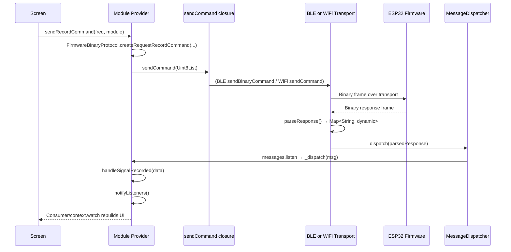

### Command Sending

Every module provider has a `sendCommand` callback typed as:

```dart
Future<bool> Function(Uint8List command, {bool withoutResponse})?
```

This is wired in `main.dart` via `_makeSendCommand()`, which dynamically routes to the active transport:

```dart
final transport = context.read<ConnectionStateProvider>().connectedTransport;
if (transport == 'ble') {
  await bleConn.sendBinaryCommand(cmd);
} else if (transport == 'wifi') {
  return wifi.sendCommand(cmd);
}
```

The `withoutResponse: true` flag is used for fire-and-forget operations (OTA chunk uploads, bulk file transfers) where the app doesn't need to await an ACK.

### Response Handling

Both transport providers forward parsed responses to `MessageDispatcher.dispatch()`. The dispatcher broadcasts to all subscribing module providers, which each filter by `msg['type']`:

```dart
void _dispatch(Map<String, dynamic> msg) {
  switch (msg['type'] as String?) {
    case 'SignalDetected': _handleSignalDetected(msg['data']);
    case 'SignalRecorded': _handleSignalRecorded(msg['data']);
    // ... module-specific types
  }
}
```

**On the firmware side**, `BinaryProtocolHandler` (used by both `BleAdapter` and `WifiAdapter`) handles frame parsing, chunk reassembly, and command dispatch to `CommandHandler`. Responses are built with the same protocol helpers (`sendBinaryResponse`, `sendChunkedResponse`) and delivered through the transport-specific `sendFrame()` virtual method.

---

## State Management

The app uses **Provider** (`package:provider`) with `ChangeNotifier` as the primary state management pattern. There is no BLoC, Riverpod, or Redux.

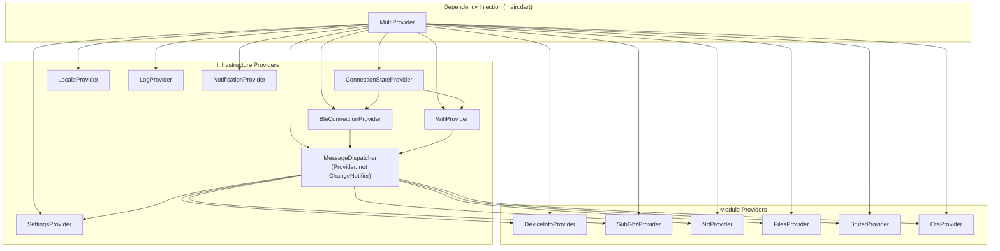

### Provider Wiring Pattern

All providers are created in `main.dart`'s `MultiProvider`. The wiring follows a consistent pattern:

1. `MessageDispatcher` is created first as a plain `Provider` (not `ChangeNotifierProvider` — it doesn't notify, it broadcasts).
2. Transport providers (`BleConnectionProvider`, `WifiProvider`) get the dispatcher injected.
3. `ConnectionStateProvider` wraps both transports via `addListener`.
4. Module providers and `SettingsProvider` subscribe to `MessageDispatcher.messages`.
5. Every provider that sends commands gets its `sendCommand` callback wired via `_makeSendCommand()`.

### Change Notification Flow

```
Transport event → parse → MessageDispatcher.dispatch() → provider._dispatch() → notifyListeners() → Consumer/widget rebuild
```

Providers do NOT talk to each other directly (with one exception — `ConnectionStateProvider` listens to transport providers). Cross-provider communication uses `AppEventBus`.

---

## Message Routing

The app uses a **two-layer routing model** to prevent double-listening bugs and keep concerns separated.

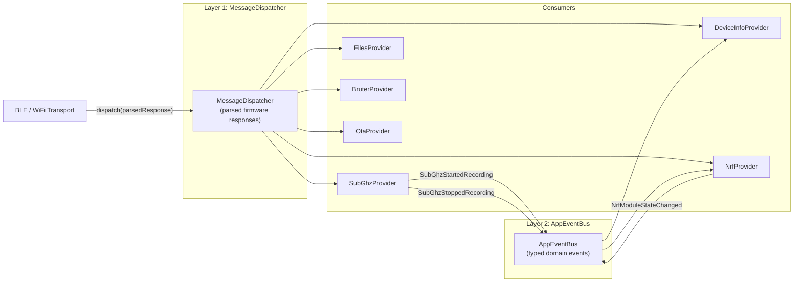

### Layer 1: `MessageDispatcher`

A broadcast `StreamController<Map<String, dynamic>>`. Transport providers push parsed firmware responses here. Module providers subscribe to the stream and filter by `msg['type']`.

**Why parsed maps, not raw bytes?** Binary responses carry `messageType` as `payload[0]`; JSON responses carry `type` as a string. Normalizing to `Map<String, dynamic>` with a uniform `type` field lets providers filter without caring about the wire format.

### Layer 2: `AppEventBus`

A singleton typed event bus. Used for cross-provider communication that doesn't originate from firmware responses:

| Event | Emitted By | Consumed By | Purpose |
|-------|-----------|-------------|---------|
| `SubGhzStartedRecording` | `SubGhzProvider` | `DeviceInfoProvider` | Mark CC1101 module as busy |
| `SubGhzStoppedRecording` | `SubGhzProvider` | `DeviceInfoProvider` | Mark CC1101 module as idle |
| `NrfModuleStateChanged` | `NrfProvider` | `DeviceInfoProvider` | Mark nRF module busy/available |
| `ConnectionLost` | Transport providers | All module providers | Reset state on disconnect |

**Design rule**: A provider never listens to both layers for the same piece of state. `MessageDispatcher` handles transport-parsed frames; `AppEventBus` handles domain events.

---

## Module Providers

Each module provider owns the state and business logic for a specific hardware capability.

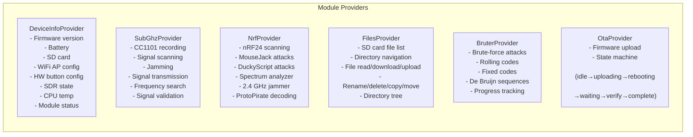

### Common Provider Contract

Every module provider follows the same shape:

```dart
class XxxProvider extends ChangeNotifier {
  final MessageDispatcher _messageDispatcher;
  StreamSubscription<Map<String, dynamic>>? _subscription;

  // Transport callback
  Future<bool> Function(Uint8List command, {bool withoutResponse})? sendCommand;

  // Notification callback
  void Function(String level, String message)? notify;

  // Constructor subscribes to dispatcher
  XxxProvider(this._messageDispatcher) {
    _subscription = _messageDispatcher.messages.listen(_dispatch);
  }

  // Private dispatch filters by type
  void _dispatch(Map<String, dynamic> msg) { ... }

  // Public command methods use FirmwareBinaryProtocol.createXxxCommand()
  Future<void> doSomething() async { ... }

  // Cleanup
  @override void dispose() { _subscription?.cancel(); super.dispose(); }
}
```

### DeviceInfoProvider (`lib/providers/device_info_provider.dart`, ~343 lines)

The "god provider" for device metadata. Handles `state`, `VersionInfo`, `DeviceName`, `BatteryStatus`, `HwButtonStatus`, `SdStatus`, `NrfModuleStatus`, `WifiApConfig`, `SettingsSync`, `SdrStatus`, and `ModeSwitch` message types. Also tracks CC1101 module availability and provides `isModuleAvailable()` / `getModuleStatus()` convenience methods.

### SubGhzProvider (`lib/providers/subghz_provider.dart`, ~305 lines)

CC1101 signal operations. Subscribes to `SignalDetected`, `SignalRecorded`, `SignalRecordError`, `SignalSent`, `SignalSendingError`, and `ModeSwitch`. Includes static `validateRecordConfig()` (pure function extracted from `BleProvider`).

### NrfProvider (`lib/providers/nrf_provider.dart`, ~489 lines)

nRF24L01 operations plus ProtoPirate decoding. The largest module provider due to the ProtoPirate sub-protocol (history, file list, emulation, save/load captures). Handles ~15+ message types.

### FilesProvider (`lib/providers/files_provider.dart`, ~631 lines)

SD card file management. The most complex provider due to async completers (`_pendingFileReadCompleter`, `_pendingRenameCompleter`, etc.) for request-response patterns. Manages a file cache with timestamps and supports chunked file downloads/uploads.

### BruterProvider (`lib/providers/bruter_provider.dart`, ~283 lines)

Brute-force attack state. Tracks progress (current code, total codes, codes/sec), supports pause/resume, and handles saved state for long-running attacks.

### OtaProvider (`lib/providers/ota_provider.dart`, ~227 lines + `OtaState` enum)

Firmware update with a proper state machine (`idle → uploading → rebooting → waitingReconnect → awaitingVerify → complete/error`). Handles chunked firmware uploads and post-reboot version verification.

### SettingsProvider (`lib/providers/settings_provider.dart`, ~402 lines)

Persistent app settings (SharedPreferences-backed) plus run-time firmware settings. Handles:

- **Local-only settings**: bruter delay, bruter module selection, HW button actions, nRF24 config (PA level, data rate, channel, retransmit count). Persisted to SharedPreferences.
- **Firmware-synced settings**: scanner RSSI, bruter power/repeats, radio power per module, CPU temp offset. Pushed to device via 9-byte `SETTINGS_UPDATE` binary payload and synced back via `SettingsSync` dispatcher messages.

---

## Screen Layer

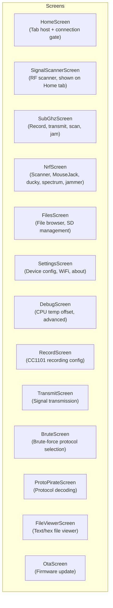

### Screen ↔ Provider Pattern

Screens access providers through two mechanisms:

**1. `Consumer<ProviderType>` / `context.watch<ProviderType>()`** — for reactive rebuilds:

```dart
Consumer<ConnectionStateProvider>(
  builder: (context, connectionState, child) {
    if (connectionState.isConnected) { ... }
    ...
  },
)
```

**2. `context.read<ProviderType>()`** — for non-reactive access (callbacks, button handlers):

```dart
onPressed: () {
  context.read<SubGhzProvider>().sendRecordCommand(...);
}
```

### Screen Splitting

Large screens have been decomposed into sub-widgets extracted to dedicated files:

| Screen | Original | After Split | Files Extracted |
|--------|----------|-------------|-----------------|
| `settings_screen.dart` | 4,536 lines | ~3,404 lines | `about_popup.dart` (612), `subghz_clone_dialog.dart` (530) |
| `nrf_screen.dart` | 1,546 lines | ~1,103 lines | `nrf_mousejack_tab.dart` (355), `nrf_spectrum_tab.dart` (164), `nrf_section_card.dart` (55) |
| `brute_screen.dart` | 1,362 lines | ~852 lines | `models/bruter_protocol.dart` (526) |
| `protopirate_screen.dart` | 1,315 lines | ~721 lines | `protopirate_result_card.dart` (608) |
| `files_screen.dart` | 1,370 lines | ~1,181 lines | `files_actions.dart` (236) |
| `record_screen.dart` | 1,819 lines | ~1,819 lines | `record_file_list.dart` (160) |
| `file_viewer_screen.dart` | ~936 lines | ~936 lines | `file_viewer_text_tab.dart` (77) |
| `status_bar_widget.dart` | ~775 lines | ~483 lines | `status_bar_icons.dart` (292) |

### Tab Gating

`HomeScreen` manages a `BottomNavigationBar` with 5 tabs. Tabs 1-3 (Sub-GHz, nRF, Files) require an active connection. Tabs 0 (Home) and 4 (Settings) are always accessible. The nRF tab is additionally gated on `DeviceInfoProvider.nrfPresent`.

---

## Services Layer

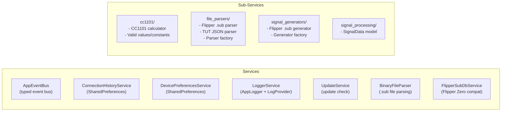

### Key Services

- **AppEventBus** — Singleton typed event bus (see [Message Routing](#message-routing)).
- **ConnectionHistoryService** — Persists last successful transport + host/device-id via SharedPreferences.
- **LoggerService** — App-wide logging with severity levels, wired to `LogProvider` for UI display.
- **BinaryMessageParser** — Parses `0x80`-`0xFF` binary response payloads into typed Dart objects (e.g., `BinaryFileList`, `BinarySignalDetected`, `BinaryModeSwitch`).
- **PendingRequestTracker** — Watches `MessageDispatcher` for matched response types with timeout support. Register an expected response type when sending a command; if no matching response arrives within 15 seconds, `onTimeout` fires. Used by module providers to detect hung commands (see [#glaring-issues](#glaring-issues)).
- **CC1101 Services** — Frequency validation, register calculation, protocol-specific constants.
- **File Parsers/Generators** — Flipper Zero `.sub` file format support (import/export).

---

## Data Flow: Key Operations

### 1. Recording a Sub-GHz Signal

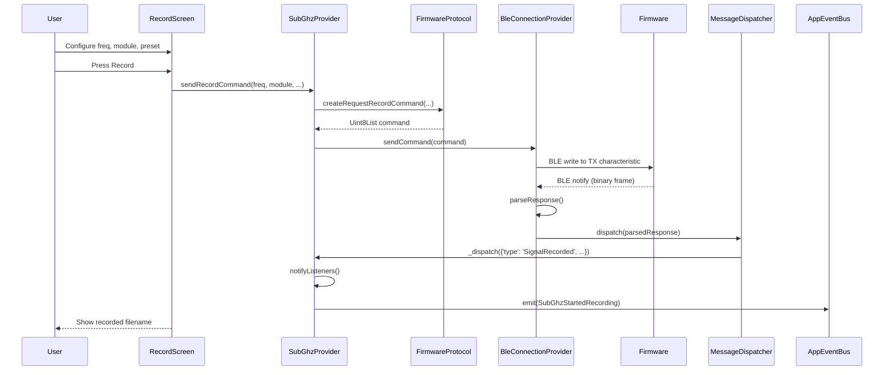

### 2. BLE Chunked Response (File List)

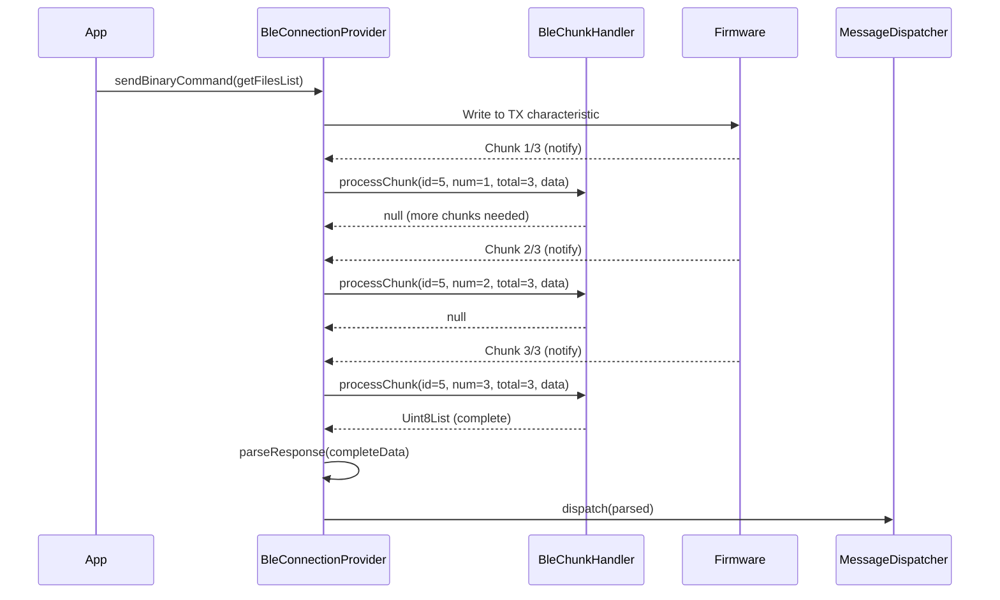

### 3. OTA Firmware Update

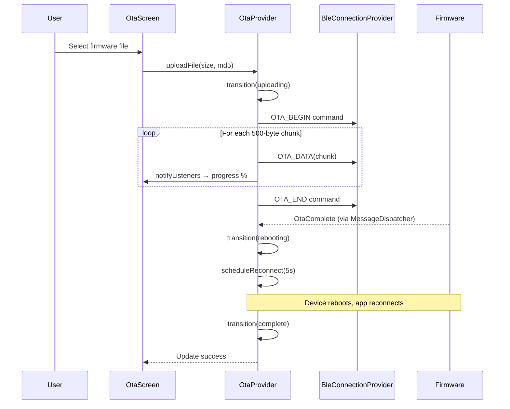

---

## Methodology Assessment

### ✅ Strengths

| Aspect | Assessment |
|--------|-----------|
| **Transport abstraction** | `sendCommand` closures + `ConnectionStateProvider` cleanly decouple screens from BLE/WiFi. Transport can be swapped without touching any screen code. |
| **Two-layer routing** | `MessageDispatcher` + `AppEventBus` prevents the common anti-pattern of providers double-subscribing to the same data source. Clear layering rule: transport frames vs domain events. |
| **Binary protocol consistency** | `FirmwareBinaryProtocol` is the single source of truth for all command creation and response parsing. The firmware's `BinaryProtocolHandler` mirrors it. No magic numbers scattered across the codebase. |
| **Provider extraction** | Splitting the 5,151-line `BleProvider` god object into 6 domain providers + 2 transport providers was done incrementally with a clear migration plan (`refactor.md`). The app never regressed. |
| **OTA state machine** | The `OtaState` enum + `transition()` method is clean and debuggable compared to scattered booleans. |
| **SettingsProvider dual-sync** | Persists local-only settings to SharedPreferences while syncing runtime settings to firmware via the standard dispatcher pattern. No special-case message handling in screens. |
| **Chunk handler isolation** | `BleChunkHandler` is BLE-specific. WiFi WebSocket frames arrive intact — no chunk-handling overhead on WiFi path. |
| **i18n compliance** | All user-facing strings go through `AppLocalizations`. `.arb` files are the single source of truth for `en`/`ru` locales. No hardcoded English strings. |

### ⚠️ Areas for Improvement

| Area | Issue | Recommendation |
|------|-------|----------------|
| **FilesProvider complexity** | 631 lines with 8+ async completers (`_pendingFileReadCompleter`, `_pendingRenameCompleter`, etc.) creates fragile state. If a response is lost, completers hang forever. | Consider a request/response correlation ID pattern with timeouts, or extract file operations into a dedicated `FileOperationService` with a proper queue. |
| **DeviceInfoProvider scope creep** | Handles ~11 message types (state, battery, SD, WiFi AP, HW buttons, SDR, NRF presence, settings sync, etc.). It's becoming a second god object. | Split into `DeviceStatusProvider` (battery, CPU, heap, SD) and `DeviceConfigProvider` (name, WiFi AP, buttons, SDR). |
| **No test coverage** | Zero automated tests. Validation is `flutter analyze` only. Provider state transitions, binary protocol parsing, and BLE chunk reassembly are untested. | Add unit tests for `FirmwareBinaryProtocol`, `BleChunkHandler`, and `BinaryMessageParser` first — these are pure functions with no Flutter dependency. Then add widget tests for critical flows. |
| **SettingsProvider uses `with ChangeNotifier` (mixin), not `extends ChangeNotifier`** | All other providers `extend ChangeNotifier`. SettingsProvider uses a mixin. This is inconsistent and subtle — `with` has different initialization order semantics but works the same for ChangeNotifier. | Standardize to `extends ChangeNotifier` for consistency unless there's a specific reason for the mixin. |
| **No dependency injection framework** | Providers are manually wired in `main.dart`'s `MultiProvider` with explicit `context.read<>()` calls. This works but doesn't scale well — adding a new provider requires touching `main.dart` + every other provider that depends on it. | Consider `riverpod` or at least extract provider creation into factory functions. Low priority — the current approach is clear enough for ~12 providers. |
| **Event bus is singleton, not injected** | `AppEventBus()` is a singleton accessed directly. This makes testing difficult and creates hidden coupling. | Pass `AppEventBus` through constructors or Provider. The singleton is convenient but limits testability. |
| **Large files remain** | `settings_screen.dart` is still 3,404 lines. `files_provider.dart` is 631 lines. `firmware_protocol.dart` is 1,433 lines. | Continue screen-splitting work. For `firmware_protocol.dart`, consider splitting by message family (core, nrf, ota, protopirate) into separate files with a shared base class. |
| **`BleChunkHandler` uses `DateTime.now()` for timeouts** | Time-based comparison uses wall clock, which can jump (NTP sync, user change). | Use `Stopwatch` or a monotonic clock for timeout tracking. |
| **Hardcoded English strings in `home_screen.dart`** | Lines 149-154 use `'nRF24 Not Detected'` and `'The nRF24L01 module is not connected...'` instead of `AppLocalizations`. | Move to `.arb` files. |
| **WiFi provisioning is a stub** | `WifiProvider.provisionViaSmartConfig()` always returns `false` (D5 deferred). | Implement ESP-TOUCH or use the SoftAP captive portal flow. |
| **No offline/caching strategy** | File lists, device state, and settings are fetched fresh on every connection. No local cache for faster startup or offline viewing. | Consider caching last-known state for instant display on reconnect. |

### 🔴 Glaring Issues

1. ~~**Missing error recovery for hung completers in FilesProvider**: If the device reboots or disconnects mid-operation, the 8+ `Completer` instances in `FilesProvider` will never resolve, potentially leaking memory and leaving the UI in a perpetual loading state.~~ ✅ **Fixed**: `BleConnectionProvider._resetConnectionState()` and `WifiProvider.disconnect()` now emit `ConnectionLost` via `AppEventBus`. `FilesProvider` subscribes and calls `_failPendingCompleters()` + `resetFileLoadingState()` on disconnect.

2. ~~**No request timeout mechanism**: Module providers send commands and passively wait for responses via `MessageDispatcher`. If the firmware never responds (crash, RF interference, buffer overflow), the UI has no way to know the command failed.~~ ✅ **Fixed**: The protocol now uses the `ChunkID` frame field as a request sequence number for response correlation. `FirmwareBinaryProtocol._getNextRequestId()` generates incrementing IDs (1..255). The firmware echoes the request's chunkId in responses via `_lastRequestChunkId`. A new `PendingRequestTracker` service (`lib/services/pending_request_tracker.dart`) watches `MessageDispatcher` and fires timeout callbacks when no matching response arrives within 15 seconds. Version bumped to **3.0.0** (breaking protocol change).

3. ~~**Binary protocol has no version negotiation**: The app assumes the firmware speaks the exact same protocol version.~~ ✅ **Fixed**: On BLE connect, `BleConnectionProvider` sends a `getState` command after 500ms which triggers `sendVersionInfo()` on the firmware. `DeviceInfoProvider._handleVersionInfo()` now checks that `_fwMajor == 3` and exposes `isFirmwareCompatible` / `incompatibilityReason` getters. The app can gate features on these flags. Version bumped to **3.0.0** (both firmware `config.h` and app `pubspec.yaml`).

4. ~~**SharedPreferences called on hot paths**: `SettingsProvider` calls `SharedPreferences.getInstance()` on every setter (e.g., `setScannerRssi`, `setBruterPowerValue`). Each call hits the async plugin channel.~~ ✅ **Fixed**: `SettingsProvider` now caches the `SharedPreferences` instance in `_cachedPrefs`, fetched once during `_initPrefs()`. All 15+ setters use the cached reference.

---

## File Map

```
mobile_app/
├── lib/
│   ├── main.dart                          # App entry, MultiProvider wiring, theme
│   ├── connection/
│   │   ├── ble_connection_provider.dart    # BLE transport (scan/connect/MTU/notify)
│   │   ├── ble_chunk_handler.dart         # Reassembles chunked BLE frames
│   │   └── message_dispatcher.dart        # Layer 1: broadcasts parsed responses
│   ├── providers/
│   │   ├── firmware_protocol.dart          # Binary protocol: all commands + parseResponse
│   │   ├── connection_state_provider.dart  # Unified isConnected/connectedTransport
│   │   ├── wifi_provider.dart             # WiFi transport (discovery, WebSocket)
│   │   ├── device_info_provider.dart       # Device identity, battery, SD, module status
│   │   ├── subghz_provider.dart           # CC1101 recording, scanning, jamming
│   │   ├── nrf_provider.dart              # nRF24 + ProtoPirate operations
│   │   ├── files_provider.dart            # SD card file management
│   │   ├── bruter_provider.dart           # Brute-force attack state
│   │   ├── ota_provider.dart              # OTA firmware update state machine
│   │   ├── settings_provider.dart         # Persistent app + firmware settings
│   │   ├── log_provider.dart              # Log entries for UI display
│   │   ├── notification_provider.dart     # Snackbar notification queue
│   │   └── locale_provider.dart           # en/ru locale switching
│   ├── services/
│   │   ├── app_event_bus.dart             # Layer 2: typed cross-provider events
│   │   ├── binary_message_parser.dart     # Parses 0x80-0xFF binary response payloads
│   │   ├── pending_request_tracker.dart   # Timeout for pending response matching
│   │   ├── binary_file_parser.dart        # .sub file format parsing
│   │   ├── connection_history_service.dart # Persist last transport connection
│   │   ├── device_preferences_service.dart # Persist device-specific prefs
│   │   ├── flipper_subdb_service.dart     # Flipper Zero sub-GHz DB compatibility
│   │   ├── logger_service.dart            # App-wide logging
│   │   ├── update_service.dart            # App update check
│   │   ├── cc1101/                        # CC1101 frequency/register helpers
│   │   ├── file_parsers/                  # .sub, TUT JSON parsers
│   │   ├── signal_generators/             # Signal format generators
│   │   └── signal_processing/             # Signal data models
│   ├── screens/
│   │   ├── home_screen.dart               # Tab host, connection gate, permissions
│   │   ├── subghz_screen.dart             # Sub-GHz operations hub
│   │   ├── nrf_screen.dart                # nRF24 + ProtoPirate hub
│   │   ├── files_screen.dart              # File browser
│   │   ├── settings_screen.dart           # Device settings (~3400 lines)
│   │   ├── record_screen.dart             # CC1101 recording config
│   │   ├── transmit_screen.dart           # Signal transmission
│   │   ├── brute_screen.dart              # Brute-force attack UI
│   │   ├── protopirate_screen.dart        # Protocol decoding UI
│   │   ├── signal_scanner_screen.dart     # Real-time RF scanner
│   │   ├── ota_screen.dart                # Firmware update UI
│   │   ├── debug_screen.dart              # Advanced debug settings
│   │   ├── file_viewer_screen.dart        # Text/hex file viewer
│   │   ├── file_viewer/                   # File viewer sub-widgets
│   │   ├── files/                         # File screen sub-widgets
│   │   ├── nrf/                           # nRF screen sub-widgets
│   │   ├── protopirate/                   # ProtoPirate sub-widgets
│   │   ├── record/                        # Record screen sub-widgets
│   │   └── settings/                      # Settings screen sub-widgets
│   ├── widgets/
│   │   ├── status_bar_widget.dart         # Top toolbar (connection, battery, SD)
│   │   ├── status_bar_icons.dart          # Extracted icon helpers
│   │   ├── quick_connect_widget.dart      # BLE/WiFi quick connect panel
│   │   ├── file_list_widget.dart          # File list with actions
│   │   ├── file_explorer_widget.dart      # File browser tree
│   │   ├── file_preview_widget.dart       # File content preview
│   │   ├── directory_tree_widget.dart     # Directory tree view
│   │   ├── directory_picker_dialog.dart   # Directory selection dialog
│   │   ├── log_viewer_widget.dart         # In-app log display
│   │   ├── transmit_file_dialog.dart      # File selection for transmission
│   │   ├── transmit_screen_widgets.dart   # Transmit screen helpers
│   │   ├── record_screen_widgets.dart     # Record screen helpers
│   │   ├── module_status_widget.dart      # CC1101 module status display
│   │   ├── module_status_basic.dart       # Compact module status
│   │   ├── module_status_expanded.dart    # Detailed module status
│   │   ├── nrf_section_card.dart          # Themed card for nRF sections
│   │   └── hacker_style_components.dart  # Shared UI components
│   ├── models/
│   │   ├── bruter_protocol.dart           # Brute-force protocol definitions
│   │   ├── detected_signal.dart           # Detected RF signal model
│   │   ├── directory_tree_node.dart       # Directory tree node model
│   │   ├── file_item.dart                 # File metadata model
│   │   ├── log_entry.dart                 # Log entry model
│   │   ├── nrf_jam_mode.dart              # nRF jammer mode model
│   │   ├── nrf_target.dart                # nRF scan target model
│   │   └── protopirate_result.dart        # ProtoPirate decode result model
│   ├── l10n/
│   │   ├── app_en.arb                     # English localization source
│   │   ├── app_ru.arb                     # Russian localization source
│   │   ├── app_localizations.dart         # Abstract localization interface
│   │   ├── app_localizations_en.dart      # Generated English localizations
│   │   └── app_localizations_ru.dart      # Generated Russian localizations
│   └── theme/
│       └── app_colors.dart                # Dark theme color palette
├── docs/
│   ├── architecture.md                    # This document
│   ├── refactor.md                        # Refactor plan + progress
│   ├── ble_optimizations.md              # BLE optimization notes
│   └── ios_build_guide*.md               # iOS build guides
└── AGENTS.md                              # Agent preferences (sync with architecture.md)
```

---

## Firmware Architecture (Reference)

For completeness, the firmware side that the app communicates with:

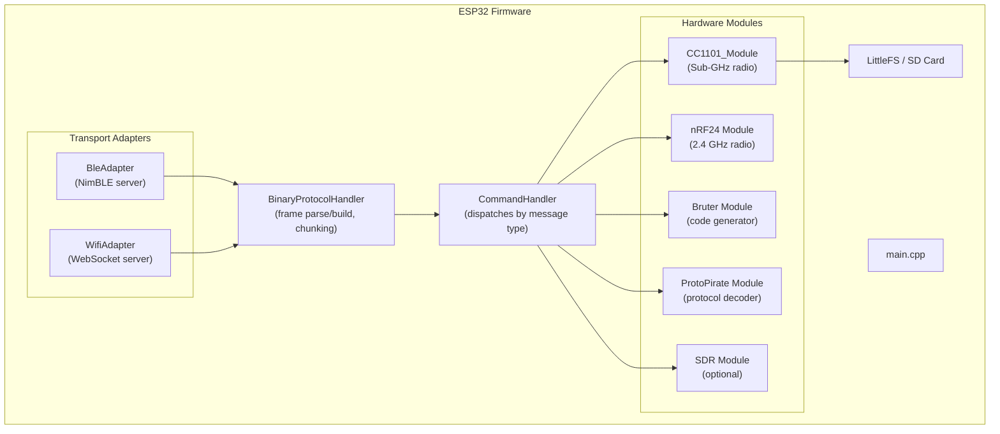

- **BleAdapter** (NimBLE, ~30-40KB RAM savings vs Bluedroid) and **WifiAdapter** both inherit from `BinaryProtocolHandler`.
- **BinaryProtocolHandler** handles frame parsing, chunk reassembly, and response chunking. Subclass implements `sendFrame()` for the specific transport.
- **CommandHandler** routes incoming message types to the appropriate module handler (FileCommands, TransmitterCommands, RecorderCommands, NrfCommands, etc.).
- WiFi credentials stored in NVS (Preferences). SoftAP starts immediately on boot without captive portal — the app connects directly.

---

*Last updated: 2026-06-18. Keep in sync with code changes. See `AGENTS.md` for agent preferences.*
```

